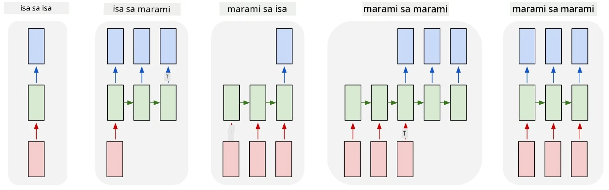

# Mga Generative na Network

## [Pre-lecture quiz](https://ff-quizzes.netlify.app/en/ai/quiz/33)

Ang Recurrent Neural Networks (RNNs) at ang mga gated cell variant nito tulad ng Long Short Term Memory Cells (LSTMs) at Gated Recurrent Units (GRUs) ay nagbibigay ng mekanismo para sa pagmomodelo ng wika dahil kaya nilang matutunan ang pagkakasunod-sunod ng mga salita at magbigay ng prediksyon para sa susunod na salita sa isang sequence. Dahil dito, magagamit natin ang RNNs para sa **generative tasks**, tulad ng ordinaryong pagbuo ng teksto, pagsasalin ng makina, at maging sa pag-caption ng mga imahe.

> ✅ Isipin ang lahat ng pagkakataon na nakinabang ka sa generative tasks tulad ng text completion habang nagta-type. Mag-research tungkol sa iyong mga paboritong aplikasyon upang malaman kung ginamit nila ang RNNs.

Sa RNN architecture na tinalakay natin sa nakaraang unit, bawat RNN unit ay gumagawa ng susunod na hidden state bilang output. Gayunpaman, maaari rin tayong magdagdag ng isa pang output sa bawat recurrent unit, na magpapahintulot sa atin na mag-output ng isang **sequence** (na kapareho ng haba sa orihinal na sequence). Bukod dito, maaari tayong gumamit ng RNN units na hindi tumatanggap ng input sa bawat hakbang, at kukuha lamang ng isang initial state vector, at pagkatapos ay gagawa ng isang sequence ng outputs.

Ito ay nagbibigay-daan para sa iba't ibang neural architectures na ipinapakita sa larawan sa ibaba:



> Larawan mula sa blog post [Unreasonable Effectiveness of Recurrent Neural Networks](http://karpathy.github.io/2015/05/21/rnn-effectiveness/) ni [Andrej Karpaty](http://karpathy.github.io/)

* **One-to-one** ay isang tradisyunal na neural network na may isang input at isang output
* **One-to-many** ay isang generative architecture na tumatanggap ng isang input value, at bumubuo ng isang sequence ng output values. Halimbawa, kung gusto nating sanayin ang isang **image captioning** network na magbibigay ng tekstuwal na deskripsyon ng isang larawan, maaari tayong magbigay ng larawan bilang input, ipasa ito sa isang CNN upang makuha ang hidden state nito, at pagkatapos ay mag-generate ang isang recurrent chain ng caption word-by-word.
* **Many-to-one** ay tumutukoy sa RNN architectures na tinalakay natin sa nakaraang unit, tulad ng text classification.
* **Many-to-many**, o **sequence-to-sequence** ay tumutukoy sa mga tasks tulad ng **machine translation**, kung saan ang unang RNN ay kinokolekta ang lahat ng impormasyon mula sa input sequence papunta sa hidden state, at ang isa pang RNN chain ay nag-unroll ng state na ito papunta sa output sequence.

Sa unit na ito, magpo-focus tayo sa simpleng generative models na tumutulong sa atin na mag-generate ng teksto. Para sa pagiging simple, gagamit tayo ng character-level tokenization.

Sasanayin natin ang RNN na ito upang mag-generate ng teksto hakbang-hakbang. Sa bawat hakbang, kukuha tayo ng isang sequence ng mga character na may haba na `nchars`, at hihilingin sa network na mag-generate ng susunod na output character para sa bawat input character:


Kapag nag-generate ng teksto (sa panahon ng inference), magsisimula tayo sa isang **prompt**, na ipapasa sa RNN cells upang mag-generate ng intermediate state nito, at pagkatapos mula sa state na ito magsisimula ang generation. Mag-generate tayo ng isang character sa bawat pagkakataon, at ipapasa ang state at ang generated character sa isa pang RNN cell upang mag-generate ng susunod, hanggang sa makabuo tayo ng sapat na mga character.


> Larawan ng may-akda

## ✍️ Mga Ehersisyo: Generative Networks

Ipagpatuloy ang iyong pag-aaral sa mga sumusunod na notebooks:

* [Generative Networks gamit ang PyTorch](GenerativePyTorch.ipynb)
* [Generative Networks gamit ang TensorFlow](GenerativeTF.ipynb)

## Soft text generation at temperature

Ang output ng bawat RNN cell ay isang probability distribution ng mga character. Kung palaging kukunin ang character na may pinakamataas na probability bilang susunod na character sa generated text, madalas na nagiging "cycled" ang teksto sa parehong sequence ng mga character nang paulit-ulit, tulad ng sa halimbawang ito:

```
today of the second the company and a second the company ...
```

Gayunpaman, kung titingnan natin ang probability distribution para sa susunod na character, maaaring ang pagkakaiba sa pagitan ng ilang pinakamataas na probabilities ay hindi malaki, halimbawa, ang isang character ay maaaring may probability na 0.2, ang isa pa - 0.19, atbp. Halimbawa, kapag naghahanap ng susunod na character sa sequence na '*play*', ang susunod na character ay maaaring space, o **e** (tulad ng sa salitang *player*).

Ito ay nagdadala sa atin sa konklusyon na hindi palaging "makatarungan" na piliin ang character na may mas mataas na probability, dahil ang pagpili sa pangalawang pinakamataas ay maaari pa ring magresulta sa makabuluhang teksto. Mas matalino na **mag-sample** ng mga character mula sa probability distribution na ibinigay ng network output. Maaari rin tayong gumamit ng isang parameter, **temperature**, na magpapalapat ng probability distribution, kung nais nating magdagdag ng higit pang randomness, o gawing mas steep, kung nais nating manatili sa mga character na may pinakamataas na probability.

I-explore kung paano na-implement ang soft text generation sa mga notebooks na naka-link sa itaas.

## Konklusyon

Bagama't ang text generation ay maaaring maging kapaki-pakinabang sa sarili nito, ang pangunahing benepisyo ay nagmumula sa kakayahang mag-generate ng teksto gamit ang RNNs mula sa isang initial feature vector. Halimbawa, ang text generation ay ginagamit bilang bahagi ng machine translation (sequence-to-sequence, sa kasong ito ang state vector mula sa *encoder* ay ginagamit upang mag-generate o *decode* ng translated message), o pagbuo ng tekstuwal na deskripsyon ng isang imahe (kung saan ang feature vector ay magmumula sa CNN extractor).

## 🚀 Hamon

Kumuha ng ilang mga aralin sa Microsoft Learn tungkol sa paksang ito

* Text Generation gamit ang [PyTorch](https://docs.microsoft.com/learn/modules/intro-natural-language-processing-pytorch/6-generative-networks/?WT.mc_id=academic-77998-cacaste)/[TensorFlow](https://docs.microsoft.com/learn/modules/intro-natural-language-processing-tensorflow/5-generative-networks/?WT.mc_id=academic-77998-cacaste)

## [Post-lecture quiz](https://ff-quizzes.netlify.app/en/ai/quiz/34)

## Review at Pag-aaral sa Sarili

Narito ang ilang mga artikulo upang palawakin ang iyong kaalaman

* Iba't ibang mga approach sa text generation gamit ang Markov Chain, LSTM, at GPT-2: [blog post](https://towardsdatascience.com/text-generation-gpt-2-lstm-markov-chain-9ea371820e1e)
* Halimbawa ng text generation sa [Keras documentation](https://keras.io/examples/generative/lstm_character_level_text_generation/)

## [Assignment](lab/README.md)

Nakita natin kung paano mag-generate ng teksto character-by-character. Sa lab, i-eexplore mo ang word-level text generation.

---

