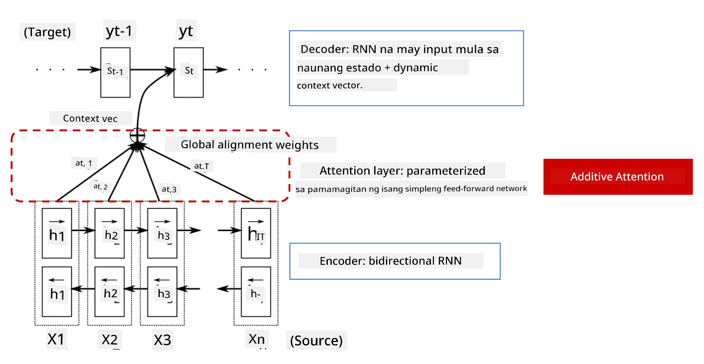
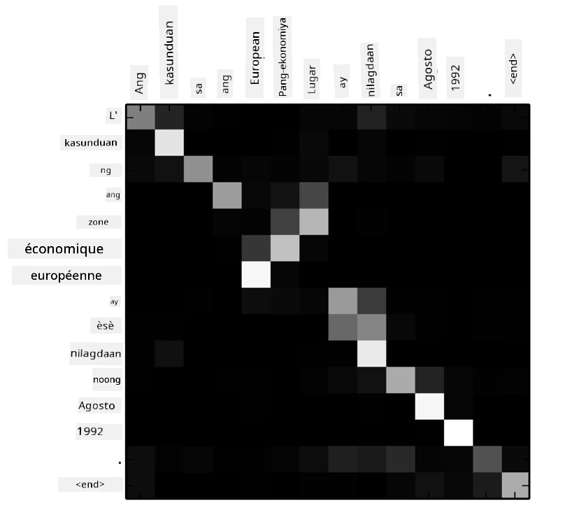
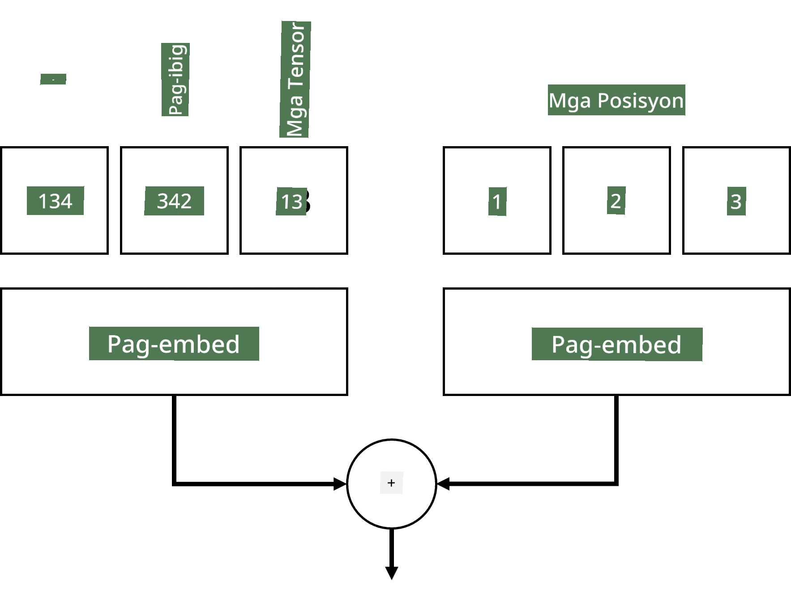
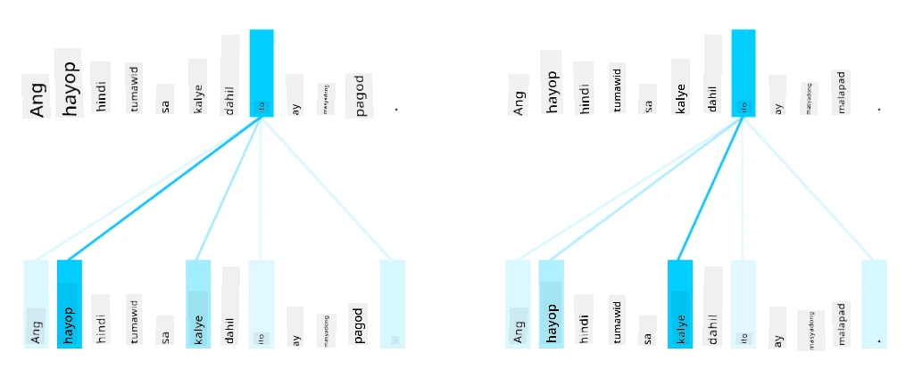
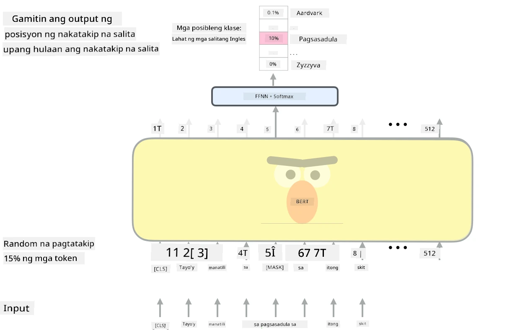

# Mga Mekanismo ng Atensyon at Transformers

## [Pre-lecture quiz](https://ff-quizzes.netlify.app/en/ai/quiz/35)

Isa sa pinakamahalagang problema sa larangan ng NLP ay ang **machine translation**, isang mahalagang gawain na nasa likod ng mga tool tulad ng Google Translate. Sa seksyong ito, magtutuon tayo sa machine translation, o, sa mas pangkalahatan, sa anumang *sequence-to-sequence* na gawain (na tinatawag ding **sentence transduction**).

Sa RNNs, ang sequence-to-sequence ay ipinatutupad gamit ang dalawang recurrent networks, kung saan ang isang network, ang **encoder**, ay nagko-collapse ng input sequence sa isang hidden state, habang ang isa pang network, ang **decoder**, ay nag-u-unroll ng hidden state na ito sa isang isinaling resulta. May ilang problema sa ganitong paraan:

* Ang huling estado ng encoder network ay nahihirapang alalahanin ang simula ng isang pangungusap, na nagdudulot ng mababang kalidad ng modelo para sa mahahabang pangungusap.
* Ang lahat ng salita sa isang sequence ay may parehong epekto sa resulta. Sa realidad, gayunpaman, may mga partikular na salita sa input sequence na mas may epekto sa mga sequential outputs kaysa sa iba.

Ang **Attention Mechanisms** ay nagbibigay ng paraan upang timbangin ang contextual na epekto ng bawat input vector sa bawat output prediction ng RNN. Ang paraan ng pagpapatupad nito ay sa pamamagitan ng paglikha ng mga shortcut sa pagitan ng mga intermediate states ng input RNN at output RNN. Sa ganitong paraan, kapag gumagawa ng output symbol yt, isasaalang-alang natin ang lahat ng input hidden states hi, na may iba't ibang weight coefficients &alpha;t,i.

> Ang encoder-decoder model na may additive attention mechanism sa [Bahdanau et al., 2015](https://arxiv.org/pdf/1409.0473.pdf), mula sa [blog post na ito](https://lilianweng.github.io/lil-log/2018/06/24/attention-attention.html)

Ang attention matrix {&alpha;i,j} ay kumakatawan sa antas kung paano ang ilang input words ay may papel sa pagbuo ng isang partikular na salita sa output sequence. Narito ang isang halimbawa ng ganitong matrix:

> Larawan mula sa [Bahdanau et al., 2015](https://arxiv.org/pdf/1409.0473.pdf) (Fig.3)

Ang mga mekanismo ng atensyon ay responsable para sa karamihan ng kasalukuyan o malapit sa kasalukuyang state-of-the-art sa NLP. Gayunpaman, ang pagdaragdag ng atensyon ay lubos na nagpapataas ng bilang ng mga parameter ng modelo na nagdulot ng mga isyu sa scaling sa RNNs. Ang isang pangunahing limitasyon ng scaling RNNs ay ang recurrent na kalikasan ng mga modelo na nagpapahirap sa pag-batch at pag-parallelize ng training. Sa isang RNN, ang bawat elemento ng isang sequence ay kailangang iproseso sa sunud-sunod na pagkakasunod-sunod na nangangahulugan na hindi ito madaling ma-parallelize.

> Larawan mula sa [Google's Blog](https://research.googleblog.com/2016/09/a-neural-network-for-machine.html)

Ang paggamit ng mga mekanismo ng atensyon na sinamahan ng limitasyong ito ay humantong sa paglikha ng mga State-of-the-Art Transformer Models na kilala at ginagamit natin ngayon tulad ng BERT at Open-GPT3.

## Mga Transformer Models

Isa sa mga pangunahing ideya sa likod ng transformers ay ang pag-iwas sa sunud-sunod na kalikasan ng RNNs at ang paglikha ng isang modelong maaaring ma-parallelize sa panahon ng training. Ito ay nakamit sa pamamagitan ng pagpapatupad ng dalawang ideya:

* positional encoding
* paggamit ng self-attention mechanism upang makuha ang mga pattern sa halip na RNNs (o CNNs) (kaya't ang papel na nagpapakilala sa transformers ay tinatawag na *[Attention is all you need](https://arxiv.org/abs/1706.03762)*)

### Positional Encoding/Embedding

Ang ideya ng positional encoding ay ang mga sumusunod. 
1. Kapag gumagamit ng RNNs, ang relatibong posisyon ng mga token ay kinakatawan ng bilang ng mga hakbang, at sa gayon ay hindi kailangang tahasang kinakatawan. 
2. Gayunpaman, kapag lumipat tayo sa atensyon, kailangan nating malaman ang relatibong posisyon ng mga token sa loob ng isang sequence. 
3. Upang makuha ang positional encoding, dinaragdagan natin ang ating sequence ng mga token ng isang sequence ng mga posisyon ng token sa sequence (hal., isang sequence ng mga numero 0,1, ...).
4. Pagkatapos ay pinaghahalo natin ang posisyon ng token sa isang token embedding vector. Upang i-transform ang posisyon (integer) sa isang vector, maaari tayong gumamit ng iba't ibang mga pamamaraan:

* Trainable embedding, katulad ng token embedding. Ito ang pamamaraang isinasaalang-alang natin dito. Nag-a-apply tayo ng embedding layers sa parehong mga token at kanilang mga posisyon, na nagreresulta sa embedding vectors na may parehong dimensyon, na pagkatapos ay pinagsasama natin.
* Fixed position encoding function, tulad ng iminungkahi sa orihinal na papel.

> Larawan ng may-akda

Ang resulta na nakukuha natin sa positional embedding ay nag-e-embed sa parehong orihinal na token at ang posisyon nito sa loob ng isang sequence.

### Multi-Head Self-Attention

Susunod, kailangan nating makuha ang ilang mga pattern sa loob ng ating sequence. Upang gawin ito, gumagamit ang transformers ng **self-attention** mechanism, na mahalagang atensyon na inilapat sa parehong sequence bilang input at output. Ang pag-aapply ng self-attention ay nagbibigay-daan sa atin na isaalang-alang ang **context** sa loob ng pangungusap, at makita kung aling mga salita ang magkakaugnay. Halimbawa, pinapayagan tayo nitong makita kung aling mga salita ang tinutukoy ng mga coreferences, tulad ng *it*, at isaalang-alang din ang konteksto:

> Larawan mula sa [Google Blog](https://research.googleblog.com/2017/08/transformer-novel-neural-network.html)

Sa transformers, gumagamit tayo ng **Multi-Head Attention** upang bigyan ang network ng kakayahang makuha ang iba't ibang uri ng dependencies, hal. long-term vs. short-term word relations, co-reference vs. iba pa, atbp.

[TensorFlow Notebook](TransformersTF.ipynb) ay naglalaman ng higit pang detalye sa pagpapatupad ng transformer layers.

### Encoder-Decoder Attention

Sa transformers, ginagamit ang atensyon sa dalawang lugar:

* Upang makuha ang mga pattern sa loob ng input text gamit ang self-attention
* Upang magsagawa ng sequence translation - ito ang attention layer sa pagitan ng encoder at decoder.

Ang encoder-decoder attention ay halos katulad ng attention mechanism na ginagamit sa RNNs, tulad ng inilarawan sa simula ng seksyong ito. Ang animated na diagram na ito ay nagpapaliwanag ng papel ng encoder-decoder attention.

Dahil ang bawat input position ay na-map nang independyente sa bawat output position, mas mahusay na ma-parallelize ng transformers kaysa sa RNNs, na nagbibigay-daan sa mas malalaking at mas expressive na language models. Ang bawat attention head ay maaaring gamitin upang matutunan ang iba't ibang relasyon sa pagitan ng mga salita na nagpapabuti sa mga downstream Natural Language Processing tasks.

## BERT

Ang **BERT** (Bidirectional Encoder Representations from Transformers) ay isang napakalaking multi-layer transformer network na may 12 layers para sa *BERT-base*, at 24 para sa *BERT-large*. Ang modelo ay unang pre-trained sa isang malaking corpus ng text data (WikiPedia + mga libro) gamit ang unsupervised training (pagpredikta ng mga masked words sa isang pangungusap). Sa panahon ng pre-training, ang modelo ay sumisipsip ng makabuluhang antas ng pag-unawa sa wika na maaaring magamit sa iba pang mga dataset gamit ang fine tuning. Ang prosesong ito ay tinatawag na **transfer learning**.

> Larawan [source](http://jalammar.github.io/illustrated-bert/)

## ✍️ Mga Ehersisyo: Transformers

Ipagpatuloy ang iyong pag-aaral sa mga sumusunod na notebooks:

* [Transformers sa PyTorch](TransformersPyTorch.ipynb)
* [Transformers sa TensorFlow](TransformersTF.ipynb)

## Konklusyon

Sa araling ito, natutunan mo ang tungkol sa Transformers at Attention Mechanisms, mga mahahalagang tool sa NLP toolbox. Maraming mga variation ng Transformer architectures kabilang ang BERT, DistilBERT, BigBird, OpenGPT3, at iba pa na maaaring i-fine tune. Ang [HuggingFace package](https://github.com/huggingface/) ay nagbibigay ng repository para sa pag-train ng marami sa mga architecture na ito gamit ang parehong PyTorch at TensorFlow.

## 🚀 Hamon

## [Post-lecture quiz](https://ff-quizzes.netlify.app/en/ai/quiz/36)

## Review at Pag-aaral sa Sarili

* [Blog post](https://mchromiak.github.io/articles/2017/Sep/12/Transformer-Attention-is-all-you-need/), na nagpapaliwanag sa klasikong [Attention is all you need](https://arxiv.org/abs/1706.03762) na papel tungkol sa transformers.
* [Isang serye ng mga blog post](https://towardsdatascience.com/transformers-explained-visually-part-1-overview-of-functionality-95a6dd460452) tungkol sa transformers, na nagpapaliwanag sa architecture nang detalyado.

## [Assignment](assignment.md)

---

