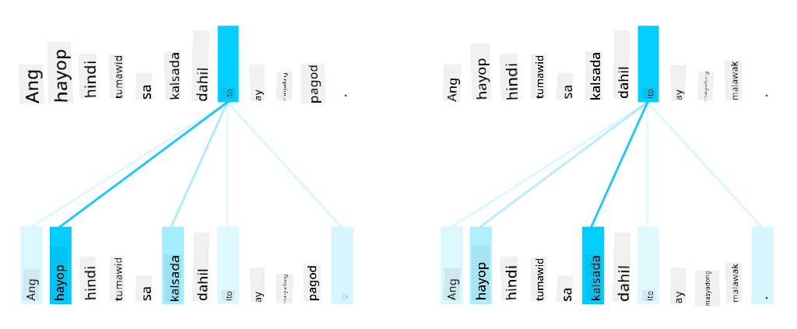
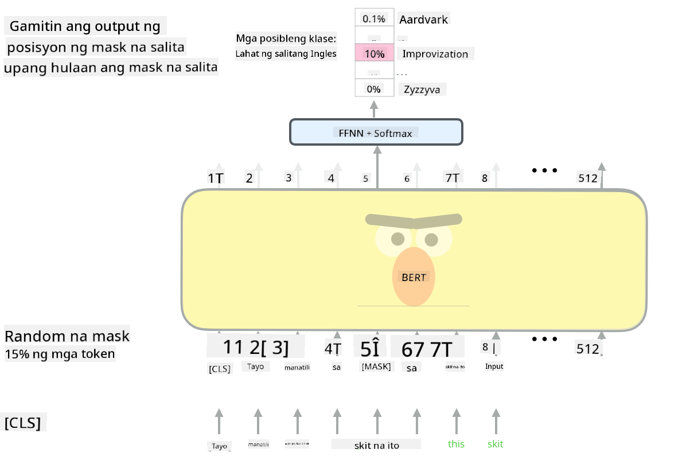

<!--
CO_OP_TRANSLATOR_METADATA:
{
  "original_hash": "7e617f0b8de85a43957a853aba09bfeb",
  "translation_date": "2025-08-28T02:42:27+00:00",
  "source_file": "lessons/5-NLP/18-Transformers/README.md",
  "language_code": "tl"
}
-->
# Mga Mekanismo ng Atensyon at Transformers

## [Pre-lecture quiz](https://red-field-0a6ddfd03.1.azurestaticapps.net/quiz/118)

Isa sa pinakamahalagang problema sa larangan ng NLP ay ang **machine translation**, isang mahalagang gawain na ginagamit sa mga tool tulad ng Google Translate. Sa seksyong ito, magtutuon tayo sa machine translation, o sa mas pangkalahatan, sa anumang *sequence-to-sequence* na gawain (na tinatawag ding **sentence transduction**).

Sa paggamit ng RNNs, ang sequence-to-sequence ay ipinatutupad gamit ang dalawang recurrent networks, kung saan ang isang network, ang **encoder**, ay nagko-collapse ng input sequence sa isang hidden state, habang ang isa pang network, ang **decoder**, ay nag-u-unroll ng hidden state na ito sa isang isinaling resulta. May ilang problema sa ganitong paraan:

* Ang huling estado ng encoder network ay nahihirapang maalala ang simula ng isang pangungusap, na nagdudulot ng mababang kalidad ng modelo para sa mahahabang pangungusap.
* Ang lahat ng salita sa isang sequence ay may parehong epekto sa resulta. Sa realidad, gayunpaman, may mga partikular na salita sa input sequence na mas may malaking epekto sa mga sunod-sunod na output kaysa sa iba.

Ang **Mekanismo ng Atensyon** ay nagbibigay ng paraan upang timbangin ang kontekstwal na epekto ng bawat input vector sa bawat output prediction ng RNN. Ang paraan ng pagpapatupad nito ay sa pamamagitan ng paglikha ng mga shortcut sa pagitan ng mga intermediate state ng input RNN at output RNN. Sa ganitong paraan, kapag gumagawa ng output symbol yt, isasaalang-alang natin ang lahat ng input hidden states hi, na may iba't ibang weight coefficients αt,i.

> Ang encoder-decoder model na may additive attention mechanism mula sa [Bahdanau et al., 2015](https://arxiv.org/pdf/1409.0473.pdf), na binanggit mula sa [blog post na ito](https://lilianweng.github.io/lil-log/2018/06/24/attention-attention.html)

Ang attention matrix {αi,j} ay kumakatawan sa antas kung saan ang ilang input na salita ay may papel sa pagbuo ng isang partikular na salita sa output sequence. Narito ang isang halimbawa ng naturang matrix:

> Larawan mula sa [Bahdanau et al., 2015](https://arxiv.org/pdf/1409.0473.pdf) (Fig.3)

Ang mga mekanismo ng atensyon ay responsable para sa karamihan ng kasalukuyan o malapit sa kasalukuyang state-of-the-art sa NLP. Gayunpaman, ang pagdaragdag ng atensyon ay lubos na nagpapataas ng bilang ng mga parameter ng modelo na nagdulot ng mga isyu sa scaling sa RNNs. Ang isang pangunahing limitasyon ng scaling ng RNNs ay ang likas na pagkakasunod-sunod ng mga modelo na nagpapahirap sa pag-batch at parallelize ng training. Sa isang RNN, ang bawat elemento ng isang sequence ay kailangang iproseso nang sunod-sunod, na nangangahulugang hindi ito madaling ma-parallelize.

> Larawan mula sa [Google's Blog](https://research.googleblog.com/2016/09/a-neural-network-for-machine.html)

Ang paggamit ng mga mekanismo ng atensyon kasabay ng limitasyong ito ay humantong sa paglikha ng mga kasalukuyang State-of-the-Art Transformer Models na kilala at ginagamit natin ngayon tulad ng BERT at Open-GPT3.

## Mga Transformer Models

Isa sa mga pangunahing ideya sa likod ng transformers ay ang pag-iwas sa sunod-sunod na kalikasan ng RNNs at ang paglikha ng isang modelong maaaring i-parallelize habang nagte-training. Ito ay nakamit sa pamamagitan ng pagpapatupad ng dalawang ideya:

* positional encoding
* paggamit ng self-attention mechanism upang makuha ang mga pattern sa halip na RNNs (o CNNs) (kaya't ang papel na nagpapakilala sa transformers ay tinawag na *[Attention is all you need](https://arxiv.org/abs/1706.03762)*)

### Positional Encoding/Embedding

Ang ideya ng positional encoding ay ang mga sumusunod.  
1. Kapag gumagamit ng RNNs, ang relatibong posisyon ng mga token ay kinakatawan ng bilang ng mga hakbang, kaya't hindi na kailangang ipakita nang tahasan.  
2. Gayunpaman, kapag lumipat tayo sa atensyon, kailangan nating malaman ang relatibong posisyon ng mga token sa loob ng isang sequence.  
3. Upang makuha ang positional encoding, dinaragdagan natin ang ating sequence ng mga token ng isang sequence ng mga posisyon ng token sa sequence (hal., isang sequence ng mga numero 0,1, ...).  
4. Pagkatapos, pinaghahalo natin ang posisyon ng token sa isang token embedding vector. Upang gawing vector ang posisyon (integer), maaari tayong gumamit ng iba't ibang paraan:

* Trainable embedding, katulad ng token embedding. Ito ang paraan na isasaalang-alang natin dito. Nag-a-apply tayo ng embedding layers sa parehong mga token at kanilang mga posisyon, na nagreresulta sa embedding vectors na may parehong dimensyon, na pagkatapos ay pinagsasama natin.
* Fixed position encoding function, tulad ng iminungkahi sa orihinal na papel.

> Larawan ng may-akda

Ang resulta na nakukuha natin sa positional embedding ay nag-eembed ng parehong orihinal na token at ang posisyon nito sa loob ng isang sequence.

### Multi-Head Self-Attention

Susunod, kailangan nating makuha ang ilang mga pattern sa loob ng ating sequence. Upang gawin ito, gumagamit ang transformers ng isang **self-attention** mechanism, na mahalagang atensyon na inilalapat sa parehong sequence bilang input at output. Ang pag-aapply ng self-attention ay nagbibigay-daan sa atin na isaalang-alang ang **konteksto** sa loob ng pangungusap, at makita kung aling mga salita ang magkakaugnay. Halimbawa, pinapayagan tayo nitong makita kung aling mga salita ang tinutukoy ng mga coreference, tulad ng *it*, at isaalang-alang din ang konteksto:

> Larawan mula sa [Google Blog](https://research.googleblog.com/2017/08/transformer-novel-neural-network.html)

Sa transformers, gumagamit tayo ng **Multi-Head Attention** upang bigyan ang network ng kakayahang makuha ang iba't ibang uri ng dependencies, tulad ng long-term vs. short-term word relations, co-reference vs. iba pa, atbp.

[TensorFlow Notebook](TransformersTF.ipynb) ay naglalaman ng higit pang detalye sa pagpapatupad ng transformer layers.

### Encoder-Decoder Attention

Sa transformers, ginagamit ang atensyon sa dalawang lugar:

* Upang makuha ang mga pattern sa loob ng input text gamit ang self-attention
* Upang magsagawa ng sequence translation - ito ang atensyon layer sa pagitan ng encoder at decoder.

Ang encoder-decoder attention ay halos katulad ng mekanismo ng atensyon na ginagamit sa RNNs, tulad ng inilarawan sa simula ng seksyong ito. Ang animated na diagram na ito ay nagpapaliwanag ng papel ng encoder-decoder attention.

Dahil ang bawat input position ay naiuugnay nang independyente sa bawat output position, mas mahusay na maiparallelize ng transformers kaysa sa RNNs, na nagbibigay-daan sa mas malalaking at mas expressive na mga modelo ng wika. Ang bawat attention head ay maaaring gamitin upang matutunan ang iba't ibang relasyon sa pagitan ng mga salita na nagpapabuti sa mga gawain sa Natural Language Processing.

## BERT

Ang **BERT** (Bidirectional Encoder Representations from Transformers) ay isang napakalaking multi-layer transformer network na may 12 layers para sa *BERT-base*, at 24 para sa *BERT-large*. Ang modelo ay unang pre-trained sa isang malaking corpus ng text data (WikiPedia + mga libro) gamit ang unsupervised training (pagpapredik ng mga masked words sa isang pangungusap). Sa panahon ng pre-training, ang modelo ay sumisipsip ng makabuluhang antas ng pag-unawa sa wika na maaaring magamit sa iba pang mga dataset gamit ang fine tuning. Ang prosesong ito ay tinatawag na **transfer learning**.

> Larawan [source](http://jalammar.github.io/illustrated-bert/)

## ✍️ Mga Ehersisyo: Transformers

Ipagpatuloy ang iyong pag-aaral sa mga sumusunod na notebooks:

* [Transformers sa PyTorch](TransformersPyTorch.ipynb)
* [Transformers sa TensorFlow](TransformersTF.ipynb)

## Konklusyon

Sa araling ito, natutunan mo ang tungkol sa Transformers at Attention Mechanisms, mga mahalagang kasangkapan sa NLP toolbox. Maraming mga bersyon ng Transformer architectures kabilang ang BERT, DistilBERT, BigBird, OpenGPT3, at iba pa na maaaring i-fine tune. Ang [HuggingFace package](https://github.com/huggingface/) ay nagbibigay ng repository para sa pagte-train ng marami sa mga arkitekturang ito gamit ang parehong PyTorch at TensorFlow.

## 🚀 Hamon

## [Post-lecture quiz](https://red-field-0a6ddfd03.1.azurestaticapps.net/quiz/218)

## Review at Pag-aaral sa Sarili

* [Blog post](https://mchromiak.github.io/articles/2017/Sep/12/Transformer-Attention-is-all-you-need/), na nagpapaliwanag sa klasikong [Attention is all you need](https://arxiv.org/abs/1706.03762) na papel tungkol sa transformers.
* [Isang serye ng mga blog post](https://towardsdatascience.com/transformers-explained-visually-part-1-overview-of-functionality-95a6dd460452) tungkol sa transformers, na nagpapaliwanag ng arkitektura nang detalyado.

## [Assignment](assignment.md)

---

**Paunawa**:  
Ang dokumentong ito ay isinalin gamit ang AI translation service na [Co-op Translator](https://github.com/Azure/co-op-translator). Bagama't sinisikap naming maging tumpak, tandaan na ang mga awtomatikong pagsasalin ay maaaring maglaman ng mga pagkakamali o hindi pagkakatugma. Ang orihinal na dokumento sa kanyang katutubong wika ang dapat ituring na opisyal na sanggunian. Para sa mahalagang impormasyon, inirerekomenda ang propesyonal na pagsasalin ng tao. Hindi kami mananagot sa anumang hindi pagkakaunawaan o maling interpretasyon na maaaring magmula sa paggamit ng pagsasaling ito.