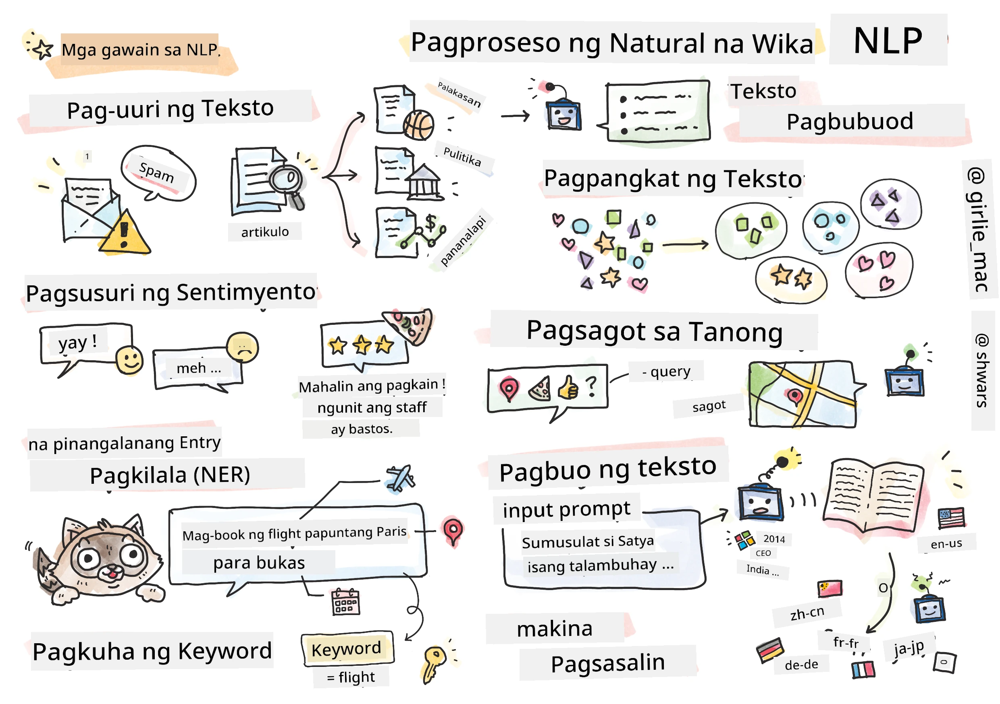

# Natural Language Processing



Sa seksyong ito, magtutuon tayo sa paggamit ng Neural Networks upang harapin ang mga gawain na may kaugnayan sa **Natural Language Processing (NLP)**. Maraming mga problema sa NLP na nais nating masolusyunan ng mga computer:

* **Text classification** ay isang karaniwang problema ng klasipikasyon na may kinalaman sa mga text sequence. Halimbawa nito ay ang pag-uuri ng mga e-mail bilang spam o hindi-spam, o ang pag-kategorya ng mga artikulo bilang sports, negosyo, politika, atbp. Gayundin, kapag gumagawa ng chat bots, madalas nating kailangang maunawaan kung ano ang nais sabihin ng isang user -- sa kasong ito, tinutukoy natin ang **intent classification**. Kadalasan, sa intent classification, kailangang harapin ang maraming kategorya.
* **Sentiment analysis** ay isang karaniwang problema ng regression, kung saan kailangan nating magtalaga ng numero (isang damdamin) na tumutukoy kung gaano ka-positibo/negatibo ang kahulugan ng isang pangungusap. Isang mas advanced na bersyon ng sentiment analysis ay ang **aspect-based sentiment analysis** (ABSA), kung saan itinatakda ang damdamin hindi sa buong pangungusap, kundi sa iba't ibang bahagi nito (mga aspeto), halimbawa: *Sa restawran na ito, nagustuhan ko ang pagkain, ngunit ang atmospera ay kakila-kilabot*.
* **Named Entity Recognition** (NER) ay tumutukoy sa problema ng pagkuha ng ilang mga entidad mula sa teksto. Halimbawa, maaaring kailangan nating maunawaan na sa pariralang *Kailangan kong lumipad papuntang Paris bukas* ang salitang *bukas* ay tumutukoy sa DATE, at ang *Paris* ay isang LOCATION.  
* **Keyword extraction** ay katulad ng NER, ngunit kailangan nating awtomatikong kunin ang mga salitang mahalaga sa kahulugan ng pangungusap, nang hindi pre-training para sa mga partikular na uri ng entidad.
* **Text clustering** ay maaaring maging kapaki-pakinabang kapag nais nating pagsama-samahin ang mga magkatulad na pangungusap, halimbawa, mga magkatulad na kahilingan sa mga teknikal na suporta.
* **Question answering** ay tumutukoy sa kakayahan ng isang modelo na sagutin ang isang partikular na tanong. Ang modelo ay tumatanggap ng isang text passage at isang tanong bilang input, at kailangang magbigay ng lugar sa teksto kung saan matatagpuan ang sagot sa tanong (o, minsan, bumuo ng sagot na teksto).
* **Text Generation** ay ang kakayahan ng isang modelo na bumuo ng bagong teksto. Maaari itong ituring bilang isang problema ng klasipikasyon na hinuhulaan ang susunod na letra/salita batay sa isang *text prompt*. Ang mga advanced na modelo ng text generation, tulad ng GPT-3, ay kayang lutasin ang iba pang mga gawain sa NLP tulad ng klasipikasyon gamit ang isang teknik na tinatawag na [prompt programming](https://towardsdatascience.com/software-3-0-how-prompting-will-change-the-rules-of-the-game-a982fbfe1e0) o [prompt engineering](https://medium.com/swlh/openai-gpt-3-and-prompt-engineering-dcdc2c5fcd29).
* **Text summarization** ay isang teknik kung saan nais nating "basahin" ng computer ang mahabang teksto at ibuod ito sa ilang pangungusap.
* **Machine translation** ay maaaring tingnan bilang kombinasyon ng pag-unawa sa teksto sa isang wika, at pagbuo ng teksto sa isa pang wika.

Noong una, karamihan sa mga gawain sa NLP ay nalulutas gamit ang mga tradisyunal na pamamaraan tulad ng mga grammar. Halimbawa, sa machine translation, ginagamit ang mga parser upang gawing syntax tree ang orihinal na pangungusap, pagkatapos ay kinukuha ang mas mataas na antas ng mga semantikong istruktura upang kumatawan sa kahulugan ng pangungusap, at batay sa kahulugang ito at grammar ng target na wika, nabubuo ang resulta. Sa kasalukuyan, maraming gawain sa NLP ang mas epektibong nalulutas gamit ang neural networks.

> Maraming mga klasikong pamamaraan sa NLP ang naipatupad sa [Natural Language Processing Toolkit (NLTK)](https://www.nltk.org) Python library. Mayroong mahusay na [NLTK Book](https://www.nltk.org/book/) na makukuha online na tumatalakay kung paano malulutas ang iba't ibang gawain sa NLP gamit ang NLTK.

Sa ating kurso, magtutuon tayo sa paggamit ng Neural Networks para sa NLP, at gagamitin ang NLTK kung kinakailangan.

Natuto na tayo tungkol sa paggamit ng neural networks para sa pagproseso ng tabular data at mga imahe. Ang pangunahing pagkakaiba sa pagitan ng mga uri ng data na iyon at ng teksto ay ang teksto ay isang sequence na may variable na haba, habang ang laki ng input sa kaso ng mga imahe ay alam na sa simula pa lang. Habang ang convolutional networks ay kayang kumuha ng mga pattern mula sa input data, ang mga pattern sa teksto ay mas kumplikado. Halimbawa, maaaring may negasyon na hiwalay sa paksa ng maraming salita (hal. *Hindi ko gusto ang mga dalandan*, kumpara sa *Hindi ko gusto ang mga malalaki, makukulay, at masarap na dalandan*), at dapat pa rin itong ma-interpret bilang isang pattern. Kaya, upang ma-handle ang wika, kailangan nating magpakilala ng mga bagong uri ng neural network, tulad ng *recurrent networks* at *transformers*.

## Pag-install ng mga Library

Kung gumagamit ka ng lokal na Python installation para patakbuhin ang kursong ito, maaaring kailangan mong i-install ang lahat ng kinakailangang library para sa NLP gamit ang mga sumusunod na command:

**Para sa PyTorch**
```bash
pip install -r requirements-torch.txt
```
**Para sa TensorFlow**
```bash
pip install -r requirements-tf.txt
```

> Maaari mong subukan ang NLP gamit ang TensorFlow sa [Microsoft Learn](https://docs.microsoft.com/learn/modules/intro-natural-language-processing-tensorflow/?WT.mc_id=academic-77998-cacaste)

## Babala sa GPU

Sa seksyong ito, sa ilang mga halimbawa ay magte-train tayo ng medyo malalaking modelo.
* **Gumamit ng Computer na May GPU**: Inirerekomenda na patakbuhin ang iyong mga notebook sa isang computer na may GPU upang mabawasan ang oras ng paghihintay kapag nagtatrabaho sa malalaking modelo.
* **Mga Limitasyon sa GPU Memory**: Ang paggamit ng GPU ay maaaring magdulot ng mga sitwasyon kung saan nauubusan ka ng GPU memory, lalo na kapag nagtetrain ng malalaking modelo.
* **Konsumo ng GPU Memory**: Ang dami ng GPU memory na nagagamit sa panahon ng training ay nakadepende sa iba't ibang salik, kabilang ang laki ng minibatch.
* **Bawasan ang Laki ng Minibatch**: Kung makakaranas ka ng mga isyu sa GPU memory, isaalang-alang ang pagbabawas ng laki ng minibatch sa iyong code bilang posibleng solusyon.
* **Paglabas ng GPU Memory sa TensorFlow**: Ang mga mas lumang bersyon ng TensorFlow ay maaaring hindi maglabas ng GPU memory nang tama kapag nagtetrain ng maraming modelo sa loob ng isang Python kernel. Upang epektibong pamahalaan ang paggamit ng GPU memory, maaari mong i-configure ang TensorFlow upang maglaan lamang ng GPU memory kung kinakailangan.
* **Pagdaragdag ng Code**: Upang itakda ang TensorFlow na palakihin ang GPU memory allocation lamang kung kinakailangan, idagdag ang sumusunod na code sa iyong mga notebook:

```python
physical_devices = tf.config.list_physical_devices('GPU') 
if len(physical_devices)>0:
    tf.config.experimental.set_memory_growth(physical_devices[0], True) 
```

Kung interesado kang matuto tungkol sa NLP mula sa klasikong ML na perspektibo, bisitahin ang [suite ng mga araling ito](https://github.com/microsoft/ML-For-Beginners/tree/main/6-NLP)

## Sa Seksiyong Ito
Sa seksyong ito, matututo tayo tungkol sa:

* [Pagre-representa ng teksto bilang tensors](13-TextRep/README.md)
* [Word Embeddings](14-Emdeddings/README.md)
* [Language Modeling](15-LanguageModeling/README.md)
* [Recurrent Neural Networks](16-RNN/README.md)
* [Generative Networks](17-GenerativeNetworks/README.md)
* [Transformers](18-Transformers/README.md)

---

**Paunawa**:  
Ang dokumentong ito ay isinalin gamit ang AI translation service na [Co-op Translator](https://github.com/Azure/co-op-translator). Bagama't sinisikap naming maging tumpak, tandaan na ang mga awtomatikong pagsasalin ay maaaring maglaman ng mga pagkakamali o hindi pagkakatugma. Ang orihinal na dokumento sa kanyang katutubong wika ang dapat ituring na opisyal na sanggunian. Para sa mahalagang impormasyon, inirerekomenda ang propesyonal na pagsasalin ng tao. Hindi kami mananagot sa anumang hindi pagkakaunawaan o maling interpretasyon na maaaring magmula sa paggamit ng pagsasaling ito.