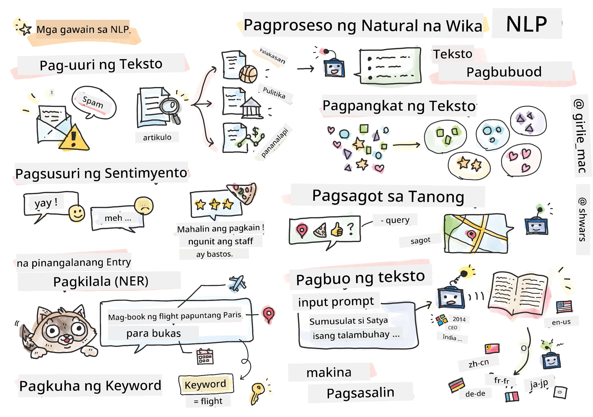

# Pagproseso ng Likas na Wika



Sa seksyong ito, magtutuon tayo sa paggamit ng Neural Networks upang hawakan ang mga gawain na may kaugnayan sa **Pagproseso ng Likas na Wika (NLP)**. Maraming mga suliranin sa NLP na nais nating kaya ng mga computer na lutasin:

* **Pagsusuri ng teksto** ay isang karaniwang problema sa klasipikasyon na may kaugnayan sa mga sekwensya ng teksto. Halimbawa nito ay ang pagklasipika ng mga mensahe sa e-mail bilang spam vs. hindi spam, o pag-uuri ng mga artikulo bilang sports, negosyo, politika, atbp. Kapag nagde-develop ng mga chat bots, madalas kailangan nating maunawaan kung ano ang nais sabihin ng gumagamit -- sa kasong ito ay tinutukoy natin ang **klasipikasyon ng intensyon**. Madalas, sa klasipikasyon ng intensyon kailangan nating harapin ang maraming kategorya.
* **Pagsusuri ng damdamin** ay isang karaniwang problema sa regresyon, kung saan kailangan nating bigyan ng numero (isang damdamin) na tumutukoy kung gaano positibo/negatibo ang kahulugan ng isang pangungusap. Ang mas advanced na bersyon ng pagsusuri ng damdamin ay ang **aspect-based sentiment analysis** (ABSA), kung saan hindi natin binibigyan ng damdamin ang buong pangungusap, kundi ang iba't ibang bahagi nito (mga aspekto), hal. *Sa restawran na ito, nagustuhan ko ang pagkain, pero ang atmospera ay kakila-kilabot*.
* **Pagkilala sa Pangalan na Entidad** (NER) ay tumutukoy sa suliranin ng pagkuha ng ilang mga entidad mula sa teksto. Halimbawa, kailangan nating maunawaan na sa pariralang *Kailangan kong lumipad papuntang Paris bukas* ang salitang *bukas* ay tumutukoy sa PETSA, at ang *Paris* ay isang LUGAR.  
* **Pagkuha ng mga pangunahing salita** ay kahawig ng NER, ngunit kailangan nating awtomatikong kunin ang mga salitang mahalaga sa kahulugan ng pangungusap, nang walang paunang pagsasanay para sa tiyak na mga uri ng entidad.
* **Pagpangkat-pangkat ng teksto** ay maaaring maging kapaki-pakinabang kapag nais nating pagsamahin ang mga magkatulad na pangungusap, halimbawa, mga magkatulad na kahilingan sa mga usapan sa suporta sa teknikal.
* **Pagsagot sa mga tanong** ay tumutukoy sa kakayahan ng isang modelo na sagutin ang isang partikular na tanong. Tumatanggap ang modelo ng isang teksto at isang tanong bilang mga input, at kailangan nitong ibigay ang lugar sa teksto kung saan nakapaloob ang sagot sa tanong (o, minsan, lumikha ng sagot na teksto).
* **Pagbuo ng Teksto** ay ang kakayahan ng isang modelo na bumuo ng bagong teksto. Maaari itong ituring bilang isang gawain sa klasipikasyon na nagpapredict ng susunod na titik/salita base sa ilang *text prompt*. Ang mga advanced na modelo ng pagbuo ng teksto, tulad ng GPT-3, ay kaya ring lutasin ang ibang mga gawain sa NLP tulad ng klasipikasyon gamit ang teknik na tinatawag na [prompt programming](https://towardsdatascience.com/software-3-0-how-prompting-will-change-the-rules-of-the-game-a982fbfe1e0) o [prompt engineering](https://medium.com/swlh/openai-gpt-3-and-prompt-engineering-dcdc2c5fcd29)
* **Pagbubuod ng teksto** ay isang teknik kung kailan nais nating ang computer na "basahin" ang mahabang teksto at ibuod ito sa ilang pangungusap.
* **Pagsasalin ng makina** ay maaaring tingnan bilang kumbinasyon ng pag-unawa sa teksto sa isang wika, at pagbuo ng teksto sa ibang wika.

Noong una, karamihan sa mga gawain sa NLP ay nilulutas gamit ang mga tradisyunal na pamamaraan gaya ng gramatika. Halimbawa, sa pagsasalin ng makina ginagamit ang mga parser upang i-transform ang unang pangungusap sa isang syntax tree, pagkatapos ay ini-extract ang mga mas mataas na antas ng semantikong istruktura upang kumatawan sa kahulugan ng pangungusap, at base sa kahulugang ito at sa gramatika ng target na wika, ginagawa ang resulta. Ngayon, marami nang mga gawain sa NLP ang mas epektibong nalulutas gamit ang mga neural networks.

> Maraming klasikal na pamamaraan ng NLP ang ipinatupad sa [Natural Language Processing Toolkit (NLTK)](https://www.nltk.org) na Python library. Mayroong mahusay na [NLTK Book](https://www.nltk.org/book/) na libre at online na nagpapakita kung paano malulutas ang iba't ibang gawain sa NLP gamit ang NLTK.

Sa aming kurso, karamihan ay magtutuon kami sa paggamit ng Neural Networks para sa NLP, at gagamit kami ng NLTK kung kinakailangan.

Natutunan na natin ang paggamit ng neural networks para sa paghawak ng mga tabular na datos at mga imahe. Ang pangunahing pagkakaiba sa pagitan ng mga uri ng datos na iyon at teksto ay ang teksto ay isang sekwensya na may pabago-bagong haba, samantalang ang sukat ng input sa kaso ng mga imahe ay alam na agad. Habang kayang mag-extract ng mga pattern mula sa input data ang mga convolutional network, mas kumplikado ang mga pattern sa teksto. Halimbawa, maaaring malayo sa paksa ang negation kahit ilang salita ang pagitan nito (hal. *Hindi ko gusto ang mga orange*, vs. *Hindi ko gusto ang mga malalaki, makukulay, at masarap na orange*), at ito ay dapat ituring pa rin bilang isang pattern. Kaya, upang hawakan ang wika, kailangan nating ipakilala ang mga bagong uri ng neural network, gaya ng *recurrent networks* at *transformers*.

## Mag-install ng mga Library

Kung gumagamit ka ng lokal na Python na pag-install para patakbuhin ang kursong ito, maaaring kailanganin mong i-install ang lahat ng kinakailangang mga library para sa NLP gamit ang mga sumusunod na utos:

**Para sa PyTorch**
```bash
pip install -r requirements-pytorch.txt
```
**Para sa TensorFlow**
```bash
pip install -r requirements-tf.txt
```

> Maaari mong subukan ang NLP gamit ang TensorFlow sa [Microsoft Learn](https://docs.microsoft.com/learn/modules/intro-natural-language-processing-tensorflow/?WT.mc_id=academic-77998-cacaste)

## Babala sa GPU

Sa seksyong ito, sa ilang mga halimbawa ay magta-train tayo ng medyo malalaking modelo.
* **Gumamit ng Computer na may GPU**: Inirerekomenda na patakbuhin ang iyong mga notebook sa computer na may GPU upang mabawasan ang paghihintay kapag nagtatrabaho sa malalaking modelo.
* **Mga Limitasyon sa GPU Memory**: Ang pagpapatakbo sa GPU ay maaaring magdulot ng kakulangan sa GPU memory, lalo na kapag nagtatrabaho sa malalaking modelo.
* **Pagkonsumo ng GPU Memory**: Ang dami ng GPU memory na nagagamit habang nagtatrabaho ay depende sa iba't ibang salik, kabilang ang laki ng minibatch.
* **Bawasan ang Laki ng Minibatch**: Kung makakaranas ka ng mga isyu sa GPU memory, subukang bawasan ang laki ng minibatch sa iyong code bilang posibleng solusyon.
* **Pagpapalabas ng TensorFlow GPU Memory**: Ang mga mas lumang bersyon ng TensorFlow ay maaaring hindi maayos na maglabas ng GPU memory kapag nagtatrabaho sa maraming modelo sa loob ng isang Python kernel. Upang maayos na pamahalaan ang paggamit ng GPU memory, maaari mong i-configure ang TensorFlow upang maglaan lamang ng GPU memory kung kinakailangan.
* **Pagsasama ng Code**: Para maiset ang TensorFlow na unti-unting dagdagan lamang ang alokasyon ng GPU memory kung kinakailangan, isama ang sumusunod na code sa iyong mga notebook:

```python
physical_devices = tf.config.list_physical_devices('GPU') 
if len(physical_devices)>0:
    tf.config.experimental.set_memory_growth(physical_devices[0], True) 
```

Kung interesado kang matuto tungkol sa NLP mula sa klasikal na pananaw ng ML, bisitahin ang [suite ng mga leksyon na ito](https://github.com/microsoft/ML-For-Beginners/tree/main/6-NLP)

## Sa Seksiyong Ito
Sa seksyong ito ay matututuhan natin ang tungkol sa:

* [Pagre-representa ng teksto bilang mga tensor](13-TextRep/README.md)
* [Mga Word Embeddings](14-Embeddings/README.md)
* [Pagmomodelo ng Wika](15-LanguageModeling/README.md)
* [Mga Recurrent Neural Network](16-RNN/README.md)
* [Mga Generative Network](17-GenerativeNetworks/README.md)
* [Mga Transformer](18-Transformers/README.md)

---

<!-- CO-OP TRANSLATOR DISCLAIMER START -->
**Pagtatanggi**:
Ang dokumentong ito ay isinalin gamit ang serbisyo ng AI translation na [Co-op Translator](https://github.com/Azure/co-op-translator). Bagama't nagsusumikap kami para sa katumpakan, pakatandaan na ang awtomatikong pagsasalin ay maaaring maglaman ng mga pagkakamali o hindi pagkakatugma. Ang orihinal na dokumento sa orihinal nitong wika ang dapat ituring na pangunahing sanggunian. Para sa mahahalagang impormasyon, inirerekomenda ang propesyonal na pagsasalin ng tao. Hindi kami mananagot sa anumang maling pagkakaintindi o maling interpretasyon na nagmula sa paggamit ng pagsasaling ito.
<!-- CO-OP TRANSLATOR DISCLAIMER END -->