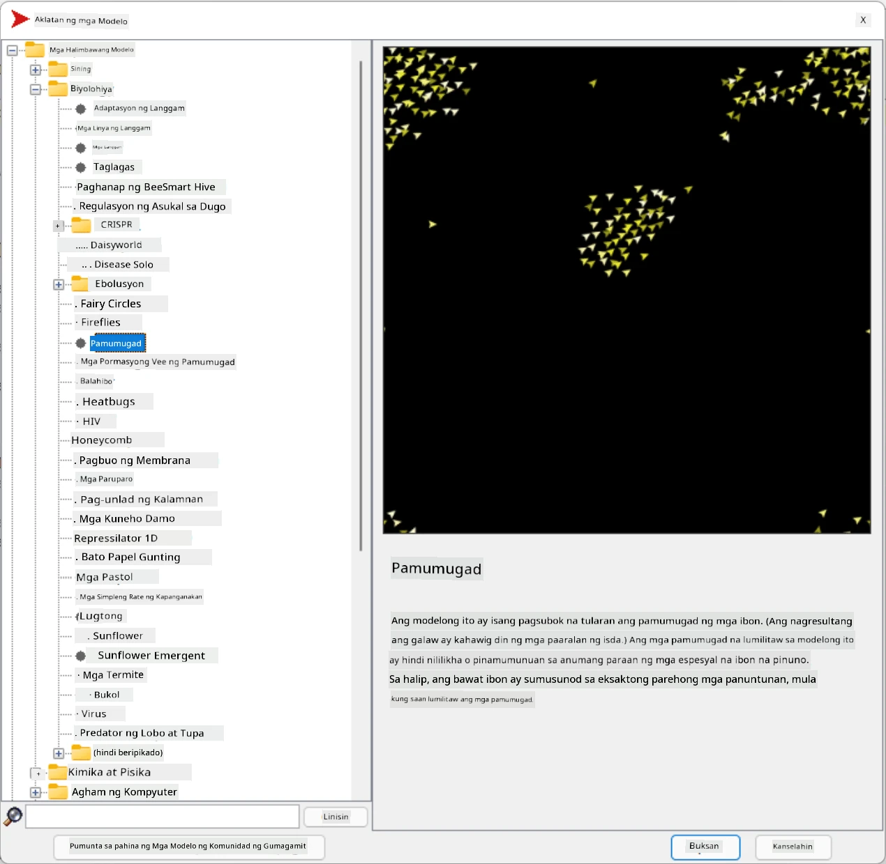

# Multi-Agent Systems

Isa sa mga posibleng paraan ng pag-abot sa katalinuhan ay ang tinatawag na **emergent** (o **synergetic**) na pamamaraan, na nakabatay sa ideya na ang pinagsamang kilos ng maraming simpleng ahente ay maaaring magresulta sa mas kumplikado (o matalino) na kilos ng sistema bilang kabuuan. Teoretikal, ito ay nakabatay sa mga prinsipyo ng [Collective Intelligence](https://en.wikipedia.org/wiki/Collective_intelligence), [Emergentism](https://en.wikipedia.org/wiki/Global_brain), at [Evolutionary Cybernetics](https://en.wikipedia.org/wiki/Global_brain), na nagsasabing ang mas mataas na antas ng mga sistema ay nakakakuha ng karagdagang halaga kapag maayos na pinagsama mula sa mas mababang antas ng mga sistema (tinatawag na *principle of metasystem transition*).

## [Pre-lecture quiz](https://ff-quizzes.netlify.app/en/ai/quiz/45)

Ang direksyon ng **Multi-Agent Systems** ay lumitaw sa AI noong dekada 1990 bilang tugon sa paglago ng Internet at mga distributed systems. Isa sa mga klasikong aklat ng AI, [Artificial Intelligence: A Modern Approach](https://en.wikipedia.org/wiki/Artificial_Intelligence:_A_Modern_Approach), ay nakatuon sa pananaw ng klasikong AI mula sa perspektibo ng Multi-agent systems.

Ang sentro ng Multi-agent approach ay ang konsepto ng **Agent** - isang entidad na nabubuhay sa isang **environment**, na kaya nitong maramdaman at kumilos dito. Ito ay isang napakalawak na depinisyon, at maaaring magkaroon ng iba't ibang uri at klasipikasyon ng mga ahente:

* Batay sa kanilang kakayahang mag-isip:
   - **Reactive** agents ay karaniwang may simpleng request-response na uri ng kilos
   - **Deliberative** agents ay gumagamit ng ilang uri ng lohikal na pag-iisip at/o kakayahan sa pagpaplano
* Batay sa lugar kung saan tumatakbo ang code ng ahente:
   - **Static** agents ay gumagana sa isang dedikadong network node
   - **Mobile** agents ay maaaring ilipat ang kanilang code sa pagitan ng mga network nodes
* Batay sa kanilang kilos:
   - **Passive agents** ay walang partikular na layunin. Ang mga ganitong ahente ay maaaring tumugon sa panlabas na stimuli, ngunit hindi magsisimula ng anumang aksyon sa kanilang sarili.
   - **Active agents** ay may mga layunin na kanilang hinahabol
   - **Cognitive agents** ay may kasamang mas kumplikadong pagpaplano at pag-iisip

Ang mga multi-agent systems ay ginagamit ngayon sa iba't ibang aplikasyon:

* Sa mga laro, maraming non-player characters ang gumagamit ng ilang uri ng AI, at maaaring ituring na mga intelligent agents
* Sa paggawa ng video, ang pag-render ng mga kumplikadong 3D scenes na may kasamang mga tao ay karaniwang ginagawa gamit ang multi-agent simulation
* Sa systems modeling, ang multi-agent approach ay ginagamit upang gayahin ang kilos ng isang kumplikadong modelo. Halimbawa, ang multi-agent approach ay matagumpay na ginamit upang hulaan ang pagkalat ng COVID-19 sa buong mundo. Ang katulad na approach ay maaaring gamitin upang i-modelo ang trapiko sa lungsod, at makita kung paano ito tumutugon sa mga pagbabago sa mga patakaran sa trapiko.
* Sa mga kumplikadong automation systems, ang bawat device ay maaaring kumilos bilang isang independiyenteng ahente, na ginagawang mas hindi monolitiko at mas matatag ang buong sistema.

Hindi tayo maglalaan ng maraming oras sa malalim na pag-aaral ng multi-agent systems, ngunit titingnan natin ang isang halimbawa ng **Multi-Agent Modeling**.

## NetLogo

[NetLogo](https://ccl.northwestern.edu/netlogo/) ay isang multi-agent modeling environment na nakabatay sa binagong bersyon ng [Logo](https://en.wikipedia.org/wiki/Logo_(programming_language)) programming language. Ang wikang ito ay binuo para sa pagtuturo ng mga konsepto ng programming sa mga bata, at pinapayagan kang kontrolin ang isang ahente na tinatawag na **turtle**, na maaaring gumalaw at mag-iwan ng bakas. Pinapayagan nito ang paglikha ng mga kumplikadong geometric figures, na isang napaka-visual na paraan upang maunawaan ang kilos ng isang ahente.

Sa NetLogo, maaari tayong lumikha ng maraming turtles gamit ang `create-turtles` na utos. Maaari nating utusan ang lahat ng turtles na gumawa ng ilang aksyon (sa halimbawa sa ibaba - gumalaw ng 10 puntos pasulong):

```
create-turtles 10
ask turtles [
  forward 10
]
```

Siyempre, hindi ito kawili-wili kung lahat ng turtles ay gumagawa ng parehong bagay, kaya maaari nating `ask` ang mga grupo ng turtles, halimbawa, ang mga nasa paligid ng isang partikular na punto. Maaari rin tayong lumikha ng turtles ng iba't ibang *breeds* gamit ang `breed [cats cat]` na utos. Dito, ang `cat` ay ang pangalan ng breed, at kailangan nating tukuyin ang parehong singular at plural na salita, dahil ang iba't ibang utos ay gumagamit ng iba't ibang anyo para sa kalinawan.

> ✅ Hindi natin pag-aaralan ang NetLogo language mismo - maaari mong bisitahin ang mahusay na [Beginner's Interactive NetLogo Dictionary](https://ccl.northwestern.edu/netlogo/bind/) na resource kung interesado kang matuto pa.

Maaari mong [i-download](https://ccl.northwestern.edu/netlogo/download.shtml) at i-install ang NetLogo upang subukan ito.

### Models Library

Ang maganda sa NetLogo ay mayroon itong library ng mga gumaganang modelo na maaari mong subukan. Pumunta sa **File &rightarrow; Models Library**, at mayroon kang maraming kategorya ng mga modelo na mapagpipilian.



> Screenshot ng models library ni Dmitry Soshnikov

Maaari mong buksan ang isa sa mga modelo, halimbawa **Biology &rightarrow; Flocking**.

### Main Principles

Pagkatapos buksan ang modelo, dadalhin ka sa pangunahing screen ng NetLogo. Narito ang isang sample na modelo na naglalarawan sa populasyon ng mga lobo at tupa, na may limitadong resources (damo).


> Screenshot ni Dmitry Soshnikov

Sa screen na ito, makikita mo:

* Ang seksyon ng **Interface** na naglalaman ng:
  - Ang pangunahing field, kung saan nabubuhay ang lahat ng ahente
  - Iba't ibang controls: buttons, sliders, atbp.
  - Mga graphs na maaari mong gamitin upang ipakita ang mga parameter ng simulation
* Ang **Code** tab na naglalaman ng editor, kung saan maaari kang mag-type ng NetLogo program

Sa karamihan ng mga kaso, ang interface ay magkakaroon ng **Setup** button, na nag-iinitialize ng simulation state, at isang **Go** button na nagsisimula ng execution. Ang mga ito ay pinangangasiwaan ng mga kaukulang handlers sa code na ganito ang hitsura:

```
to go [
...
]
```

Ang mundo ng NetLogo ay binubuo ng mga sumusunod na bagay:

* **Agents** (turtles) na maaaring gumalaw sa field at gumawa ng isang bagay. Inuutusan mo ang mga ahente gamit ang `ask turtles [...]` syntax, at ang code sa brackets ay isinasagawa ng lahat ng ahente sa *turtle mode*.
* **Patches** ay mga square areas ng field, kung saan nabubuhay ang mga ahente. Maaari mong tukuyin ang lahat ng ahente sa parehong patch, o maaari mong baguhin ang kulay ng patch at ilang iba pang properties. Maaari mo ring `ask patches` na gumawa ng isang bagay.
* **Observer** ay isang natatanging ahente na kumokontrol sa mundo. Ang lahat ng button handlers ay isinasagawa sa *observer mode*.

> ✅ Ang kagandahan ng isang multi-agent environment ay ang code na tumatakbo sa turtle mode o sa patch mode ay isinasagawa nang sabay-sabay ng lahat ng ahente nang parallel. Kaya, sa pamamagitan ng pagsusulat ng kaunting code at pagprograma ng kilos ng indibidwal na ahente, maaari kang lumikha ng kumplikadong kilos ng simulation system bilang kabuuan.

### Flocking

Bilang isang halimbawa ng multi-agent behavior, tingnan natin ang **[Flocking](https://en.wikipedia.org/wiki/Flocking_(behavior))**. Ang Flocking ay isang kumplikadong pattern na katulad ng kung paano lumilipad ang mga kawan ng ibon. Sa panonood sa kanilang paglipad, maaari mong isipin na sinusunod nila ang isang uri ng kolektibong algorithm, o na mayroon silang isang uri ng *collective intelligence*. Gayunpaman, ang kumplikadong kilos na ito ay lumilitaw kapag ang bawat indibidwal na ahente (sa kasong ito, isang *ibon*) ay nagmamasid lamang sa ilang iba pang ahente sa maikling distansya mula dito, at sinusunod ang tatlong simpleng patakaran:

* **Alignment** - ito ay tumutugon sa average na direksyon ng mga kalapit na ahente
* **Cohesion** - ito ay sinusubukang tumugon sa average na posisyon ng mga kapitbahay (*long range attraction*)
* **Separation** - kapag masyadong malapit sa ibang mga ibon, sinusubukan nitong lumayo (*short range repulsion*)

Maaari mong patakbuhin ang flocking example at obserbahan ang kilos. Maaari mo ring ayusin ang mga parameter, tulad ng *degree of separation*, o ang *viewing range*, na tumutukoy kung gaano kalayo ang nakikita ng bawat ibon. Tandaan na kung babawasan mo ang viewing range sa 0, lahat ng ibon ay nagiging bulag, at tumitigil ang flocking. Kung babawasan mo ang separation sa 0, lahat ng ibon ay nagtitipon sa isang tuwid na linya.

> ✅ Lumipat sa **Code** tab at tingnan kung saan ipinatupad sa code ang tatlong patakaran ng flocking (alignment, cohesion, at separation). Pansinin kung paano natin tinutukoy lamang ang mga ahente na nasa paningin.

### Iba pang Mga Modelong Pwedeng Tingnan

May ilang iba pang mga kawili-wiling modelo na maaari mong eksperimento:

* **Art &rightarrow; Fireworks** nagpapakita kung paano ang isang paputok ay maaaring ituring na kolektibong kilos ng indibidwal na fire streams
* **Social Science &rightarrow; Traffic Basic** at **Social Science &rightarrow; Traffic Grid** nagpapakita ng modelo ng trapiko sa lungsod sa 1D at 2D Grid na may o walang traffic lights. Ang bawat kotse sa simulation ay sumusunod sa mga sumusunod na patakaran:
   - Kung ang espasyo sa harap nito ay walang laman - mag-accelerate (hanggang sa isang tiyak na max speed)
   - Kung nakikita ang hadlang sa harap - mag-brake (at maaari mong ayusin kung gaano kalayo ang nakikita ng driver)
* **Social Science &rightarrow; Party** nagpapakita kung paano nagkakagrupo ang mga tao sa isang cocktail party. Maaari mong hanapin ang kombinasyon ng mga parameter na nagdudulot ng pinakamabilis na pagtaas ng kasiyahan ng grupo.

Tulad ng nakikita mula sa mga halimbawang ito, ang mga multi-agent simulations ay maaaring maging isang kapaki-pakinabang na paraan upang maunawaan ang kilos ng isang kumplikadong sistema na binubuo ng mga indibidwal na sumusunod sa parehong o katulad na lohika. Maaari rin itong gamitin upang kontrolin ang mga virtual agents, tulad ng [NPCs](https://en.wikipedia.org/wiki/NPC) sa mga computer games, o mga ahente sa 3D animated worlds.

## Deliberative Agents

Ang mga ahenteng inilarawan sa itaas ay napakasimple, tumutugon sa mga pagbabago sa environment gamit ang ilang uri ng algorithm. Bilang ganito, sila ay **reactive agents**. Gayunpaman, minsan ang mga ahente ay maaaring mag-isip at magplano ng kanilang aksyon, kung saan sila ay tinatawag na **deliberative**.

Isang tipikal na halimbawa ay isang personal agent na tumatanggap ng utos mula sa tao upang mag-book ng vacation tour. Ipagpalagay na mayroong maraming ahente na nabubuhay sa internet, na maaaring tumulong dito. Dapat nitong kontakin ang ibang mga ahente upang makita kung aling mga flight ang available, ano ang mga presyo ng hotel para sa iba't ibang petsa, at subukang makipag-ayos para sa pinakamagandang presyo. Kapag ang vacation plan ay kumpleto at naaprubahan ng may-ari, maaari itong magpatuloy sa pag-book.

Upang magawa ito, ang mga ahente ay kailangang **magkomunikasyon**. Para sa matagumpay na komunikasyon, kailangan nila ng:

* Ilang **standard languages para magpalitan ng kaalaman**, tulad ng [Knowledge Interchange Format](https://en.wikipedia.org/wiki/Knowledge_Interchange_Format) (KIF) at [Knowledge Query and Manipulation Language](https://en.wikipedia.org/wiki/Knowledge_Query_and_Manipulation_Language) (KQML). Ang mga wikang ito ay dinisenyo batay sa [Speech Act theory](https://en.wikipedia.org/wiki/Speech_act).
* Ang mga wikang ito ay dapat ding maglaman ng ilang **protocols para sa negosasyon**, batay sa iba't ibang **uri ng auction**.
* Isang **common ontology** na gagamitin, upang tumukoy sila sa parehong mga konsepto na alam ang kanilang semantika
* Isang paraan upang **matuklasan** kung ano ang kayang gawin ng iba't ibang ahente, batay din sa ilang uri ng ontology

Ang deliberative agents ay mas kumplikado kaysa sa reactive, dahil hindi lamang sila tumutugon sa mga pagbabago sa environment, dapat din silang makapagpasimula ng mga aksyon. Isa sa mga iminungkahing arkitektura para sa deliberative agents ay ang tinatawag na Belief-Desire-Intention (BDI) agent:

* **Beliefs** bumubuo ng set ng kaalaman tungkol sa environment ng ahente. Maaari itong istruktura bilang isang knowledge base o set ng mga patakaran na maaaring ilapat ng ahente sa isang partikular na sitwasyon sa environment.
* **Desires** tumutukoy sa kung ano ang gustong gawin ng ahente, i.e. ang mga layunin nito. Halimbawa, ang layunin ng personal assistant agent sa itaas ay mag-book ng tour, at ang layunin ng hotel agent ay makapag-maximize ng kita.
* **Intentions** ay mga partikular na aksyon na plano ng ahente upang maabot ang mga layunin nito. Ang mga aksyon ay karaniwang nagbabago sa environment at nagdudulot ng komunikasyon sa ibang mga ahente.

May ilang mga platform na magagamit para sa pagbuo ng multi-agent systems, tulad ng [JADE](https://jade.tilab.com/). [Ang papel na ito](https://arxiv.org/ftp/arxiv/papers/2007/2007.08961.pdf) ay naglalaman ng pagsusuri ng mga multi-agent platforms, kasama ang maikling kasaysayan ng multi-agent systems at ang iba't ibang mga senaryo ng paggamit nito.

## Konklusyon

Ang mga Multi-Agent systems ay maaaring magkaroon ng iba't ibang anyo at magamit sa maraming iba't ibang aplikasyon. 
Ang mga ito ay nakatuon sa mas simpleng kilos ng indibidwal na ahente, at nakakamit ang mas kumplikadong kilos ng kabuuang sistema dahil sa **synergetic effect**.

## 🚀 Hamon

Dalhin ang araling ito sa totoong mundo at subukang mag-konseptwalisa ng isang multi-agent system na maaaring mag-solve ng problema. Ano, halimbawa, ang kailangang gawin ng isang multi-agent system upang ma-optimize ang ruta ng school bus? Paano ito maaaring gumana sa isang panaderya?

## [Post-lecture quiz](https://ff-quizzes.netlify.app/en/ai/quiz/46)

## Review & Self Study

Suriin ang paggamit ng ganitong uri ng sistema sa industriya. Pumili ng isang domain tulad ng manufacturing o industriya ng video game at tuklasin kung paano maaaring magamit ang mga multi-agent systems upang malutas ang mga natatanging problema.

## [NetLogo Assignment](assignment.md)

---

