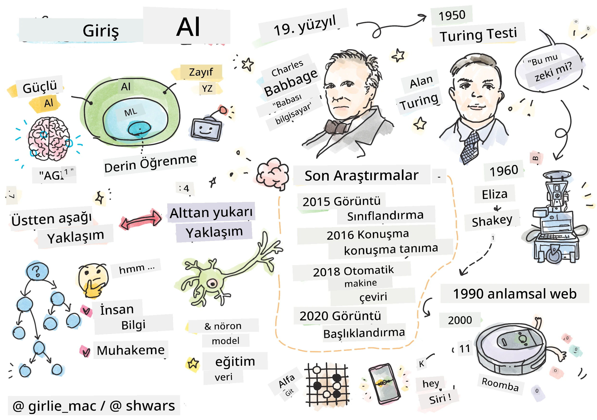
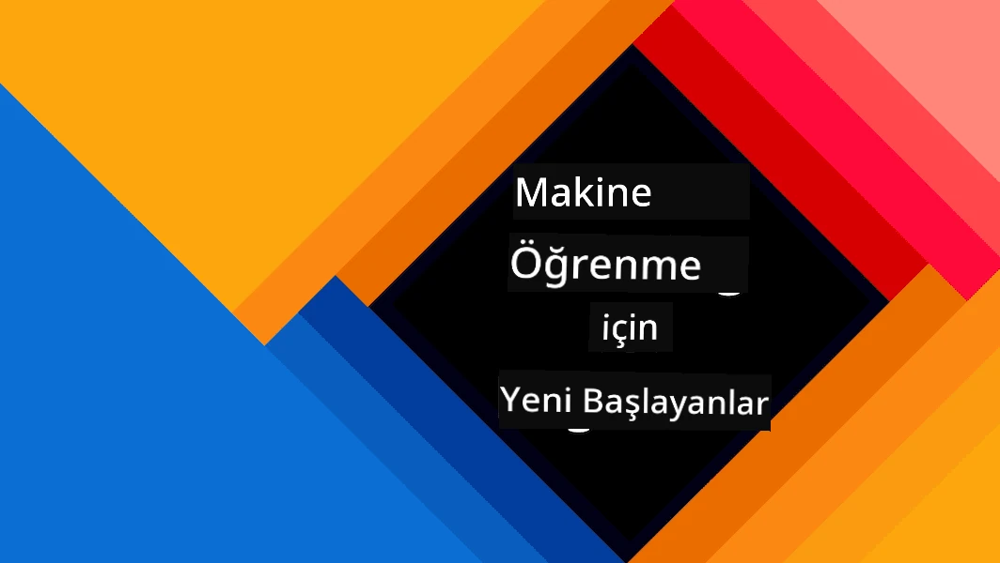
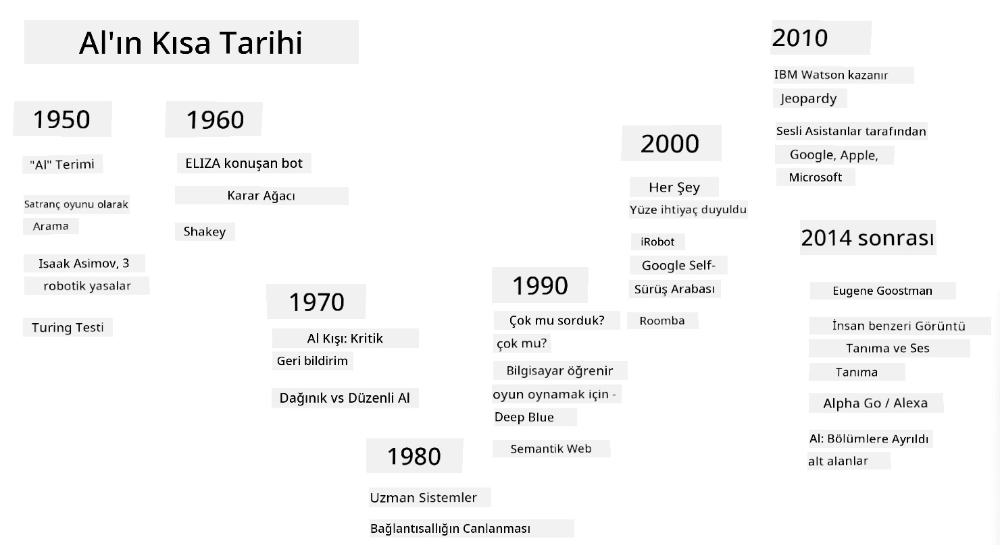
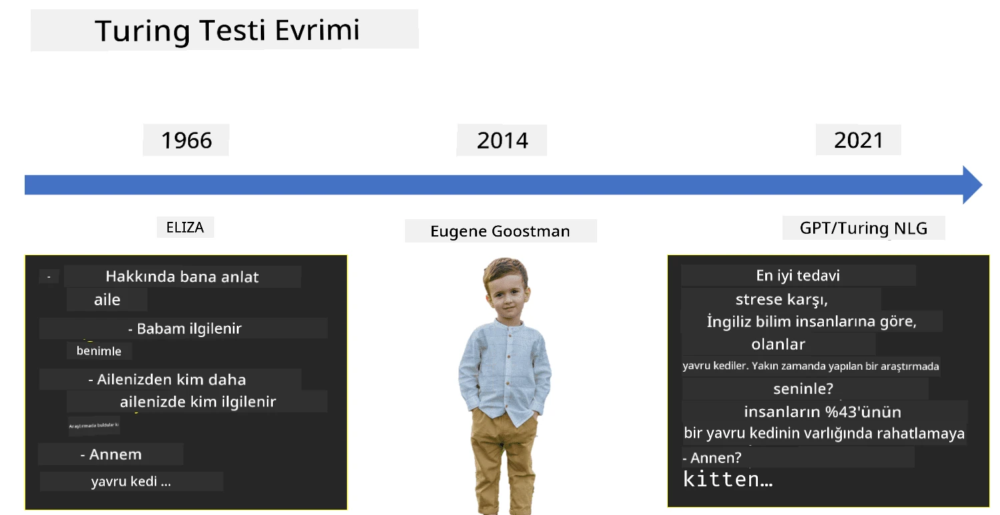

# Yapay Zekaya Giriş

> Çizim: [Tomomi Imura](https://twitter.com/girlie_mac)

## [Ders Öncesi Test](https://ff-quizzes.netlify.app/en/ai/quiz/1)

**Yapay Zeka**, bilgisayarların insanlara özgü zeki davranışlar sergilemesini sağlayacak şekilde nasıl programlanabileceğini inceleyen heyecan verici bir bilim dalıdır. Örneğin, insanların iyi olduğu şeyleri yapabilme yeteneği.

Başlangıçta, bilgisayarlar [Charles Babbage](https://en.wikipedia.org/wiki/Charles_Babbage) tarafından iyi tanımlanmış bir prosedürü - bir algoritmayı - takip ederek sayılar üzerinde işlem yapmak için icat edilmiştir. Modern bilgisayarlar, 19. yüzyılda önerilen orijinal modelden çok daha gelişmiş olmasına rağmen, hala kontrollü hesaplama fikrini takip etmektedir. Bu nedenle, bir hedefe ulaşmak için gereken adımların tam sırasını bildiğimiz sürece bir bilgisayarı bir şey yapması için programlamak mümkündür.

> Fotoğraf: [Vickie Soshnikova](http://twitter.com/vickievalerie)

> ✅ Bir kişinin fotoğrafından yaşını belirlemek, açıkça programlanamayacak bir görevdir çünkü bunu yaparken kafamızda bir sayı oluşturduğumuzda nasıl yaptığımızı bilmiyoruz.

---

Ancak, açıkça nasıl çözüleceğini bilmediğimiz bazı görevler vardır. Bir kişinin fotoğrafından yaşını belirlemeyi düşünün. Bunu bir şekilde öğreniyoruz çünkü farklı yaşlardaki birçok insan örneği gördük, ancak bunu nasıl yaptığımızı açıkça açıklayamıyoruz ve bilgisayarı bunu yapması için programlayamıyoruz. İşte tam da bu tür görevler **Yapay Zeka** (kısaca AI) için ilgi çekicidir.

✅ AI'dan faydalanabilecek bazı görevler düşünün. Finans, tıp ve sanat alanlarını göz önünde bulundurun - bu alanlar bugün AI'dan nasıl faydalanıyor?

## Zayıf AI ve Güçlü AI

Zayıf AI | Güçlü AI
---------------------------------------|-------------------------------------
Zayıf AI, belirli bir görev veya dar bir görev seti için tasarlanmış ve eğitilmiş AI sistemlerini ifade eder.|Güçlü AI veya Yapay Genel Zeka (AGI), insan seviyesinde zeka ve anlayışa sahip AI sistemlerini ifade eder.
Bu AI sistemleri genel olarak zeki değildir; tanımlanmış bir görevde mükemmel performans gösterirler ancak gerçek bir anlayış veya bilinçten yoksundurlar.|Bu AI sistemleri, bir insanın yapabileceği herhangi bir entelektüel görevi gerçekleştirme, farklı alanlara uyum sağlama ve bir tür bilinç veya öz farkındalık sahibi olma yeteneğine sahiptir.
Zayıf AI örnekleri arasında Siri veya Alexa gibi sanal asistanlar, yayın hizmetleri tarafından kullanılan öneri algoritmaları ve belirli müşteri hizmeti görevleri için tasarlanmış sohbet botları yer alır.|Güçlü AI'ya ulaşmak, AI araştırmalarının uzun vadeli bir hedefidir ve geniş bir görev ve bağlam yelpazesinde akıl yürütme, öğrenme, anlama ve uyum sağlama yeteneğine sahip AI sistemlerinin geliştirilmesini gerektirir.
Zayıf AI son derece özelleşmiştir ve dar alanının ötesinde insan benzeri bilişsel yeteneklere veya genel problem çözme yeteneklerine sahip değildir.|Güçlü AI şu anda teorik bir kavramdır ve hiçbir AI sistemi bu genel zeka seviyesine ulaşmamıştır.

Daha fazla bilgi için **[Yapay Genel Zeka](https://en.wikipedia.org/wiki/Artificial_general_intelligence)** (AGI) konusuna bakabilirsiniz.

## Zeka Tanımı ve Turing Testi

**[Zeka](https://en.wikipedia.org/wiki/Intelligence)** terimiyle uğraşırken karşılaşılan sorunlardan biri, bu terimin net bir tanımının olmamasıdır. Zekanın **soyut düşünce** veya **öz farkındalık** ile bağlantılı olduğunu iddia edebilirsiniz, ancak bunu doğru bir şekilde tanımlayamayız.

> [Fotoğraf](https://unsplash.com/photos/75715CVEJhI): [Amber Kipp](https://unsplash.com/@sadmax) tarafından Unsplash'tan alınmıştır.

*Zeka* teriminin belirsizliğini görmek için şu soruyu yanıtlamayı deneyin: "Bir kedi zeki midir?" Farklı insanlar bu soruya farklı yanıtlar verme eğilimindedir çünkü bu iddianın doğru olup olmadığını kanıtlayacak evrensel olarak kabul edilmiş bir test yoktur. Ve eğer olduğunu düşünüyorsanız - kedinizi bir IQ testinden geçirmeyi deneyin...

✅ Zekayı nasıl tanımladığınızı bir dakika düşünün. Bir labirenti çözerek yiyeceğe ulaşabilen bir karga zeki midir? Bir çocuk zeki midir?

---

AGI'den bahsederken, gerçekten zeki bir sistem oluşturup oluşturmadığımızı anlamanın bir yoluna ihtiyacımız var. [Alan Turing](https://en.wikipedia.org/wiki/Alan_Turing), aynı zamanda bir zeka tanımı olarak da işlev gören bir yöntem önerdi: **[Turing Testi](https://en.wikipedia.org/wiki/Turing_test)**. Test, verilen bir sistemi doğası gereği zeki bir şeyle - gerçek bir insanla - karşılaştırır ve herhangi bir otomatik karşılaştırma bir bilgisayar programı tarafından atlatılabileceği için, bir insan sorgulayıcı kullanırız. Yani, bir insan gerçek bir kişi ile bir bilgisayar sistemi arasındaki farkı metin tabanlı bir diyalogda ayırt edemezse - sistem zeki kabul edilir.

> St. Petersburg'da geliştirilen [Eugene Goostman](https://en.wikipedia.org/wiki/Eugene_Goostman) adlı bir sohbet botu, 2014 yılında Turing testini geçmeye yaklaşmıştı. Bot, zekice bir kişilik hilesi kullanarak kendisinin 13 yaşında bir Ukraynalı çocuk olduğunu önceden duyurdu. Bu, bilgi eksikliğini ve metindeki bazı tutarsızlıkları açıklıyordu. Bot, 5 dakikalık bir diyalogdan sonra yargıçların %30'unu insan olduğuna ikna etti. Turing, bir makinenin 2000 yılına kadar bu metriği geçebileceğine inanıyordu. Ancak, bunun zeki bir sistem oluşturduğumuz veya bir bilgisayar sisteminin insan sorgulayıcıyı kandırdığı anlamına gelmediğini anlamak gerekir - sistem insanları kandırmadı, botun yaratıcıları kandırdı!

✅ Hiç bir sohbet botunun insan olduğuna inanmanız için sizi kandırdığı oldu mu? Sizi nasıl ikna etti?

## Yapay Zekaya Yaklaşımlar

Bir bilgisayarın insan gibi davranmasını istiyorsak, bir şekilde bilgisayarın içinde düşünme biçimimizi modellememiz gerekir. Dolayısıyla, bir insanı zeki yapan şeyin ne olduğunu anlamaya çalışmamız gerekir.

> Bir makineye zeka programlayabilmek için, kendi karar verme süreçlerimizin nasıl çalıştığını anlamamız gerekir. Biraz kendinizi gözlemlediğinizde, bazı süreçlerin bilinçaltında gerçekleştiğini fark edeceksiniz – örneğin, bir kediyi bir köpekten ayırt edebiliriz, ancak bunu düşünmeden yaparız – diğerleri ise akıl yürütmeyi içerir.

Bu soruna iki olası yaklaşım vardır:

Üstten Aşağı Yaklaşım (Sembolik Akıl Yürütme) | Alttan Yukarı Yaklaşım (Sinir Ağları)
---------------------------------------|-------------------------------------
Üstten aşağı yaklaşım, bir kişinin bir problemi çözmek için akıl yürütme biçimini modellemeye çalışır. Bu, bir insandan **bilgi** çıkarmayı ve bunu bilgisayar tarafından okunabilir bir biçimde temsil etmeyi içerir. Ayrıca bilgisayar içinde **akıl yürütmeyi** modellemenin bir yolunu geliştirmemiz gerekir. | Alttan yukarı yaklaşım, insan beyninin yapısını modellemeye çalışır. Beyin, **nöronlar** adı verilen çok sayıda basit birimden oluşur. Her nöron, girdilerinin ağırlıklı bir ortalaması gibi davranır ve nöron ağını faydalı problemleri çözmek için **eğitim verileri** sağlayarak eğitebiliriz.

Zekaya yönelik başka olası yaklaşımlar da vardır:

* **Ortaya Çıkan**, **Sinergik** veya **çoklu ajan yaklaşımı**, karmaşık zeki davranışların çok sayıda basit ajanın etkileşimiyle elde edilebileceği gerçeğine dayanır. [Evrimsel sibernetik](https://en.wikipedia.org/wiki/Global_brain#Evolutionary_cybernetics)'e göre, zeka daha basit, tepkisel davranışlardan *metasistem geçişi* sürecinde *ortaya çıkabilir*.

* **Evrimsel yaklaşım** veya **genetik algoritma**, evrim ilkelerine dayanan bir optimizasyon sürecidir.

Bu yaklaşımları kursun ilerleyen bölümlerinde ele alacağız, ancak şu anda iki ana yön üzerinde duracağız: üstten aşağı ve alttan yukarı.

### Üstten Aşağı Yaklaşım

**Üstten aşağı yaklaşımda**, akıl yürütmemizi modellemeye çalışırız. Çünkü akıl yürütürken düşüncelerimizi takip edebiliriz, bu süreci resmileştirmeye ve bilgisayarın içine programlamaya çalışabiliriz. Buna **sembolik akıl yürütme** denir.

İnsanlar, karar verme süreçlerini yönlendiren bazı kurallara sahip olma eğilimindedir. Örneğin, bir doktor bir hastayı teşhis ederken, kişinin ateşi olduğunu fark edebilir ve bu nedenle vücutta bir iltihaplanma olabileceğini düşünebilir. Bir doktor, belirli bir probleme büyük bir kural seti uygulayarak nihai teşhise ulaşabilir.

Bu yaklaşım büyük ölçüde **bilgi temsili** ve **akıl yürütme**ye dayanır. Bir insan uzmandan bilgi çıkarmak en zor kısım olabilir çünkü bir doktor birçok durumda neden belirli bir teşhise ulaştığını tam olarak bilmeyebilir. Bazen çözüm açık düşünme olmadan kafasında belirir. Bir kişinin fotoğrafından yaşını belirlemek gibi bazı görevler, bilgiyi manipüle etmeye hiç indirgenemez.

### Alttan Yukarı Yaklaşım

Alternatif olarak, beynimizdeki en basit öğeleri – bir nöronu – modellemeye çalışabiliriz. Bilgisayarın içinde **yapay sinir ağı** oluşturabilir ve ardından örnekler vererek problemleri çözmeyi öğretmeye çalışabiliriz. Bu süreç, yeni doğmuş bir çocuğun çevresini gözlem yaparak öğrenmesine benzer.

✅ Bebeklerin nasıl öğrendiği hakkında biraz araştırma yapın. Bir bebeğin beyninin temel unsurları nelerdir?

> | Peki ya ML?         |      |
> |--------------|-----------|
> | Bazı verilere dayanarak bir problemi çözmeyi öğrenen bilgisayar temelli yapay zeka kısmına **Makine Öğrenimi** denir. Bu kursta klasik makine öğrenimini ele almayacağız - sizi ayrı bir [Makine Öğrenimi için Başlangıç](http://aka.ms/ml-beginners) müfredatına yönlendiriyoruz. |       |

## Yapay Zekanın Kısa Tarihi

Yapay Zeka, yirminci yüzyılın ortalarında bir alan olarak başladı. Başlangıçta, sembolik akıl yürütme yaygın bir yaklaşımdı ve uzman sistemler gibi bazı sınırlı problem alanlarında uzman gibi davranabilen bilgisayar programları gibi önemli başarılara yol açtı. Ancak, bu yaklaşımın iyi ölçeklenmediği kısa sürede anlaşıldı. Bir uzmandan bilgi çıkarmak, bunu bir bilgisayarda temsil etmek ve bilgi tabanını doğru tutmak çok karmaşık bir görev ve birçok durumda pratik olmaktan çok pahalı olduğu ortaya çıktı. Bu, 1970'lerde [AI Kışı](https://en.wikipedia.org/wiki/AI_winter) olarak adlandırılan döneme yol açtı.

> Görsel: [Dmitry Soshnikov](http://soshnikov.com)

Zamanla, bilgisayar kaynakları ucuzladı ve daha fazla veri erişilebilir hale geldi, böylece sinir ağı yaklaşımları insanlarla rekabet edebilecek performans göstermeye başladı. Son on yılda, Yapay Zeka terimi çoğunlukla Sinir Ağları ile eş anlamlı olarak kullanıldı çünkü duyduğumuz Yapay Zeka başarılarının çoğu bunlara dayanıyor.

Satranç oynayan bir bilgisayar programı oluşturma yaklaşımlarının nasıl değiştiğini gözlemleyebiliriz:

* İlk satranç programları arama temelliydi – bir program, belirli bir sayıda sonraki hamle için bir rakibin olası hamlelerini tahmin etmeye çalıştı ve birkaç hamlede elde edilebilecek en iyi pozisyona dayalı olarak optimal bir hamle seçti. Bu, [alpha-beta budama](https://en.wikipedia.org/wiki/Alpha%E2%80%93beta_pruning) arama algoritmasının geliştirilmesine yol açtı.
* Arama stratejileri, oyunun sonuna doğru, arama alanı sınırlı bir olası hamle sayısıyla sınırlı olduğunda iyi çalışır. Ancak, oyunun başında arama alanı çok büyüktür ve algoritma, insan oyuncular arasındaki mevcut maçlardan öğrenerek geliştirilebilir. Sonraki deneyler, programın oyundaki mevcut pozisyona çok benzer durumları bilgi tabanında aradığı [durum temelli akıl yürütme](https://en.wikipedia.org/wiki/Case-based_reasoning) yöntemini kullandı.
* İnsan oyuncuları yenen modern programlar, yalnızca uzun süre kendilerine karşı oynayarak ve kendi hatalarından öğrenerek oynamayı öğrenen sinir ağları ve [pekiştirmeli öğrenme](https://en.wikipedia.org/wiki/Reinforcement_learning) temellidir – tıpkı insanların satranç öğrenirken yaptığı gibi. Ancak, bir bilgisayar programı çok daha kısa sürede çok daha fazla oyun oynayabilir ve böylece çok daha hızlı öğrenebilir.

✅ AI tarafından oynanan diğer oyunlar hakkında biraz araştırma yapın.

Benzer şekilde, "konuşan programlar" (Turing testini geçebilecek türden) oluşturma yaklaşımının nasıl değiştiğini görebiliriz:

* Bu türden erken programlar, [Eliza](https://en.wikipedia.org/wiki/ELIZA) gibi, çok basit dilbilgisi kurallarına ve giriş cümlesinin bir soruya yeniden formüle edilmesine dayanıyordu.
* Cortana, Siri veya Google Asistan gibi modern asistanlar, konuşmayı metne dönüştürmek ve niyetimizi tanımak için Sinir ağlarını kullanan ve ardından gerekli eylemleri gerçekleştirmek için bazı akıl yürütme veya açık algoritmalar kullanan hibrit sistemlerdir.
* Gelecekte, diyaloğu tamamen kendi başına yönetebilecek tam bir sinir temelli model bekleyebiliriz. Son zamanlardaki GPT ve [Turing-NLG](https://www.microsoft.com/research/blog/turing-nlg-a-17-billion-parameter-language-model-by-microsoft) sinir ağı ailesi bu konuda büyük başarılar göstermektedir.

> Görsel Dmitry Soshnikov tarafından, [fotoğraf](https://unsplash.com/photos/r8LmVbUKgns) [Marina Abrosimova](https://unsplash.com/@abrosimova_marina_foto) tarafından, Unsplash

## Son Dönem AI Araştırmaları

Sinir ağı araştırmalarındaki büyük büyüme, büyük kamuya açık veri setlerinin kullanılabilir hale gelmeye başladığı 2010 civarında başladı. Yaklaşık 14 milyon etiketlenmiş görüntü içeren [ImageNet](https://en.wikipedia.org/wiki/ImageNet) adlı büyük bir görüntü koleksiyonu, [ImageNet Büyük Ölçekli Görsel Tanıma Yarışması](https://image-net.org/challenges/LSVRC/)’nın doğmasına yol açtı.

> Görsel [Dmitry Soshnikov](http://soshnikov.com) tarafından

2012 yılında, [Convolutional Neural Networks](../4-ComputerVision/07-ConvNets/README.md) ilk kez görüntü sınıflandırmada kullanıldı ve bu, sınıflandırma hatalarında önemli bir düşüşe yol açtı (neredeyse %30'dan %16.4'e). 2015 yılında, Microsoft Research’ün ResNet mimarisi [insan seviyesinde doğruluk](https://doi.org/10.1109/ICCV.2015.123) elde etti.

O zamandan beri, Sinir Ağları birçok görevde çok başarılı bir performans sergiledi:

---

Yıl  | İnsan Seviyesinde Başarı
-----|-------------------------
2015 | [Görüntü Sınıflandırma](https://doi.org/10.1109/ICCV.2015.123)
2016 | [Konuşma Tanıma](https://arxiv.org/abs/1610.05256)
2018 | [Otomatik Makine Çevirisi](https://arxiv.org/abs/1803.05567) (Çince-İngilizce)
2020 | [Görüntü Altyazılama](https://arxiv.org/abs/2009.13682)

Son birkaç yılda, BERT ve GPT-3 gibi büyük dil modelleriyle büyük başarılar gördük. Bu, büyük ölçüde genel metin verilerinin bolca bulunması sayesinde gerçekleşti. Bu veriler, modellerin metinlerin yapısını ve anlamını öğrenmesini, genel metin koleksiyonlarında önceden eğitilmesini ve ardından bu modellerin daha spesifik görevler için özelleştirilmesini sağladı. Bu kursun ilerleyen bölümlerinde [Doğal Dil İşleme](../5-NLP/README.md) hakkında daha fazla bilgi edineceğiz.

## 🚀 Meydan Okuma

İnternette bir tur yaparak, AI'nin en etkili şekilde nerede kullanıldığını belirleyin. Bir haritalama uygulamasında mı, bir konuşmadan metne hizmette mi yoksa bir video oyununda mı? Sistemin nasıl inşa edildiğini araştırın.

## [Ders sonrası test](https://ff-quizzes.netlify.app/en/ai/quiz/2)

## Gözden Geçirme ve Kendi Kendine Çalışma

[Bu dersi](https://github.com/microsoft/ML-For-Beginners/tree/main/1-Introduction/2-history-of-ML) okuyarak AI ve ML tarihini gözden geçirin. Bu dersin veya bu dersin başındaki sketchnote’tan bir öğe seçin ve onun evrimini şekillendiren kültürel bağlamı daha derinlemesine anlamak için araştırma yapın.

**Ödev**: [Game Jam](assignment.md)

---

<!-- CO-OP TRANSLATOR DISCLAIMER START -->
**Feragatname**:  
Bu belge, [Co-op Translator](https://github.com/Azure/co-op-translator) adlı yapay zeka çeviri hizmeti kullanılarak çevrilmiştir. Doğruluk için çaba göstersek de, otomatik çevirilerin hata veya yanlışlıklar içerebileceğini lütfen unutmayın. Belgenin orijinal dili, yetkili kaynak olarak kabul edilmelidir. Kritik bilgiler için profesyonel insan çevirisi önerilir. Bu çevirinin kullanımından kaynaklanan yanlış anlamalar veya yanlış yorumlamalar için sorumluluk kabul edilmez.
<!-- CO-OP TRANSLATOR DISCLAIMER END -->