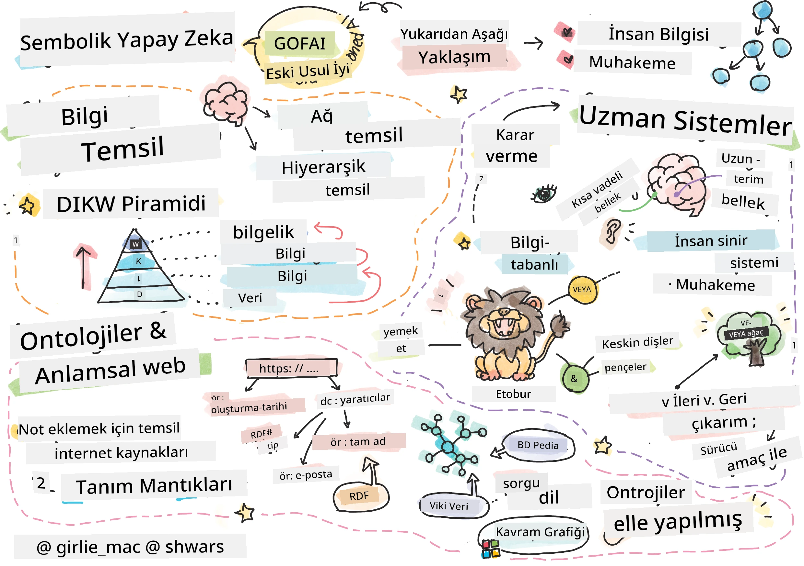
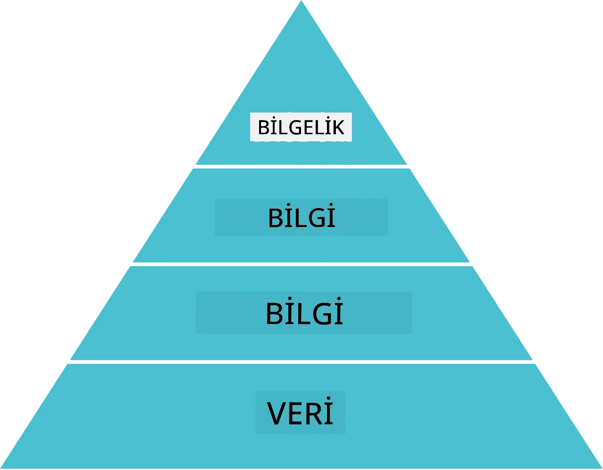
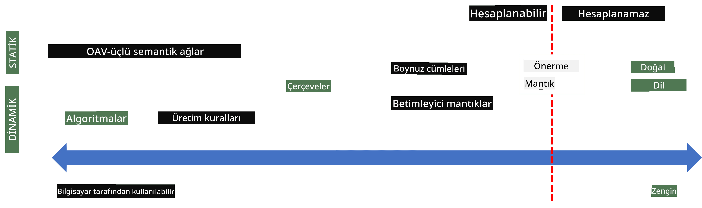
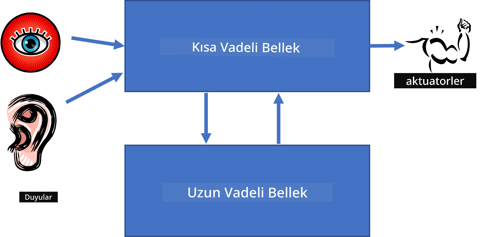
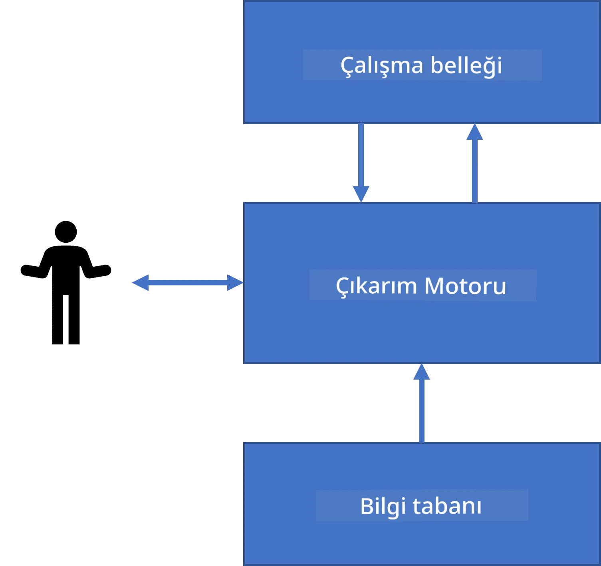
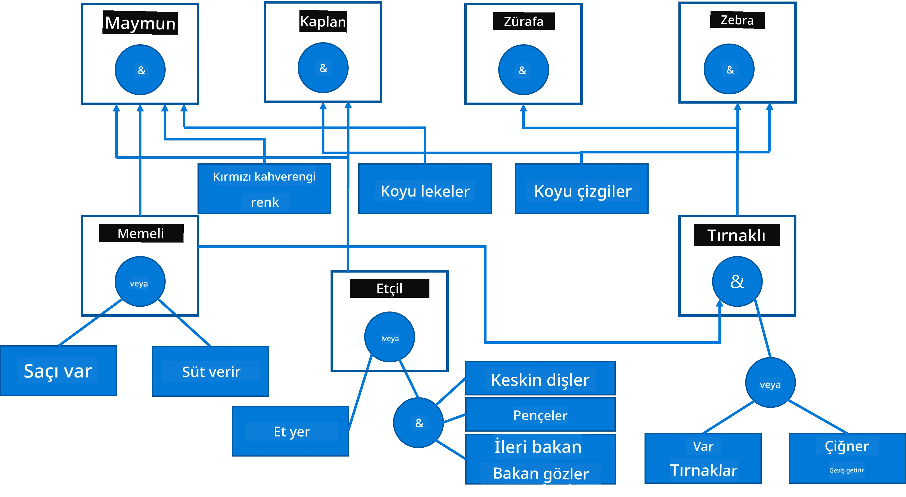
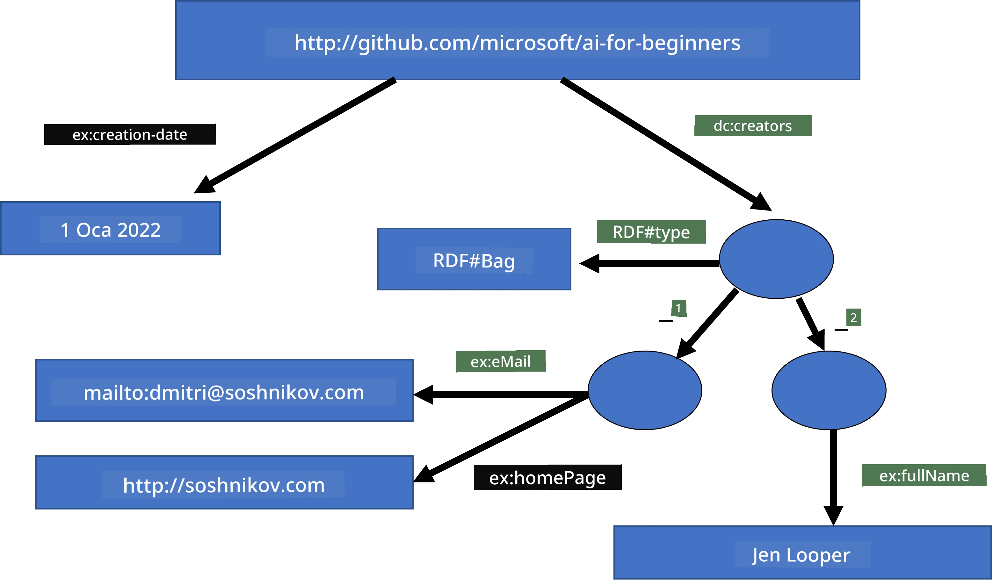
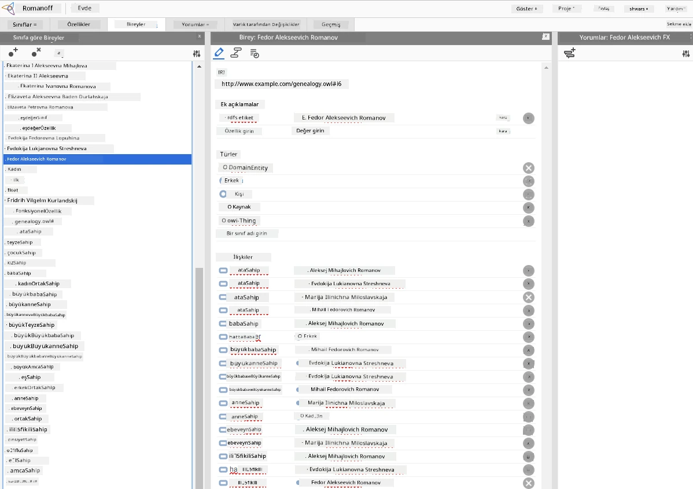

# Bilgi Temsili ve Uzman Sistemler



> Sketchnote [Tomomi Imura](https://twitter.com/girlie_mac) tarafından

Yapay zekâ arayışı, insanların dünyayı anladığı gibi anlamak için bilgi arayışına dayanır. Peki bunu nasıl yapabilirsiniz?

## [Ön-ders sınavı](https://ff-quizzes.netlify.app/en/ai/quiz/3)

AI'nin ilk dönemlerinde, akıllı sistemler yaratmaya yönelik yukarıdan aşağı yaklaşımı (önceki derste tartışılmıştır) popülerdi. Fikir, bilgiyi insanlardan makine tarafından okunabilir bir forma çıkarıp, ardından bunu otomatik problem çözmede kullanmaktı. Bu yaklaşım iki büyük fikre dayanıyordu:

* Bilgi Temsili
* Akıl Yürütme

## Bilgi Temsili

Sembolik AI'deki önemli kavramlardan biri **bilgidir**. Bilgiyi *bilgi* veya *veri* den ayırmak önemlidir. Örneğin, kitapların bilgi içerdiği söylenebilir, çünkü kitaplar çalışılarak uzman olunur. Ancak kitapların içinde aslında *veri* vardır ve kitapları okuyup bu veriyi dünya modelimize entegre ederek bu veriyi bilgiye dönüştürürüz.

> ✅ **Bilgi**, kafamızda bulunan ve dünyayı anlama biçimimizi temsil eden bir şeydir. Edinilmesi, aldığımız bilgiler parçasını aktif olarak dünya modelimize entegre eden aktif bir **öğrenme** süreciyle olur.

Çoğu zaman bilgiyi kesin tanımlamayız, ancak [DIKW Piramidi](https://en.wikipedia.org/wiki/DIKW_pyramid) kullanarak diğer ilgili kavramlarla ilişkilendiririz. İçerisinde şu kavramlar vardır:

* **Veri**, yazılı metin veya sözcükler gibi fiziksel ortamda temsil edilen bir şeydir. Veri, insanlardan bağımsız olarak var olur ve insanlar arasında aktarılabilir.
* **Bilgi**, veriyi kafamızda nasıl yorumladığımızdır. Örneğin, *bilgisayar* kelimesini duyduğumuzda ne olduğunu anlarız.
* **Bilgi** ise bilgilerin dünya modelimize entegre edilmesidir. Örneğin, bilgisayarın ne olduğunu öğrendiğimizde, nasıl çalıştığı, fiyatı ve kullanım alanları hakkındaki fikirlerimiz oluşur. Bu ağ biçimindeki ilişkili kavramlar bizim bilgimizi oluşturur.
* **Bilgelik**, dünyayı anlama düzeyimizde bir üst basamaktır ve *meta-bilgi*yi temsil eder, yani bilginin nasıl ve ne zaman kullanılacağına dair bir kavrayıştır.



*Görsel [Vikipedi'den](https://commons.wikimedia.org/w/index.php?curid=37705247), By Longlivetheux - Own work, CC BY-SA 4.0*

Böylece, **bilgi temsili** problemi, bilgiyi otomatik olarak kullanılabilir hale getirmek için bilgisayar içinde etkili bir şekilde veri formunda temsil etme yollarını bulmaktır. Bu bir spektrum olarak görülebilir:



> Görsel [Dmitry Soshnikov](http://soshnikov.com) tarafından

* Solda, bilgisayarlar tarafından etkili biçimde kullanılabilen çok basit bilgi temsili türleri vardır. En basiti, bilgi bir bilgisayar programı tarafından temsil edildiğinde algoritmadır. Ancak bu, esnek olmadığı için bilginin temsilinde en iyi yol değildir. Kafamızdaki bilgi çoğunlukla algoritmik değildir.
* Sağda ise doğal metin gibi temsiller vardır. Bu en güçlüdür, ancak otomatik akıl yürütme için kullanılamaz.

> ✅ Bir dakika düşünün, bilginizi kafanızda nasıl temsil ediyor ve notlara dönüştürüyorsunuz. Hafızada kalmayı desteklemek için sizin için iyi çalışan özel bir format var mı?

## Bilgisayar Bilgi Temsillerinin Sınıflandırılması

Farklı bilgisayar bilgi temsili yöntemleri şu kategorilere ayrılabilir:

* **Ağ temsilleri**, kafamızda ilişkili kavramların bir ağ olarak var olduğu gerçeğine dayanır. Aynı ağları bilgisayar içinde, bir grafik olarak, yani **anlamsal ağ** olarak yeniden oluşturabiliriz.

1. **Nesne-Özellik-Değer üçlüleri** veya **özellik-değer çiftleri**. Bir grafik bilgisayarda düğüm ve kenar listesi olarak temsil edilebildiğinden, anlamsal ağı, nesneler, özellikler ve değerlerden oluşan üçlük listesi şeklinde temsil edebiliriz. Örneğin, programlama dilleri hakkında şu üçlüleri oluşturabiliriz:

Nesne | Özellik | Değer
-------|---------|------
Python | is | Untyped-Language
Python | invented-by | Guido van Rossum
Python | block-syntax | indentation
Untyped-Language | doesn't have | type definitions

> ✅ Üçlüklerin diğer bilgi türlerini temsil etmek için nasıl kullanılabileceğini düşünün.

2. **Hiyerarşik temsiller**, kafamızda nesnelerin hiyerarşisini sık oluşturduğumuzu vurgular. Örneğin, kanaryanın bir kuş olduğunu ve tüm kuşların kanatları olduğunu biliriz. Kanaryanın genellikle hangi renkte olduğunu ve uçuş hızını da az çok biliyoruz.

   - **Çerçeve (frame) temsili**, her nesne veya nesne sınıfını **slot** (yuva) içeren bir **çerçeve** olarak temsil eder. Slotlar olası varsayılan değerler, değer kısıtlamaları ya da bir slotun değerini almak için çağrılabilecek prosedürler içerebilir. Tüm çerçeveler nesne yönelimli programlama dillerindeki nesne hiyerarşisine benzer bir hiyerarşi oluşturur.
   - **Senaryolar (scenarios)**, zaman içinde gelişebilecek karmaşık durumları temsil eden özel tip çerçevelerdir.

**Python**

Slot | Değer | Varsayılan Değer | Aralık |
-----|-------|------------------|--------|
Name | Python | | |
Is-A | Untyped-Language | | |
Variable Case | | CamelCase | |
Program Length | | | 5-5000 satır |
Block Syntax | Indent | | |

3. **Prosedürel temsiller**, belirli bir koşul gerçekleştiğinde yürütülebilen eylemler listesini kullanarak bilgiyi temsil eder.
   - Üretim kuralları, sonuç çıkarmamızı sağlayan if-then ifadeleridir. Örneğin, bir doktorun kuralı şöyle olabilir: **EĞER** hastada yüksek ateş **VEYA** kan testinde yüksek C-reaktif protein seviyesi varsa **O HALDE** inflamasyonu vardır. Koşullardan biri karşılandığında inflamasyon hakkında karar veririz ve bunu sonraki akıl yürütmede kullanırız.
   - Algoritmalar prosedürel temsillerin bir başka şekli olarak kabul edilebilir, fakat bilgi tabanlı sistemlerde neredeyse hiç doğrudan kullanılmazlar.

4. **Mantık**, evrensel insan bilgisini temsil etmenin bir yolu olarak Aristoteles tarafından önerilmiştir.
   - Önerme Mantığı hesaplanabilir olmayacak kadar zengindir, bu nedenle genellikle Prolog'ta kullanılan Horn kuralı gibi bir alt kümesi kullanılır.
   - Betimleyici Mantık, *anlamsal web* gibi dağıtık bilgi temsillerinde nesne hiyerarşilerini temsil etmek ve akıl yürütmek için kullanılan mantıksal sistemler ailesidir.

## Uzman Sistemler

Sembolik AI'nin erken başarılarından biri olan **uzman sistemler**, sınırlı problem alanında bir uzman gibi davranmak üzere tasarlanmış bilgisayar sistemleridir. Bir veya daha fazla insan uzmandan çıkartılmış bir **bilgi tabanına** dayanır ve bunun üzerinde bazı akıl yürütme yapan bir **çıkarım motoruna** sahiptir.

 | 
---------------------------------------------|------------------------------------------------
İnsan sinir sisteminin sadeleştirilmiş yapısı | Bilgi tabanlı sistem mimarisi

Uzman sistemler, kısa dönem ve uzun dönem bellek içeren insan akıl yürütme sistemine benzer şekilde inşa edilir. Benzer şekilde bilgi tabanlı sistemlerde şu bileşenler ayırt edilir:

* **Problem belleği**: Şu anda çözülen problem hakkında bilgi içerir, örneğin hastanın sıcaklığı veya tansiyonu, inflamasyon durumu vb. Bu bilgi **statik bilgi** olarak da adlandırılır, çünkü problem hakkında şu anda bildiklerimizin anlık bir görüntüsünü yani *problem durumu*nu içerir.
* **Bilgi tabanı**: Problem alanı hakkında uzun dönem bilgiyi temsil eder. İnsan uzmanlardan elle çıkarılır ve danışmanlıktan danışmanlığa değişmez. Bir problem durumu üzerinden diğerine geçişi sağladığı için **dinamik bilgi** olarak da adlandırılır.
* **Çıkarım motoru**: Problem durum uzayında arama sürecini yönetir, gerektiğinde kullanıcıdan sorular sorar. Her duruma uygulanacak doğru kuralları bulmaktan sorumludur.

Örnek olarak, bir hayvanın fiziksel özelliklerine dayanarak tanımlandığı aşağıdaki uzman sistemi düşünelim:



> Görsel [Dmitry Soshnikov](http://soshnikov.com) tarafından

Bu diyagram **AND-OR ağacı** olarak adlandırılır, üretim kurallarının grafiksel temsilidir. Uzmandan bilgi çıkarırken başta bunu çizmek faydalıdır. Bilgiyi bilgisayarda temsil etmek için kurallar kullanmak daha uygundur:

```
IF the animal eats meat
OR (animal has sharp teeth
    AND animal has claws
    AND animal has forward-looking eyes
) 
THEN the animal is a carnivore
```

Daha ileri bakarsanız, kuralın sol tarafındaki her koşul ve eylem aslında nesne-özellik-değer (OÖD) üçlüleridir. **Çalışma belleği**, şu anda çözülen probleme ilişkin OÖD üçlülerini içerir. Bir **kural motoru**, koşul karşılanan kuralları arar ve uygular, çalışma belleğine yeni bir üçlü ekler.

> ✅ Kendi sevdiğiniz konuda bir AND-OR ağacı yazın!

### İleriye ve Geriye Çıkarım

Yukarıda açıklanan süreç **ileri çıkarım** olarak adlandırılır. Çalışma belleğinde mevcut olan problem hakkındaki bazı başlangıç verileri ile başlar ve şu akıl yürütme döngüsünü uygular:

1. Hedef özellik çalışma belleğinde varsa - dur ve sonucu ver
2. Koşulu şimdi karşılanan tüm kuralları ara - **çakışma kümesi** oluştur
3. **Çakışma çözümü** yap - bu adımda uygulanacak bir kural seç. Farklı çakışma çözüm stratejileri olabilir:
   - Bilgi tabanındaki ilk uygulanabilir kuralı seç
   - Rastgele bir kural seç
   - *Daha spesifik* bir kural seç, yani sol taraftaki (LHS) en çok koşulu karşılayan
4. Seçilen kuralı uygula ve probleme yeni bir bilgi ekle
5. 1. adıma dön

Ancak bazen, problem hakkında bilgimizin boş olduğu durumlarda başlayıp, bizi sonuca ulaştıracak soruları sormak isteyebiliriz. Örneğin tıbbi tanı koyarken, hastayı teşhis etmeye başlamadan önce tüm testleri yapmayız. Karar verilmesi gereken zamanda testleri yaparız.

Bu süreç **geri çıkarım** kullanılarak modellenebilir. Bu süreç, aradığımız özellik değeri olan **hedef** tarafından yönlendirilir:

1. Hedef değerini verebilecek tüm kuralları seç (örneğin hedef sağ tarafta (RHS), bir çakışma kümemiz var)
1. Bu özellik için kural yoksa veya kullanıcıdan değer istenmesi gerektiği söyleniyorsa - kullanıcıdan sor, yoksa:
1. Çakışma çözüm stratejisini kullanarak bir kural seç - bunu *varsayım* (hipotez) olarak kullanacağız
1. Kuralın sol tarafındaki tüm özellikler için süreci yinele, onları da hedef olarak kanıtlamaya çalış
1. Eğer süreç başarısız olursa - 3. adımda başka kural dene

> ✅ Hangi durumlarda ileri çıkarım daha uygundur? Geriye çıkarım için ne dersiniz?

### Uzman Sistemlerin Uygulanması

Uzman sistemler farklı araçlarla uygulanabilir:

* Doğrudan yüksek seviyeli bir programlama dilinde programlama yapılabilir. Bu en iyi fikir değildir çünkü bilgi tabanlı sistemin en önemli avantajı, bilginin çıkarımdan ayrılmasıdır ve potansiyel olarak problem alanı uzmanı çıkarım detaylarını anlamadan kuralları yazabilmelidir.
* **Uzman sistem kabuğu** kullanmak, yani bazı bilgi temsili dilleri içeren, bilgiyle doldurulmak üzere özel tasarlanmış bir sistem.

## ✍️ Alıştırma: Hayvan Çıkarımı

İleri ve geri çıkarım uzman sisteminin bir örneği için [Animals.ipynb](https://github.com/microsoft/AI-For-Beginners/blob/main/lessons/2-Symbolic/Animals.ipynb) dosyasına bakınız.

> **Not**: Bu örnek oldukça basittir ve sadece bir uzman sistemin nasıl göründüğüne dair fikir verir. Böyle bir sistem kurmaya başladığınızda ancak 200+ taneyle kural sayısına ulaşınca ancak *akıllı* davranış görmeye başlarsınız. Bir noktadan sonra kurallar çok karmaşık hale gelir ve sistemin neden belirli kararlar verdiği merak edilir. Ancak bilgi tabanlı sistemlerin önemli özelliği, verilen herhangi bir kararın nasıl verildiğinin her zaman tam olarak *açıklanabilir* olmasıdır.

## Ontolojiler ve Anlamsal Web

20. yüzyılın sonunda, İnternet kaynaklarını belirli sorulara karşılık gelen kaynakları bulmayı mümkün kılacak şekilde açıklamak için bilgi temsili kullanma girişimi oldu. Bu hareket **Anlamsal Web** olarak adlandırıldı ve birkaç konsepte dayanıyordu:

- **[Betimleyici mantık](https://en.wikipedia.org/wiki/Description_logic)** (DL) tabanlı özel bilgi temsili. Çerçeve bilgi temsiline benzer, çünkü nesne hiyerarşileri ve özellikleri oluşturur, ancak formal mantıksal anlamsal yapıya ve çıkarıma sahiptir. DL ailesi, anlatım gücü ile çıkarımın algoritmik karmaşıklığı arasında denge sağlar.
- Tüm kavramların küresel URI tanımlayıcıları ile temsil edildiği dağıtık bilgi temsili, internet çapında bilgi hiyerarşileri oluşturmayı mümkün kılar.
- Bilgi tanımlaması için XML tabanlı diller ailesi: RDF (Kaynak Tanımlama Çerçevesi), RDFS (RDF Şeması), OWL (Ontoloji Web Dili).

Anlamsal Web'de temel bir kavram **Ontoloji** kavramıdır. Bu, bir problem alanının resmi bilgi temsili kullanılarak açıkça belirtilmesi anlamına gelir. En basit ontoloji, problem alanındaki nesnelerin bir hiyerarşisi olabilir, ancak daha karmaşık ontolojiler çıkarım için kullanılabilecek kuralları da içerecektir.

Anlamsal webde, tüm temsiller üçlüler üzerine kuruludur. Her nesne ve her ilişki URI ile benzersiz şekilde tanımlanır. Örneğin, bu AI Müfredatının 1 Ocak 2022'de Dmitry Soshnikov tarafından geliştirildiğini belirtmek istersek - kullanabileceğimiz üçlüler şunlardır:


```
http://github.com/microsoft/ai-for-beginners http://www.example.com/terms/creation-date “Jan 1, 2022”
http://github.com/microsoft/ai-for-beginners http://purl.org/dc/elements/1.1/creator http://soshnikov.com
```

> ✅ Burada `http://www.example.com/terms/creation-date` ve `http://purl.org/dc/elements/1.1/creator` *oluşturan* ve *oluşturulma tarihi* kavramlarını ifade etmek için bilinen ve evrensel olarak kabul görmüş URI'lerdir.

Daha karmaşık bir durumda, birden çok yaratıcıyı tanımlamak istersek, RDF'de tanımlı bazı veri yapıları kullanabiliriz.



> Yukarıdaki diyagramlar [Dmitry Soshnikov](http://soshnikov.com) tarafından hazırlanmıştır.

Anlamsal Web'in gelişimi, arama motorlarının ve metinden yapılandırılmış veriler çıkarmaya olanak sağlayan doğal dil işleme tekniklerinin başarısı nedeniyle bir ölçüde yavaşlamıştır. Ancak, bazı alanlarda ontolojileri ve bilgi tabanlarını korumak için hâlâ önemli çabalar vardır. Dikkate değer birkaç proje:

* [WikiData](https://wikidata.org/) Wikipedia ile ilişkilendirilen makine tarafından okunabilir bilgi tabanları koleksiyonudur. Verilerin çoğu Wikipedia *InfoBox*larından, Wikipedia sayfalarındaki yapılandırılmış içerik parçalarından çıkarılır. Wikidata'yı Anlamsal Web için özel sorgulama dili olan SPARQL ile [sorgulayabilirsiniz](https://query.wikidata.org/). İşte insanlar arasında en popüler göz renklerini gösteren örnek bir sorgu:

```sparql
#defaultView:BubbleChart
SELECT ?eyeColorLabel (COUNT(?human) AS ?count)
WHERE
{
  ?human wdt:P31 wd:Q5.       # human instance-of homo sapiens
  ?human wdt:P1340 ?eyeColor. # human eye-color ?eyeColor
  SERVICE wikibase:label { bd:serviceParam wikibase:language "en". }
}
GROUP BY ?eyeColorLabel
```

* [DBpedia](https://www.dbpedia.org/) WikiData'ya benzer başka bir projedir.

> ✅ Kendi ontolojilerinizi oluşturmayı ya da mevcut ontolojileri açmayı denemek isterseniz, [Protégé](https://protege.stanford.edu/) adlı harika bir görsel ontoloji editörü vardır. İndirin ya da çevrimiçi kullanın.



*Web Protégé editörü Romanov Ailesi ontolojisiyle açık. Ekran görüntüsü Dmitry Soshnikov tarafından alınmıştır.*

## ✍️ Alıştırma: Bir Aile Ontolojisi

Aile ilişkileri hakkında mantık yürütmek için Anlamsal Web tekniklerini kullanan bir örnek için [FamilyOntology.ipynb](https://github.com/Ezana135/AI-For-Beginners/blob/main/lessons/2-Symbolic/FamilyOntology.ipynb) dosyasına bakın. Yaygın GEDCOM formatında temsil edilmiş bir soy ağacını ve aile ilişkileri ontolojisini alıp, belirli bireyler için tüm aile ilişkilerinin bir grafik temsilini oluşturacağız.

## Microsoft Kavram Grafiği

Çoğu durumda ontolojiler özenle elle oluşturulur. Ancak, doğal dil metinlerinden örneğin yapılandırılmamış verilerden ontolojiler **çıkarılabilir** de.

Microsoft Research tarafından yapılan bir çalışma sonucu ortaya çıkan [Microsoft Concept Graph](https://blogs.microsoft.com/ai/microsoft-researchers-release-graph-that-helps-machines-conceptualize/?WT.mc_id=academic-77998-cacaste) buna örnektir.

Bu, `is-a` kalıtım ilişkisi kullanılarak gruplandırılmış varlıkların büyük bir koleksiyonudur. “Microsoft nedir?” gibi sorulara yanıt vermeyi sağlar — örneğin “%0.87 olasılıkla bir şirket ve %0.75 olasılıkla bir marka” şeklinde.

Graf, REST API olarak ya da tüm varlık çiftlerini listeleyen büyük indirilebilir bir metin dosyası olarak sunulur.

## ✍️ Alıştırma: Bir Kavram Grafiği

Microsoft Concept Graph'ın haber makalelerini birkaç kategoriye nasıl ayırabileceğimizi görmek için [MSConceptGraph.ipynb](https://github.com/microsoft/AI-For-Beginners/blob/main/lessons/2-Symbolic/MSConceptGraph.ipynb) defterini deneyin.

## Sonuç

Günümüzde, Yapay Zeka sıklıkla *Makine Öğrenimi* veya *Sinir Ağları* ile eş anlamlı olarak kabul edilir. Ancak, insan aynı zamanda açık mantık yürütme sergiler ve bu şu anda sinir ağları tarafından işlenemeyen bir şeydir. Gerçek dünya projelerinde, açık mantık yürütme halen açıklama gerektiren görevleri yerine getirmek ya da sistem davranışını kontrollü şekilde değiştirmek için kullanılır.

## 🚀 Zorluk

Bu dersle ilişkili Aile Ontolojisi defterinde diğer aile ilişkileriyle de deney yapma fırsatı vardır. Soy ağacındaki kişiler arasında yeni bağlantılar keşfetmeye çalışın.

## [Ders sonrası sınav](https://ff-quizzes.netlify.app/en/ai/quiz/4)

## Gözden Geçirme & Kendi Kendine Çalışma

İnsanların bilgi nicelendirmeye ve kodlamaya çalıştığı alanları keşfetmek için internette araştırma yapın. Bloom'un Taksonomisine bakın ve insanların dünyalarını anlamaya nasıl çalıştığını tarihsel olarak inceleyin. Organizmaların taksonomisini oluşturmak için Linnaeus'un çalışmalarını keşfedin ve Dmitri Mendeleev'in kimyasal elementleri tanımlayıp gruplayacağı yolu gözlemleyin. Başka ne tür ilginç örnekler bulabilirsiniz?

**Ödev**: [Bir Ontoloji Oluşturun](assignment.md)

---

<!-- CO-OP TRANSLATOR DISCLAIMER START -->
**Feragatname**:  
Bu belge, [Co-op Translator](https://github.com/Azure/co-op-translator) adlı Yapay Zeka çeviri hizmeti kullanılarak çevrilmiştir. Doğruluk için çaba sarf etsek de, otomatik çevirilerin hatalar veya yanlışlıklar içerebileceğini lütfen unutmayınız. Orijinal belge, kendi ana dilindeki haliyle yetkili kaynak olarak kabul edilmelidir. Kritik bilgiler için profesyonel insan çevirisi tavsiye edilir. Bu çevirinin kullanılması nedeniyle oluşabilecek herhangi bir yanlış anlama veya yorum hatasından sorumlu değiliz.
<!-- CO-OP TRANSLATOR DISCLAIMER END -->