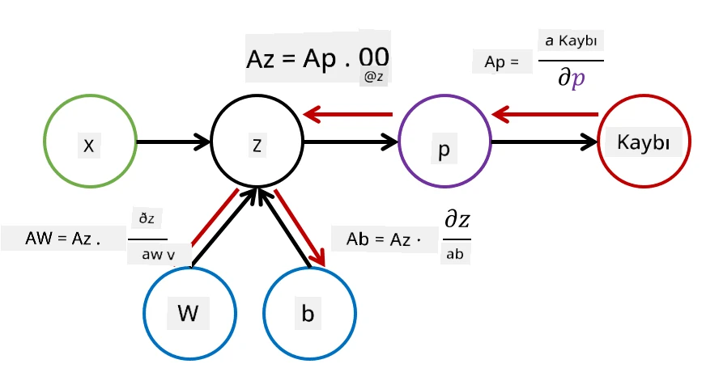

# Sinir Ağlarına Giriş. Çok Katmanlı Perceptron

Önceki bölümde, en basit sinir ağı modeli olan tek katmanlı perceptron, yani doğrusal iki sınıflı sınıflandırma modelini öğrendiniz.

Bu bölümde, bu modeli daha esnek bir çerçeveye genişleteceğiz. Bu sayede:

* İki sınıfın yanı sıra **çok sınıflı sınıflandırma** yapabiliriz  
* Sınıflandırmanın yanı sıra **regresyon problemlerini** çözebiliriz  
* Doğrusal olarak ayrılabilir olmayan sınıfları ayırabiliriz  

Ayrıca, farklı sinir ağı mimarileri oluşturabilmemizi sağlayacak kendi modüler Python çerçevemizi geliştireceğiz.

## [Ders Öncesi Testi](https://ff-quizzes.netlify.app/en/ai/quiz/7)

## Makine Öğreniminin Formalizasyonu

Makine Öğrenimi problemini formalize ederek başlayalım. Diyelim ki **X** adlı bir eğitim veri setimiz ve **Y** adlı etiketlerimiz var ve en doğru tahminleri yapacak bir model *f* inşa etmemiz gerekiyor. Tahminlerin kalitesi **Kayıp Fonksiyonu** &lagran; ile ölçülür. Aşağıdaki kayıp fonksiyonları sıkça kullanılır:

* Bir sayı tahmin etmemiz gereken regresyon problemlerinde, **mutlak hata** &sum;i|f(x(i))-y(i)| veya **kare hata** &sum;i(f(x(i))-y(i))2 kullanılabilir.  
* Sınıflandırma için, **0-1 kaybı** (temelde modelin **doğruluğu** ile aynıdır) veya **lojistik kayıp** kullanılır.

Tek katmanlı perceptron için, *f* fonksiyonu doğrusal bir fonksiyon olarak tanımlanır: *f(x)=wx+b* (burada *w* ağırlık matrisi, *x* giriş özelliklerinin vektörü ve *b* bias vektörüdür). Farklı sinir ağı mimarileri için bu fonksiyon daha karmaşık bir form alabilir.

> Sınıflandırma durumunda, ağ çıktısı olarak ilgili sınıfların olasılıklarını elde etmek genellikle istenir. Rastgele sayıları olasılıklara dönüştürmek (örneğin, çıktıyı normalize etmek) için genellikle **softmax** fonksiyonu &sigma; kullanılır ve *f* fonksiyonu *f(x)=&sigma;(wx+b)* haline gelir.

Yukarıdaki *f* tanımında, *w* ve *b* **parametreler** olarak adlandırılır: &theta;=⟨*w,b*⟩. Veri seti ⟨**X**,**Y**⟩ verildiğinde, tüm veri seti üzerindeki toplam hatayı parametrelerin bir fonksiyonu olarak hesaplayabiliriz.

> ✅ **Sinir ağı eğitiminin amacı, parametreleri &theta; değiştirerek hatayı minimize etmektir.**

## Gradyan İnişi Optimizasyonu

**Gradyan inişi** adı verilen iyi bilinen bir fonksiyon optimizasyon yöntemi vardır. Bu yöntemin temel fikri, kayıp fonksiyonunun parametrelere göre türevini (çok boyutlu durumda **gradyan** olarak adlandırılır) hesaplayarak, hatayı azaltacak şekilde parametreleri değiştirmektir. Bu şu şekilde formalize edilebilir:

* Parametreleri rastgele değerlerle başlat: w(0), b(0)  
* Aşağıdaki adımı birçok kez tekrarla:
    - w(i+1) = w(i)-&eta;&part;&lagran;/&part;w  
    - b(i+1) = b(i)-&eta;&part;&lagran;/&part;b  

Eğitim sırasında, optimizasyon adımları tüm veri seti dikkate alınarak hesaplanmalıdır (hatırlayın, kayıp tüm eğitim örnekleri üzerinden bir toplam olarak hesaplanır). Ancak, gerçek hayatta veri setinin küçük parçaları olan **minibatch'ler** alınır ve gradyanlar bir alt veri kümesine dayanarak hesaplanır. Alt küme her seferinde rastgele alındığı için bu yönteme **stokastik gradyan inişi** (SGD) denir.

## Çok Katmanlı Perceptronlar ve Geri Yayılım

Yukarıda gördüğümüz gibi, tek katmanlı bir ağ doğrusal olarak ayrılabilir sınıfları sınıflandırabilir. Daha zengin bir model oluşturmak için, ağın birkaç katmanını birleştirebiliriz. Matematiksel olarak bu, *f* fonksiyonunun daha karmaşık bir form alacağı ve birkaç adımda hesaplanacağı anlamına gelir:
* z1=w1x+b1  
* z2=w2&alpha;(z1)+b2  
* f = &sigma;(z2)  

Burada, &alpha; bir **doğrusal olmayan aktivasyon fonksiyonu**, &sigma; bir softmax fonksiyonu ve parametreler &theta;=<*w1,b1,w2,b2*>'dir.

Gradyan inişi algoritması aynı kalır, ancak gradyanları hesaplamak daha zor hale gelir. Zincir türev kuralı kullanılarak türevler şu şekilde hesaplanabilir:

* &part;&lagran;/&part;w2 = (&part;&lagran;/&part;&sigma;)(&part;&sigma;/&part;z2)(&part;z2/&part;w2)  
* &part;&lagran;/&part;w1 = (&part;&lagran;/&part;&sigma;)(&part;&sigma;/&part;z2)(&part;z2/&part;&alpha;)(&part;&alpha;/&part;z1)(&part;z1/&part;w1)  

> ✅ Zincir türev kuralı, kayıp fonksiyonunun parametrelere göre türevlerini hesaplamak için kullanılır.

Dikkat edin, bu ifadelerin en sol kısmı aynıdır ve bu nedenle türevleri etkili bir şekilde kayıp fonksiyonundan başlayarak "geri" doğru hesaplayabiliriz. Bu nedenle, çok katmanlı perceptron eğitme yöntemi **geri yayılım** veya 'backprop' olarak adlandırılır.

> TODO: görsel kaynağı

> ✅ Geri yayılımı, notebook örneğimizde çok daha ayrıntılı bir şekilde ele alacağız.

## Sonuç

Bu derste, kendi sinir ağı kütüphanemizi oluşturduk ve bunu basit bir iki boyutlu sınıflandırma görevi için kullandık.

## 🚀 Meydan Okuma

Eşlik eden notebook'ta, çok katmanlı perceptronlar oluşturmak ve eğitmek için kendi çerçevenizi uygulayacaksınız. Modern sinir ağlarının nasıl çalıştığını ayrıntılı bir şekilde görebileceksiniz.

[OwnFramework](OwnFramework.ipynb) notebook'una geçin ve üzerinde çalışın.

## [Ders Sonrası Testi](https://ff-quizzes.netlify.app/en/ai/quiz/8)

## Gözden Geçirme ve Kendi Kendine Çalışma

Geri yayılım, AI ve ML'de yaygın olarak kullanılan bir algoritmadır ve [daha ayrıntılı](https://wikipedia.org/wiki/Backpropagation) çalışmaya değerdir.

## [Ödev](lab/README.md)

Bu laboratuvarda, bu derste oluşturduğunuz çerçeveyi kullanarak MNIST el yazısı rakam sınıflandırmasını çözmeniz isteniyor.

* [Talimatlar](lab/README.md)  
* [Notebook](lab/MyFW_MNIST.ipynb)  

---

