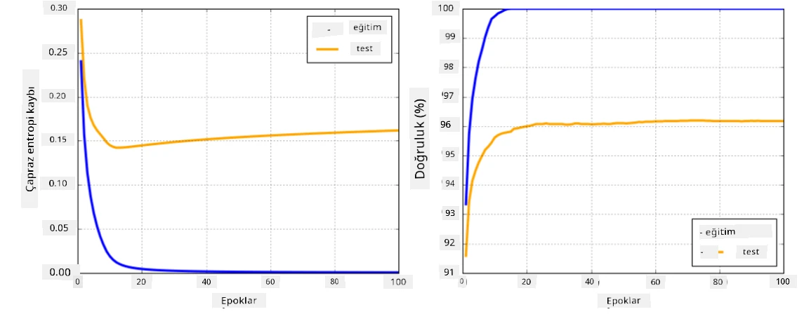

# Sinir Ağı Çerçeveleri

Daha önce öğrendiğimiz gibi, sinir ağlarını verimli bir şekilde eğitebilmek için iki şeyi yapmamız gerekiyor:

* Tensörler üzerinde işlem yapmak, örneğin çarpma, toplama ve sigmoid veya softmax gibi bazı fonksiyonları hesaplamak
* Tüm ifadelerin gradyanlarını hesaplamak, böylece gradyan inişi optimizasyonu gerçekleştirebilmek

## [Ders Öncesi Test](https://ff-quizzes.netlify.app/en/ai/quiz/9)

`numpy` kütüphanesi ilk kısmı yapabilse de, gradyanları hesaplamak için bir mekanizmaya ihtiyacımız var. Önceki bölümde geliştirdiğimiz [kendi çerçevemizde](../04-OwnFramework/OwnFramework.ipynb), `backward` metodunun içinde tüm türev fonksiyonlarını manuel olarak programlamamız gerekiyordu. İdeal olarak, bir çerçeve bize tanımlayabileceğimiz *herhangi bir ifadenin* gradyanlarını hesaplama fırsatı sunmalıdır.

Bir diğer önemli şey ise GPU veya [TPU](https://en.wikipedia.org/wiki/Tensor_Processing_Unit) gibi diğer özel işlem birimlerinde hesaplama yapabilmektir. Derin sinir ağı eğitimi *çok fazla* hesaplama gerektirir ve bu hesaplamaları GPU'larda paralelleştirebilmek çok önemlidir.

> ✅ 'Paralelleştirme' terimi, hesaplamaları birden fazla cihaz arasında dağıtmak anlamına gelir.

Şu anda en popüler iki sinir ağı çerçevesi: [TensorFlow](http://TensorFlow.org) ve [PyTorch](https://pytorch.org/). Her ikisi de hem CPU hem de GPU üzerinde tensörlerle çalışmak için düşük seviyeli bir API sağlar. Düşük seviyeli API'nin yanı sıra, sırasıyla [Keras](https://keras.io/) ve [PyTorch Lightning](https://pytorchlightning.ai/) olarak adlandırılan yüksek seviyeli bir API de bulunmaktadır.

Düşük Seviyeli API | [TensorFlow](http://TensorFlow.org) | [PyTorch](https://pytorch.org/)
--------------------|-------------------------------------|--------------------------------
Yüksek Seviyeli API | [Keras](https://keras.io/) | [PyTorch Lightning](https://pytorchlightning.ai/)

**Düşük seviyeli API'ler**, her iki çerçevede de **hesaplama grafikleri** oluşturmanıza olanak tanır. Bu grafik, verilen giriş parametreleriyle çıktının (genellikle kayıp fonksiyonu) nasıl hesaplanacağını tanımlar ve GPU'da hesaplama için gönderilebilir. Bu hesaplama grafiğini türetmek ve gradyanları hesaplamak için fonksiyonlar vardır, bu gradyanlar daha sonra model parametrelerini optimize etmek için kullanılabilir.

**Yüksek seviyeli API'ler**, sinir ağlarını genellikle bir **katmanlar dizisi** olarak ele alır ve çoğu sinir ağını oluşturmayı çok daha kolay hale getirir. Modeli eğitmek genellikle veriyi hazırlamayı ve ardından işi yapmak için bir `fit` fonksiyonunu çağırmayı gerektirir.

Yüksek seviyeli API, tipik sinir ağlarını çok hızlı bir şekilde oluşturmanıza olanak tanır ve birçok detayı düşünmenize gerek kalmaz. Aynı zamanda, düşük seviyeli API, eğitim süreci üzerinde çok daha fazla kontrol sağlar ve bu nedenle yeni sinir ağı mimarileriyle çalışırken araştırmalarda çok kullanılır.

Her iki API'yi birlikte kullanabileceğinizi anlamak da önemlidir. Örneğin, düşük seviyeli API kullanarak kendi ağ katmanı mimarinizi geliştirebilir ve ardından bunu daha büyük bir ağ içinde kullanabilir ve yüksek seviyeli API ile eğitebilirsiniz. Ya da katmanlar dizisi olarak yüksek seviyeli API kullanarak bir ağ tanımlayabilir ve ardından kendi düşük seviyeli eğitim döngünüzü kullanarak optimizasyon yapabilirsiniz. Her iki API de aynı temel kavramları kullanır ve birlikte iyi çalışacak şekilde tasarlanmıştır.

## Öğrenme

Bu derste, içeriğin çoğunu hem PyTorch hem de TensorFlow için sunuyoruz. Tercih ettiğiniz çerçeveyi seçebilir ve yalnızca ilgili not defterlerini inceleyebilirsiniz. Hangi çerçeveyi seçeceğinizden emin değilseniz, **PyTorch vs. TensorFlow** hakkında internetteki bazı tartışmaları okuyabilirsiniz. Ayrıca her iki çerçeveye de göz atarak daha iyi bir anlayış elde edebilirsiniz.

Mümkün olduğunda, basitlik için Yüksek Seviyeli API'leri kullanacağız. Ancak, sinir ağlarının temelden nasıl çalıştığını anlamanın önemli olduğuna inanıyoruz, bu nedenle başlangıçta düşük seviyeli API ve tensörlerle çalışmaya başlıyoruz. Ancak, hızlı bir şekilde başlamak ve bu detayları öğrenmek için çok fazla zaman harcamak istemiyorsanız, bunları atlayabilir ve doğrudan yüksek seviyeli API not defterlerine geçebilirsiniz.

## ✍️ Egzersizler: Çerçeveler

Aşağıdaki not defterlerinde öğrenmeye devam edin:

Düşük Seviyeli API | [TensorFlow+Keras Not Defteri](IntroKerasTF.ipynb) | [PyTorch](IntroPyTorch.ipynb)
--------------------|-------------------------------------|--------------------------------
Yüksek Seviyeli API | [Keras](IntroKeras.ipynb) | *PyTorch Lightning*

Çerçeveleri öğrendikten sonra, aşırı öğrenme (overfitting) kavramını tekrar gözden geçirelim.

# Aşırı Öğrenme (Overfitting)

Aşırı öğrenme, makine öğreniminde son derece önemli bir kavramdır ve doğru anlamak çok önemlidir!

Aşağıdaki 5 noktayı (grafiklerde `x` ile gösterilen) yaklaşık olarak tahmin etme problemini düşünün:

 | 
-------------------------|--------------------------
**Doğrusal model, 2 parametre** | **Doğrusal olmayan model, 7 parametre**
Eğitim hatası = 5.3 | Eğitim hatası = 0
Doğrulama hatası = 5.1 | Doğrulama hatası = 20

* Solda, iyi bir doğru çizgisi yaklaşımı görüyoruz. Parametre sayısı uygun olduğu için model, nokta dağılımının arkasındaki fikri doğru bir şekilde kavrıyor.
* Sağda, model çok güçlü. Sadece 5 noktamız olduğu ve modelin 7 parametresi olduğu için, tüm noktalardan geçecek şekilde ayarlanabiliyor, bu da eğitim hatasını 0 yapıyor. Ancak bu, modelin verinin arkasındaki doğru deseni anlamasını engelliyor, dolayısıyla doğrulama hatası çok yüksek.

Modelin zenginliği (parametre sayısı) ile eğitim örneklerinin sayısı arasında doğru bir denge kurmak çok önemlidir.

## Aşırı Öğrenme Neden Oluşur?

  * Yeterli eğitim verisinin olmaması
  * Çok güçlü bir model
  * Giriş verilerinde çok fazla gürültü

## Aşırı Öğrenme Nasıl Tespit Edilir?

Yukarıdaki grafikten görebileceğiniz gibi, aşırı öğrenme çok düşük bir eğitim hatası ve yüksek bir doğrulama hatası ile tespit edilebilir. Normalde eğitim sırasında hem eğitim hem de doğrulama hatalarının azalmaya başladığını görürüz, ancak bir noktada doğrulama hatası azalmayı durdurabilir ve artmaya başlayabilir. Bu, aşırı öğrenmenin bir işareti ve eğitimi muhtemelen bu noktada durdurmamız gerektiğinin (veya en azından modelin bir anlık görüntüsünü almamız gerektiğinin) göstergesidir.

## Aşırı Öğrenme Nasıl Önlenir?

Aşırı öğrenmenin meydana geldiğini görüyorsanız, aşağıdakilerden birini yapabilirsiniz:

 * Eğitim verilerinin miktarını artırın
 * Modelin karmaşıklığını azaltın
 * [Dropout](../../4-ComputerVision/08-TransferLearning/TrainingTricks.md#Dropout) gibi bazı [düzenleme tekniklerini](../../4-ComputerVision/08-TransferLearning/TrainingTricks.md) kullanın, bunları daha sonra ele alacağız.

## Aşırı Öğrenme ve Hata-Varyans Dengesi

Aşırı öğrenme aslında istatistikte [Hata-Varyans Dengesi](https://en.wikipedia.org/wiki/Bias%E2%80%93variance_tradeoff) olarak adlandırılan daha genel bir problemin bir örneğidir. Modelimizdeki hata kaynaklarını düşünürsek, iki tür hata görebiliriz:

* **Hata hataları**, algoritmamızın eğitim verileri arasındaki ilişkiyi doğru bir şekilde yakalayamamasından kaynaklanır. Bu, modelimizin yeterince güçlü olmamasından kaynaklanabilir (**eksik öğrenme**).
* **Varyans hataları**, modelin giriş verilerindeki gürültüyü anlamlı bir ilişki yerine tahmin etmesinden kaynaklanır (**aşırı öğrenme**).

Eğitim sırasında, hata hatası azalır (modelimiz veriyi tahmin etmeyi öğrenir) ve varyans hatası artar. Aşırı öğrenmeyi önlemek için eğitimi durdurmak - ya manuel olarak (aşırı öğrenmeyi tespit ettiğimizde) ya da otomatik olarak (düzenleme ekleyerek) - önemlidir.

## Sonuç

Bu derste, iki en popüler AI çerçevesi olan TensorFlow ve PyTorch için çeşitli API'ler arasındaki farkları öğrendiniz. Ayrıca, çok önemli bir konu olan aşırı öğrenmeyi öğrendiniz.

## 🚀 Meydan Okuma

Eşlik eden not defterlerinde, 'görevler' bölümünü bulacaksınız; not defterlerini inceleyin ve görevleri tamamlayın.

## [Ders Sonrası Test](https://ff-quizzes.netlify.app/en/ai/quiz/10)

## Gözden Geçirme ve Kendi Kendine Çalışma

Aşağıdaki konular hakkında biraz araştırma yapın:

- TensorFlow
- PyTorch
- Aşırı öğrenme

Kendinize şu soruları sorun:

- TensorFlow ve PyTorch arasındaki fark nedir?
- Aşırı öğrenme ile eksik öğrenme arasındaki fark nedir?

## [Ödev](lab/README.md)

Bu laboratuvarda, PyTorch veya TensorFlow kullanarak tek katmanlı ve çok katmanlı tam bağlantılı ağlarla iki sınıflandırma problemini çözmeniz isteniyor.

* [Talimatlar](lab/README.md)
* [Not Defteri](lab/LabFrameworks.ipynb)

---

