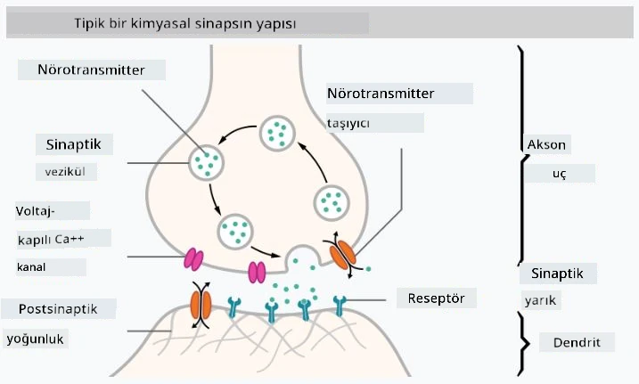

# Sinir Ağlarına Giriş

Giriş bölümünde tartıştığımız gibi, zekaya ulaşmanın yollarından biri bir **bilgisayar modeli** veya bir **yapay beyin** eğitmekten geçer. 20. yüzyılın ortalarından itibaren araştırmacılar farklı matematiksel modeller denediler ve son yıllarda bu yaklaşım büyük ölçüde başarılı oldu. Beynin bu tür matematiksel modellerine **sinir ağları** denir.

> Bazen sinir ağlarına *Yapay Sinir Ağları* veya ANNs denir, böylece gerçek nöron ağlarından değil, modellerden bahsettiğimiz anlaşılır.

## Makine Öğrenimi

Sinir Ağları, **Makine Öğrenimi** adı verilen daha geniş bir disiplinin parçasıdır. Makine Öğrenimi'nin amacı, problemleri çözebilen bilgisayar modellerini eğitmek için verileri kullanmaktır. Makine Öğrenimi, Yapay Zeka'nın büyük bir bölümünü oluşturur, ancak bu müfredatta klasik ML'yi ele almıyoruz.

> Klasik Makine Öğrenimi hakkında daha fazla bilgi edinmek için ayrı **[Başlangıç Seviyesi Makine Öğrenimi](http://github.com/microsoft/ml-for-beginners)** müfredatımıza göz atabilirsiniz.

Makine Öğrenimi'nde, elimizde bazı örneklerden oluşan bir veri kümesi **X** ve buna karşılık gelen çıktı değerleri **Y** olduğunu varsayarız. Örnekler genellikle **özelliklerden** oluşan N boyutlu vektörlerdir ve çıktılara **etiketler** denir.

En yaygın iki makine öğrenimi problemini ele alacağız:

* **Sınıflandırma**, burada bir giriş nesnesini iki veya daha fazla sınıfa ayırmamız gerekir.
* **Regresyon**, burada her bir giriş örneği için bir sayısal değer tahmin etmemiz gerekir.

> Giriş ve çıkışları tensörler olarak temsil ederken, giriş veri kümesi M&times;N boyutunda bir matristir; burada M örnek sayısını ve N özellik sayısını ifade eder. Çıkış etiketleri Y ise M boyutunda bir vektördür.

Bu müfredatta yalnızca sinir ağı modellerine odaklanacağız.

## Bir Nöron Modeli

Biyolojiden biliyoruz ki beynimiz, her biri birden fazla "girişe" (dendritler) ve tek bir "çıkışa" (akson) sahip olan sinir hücrelerinden (nöronlar) oluşur. Hem dendritler hem de aksonlar elektrik sinyalleri iletebilir ve aralarındaki bağlantılar — sinapslar olarak bilinir — iletkenlik derecelerini değiştirebilir. Bu iletkenlik, nörotransmitterler tarafından düzenlenir.

 | 
----|----
Gerçek Nöron *([Resim](https://en.wikipedia.org/wiki/Synapse#/media/File:SynapseSchematic_lines.svg) Wikipedia'dan)* | Yapay Nöron *(Yazarın Görseli)*

Dolayısıyla, bir nöronun en basit matematiksel modeli birkaç giriş X1, ..., XN ve bir çıkış Y ile bir dizi ağırlık W1, ..., WN içerir. Çıkış şu şekilde hesaplanır:

burada f, bazı doğrusal olmayan **aktivasyon fonksiyonudur**.

> Nöronların erken modelleri, Warren McCullock ve Walter Pitts tarafından 1943 yılında yazılan klasik makale [Sinirsel Aktivitede İçkin Fikirlerin Mantıksal Hesaplaması](https://www.cs.cmu.edu/~./epxing/Class/10715/reading/McCulloch.and.Pitts.pdf) içinde tanımlanmıştır. Donald Hebb, "[Davranışın Organizasyonu: Bir Nöropsikolojik Teori](https://books.google.com/books?id=VNetYrB8EBoC)" adlı kitabında bu ağların nasıl eğitilebileceğini önermiştir.

## Bu Bölümde

Bu bölümde şunları öğreneceğiz:
* [Perceptron](03-Perceptron/README.md), iki sınıflı sınıflandırma için en eski sinir ağı modellerinden biri
* [Çok Katmanlı Ağlar](04-OwnFramework/README.md) ve eşlik eden not defteri [kendi çerçevemizi nasıl oluşturabiliriz](04-OwnFramework/OwnFramework.ipynb)
* [Sinir Ağı Çerçeveleri](05-Frameworks/README.md), şu not defterleriyle: [PyTorch](05-Frameworks/IntroPyTorch.ipynb) ve [Keras/Tensorflow](05-Frameworks/IntroKerasTF.ipynb)
* [Aşırı Uyum](../../../../lessons/3-NeuralNetworks/05-Frameworks)

---

**Feragatname**:  
Bu belge, AI çeviri hizmeti [Co-op Translator](https://github.com/Azure/co-op-translator) kullanılarak çevrilmiştir. Doğruluk için çaba göstersek de, otomatik çevirilerin hata veya yanlışlıklar içerebileceğini lütfen unutmayın. Belgenin orijinal dili, yetkili kaynak olarak kabul edilmelidir. Kritik bilgiler için profesyonel bir insan çevirisi önerilir. Bu çevirinin kullanımından kaynaklanan herhangi bir yanlış anlama veya yanlış yorumlama durumunda sorumluluk kabul edilmez.