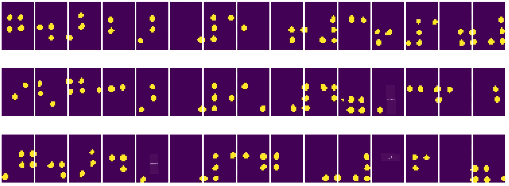
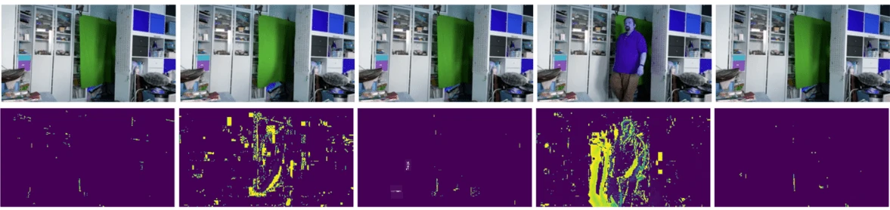

# Bilgisayarlı Görüye Giriş

[Bilgisayarlı Görü](https://wikipedia.org/wiki/Computer_vision), bilgisayarların dijital görüntüleri yüksek seviyede anlamasını sağlamayı amaçlayan bir disiplindir. Bu oldukça geniş bir tanımdır çünkü *anlama* birçok farklı şeyi ifade edebilir; bir resimdeki nesneyi bulmak (**nesne tespiti**), ne olduğunu anlamak (**olay tespiti**), bir resmi metinle açıklamak veya bir sahneyi 3D olarak yeniden oluşturmak gibi. İnsan görüntüleriyle ilgili özel görevler de vardır: yaş ve duygu tahmini, yüz tespiti ve tanımlama, 3D duruş tahmini gibi.

## [Ders Öncesi Test](https://ff-quizzes.netlify.app/en/ai/quiz/11)

Bilgisayarlı görünün en basit görevlerinden biri **görüntü sınıflandırmasıdır**.

Bilgisayarlı görü genellikle yapay zekanın bir dalı olarak kabul edilir. Günümüzde, bilgisayarlı görü görevlerinin çoğu sinir ağları kullanılarak çözülmektedir. Bu bölümde, bilgisayarlı görü için kullanılan özel bir sinir ağı türü olan [evrişimli sinir ağlarını](../07-ConvNets/README.md) daha ayrıntılı olarak öğreneceğiz.

Ancak, bir görüntüyü sinir ağına göndermeden önce, birçok durumda görüntüyü iyileştirmek için bazı algoritmik teknikler kullanmak mantıklı olabilir.

Görüntü işleme için kullanılabilecek birkaç Python kütüphanesi bulunmaktadır:

* **[imageio](https://imageio.readthedocs.io/en/stable/)** farklı görüntü formatlarını okumak/yazmak için kullanılabilir. Ayrıca video karelerini görüntülere dönüştürmek için faydalı bir araç olan ffmpeg'i destekler.
* **[Pillow](https://pillow.readthedocs.io/en/stable/index.html)** (PIL olarak da bilinir) biraz daha güçlüdür ve morfing, palet ayarlamaları gibi bazı görüntü manipülasyonlarını destekler.
* **[OpenCV](https://opencv.org/)** C++ ile yazılmış güçlü bir görüntü işleme kütüphanesidir ve görüntü işleme için *de facto* standart haline gelmiştir. Python arayüzü oldukça kullanışlıdır.
* **[dlib](http://dlib.net/)** birçok makine öğrenimi algoritmasını, bilgisayarlı görü algoritmalarını da içeren bir C++ kütüphanesidir. Python arayüzü vardır ve yüz ve yüz özellikleri tespiti gibi zorlu görevler için kullanılabilir.

## OpenCV

[OpenCV](https://opencv.org/) görüntü işleme için *de facto* standart olarak kabul edilir. C++ ile yazılmış birçok faydalı algoritma içerir. OpenCV'yi Python'dan da çağırabilirsiniz.

OpenCV öğrenmek için iyi bir yer [bu Learn OpenCV kursudur](https://learnopencv.com/getting-started-with-opencv/). Müfredatımızda amacımız OpenCV'yi öğrenmek değil, onun ne zaman ve nasıl kullanılabileceğine dair bazı örnekler göstermektir.

### Görüntü Yükleme

Python'da görüntüler NumPy dizileriyle kolayca temsil edilebilir. Örneğin, 320x200 piksel boyutundaki gri tonlamalı bir görüntü 200x320 boyutunda bir dizi olarak saklanır ve aynı boyuttaki renkli bir görüntü 200x320x3 (3 renk kanalı için) şekline sahip olur. Bir görüntüyü yüklemek için aşağıdaki kodu kullanabilirsiniz:

```python
import cv2
import matplotlib.pyplot as plt

im = cv2.imread('image.jpeg')
plt.imshow(im)
```

Geleneksel olarak, OpenCV renkli görüntüler için BGR (Mavi-Yeşil-Kırmızı) kodlamasını kullanır, diğer Python araçları ise daha geleneksel olan RGB (Kırmızı-Yeşil-Mavi) kodlamasını kullanır. Görüntünün doğru görünmesi için, NumPy dizisindeki boyutları değiştirerek veya bir OpenCV fonksiyonunu çağırarak RGB renk uzayına dönüştürmeniz gerekir:

```python
im = cv2.cvtColor(im,cv2.COLOR_BGR2RGB)
```

Aynı `cvtColor` fonksiyonu, bir görüntüyü gri tonlamaya veya HSV (Ton-Doygunluk-Değer) renk uzayına dönüştürmek gibi diğer renk uzayı dönüşümleri için de kullanılabilir.

OpenCV'yi kullanarak video karelerini tek tek yükleyebilirsiniz - bunun bir örneği [OpenCV Notebook](OpenCV.ipynb) egzersizinde verilmiştir.

### Görüntü İşleme

Bir görüntüyü sinir ağına beslemeden önce, birkaç ön işleme adımı uygulamak isteyebilirsiniz. OpenCV birçok şey yapabilir, bunlar arasında:

* `im = cv2.resize(im, (320,200),interpolation=cv2.INTER_LANCZOS)` kullanarak görüntüyü **yeniden boyutlandırma**.
* `im = cv2.medianBlur(im,3)` veya `im = cv2.GaussianBlur(im, (3,3), 0)` kullanarak görüntüyü **bulanıklaştırma**.
* Görüntünün **parlaklık ve kontrastını** değiştirmek, [bu Stackoverflow notunda](https://stackoverflow.com/questions/39308030/how-do-i-increase-the-contrast-of-an-image-in-python-opencv) açıklandığı gibi NumPy dizisi manipülasyonlarıyla yapılabilir.
* [Eşikleme](https://docs.opencv.org/4.x/d7/d4d/tutorial_py_thresholding.html) kullanarak `cv2.threshold`/`cv2.adaptiveThreshold` fonksiyonlarını çağırmak, genellikle parlaklık veya kontrast ayarlamaya tercih edilir.
* Görüntüye farklı [dönüşümler](https://docs.opencv.org/4.5.5/da/d6e/tutorial_py_geometric_transformations.html) uygulamak:
    - **[Affine dönüşümler](https://docs.opencv.org/4.5.5/d4/d61/tutorial_warp_affine.html)**, görüntüye döndürme, yeniden boyutlandırma ve eğme işlemlerini birleştirmeniz gerektiğinde ve görüntüdeki üç noktanın kaynak ve hedef konumlarını bildiğinizde faydalı olabilir. Affine dönüşümler paralel çizgileri paralel tutar.
    - **[Perspektif dönüşümler](https://medium.com/analytics-vidhya/opencv-perspective-transformation-9edffefb2143)**, görüntüdeki dört noktanın kaynak ve hedef konumlarını bildiğinizde faydalı olabilir. Örneğin, bir akıllı telefon kamerasıyla bir dikdörtgen belgeyi bir açıdan çekerseniz ve belgenin kendisinin dikdörtgen bir görüntüsünü oluşturmak isterseniz.
* **[Optik akış](https://docs.opencv.org/4.5.5/d4/dee/tutorial_optical_flow.html)** kullanarak görüntü içindeki hareketi anlamak.

## Bilgisayarlı Görü Kullanım Örnekleri

[OpenCV Notebook](OpenCV.ipynb) içinde, bilgisayarlı görünün belirli görevleri gerçekleştirmek için nasıl kullanılabileceğine dair bazı örnekler veriyoruz:

* **Braille kitabının bir fotoğrafını ön işleme**. Eşikleme, özellik tespiti, perspektif dönüşümü ve NumPy manipülasyonlarını kullanarak bireysel Braille sembollerini bir sinir ağı tarafından daha fazla sınıflandırma için ayırmaya odaklanıyoruz.

 |  | 
----|-----|-----

> Görüntü [OpenCV.ipynb](OpenCV.ipynb) dosyasından alınmıştır.

* **Video içinde hareketi kare farkı kullanarak tespit etme**. Kamera sabit ise, kamera akışından gelen kareler birbirine oldukça benzer olmalıdır. Kareler diziler olarak temsil edildiğinden, iki ardışık kare için bu dizileri çıkararak piksel farkını elde edebiliriz; bu fark statik kareler için düşük olmalı ve görüntüde önemli bir hareket olduğunda artmalıdır.



> Görüntü [OpenCV.ipynb](OpenCV.ipynb) dosyasından alınmıştır.

* **Optik Akış kullanarak hareket tespiti**. [Optik akış](https://docs.opencv.org/3.4/d4/dee/tutorial_optical_flow.html), video karelerindeki bireysel piksellerin nasıl hareket ettiğini anlamamıza olanak tanır. İki tür optik akış vardır:

   - **Yoğun Optik Akış**, her pikselin nereye hareket ettiğini gösteren vektör alanını hesaplar.
   - **Seyrek Optik Akış**, görüntüdeki bazı belirgin özellikleri (örneğin kenarları) alır ve bunların kareden kareye olan hareket yolunu oluşturur.


> Görüntü [OpenCV.ipynb](OpenCV.ipynb) dosyasından alınmıştır.

## ✍️ Örnek Not Defterleri: OpenCV [OpenCV'yi Deneyin](OpenCV.ipynb)

[OpenCV Notebook](OpenCV.ipynb) ile OpenCV'yi keşfederek bazı deneyler yapalım.

## Sonuç

Bazen, hareket tespiti veya parmak ucu tespiti gibi nispeten karmaşık görevler yalnızca bilgisayarlı görü ile çözülebilir. Bu nedenle, bilgisayarlı görünün temel tekniklerini ve OpenCV gibi kütüphanelerin neler yapabileceğini bilmek çok faydalıdır.

## 🚀 Meydan Okuma

AI Show'dan [bu videoyu](https://docs.microsoft.com/shows/ai-show/ai-show--2021-opencv-ai-competition--grand-prize-winners--cortic-tigers--episode-32?WT.mc_id=academic-77998-cacaste) izleyerek Cortic Tigers projesini ve bilgisayarlı görü görevlerini bir robot aracılığıyla demokratikleştirmek için blok tabanlı bir çözüm nasıl oluşturduklarını öğrenin. Bu alana yeni başlayanları yönlendiren benzer projeler hakkında araştırma yapın.

## [Ders Sonrası Test](https://ff-quizzes.netlify.app/en/ai/quiz/12)

## İnceleme ve Kendi Kendine Çalışma

Optik akış hakkında daha fazla bilgi edinmek için [bu harika eğitimi](https://learnopencv.com/optical-flow-in-opencv/) okuyun.

## [Ödev](lab/README.md)

Bu laboratuvarda, basit jestlerle bir video çekeceksiniz ve amacınız optik akış kullanarak yukarı/aşağı/sol/sağ hareketlerini çıkarmaktır.


---

