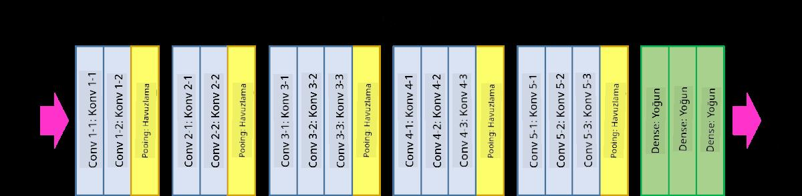

# Bilinen CNN Mimarileri

### VGG-16

VGG-16, 2014 yılında ImageNet top-5 sınıflandırmasında %92.7 doğruluk oranına ulaşan bir ağdır. Aşağıdaki katman yapısına sahiptir:

Görüldüğü gibi, VGG geleneksel bir piramit mimarisini takip eder; bu, bir dizi konvolüsyon-pooling katmanıdır.

> Görsel [Researchgate](https://www.researchgate.net/figure/Vgg16-model-structure-To-get-the-VGG-NIN-model-we-replace-the-2-nd-4-th-6-th-7-th_fig2_335194493) kaynağındandır.

### ResNet

ResNet, 2015 yılında Microsoft Research tarafından önerilen bir model ailesidir. ResNet'in ana fikri **artık bloklar** kullanmaktır:

> Görsel [bu makaleden](https://arxiv.org/pdf/1512.03385.pdf) alınmıştır.

Kimlik geçişinin kullanılma nedeni, katmanımızın bir önceki katmanın sonucuyla artık bloğunun çıktısı arasındaki **farkı** tahmin etmesini sağlamaktır - bu nedenle ismi *artık*dır. Bu bloklar çok daha kolay eğitilir ve bu bloklardan birkaç yüz tanesiyle ağlar inşa edilebilir (en yaygın varyantlar ResNet-52, ResNet-101 ve ResNet-152'dir).

Bu ağı, veri kümesine göre karmaşıklığını ayarlayabilen bir yapı olarak da düşünebilirsiniz. Başlangıçta, ağı eğitmeye başladığınızda, ağırlık değerleri küçüktür ve sinyalin çoğu kimlik geçiş katmanlarından geçer. Eğitim ilerledikçe ve ağırlıklar büyüdükçe, ağ parametrelerinin önemi artar ve ağ, eğitim görüntülerini doğru bir şekilde sınıflandırmak için gerekli ifadeyi sağlamak üzere ayarlanır.

### Google Inception

Google Inception mimarisi bu fikri bir adım daha ileri götürerek, her ağ katmanını birkaç farklı yolun kombinasyonu olarak inşa eder:

> Görsel [Researchgate](https://www.researchgate.net/figure/Inception-module-with-dimension-reductions-left-and-schema-for-Inception-ResNet-v1_fig2_355547454) kaynağındandır.

Burada, 1x1 konvolüsyonların rolünü vurgulamamız gerekiyor, çünkü ilk başta mantıklı görünmeyebilir. 1x1 filtre ile görüntü üzerinden geçmemize neden olan şey nedir? Ancak, konvolüsyon filtrelerinin aynı zamanda birkaç derinlik kanalıyla çalıştığını unutmamalısınız (ilk olarak - RGB renkleri, sonraki katmanlarda - farklı filtreler için kanallar) ve 1x1 konvolüsyon, bu giriş kanallarını farklı eğitilebilir ağırlıklar kullanarak bir araya getirmek için kullanılır. Ayrıca, bu durum kanal boyutunda örnekleme (pooling) olarak da görülebilir.

Konu hakkında [iyi bir blog yazısı](https://medium.com/analytics-vidhya/talented-mr-1x1-comprehensive-look-at-1x1-convolution-in-deep-learning-f6b355825578) ve [orijinal makale](https://arxiv.org/pdf/1312.4400.pdf) bulunmaktadır.

### MobileNet

MobileNet, boyutu azaltılmış, mobil cihazlar için uygun model aileleridir. Kaynaklarınız kısıtlıysa ve biraz doğruluktan feragat edebiliyorsanız bunları kullanabilirsiniz. Onların arkasındaki ana fikir, **derinlik ayırıcı konvolüsyon** olarak adlandırılan bir yapıdır; bu, konvolüsyon filtrelerini mekansal konvolüsyonların ve derinlik kanalları üzerindeki 1x1 konvolüsyonların bir bileşimi olarak temsil etmeye olanak tanır. Bu, parametre sayısını önemli ölçüde azaltarak ağın boyutunu küçültür ve ayrıca daha az veriyle daha kolay eğitilmesini sağlar.

Burada [MobileNet hakkında iyi bir blog yazısı](https://medium.com/analytics-vidhya/image-classification-with-mobilenet-cc6fbb2cd470) bulunmaktadır.

## Sonuç

Bu ünitede, bilgisayarla görme sinir ağlarının temel kavramını öğrendiniz - konvolüsyonel ağlar. Görüntü sınıflandırması, nesne tespiti ve hatta görüntü üretim ağlarını güçlendiren gerçek yaşam mimarileri hepsi CNN'lere dayanmaktadır, sadece daha fazla katman ve bazı ek eğitim ipuçları ile.

## 🚀 Meydan Okuma

Eşlik eden defterlerde, daha yüksek doğruluk elde etme konusunda notlar bulunmaktadır. Daha yüksek bir doğruluk elde edip edemeyeceğinizi görmek için bazı deneyler yapın.

## [Ders sonrası quiz](https://red-field-0a6ddfd03.1.azurestaticapps.net/quiz/207)

## Gözden Geçirme ve Kendi Kendine Çalışma

CNN'ler en çok Bilgisayarla Görme görevleri için kullanılsa da, genellikle sabit boyutlu desenleri çıkarmak için iyidirler. Örneğin, seslerle uğraşıyorsak, belirli bir ses sinyalindeki belirli desenleri aramak için CNN'leri kullanmak isteyebiliriz - bu durumda filtreler 1 boyutlu olur (ve bu CNN 1D-CNN olarak adlandırılır). Ayrıca, bazen 3D-CNN, çok boyutlu alanda özellikleri çıkarmak için kullanılır; örneğin, videoda meydana gelen belirli olaylar - CNN, zaman içinde değişen özelliklerin belirli desenlerini yakalayabilir. CNN'lerle yapılabilecek diğer görevler hakkında gözden geçirme ve kendi kendine çalışma yapın.

## [Ödev](lab/README.md)

Bu laboratuvar çalışmasında, farklı kedi ve köpek ırklarını sınıflandırmanız isteniyor. Bu görüntüler, MNIST veri setinden daha karmaşık ve daha yüksek boyutlardadır ve 10'dan fazla sınıf bulunmaktadır.

**Açıklama**:  
Bu belge, makine tabanlı yapay zeka çeviri hizmetleri kullanılarak çevrilmiştir. Doğruluk için çaba göstersek de, otomatik çevirilerin hatalar veya yanlışlıklar içerebileceğini lütfen unutmayın. Orijinal belge, kendi dilinde otorite kaynağı olarak kabul edilmelidir. Kritik bilgiler için profesyonel insan çevirisi önerilmektedir. Bu çevirinin kullanılması sonucu ortaya çıkan herhangi bir yanlış anlama veya yanlış yorumlama için sorumluluk kabul etmiyoruz.