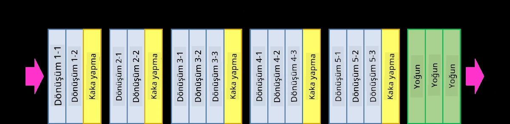
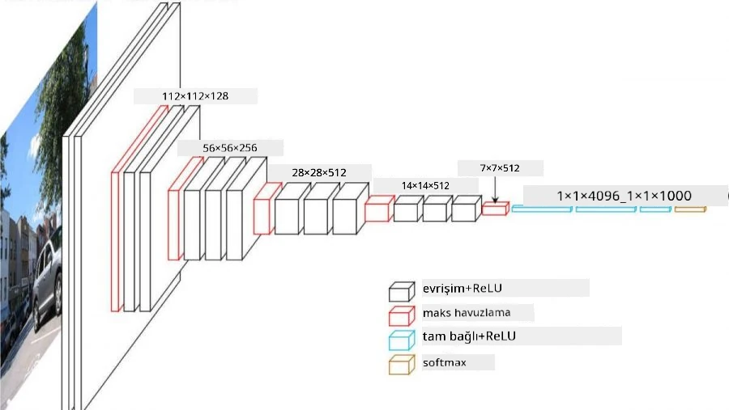
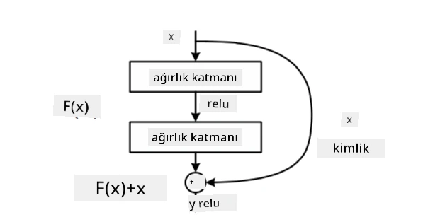
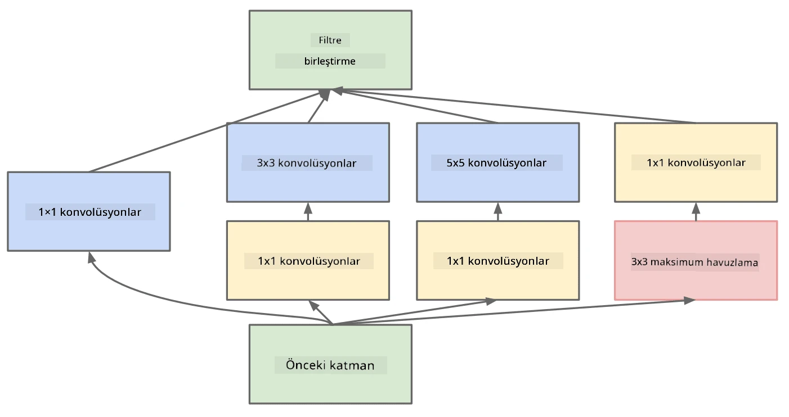

# Bilinen CNN Mimarileri

### VGG-16

VGG-16, 2014 yılında ImageNet top-5 sınıflandırmasında %92.7 doğruluk elde eden bir ağdır. Katman yapısı şu şekildedir:

Gördüğünüz gibi, VGG geleneksel bir piramit mimarisini takip eder; bu, bir dizi evrişim-havuzlama katmanıdır.

> Görsel [Researchgate](https://www.researchgate.net/figure/Vgg16-model-structure-To-get-the-VGG-NIN-model-we-replace-the-2-nd-4-th-6-th-7-th_fig2_335194493) kaynağından alınmıştır.

### ResNet

ResNet, 2015 yılında Microsoft Research tarafından önerilen bir model ailesidir. ResNet'in ana fikri **artık blokları** kullanmaktır:

> Görsel [bu makaleden](https://arxiv.org/pdf/1512.03385.pdf) alınmıştır.

Kimlik geçişi kullanmanın sebebi, katmanımızın bir önceki katmanın sonucuyla artık bloğun çıktısı arasındaki **farkı** tahmin etmesini sağlamaktır - bu yüzden adına *artık* denir. Bu bloklar çok daha kolay eğitilir ve yüzlerce blok içeren ağlar oluşturulabilir (en yaygın varyantlar ResNet-52, ResNet-101 ve ResNet-152'dır).

Bu ağı, veri setine göre karmaşıklığını ayarlayabilen bir yapı olarak da düşünebilirsiniz. Başlangıçta, ağı eğitmeye başladığınızda ağırlık değerleri küçüktür ve sinyalin çoğu kimlik geçiş katmanlarından geçer. Eğitim ilerledikçe ve ağırlıklar büyüdükçe, ağ parametrelerinin önemi artar ve ağ, eğitim görüntülerini doğru bir şekilde sınıflandırmak için gereken ifade gücünü karşılayacak şekilde kendini ayarlar.

### Google Inception

Google Inception mimarisi bu fikri bir adım ileri taşır ve her ağ katmanını birkaç farklı yolun birleşimi olarak oluşturur:

> Görsel [Researchgate](https://www.researchgate.net/figure/Inception-module-with-dimension-reductions-left-and-schema-for-Inception-ResNet-v1_fig2_355547454) kaynağından alınmıştır.

Burada, 1x1 evrişimlerin rolünü vurgulamak gerekiyor, çünkü ilk bakışta mantıklı görünmeyebilir. Neden bir görüntüyü 1x1 filtreyle taramamız gerekiyor? Ancak, evrişim filtrelerinin birkaç derinlik kanalında (başlangıçta - RGB renkler, sonraki katmanlarda - farklı filtreler için kanallar) çalıştığını unutmamalısınız ve 1x1 evrişim, bu giriş kanallarını farklı öğrenilebilir ağırlıklarla birleştirmek için kullanılır. Ayrıca, kanal boyutunda alt örnekleme (havuzlama) olarak da görülebilir.

Konu hakkında [iyi bir blog yazısı](https://medium.com/analytics-vidhya/talented-mr-1x1-comprehensive-look-at-1x1-convolution-in-deep-learning-f6b355825578) ve [orijinal makale](https://arxiv.org/pdf/1312.4400.pdf) burada.

### MobileNet

MobileNet, mobil cihazlar için uygun, boyutu azaltılmış model ailesidir. Eğer kaynaklarınız sınırlıysa ve biraz doğruluk kaybını göze alabiliyorsanız, bu modelleri kullanabilirsiniz. MobileNet'in temel fikri, **derinlik ayrılabilir evrişim** olarak adlandırılan bir yöntemdir. Bu yöntem, evrişim filtrelerini, uzaysal evrişimlerin ve derinlik kanalları üzerinde 1x1 evrişimlerin bir bileşimi olarak temsil etmeye olanak tanır. Bu, parametre sayısını önemli ölçüde azaltır, ağı daha küçük hale getirir ve daha az veriyle eğitimi kolaylaştırır.

MobileNet hakkında [iyi bir blog yazısı](https://medium.com/analytics-vidhya/image-classification-with-mobilenet-cc6fbb2cd470) burada.

## Sonuç

Bu bölümde, bilgisayarla görme sinir ağlarının temel konseptini - evrişimli ağları - öğrendiniz. Görüntü sınıflandırma, nesne algılama ve hatta görüntü oluşturma ağlarını güçlendiren gerçek dünya mimarileri, sadece daha fazla katman ve bazı ek eğitim hileleriyle birlikte, tamamen CNN'lere dayanmaktadır.

## 🚀 Meydan Okuma

Eşlik eden not defterlerinde, daha yüksek doğruluk elde etme yolları hakkında notlar bulunmaktadır. Daha yüksek doğruluk elde edip edemeyeceğinizi görmek için bazı deneyler yapın.

## [Ders sonrası test](https://ff-quizzes.netlify.app/en/ai/quiz/14)

## Gözden Geçirme ve Kendi Kendine Çalışma

CNN'ler en sık Bilgisayarla Görme görevlerinde kullanılsa da, genelde sabit boyutlu desenleri çıkarmada iyidirler. Örneğin, seslerle çalışıyorsak, ses sinyalinde bazı belirli desenleri aramak için CNN'leri kullanmak isteyebiliriz - bu durumda filtreler 1 boyutlu olur (ve bu CNN'e 1D-CNN denir). Ayrıca, bazen 3D-CNN, çok boyutlu uzayda özellikler çıkarmak için kullanılır; örneğin, videoda meydana gelen belirli olaylar - CNN, zaman içinde değişen belirli desenleri yakalayabilir. CNN'lerle yapılabilecek diğer görevler hakkında gözden geçirme ve kendi kendine çalışma yapın.

## [Görev](lab/README.md)

Bu laboratuvarda, farklı kedi ve köpek türlerini sınıflandırma görevi verilmektedir. Bu görüntüler MNIST veri setinden daha karmaşıktır, daha yüksek boyutlardadır ve 10'dan fazla sınıf bulunmaktadır.

---

