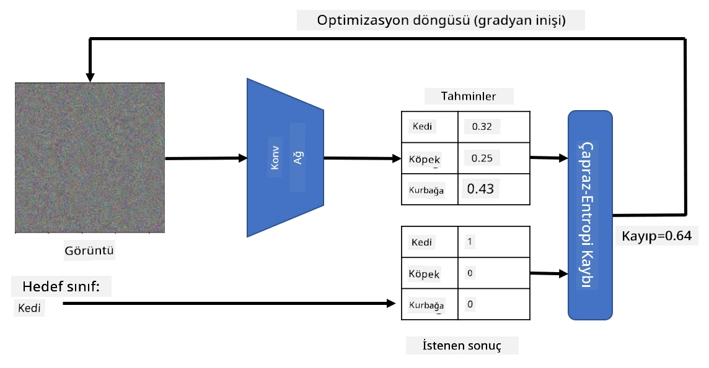

# Önceden Eğitilmiş Ağlar ve Transfer Öğrenimi

CNN'leri eğitmek oldukça zaman alabilir ve bu görev için çok fazla veri gereklidir. Ancak, bu sürenin büyük bir kısmı, bir ağın görüntülerden desenler çıkarmak için kullanabileceği en iyi düşük seviyeli filtreleri öğrenmekle geçer. Doğal olarak şu soru ortaya çıkar: Bir veri kümesinde eğitilmiş bir sinir ağını alıp, tamamen yeni bir eğitim sürecine gerek kalmadan farklı görüntüleri sınıflandırmak için uyarlayabilir miyiz?

## [Ders Öncesi Test](https://ff-quizzes.netlify.app/en/ai/quiz/15)

Bu yaklaşım **transfer öğrenimi** olarak adlandırılır, çünkü bir sinir ağı modelinden diğerine bir miktar bilgi aktarırız. Transfer öğreniminde genellikle **ImageNet** gibi büyük bir görüntü veri kümesinde eğitilmiş bir önceden eğitilmiş modelle başlarız. Bu modeller, genel görüntülerden farklı özellikler çıkarmada zaten iyi bir iş çıkarabilir ve çoğu durumda, bu çıkarılan özelliklerin üzerine bir sınıflandırıcı inşa etmek iyi sonuçlar verebilir.

> ✅ Transfer Öğrenimi, Eğitim gibi diğer akademik alanlarda da karşılaşabileceğiniz bir terimdir. Bir alandaki bilgiyi alıp başka bir alana uygulama sürecini ifade eder.

## Önceden Eğitilmiş Modelleri Özellik Çıkarıcı Olarak Kullanma

Önceki bölümde bahsettiğimiz evrişimli ağlar, görüntüden özellikler çıkarmak için tasarlanmış bir dizi katman içerir. Bu katmanlar, düşük seviyeli piksel kombinasyonlarından (örneğin yatay/dikey çizgi veya vuruş) başlayarak, daha yüksek seviyeli özellik kombinasyonlarına kadar çıkarım yapar. Eğer CNN'yi yeterince büyük ve çeşitli bir görüntü veri kümesinde eğitirsek, ağ bu ortak özellikleri çıkarmayı öğrenmelidir.

Hem Keras hem de PyTorch, yaygın mimariler için önceden eğitilmiş sinir ağı ağırlıklarını kolayca yüklemek için işlevler içerir. Çoğu, ImageNet görüntüleri üzerinde eğitilmiştir. En sık kullanılanlar, önceki dersteki [CNN Mimarileri](../07-ConvNets/CNN_Architectures.md) sayfasında açıklanmıştır. Özellikle aşağıdaki modellerden birini kullanmayı düşünebilirsiniz:

* **VGG-16/VGG-19**, nispeten basit modellerdir ve yine de iyi doğruluk sağlar. Transfer öğreniminin nasıl çalıştığını görmek için genellikle VGG'yi ilk deneme olarak kullanmak iyi bir seçimdir.
* **ResNet**, Microsoft Research tarafından 2015 yılında önerilen bir model ailesidir. Daha fazla katmana sahiptirler ve dolayısıyla daha fazla kaynak gerektirirler.
* **MobileNet**, mobil cihazlar için uygun, boyutu azaltılmış bir model ailesidir. Eğer kaynaklarınız sınırlıysa ve biraz doğruluk kaybını göze alabiliyorsanız, bu modelleri kullanabilirsiniz.

İşte VGG-16 ağı tarafından bir kedi resminden çıkarılan örnek özellikler:

## Kediler ve Köpekler Veri Kümesi

Bu örnekte, gerçek hayattaki bir görüntü sınıflandırma senaryosuna oldukça yakın olan [Kediler ve Köpekler](https://www.microsoft.com/download/details.aspx?id=54765&WT.mc_id=academic-77998-cacaste) veri kümesini kullanacağız.

## ✍️ Alıştırma: Transfer Öğrenimi

Transfer öğrenimini ilgili not defterlerinde nasıl çalıştığını görelim:

* [Transfer Öğrenimi - PyTorch](TransferLearningPyTorch.ipynb)
* [Transfer Öğrenimi - TensorFlow](TransferLearningTF.ipynb)

## Adversaryal Kedi Görselleştirme

Önceden eğitilmiş bir sinir ağı, "ideal kedi" (aynı zamanda ideal köpek, ideal zebra vb.) gibi farklı desenleri "beyninde" barındırır. Bu görüntüyü bir şekilde **görselleştirmek** ilginç olurdu. Ancak bu basit bir işlem değildir, çünkü desenler ağ ağırlıkları boyunca dağılmıştır ve ayrıca hiyerarşik bir yapıda organize edilmiştir.

Alabileceğimiz bir yaklaşım, rastgele bir görüntüyle başlamak ve ardından **gradyan iniş optimizasyonu** tekniğini kullanarak bu görüntüyü ağın bir kedi olduğunu düşünmesini sağlayacak şekilde ayarlamaktır.

Ancak bunu yaparsak, rastgele bir gürültüye çok benzeyen bir şey elde ederiz. Bunun nedeni, *ağın giriş görüntüsünü bir kedi olarak düşünmesini sağlamanın birçok yolu olmasıdır*, bunların bazıları görsel olarak mantıklı değildir. Bu görüntüler kediye özgü birçok desen içerirken, görsel olarak ayırt edici olmalarını sağlayacak bir kısıtlama yoktur.

Sonucu iyileştirmek için kayıp fonksiyonuna **varyasyon kaybı** adı verilen başka bir terim ekleyebiliriz. Bu, görüntünün komşu piksellerinin ne kadar benzer olduğunu gösteren bir metriktir. Varyasyon kaybını minimize etmek, görüntüyü daha düzgün hale getirir ve gürültüyü ortadan kaldırır - böylece daha görsel olarak çekici desenler ortaya çıkar. İşte yüksek olasılıkla kedi ve zebra olarak sınıflandırılan bu "ideal" görüntülere bir örnek:

 | 
-----|-----
 *İdeal Kedi* | *İdeal Zebra*

Benzer bir yaklaşım, sinir ağına karşı **adversaryal saldırılar** gerçekleştirmek için kullanılabilir. Diyelim ki bir sinir ağını kandırmak ve bir köpeği kedi gibi göstermek istiyoruz. Eğer ağ tarafından köpek olarak tanınan bir köpek görüntüsü alırsak, bunu biraz ayarlayarak gradyan iniş optimizasyonu kullanabiliriz, ta ki ağ bunu kedi olarak sınıflandırana kadar:

 | 
-----|-----
*Orijinal köpek resmi* | *Kedi olarak sınıflandırılan köpek resmi*

Yukarıdaki sonuçları yeniden oluşturmak için kodu şu not defterinde görebilirsiniz:

* [İdeal ve Adversaryal Kedi - TensorFlow](AdversarialCat_TF.ipynb)

## Sonuç

Transfer öğrenimi kullanarak, özel bir nesne sınıflandırma görevi için hızlı bir şekilde bir sınıflandırıcı oluşturabilir ve yüksek doğruluk elde edebilirsiniz. Daha karmaşık görevlerin artık daha yüksek hesaplama gücü gerektirdiğini ve CPU üzerinde kolayca çözülemeyeceğini görebilirsiniz. Bir sonraki birimde, aynı modeli daha düşük hesaplama kaynakları kullanarak eğitmek için daha hafif bir uygulama kullanmayı deneyeceğiz, bu da sadece biraz daha düşük doğrulukla sonuçlanır.

## 🚀 Meydan Okuma

Eşlik eden not defterlerinde, transfer öğreniminin benzer eğitim verileriyle (örneğin yeni bir hayvan türü) en iyi şekilde çalıştığına dair notlar bulunmaktadır. Transfer öğrenimi modellerinizin tamamen yeni türdeki görüntülerle ne kadar iyi veya kötü performans gösterdiğini görmek için biraz deney yapın.

## [Ders Sonrası Test](https://ff-quizzes.netlify.app/en/ai/quiz/16)

## Gözden Geçirme ve Kendi Kendine Çalışma

Modellerinizi eğitmenin diğer yollarını öğrenmek için [TrainingTricks.md](TrainingTricks.md) dosyasını okuyun.

## [Ödev](lab/README.md)

Bu laboratuvarda, gerçek hayattaki [Oxford-IIIT](https://www.robots.ox.ac.uk/~vgg/data/pets/) evcil hayvan veri kümesini kullanacağız. Bu veri kümesi, 35 kedi ve köpek türünü içerir ve bir transfer öğrenimi sınıflandırıcısı oluşturacağız.

---

