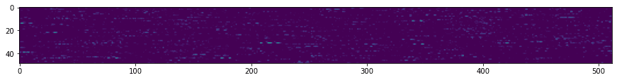

# Önceden Eğitilmiş Ağlar ve Transfer Öğrenme

CNN'leri eğitmek çok zaman alabilir ve bu görev için büyük miktarda veriye ihtiyaç vardır. Ancak, çoğu zaman, bir ağın görüntülerden desenler çıkarmak için kullanabileceği en iyi düşük seviyeli filtreleri öğrenmekle geçer. Doğal bir soru ortaya çıkar - bir veri kümesinde eğitilmiş bir sinir ağını kullanarak farklı görüntüleri sınıflandırmak için tam bir eğitim sürecine ihtiyaç duymadan bunu uyarlayabilir miyiz?

## [Ön ders anketi](https://red-field-0a6ddfd03.1.azurestaticapps.net/quiz/108)

Bu yaklaşıma **transfer öğrenme** denir, çünkü bir sinir ağı modelinden diğerine bazı bilgileri aktarırız. Transfer öğrenmede genellikle, bazı büyük görüntü veri kümesinde eğitilmiş bir önceden eğitilmiş modelle başlarız, örneğin **ImageNet**. Bu modeller, genel görüntülerden farklı özellikleri çıkarmada zaten iyi bir iş çıkarabilir ve çoğu durumda, bu çıkarılan özelliklerin üzerine bir sınıflayıcı inşa etmek iyi sonuçlar verebilir.

> ✅ Transfer Öğrenme, Eğitim gibi diğer akademik alanlarda da bulunan bir terimdir. Bir alandan bilgi alıp bunu başka bir alana uygulama sürecini ifade eder.

## Önceden Eğitilmiş Modellerin Özellik Çıkarıcıları Olarak Kullanılması

Önceki bölümde bahsettiğimiz konvolüsyonel ağlar, her birinin görüntüden bazı özellikleri çıkarması beklenen bir dizi katman içeriyordu. Bu katmanlar, düşük seviyeli piksel kombinasyonlarından (örneğin yatay/dikey çizgi veya darbe) başlayarak, bir alevin gözü gibi daha yüksek seviyeli özellik kombinasyonlarına kadar uzanır. Eğer CNN'i yeterince büyük, genel ve çeşitli görüntü veri kümesinde eğitirsek, ağ bu yaygın özellikleri çıkarmayı öğrenmelidir.

Hem Keras hem de PyTorch, bazı yaygın mimariler için önceden eğitilmiş sinir ağı ağırlıklarını kolayca yüklemek için fonksiyonlar içerir; bunların çoğu ImageNet görüntüleri üzerinde eğitilmiştir. En sık kullanılanlar, önceki dersten [CNN Mimarileri](../07-ConvNets/CNN_Architectures.md) sayfasında açıklanmıştır. Özellikle aşağıdakilerden birini kullanmayı düşünebilirsiniz:

* **VGG-16/VGG-19** nispeten basit modellerdir ve yine de iyi doğruluk sağlar. VGG'yi ilk deneme olarak kullanmak, transfer öğrenmenin nasıl çalıştığını görmek için iyi bir seçimdir.
* **ResNet**, Microsoft Research tarafından 2015'te önerilen bir model ailesidir. Daha fazla katmana sahiptirler ve bu nedenle daha fazla kaynak alırlar.
* **MobileNet**, mobil cihazlar için uygun, boyutu azaltılmış bir model ailesidir. Kaynaklarınız kısıtlıysa ve biraz doğruluktan feragat edebiliyorsanız bunları kullanın.

İşte VGG-16 ağı tarafından bir kedinin resminden çıkarılan örnek özellikler:

## Kediler ve Köpekler Veri Kümesi

Bu örnekte, gerçek yaşam görüntü sınıflandırma senaryosuna çok yakın bir [Kediler ve Köpekler](https://www.microsoft.com/download/details.aspx?id=54765&WT.mc_id=academic-77998-cacaste) veri kümesini kullanacağız.

## ✍️ Alıştırma: Transfer Öğrenme

Transfer öğrenmeyi uygulamalı olarak görmek için ilgili defterlere bakalım:

* [Transfer Öğrenme - PyTorch](../../../../../lessons/4-ComputerVision/08-TransferLearning/TransferLearningPyTorch.ipynb)
* [Transfer Öğrenme - TensorFlow](../../../../../lessons/4-ComputerVision/08-TransferLearning/TransferLearningTF.ipynb)

## Düşmanca Kedi Görselleştirme

Önceden eğitilmiş sinir ağı, *beyni* içinde farklı desenler içerir, bunlar arasında **ideal kedi** (ve ideal köpek, ideal zebra vb.) kavramları da vardır. Bu görüntüyü bir şekilde **görselleştirmek** ilginç olacaktır. Ancak bu basit değildir, çünkü desenler ağ ağırlıkları üzerinde yayılmıştır ve ayrıca hiyerarşik bir yapıda düzenlenmiştir.

Alabileceğimiz bir yaklaşım, rastgele bir görüntü ile başlamaktır ve ardından o görüntüyü öyle bir şekilde ayarlamak için **gradyan iniş optimizasyonu** tekniğini kullanmaktır ki ağ, bunun bir kedi olduğunu düşünmeye başlasın.

Ancak, bunu yaparsak, rastgele bir gürültüye çok benzeyen bir şey alırız. Bunun nedeni, *ağın giriş görüntüsünün bir kedi olduğunu düşünmesini sağlamak için birçok yolun olmasıdır*, bazıları görsel olarak mantıklı değildir. Bu görüntüler, kediye özgü birçok deseni içerse de, onları görsel olarak ayırt edici kılacak hiçbir şey yoktur.

Sonucu iyileştirmek için kayıp fonksiyonuna **varyasyon kaybı** adı verilen başka bir terim ekleyebiliriz. Bu, görüntünün komşu piksellerinin ne kadar benzer olduğunu gösteren bir metriktir. Varyasyon kaybını minimize etmek, görüntüyü daha pürüzsüz hale getirir ve gürültüyü ortadan kaldırır - böylece daha görsel olarak çekici desenleri ortaya çıkarır. İşte yüksek olasılıkla kedi ve zebra olarak sınıflandırılan bu tür "ideal" görüntülerin bir örneği:

 | 
-----|-----
 *İdeal Kedi* | *İdeal Zebra*

Benzer bir yaklaşım, sinir ağları üzerinde **düşmanca saldırılar** gerçekleştirmek için kullanılabilir. Farz edelim ki bir sinir ağını kandırmak ve bir köpeği kedi gibi göstermek istiyoruz. Eğer bir ağ tarafından köpek olarak tanınan bir köpeğin görüntüsünü alırsak, ardından gradyan iniş optimizasyonunu kullanarak onu biraz ayarlayabiliriz, ta ki ağ bunu kedi olarak sınıflandırmaya başlayana kadar:

 | 
-----|-----
*Bir köpeğin orijinal resmi* | *Kedi olarak sınıflandırılan bir köpeğin resmi*

Yukarıdaki sonuçları yeniden üretmek için kodu aşağıdaki defterde görebilirsiniz:

* [İdeal ve Düşmanca Kedi - TensorFlow](../../../../../lessons/4-ComputerVision/08-TransferLearning/AdversarialCat_TF.ipynb)
## Sonuç

Transfer öğrenmeyi kullanarak, özel bir nesne sınıflandırma görevi için hızlı bir şekilde bir sınıflayıcı oluşturabilir ve yüksek doğruluk elde edebilirsiniz. Daha karmaşık görevlerin, çözmekte olduğumuz şu an daha yüksek hesaplama gücü gerektirdiğini ve CPU üzerinde kolayca çözülemeyeceğini görebilirsiniz. Bir sonraki ünitede, aynı modeli daha düşük hesaplama kaynakları kullanarak eğitmek için daha hafif bir uygulama kullanmaya çalışacağız; bu, sadece biraz daha düşük doğruluk ile sonuçlanacaktır.

## 🚀 Meydan Okuma

Eşlik eden defterlerde, transfer bilginin en iyi nasıl çalıştığına dair notlar bulunmaktadır; bu notlar, biraz benzer eğitim verileri ile (belki yeni bir hayvan türü) ilgilidir. Transfer bilginiz modellerinin nasıl performans gösterdiğini görmek için tamamen yeni görüntü türleri ile bazı deneyler yapın.

## [Ders sonrası anket](https://red-field-0a6ddfd03.1.azurestaticapps.net/quiz/208)

## Gözden Geçirme ve Kendi Kendine Çalışma

Modellerinizi eğitmenin bazı diğer yollarını derinleştirmek için [TrainingTricks.md](TrainingTricks.md) dosyasını okuyun.

## [Görev](lab/README.md)

Bu laboratuvarda, 35 kedi ve köpek ırkından oluşan gerçek yaşam [Oxford-IIIT](https://www.robots.ox.ac.uk/~vgg/data/pets/) evcil hayvan veri kümesini kullanacağız ve bir transfer öğrenme sınıflayıcısı oluşturacağız.

**Açıklama**:  
Bu belge, makine tabanlı yapay zeka çeviri hizmetleri kullanılarak çevrilmiştir. Doğruluk için çaba göstersek de, otomatik çevirilerin hatalar veya yanlış anlamalar içerebileceğini lütfen dikkate alınız. Orijinal belge, kendi dilinde yetkili kaynak olarak kabul edilmelidir. Kritik bilgiler için profesyonel insan çevirisi önerilmektedir. Bu çevirinin kullanımından kaynaklanan herhangi bir yanlış anlama veya yanlış yorumlama için sorumluluk kabul etmiyoruz.