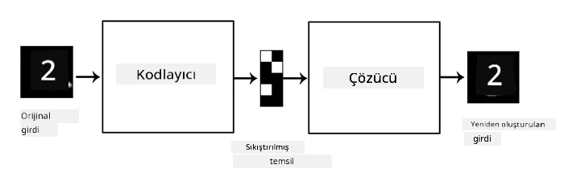
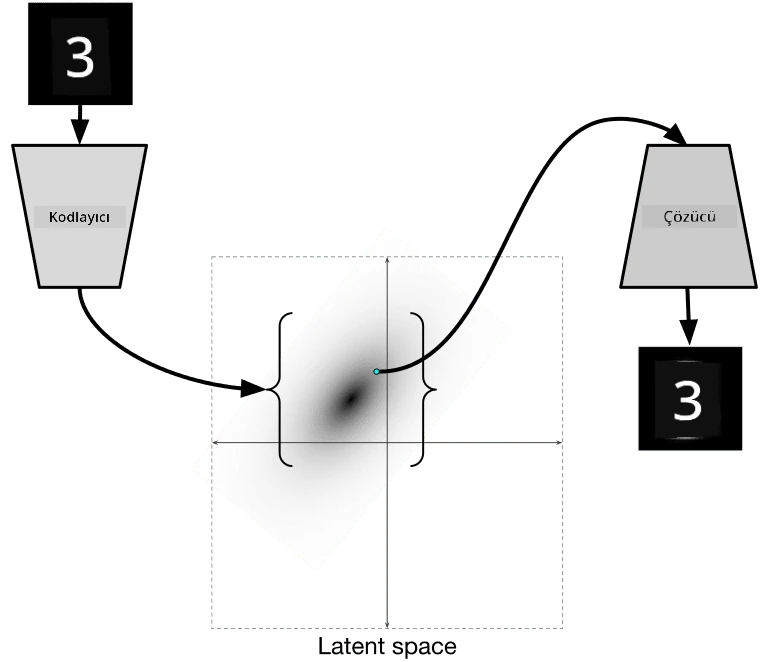

# Otomatik Kodlayıcılar

CNN'leri eğitirken karşılaşılan sorunlardan biri, çok fazla etiketlenmiş veriye ihtiyaç duymamızdır. Görüntü sınıflandırma durumunda, görüntüleri farklı sınıflara ayırmamız gerekir ve bu manuel bir çabadır.

## [Ders Öncesi Test](https://ff-quizzes.netlify.app/en/ai/quiz/17)

Ancak, CNN özellik çıkarıcılarını eğitmek için ham (etiketlenmemiş) veriyi kullanmak isteyebiliriz, bu yönteme **kendinden denetimli öğrenme** denir. Etiketler yerine, eğitim görüntülerini hem ağ girişi hem de çıkışı olarak kullanacağız. **Otomatik kodlayıcı** fikrinin temelinde, bir **kodlayıcı ağ** ile giriş görüntüsünü bir **gizli uzaya** (genellikle daha küçük boyutlu bir vektör) dönüştürmek ve ardından **kod çözücü ağ** ile orijinal görüntüyü yeniden oluşturmak yer alır.

> ✅ Bir [otomatik kodlayıcı](https://wikipedia.org/wiki/Autoencoder), "etiketlenmemiş verilerin verimli kodlamalarını öğrenmek için kullanılan bir tür yapay sinir ağıdır."

Otomatik kodlayıcıyı, orijinal görüntüden mümkün olduğunca fazla bilgi yakalamak ve doğru bir şekilde yeniden oluşturmak için eğittiğimizden, ağ en iyi **gömülü temsili** bulmaya çalışır.

> Görsel [Keras blogundan](https://blog.keras.io/building-autoencoders-in-keras.html)

## Otomatik Kodlayıcıların Kullanım Senaryoları

Orijinal görüntüleri yeniden oluşturmak kendi başına çok faydalı görünmese de, otomatik kodlayıcıların özellikle faydalı olduğu birkaç senaryo vardır:

* **Görüntülerin boyutunu düşürmek için görselleştirme** veya **görüntü gömülü temsilleri eğitmek**. Genellikle otomatik kodlayıcılar PCA'dan daha iyi sonuçlar verir, çünkü görüntülerin mekansal doğasını ve hiyerarşik özelliklerini dikkate alır.
* **Gürültü giderme**, yani görüntüden gürültüyü kaldırma. Gürültü çok fazla gereksiz bilgi taşıdığı için, otomatik kodlayıcı bunu nispeten küçük gizli uzaya sığdıramaz ve bu nedenle yalnızca görüntünün önemli kısmını yakalar. Gürültü gidericileri eğitirken, orijinal görüntülerle başlarız ve otomatik kodlayıcıya giriş olarak yapay olarak eklenmiş gürültü içeren görüntüleri kullanırız.
* **Süper çözünürlük**, görüntü çözünürlüğünü artırma. Yüksek çözünürlüklü görüntülerle başlarız ve düşük çözünürlüklü görüntüyü otomatik kodlayıcıya giriş olarak kullanırız.
* **Üretici modeller**. Otomatik kodlayıcıyı eğittikten sonra, kod çözücü kısmı rastgele gizli vektörlerden başlayarak yeni nesneler oluşturmak için kullanılabilir.

## Varyasyonel Otomatik Kodlayıcılar (VAE)

Geleneksel otomatik kodlayıcılar, giriş verisinin boyutunu bir şekilde azaltır ve giriş görüntülerinin önemli özelliklerini belirler. Ancak, gizli vektörler genellikle çok anlamlı değildir. Örneğin, MNIST veri setini ele alırsak, farklı gizli vektörlerin hangi rakamlara karşılık geldiğini anlamak kolay değildir, çünkü yakın gizli vektörler mutlaka aynı rakamlara karşılık gelmez.

Öte yandan, *üretici* modelleri eğitmek için gizli uzay hakkında bir anlayışa sahip olmak daha iyidir. Bu fikir bizi **varyasyonel otomatik kodlayıcıya** (VAE) götürür.

VAE, gizli parametrelerin *istatistiksel dağılımını* tahmin etmeyi öğrenen bir otomatik kodlayıcıdır, buna **gizli dağılım** denir. Örneğin, gizli vektörlerin zmean ve zsigma (her ikisi de belirli bir boyut d'ye sahip vektörlerdir) ile normal olarak dağıtılmasını isteyebiliriz. VAE'deki kodlayıcı bu parametreleri tahmin etmeyi öğrenir ve ardından kod çözücü, bu dağılımdan rastgele bir vektör alarak nesneyi yeniden oluşturur.

Özetlemek gerekirse:

 * Giriş vektöründen `z_mean` ve `z_log_sigma` tahmin edilir (standart sapmanın kendisini tahmin etmek yerine, logaritması tahmin edilir)
 * N(zmean,exp(zlog\_sigma)) dağılımından `sample` adlı bir vektör örneklenir
 * Kod çözücü, `sample` vektörünü giriş olarak kullanarak orijinal görüntüyü çözmeye çalışır

 

> Görsel [bu blog yazısından](https://ijdykeman.github.io/ml/2016/12/21/cvae.html) Isaak Dykeman tarafından

Varyasyonel otomatik kodlayıcılar, iki bölümden oluşan karmaşık bir kayıp fonksiyonu kullanır:

* **Yeniden yapılandırma kaybı**, yeniden yapılandırılmış bir görüntünün hedefe ne kadar yakın olduğunu gösteren kayıp fonksiyonudur (örneğin Ortalama Kare Hata veya MSE olabilir). Bu, normal otomatik kodlayıcılardaki kayıp fonksiyonuyla aynıdır.
* **KL kaybı**, gizli değişken dağılımlarının normal dağılıma yakın kalmasını sağlar. Bu, iki istatistiksel dağılımın ne kadar benzer olduğunu tahmin etmek için kullanılan bir metrik olan [Kullback-Leibler sapması](https://www.countbayesie.com/blog/2017/5/9/kullback-leibler-divergence-explained) temel alınarak hesaplanır.

VAE'lerin önemli bir avantajı, yeni görüntüleri nispeten kolay bir şekilde oluşturabilmemize olanak tanımasıdır, çünkü gizli vektörlerin örnekleneceği dağılımı biliriz. Örneğin, MNIST üzerinde 2D gizli vektörle VAE eğitirsek, gizli vektörün bileşenlerini değiştirerek farklı rakamlar elde edebiliriz:

> Görsel [Dmitry Soshnikov](http://soshnikov.com) tarafından

Gizli parametre uzayının farklı bölümlerinden gizli vektörler almaya başladıkça, görüntülerin birbirine nasıl karıştığını gözlemleyin. Bu uzayı ayrıca 2D olarak görselleştirebiliriz:

 

> Görsel [Dmitry Soshnikov](http://soshnikov.com) tarafından

## ✍️ Egzersizler: Otomatik Kodlayıcılar

Otomatik kodlayıcılar hakkında daha fazla bilgi edinmek için şu ilgili not defterlerini inceleyin:

* [TensorFlow'da Otomatik Kodlayıcılar](AutoencodersTF.ipynb)
* [PyTorch'ta Otomatik Kodlayıcılar](AutoEncodersPyTorch.ipynb)

## Otomatik Kodlayıcıların Özellikleri

* **Veriye Özgü** - yalnızca eğitildikleri görüntü türleriyle iyi çalışırlar. Örneğin, bir süper çözünürlük ağı çiçekler üzerinde eğitilirse, portrelerde iyi çalışmaz. Bunun nedeni, ağın daha yüksek çözünürlüklü görüntü üretebilmesi için eğitim veri setinden öğrenilen özelliklerden ince detaylar almasıdır.
* **Kayıplı** - yeniden yapılandırılmış görüntü, orijinal görüntüyle aynı değildir. Kaybın doğası, eğitim sırasında kullanılan *kayıp fonksiyonu* ile tanımlanır.
* **Etiketlenmemiş veri** üzerinde çalışır.

## [Ders Sonrası Test](https://ff-quizzes.netlify.app/en/ai/quiz/18)

## Sonuç

Bu derste, bir AI bilim insanının kullanabileceği çeşitli otomatik kodlayıcı türlerini öğrendiniz. Bunları nasıl oluşturacağınızı ve görüntüleri yeniden yapılandırmak için nasıl kullanacağınızı öğrendiniz. Ayrıca VAE'yi ve yeni görüntüler oluşturmak için nasıl kullanılacağını öğrendiniz.

## 🚀 Meydan Okuma

Bu derste, otomatik kodlayıcıları görüntüler için kullanmayı öğrendiniz. Ancak, müzik için de kullanılabilirler! Magenta projesinin [MusicVAE](https://magenta.tensorflow.org/music-vae) projesine göz atın; bu proje, müziği yeniden yapılandırmayı öğrenmek için otomatik kodlayıcıları kullanır. Bu kütüphane ile bazı [deneyler](https://colab.research.google.com/github/magenta/magenta-demos/blob/master/colab-notebooks/Multitrack_MusicVAE.ipynb) yaparak neler yaratabileceğinizi görün.

## [Ders Sonrası Test](https://ff-quizzes.netlify.app/en/ai/quiz/16)

## İnceleme ve Kendi Kendine Çalışma

Referans için, otomatik kodlayıcılar hakkında daha fazla bilgi edinmek için şu kaynakları okuyun:

* [Keras'ta Otomatik Kodlayıcılar Oluşturma](https://blog.keras.io/building-autoencoders-in-keras.html)
* [NeuroHive'daki Blog Yazısı](https://neurohive.io/ru/osnovy-data-science/variacionnyj-avtojenkoder-vae/)
* [Varyasyonel Otomatik Kodlayıcılar Açıklaması](https://kvfrans.com/variational-autoencoders-explained/)
* [Koşullu Varyasyonel Otomatik Kodlayıcılar](https://ijdykeman.github.io/ml/2016/12/21/cvae.html)

## Ödev

[TensorFlow kullanılarak hazırlanan bu not defterinin](AutoencodersTF.ipynb) sonunda bir 'görev' bulacaksınız - bunu ödeviniz olarak kullanın.

---

