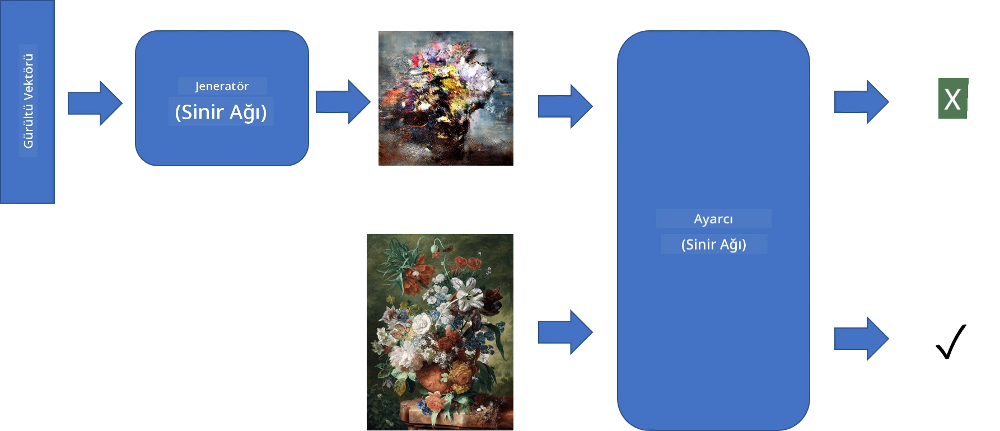
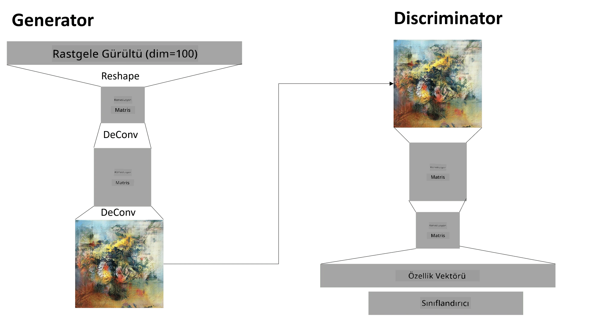

# Üretici Çekişmeli Ağlar

Önceki bölümde **üretici modelleri** öğrendik: eğitim veri setindeki görüntülere benzer yeni görüntüler üretebilen modeller. VAE, üretici model için iyi bir örnekti.

## [Ders Öncesi Test](https://ff-quizzes.netlify.app/en/ai/quiz/19)

Ancak, VAE ile makul bir çözünürlükte anlamlı bir şey, örneğin bir tablo üretmeye çalışırsak, eğitimin iyi bir şekilde yakınsamadığını göreceğiz. Bu kullanım durumu için, üretici modellere özel olarak tasarlanmış başka bir mimariyi öğrenmeliyiz - **Üretici Çekişmeli Ağlar**, veya GAN'lar.

GAN'ın temel fikri, birbirine karşı eğitilecek iki sinir ağına sahip olmaktır:

> Görsel: [Dmitry Soshnikov](http://soshnikov.com)

> ✅ Küçük bir sözlük:
> * **Generator** (Üretici), rastgele bir vektör alır ve sonuç olarak bir görüntü üretir.
> * **Discriminator** (Ayırt Edici), bir görüntü alır ve bunun gerçek bir görüntü (eğitim veri setinden) mi yoksa üretici tarafından üretilmiş bir görüntü mü olduğunu söylemelidir. Temelde bir görüntü sınıflandırıcıdır.

### Ayırt Edici

Ayırt edicinin mimarisi, sıradan bir görüntü sınıflandırma ağından farklı değildir. En basit durumda tamamen bağlı bir sınıflandırıcı olabilir, ancak büyük olasılıkla bir [konvolüsyonel ağ](../07-ConvNets/README.md) olacaktır.

> ✅ Konvolüsyonel ağlara dayalı bir GAN, [DCGAN](https://arxiv.org/pdf/1511.06434.pdf) olarak adlandırılır.

Bir CNN ayırt edici şu katmanlardan oluşur: birkaç konvolüsyon+havuzlama (azalan uzaysal boyutlarla) ve bir veya daha fazla tamamen bağlı katman, "özellik vektörü" elde etmek için son ikili sınıflandırıcı.

> ✅ 'Havuzlama' bu bağlamda görüntünün boyutunu küçültme tekniğidir. "Havuzlama katmanları, bir katmandaki nöron kümelerinin çıktısını bir sonraki katmandaki tek bir nöronda birleştirerek verilerin boyutlarını azaltır." - [kaynak](https://wikipedia.org/wiki/Convolutional_neural_network#Pooling_layers)

### Üretici

Üretici biraz daha karmaşıktır. Bunu ters bir ayırt edici olarak düşünebilirsiniz. Bir özellik vektörünün yerine bir gizli vektörden başlayarak, gerekli boyut/şekle dönüştürmek için tamamen bağlı bir katmana sahiptir, ardından dekonvolüsyon+ölçek büyütme işlemleri gelir. Bu, [otoenkoder](../09-Autoencoders/README.md)'in *kod çözücü* kısmına benzer.

> ✅ Konvolüsyon katmanı bir görüntü üzerinde doğrusal bir filtre olarak uygulandığından, dekonvolüsyon temelde konvolüsyona benzer ve aynı katman mantığı kullanılarak uygulanabilir.

> Görsel: [Dmitry Soshnikov](http://soshnikov.com)

### GAN'ı Eğitmek

GAN'lar **çekişmeli** olarak adlandırılır çünkü üretici ve ayırt edici arasında sürekli bir rekabet vardır. Bu rekabet sırasında hem üretici hem de ayırt edici gelişir, böylece ağ daha iyi ve daha iyi görüntüler üretmeyi öğrenir.

Eğitim iki aşamada gerçekleşir:

* **Ayırt ediciyi eğitmek**. Bu görev oldukça basittir: üretici tarafından bir görüntü grubu oluştururuz, bunları sahte görüntü anlamına gelen 0 ile etiketleriz ve giriş veri setinden bir grup görüntü alırız (etiket 1, gerçek görüntü). Bir *ayırt edici kaybı* elde ederiz ve geri yayılım yaparız.
* **Üreticiyi eğitmek**. Bu biraz daha karmaşıktır çünkü üretici için beklenen çıktıyı doğrudan bilmiyoruz. Üretici ve ayırt ediciden oluşan tüm GAN ağını alırız, rastgele vektörlerle besleriz ve sonucun 1 olmasını bekleriz (gerçek görüntülere karşılık gelir). Ayırt edicinin parametrelerini dondururuz (bu adımda eğitilmesini istemiyoruz) ve geri yayılım yaparız.

Bu süreç sırasında hem üretici hem de ayırt edici kayıpları önemli ölçüde düşmez. İdeal durumda, her iki ağın performansını geliştirdiğini gösteren bir salınım yapmalıdırlar.

## ✍️ Alıştırmalar: GAN'lar

* [TensorFlow/Keras ile GAN Not Defteri](GANTF.ipynb)
* [PyTorch ile GAN Not Defteri](GANPyTorch.ipynb)

### GAN Eğitimindeki Sorunlar

GAN'ların eğitilmesi özellikle zor olduğu bilinir. İşte birkaç sorun:

* **Mod Çökmesi**. Bu terimle, üreticinin ayırt ediciyi kandıran tek bir başarılı görüntü üretmeyi öğrenmesi ve farklı görüntüler çeşitliliği üretmemesi kastedilir.
* **Hiperparametrelere duyarlılık**. Çoğu zaman bir GAN'ın hiç yakınsamadığını ve ardından öğrenme oranındaki ani bir düşüşle yakınsamaya başladığını görebilirsiniz.
* Üretici ve ayırt edici arasında **dengeyi korumak**. Çoğu durumda ayırt edici kaybı nispeten hızlı bir şekilde sıfıra düşebilir, bu da üreticinin daha fazla eğitim yapamamasına neden olur. Bunu aşmak için üretici ve ayırt edici için farklı öğrenme oranları ayarlamayı veya kayıp zaten çok düşükse ayırt edici eğitimi atlamayı deneyebiliriz.
* **Yüksek çözünürlük** için eğitim. Otoenkoderlerde olduğu gibi aynı sorunu yansıtan bu sorun, konvolüsyonel ağın çok fazla katmanını yeniden oluşturmanın artefaktlara yol açması nedeniyle tetiklenir. Bu sorun genellikle **aşamalı büyüme** ile çözülür; önce birkaç katman düşük çözünürlüklü görüntülerde eğitilir, ardından katmanlar "açılır" veya eklenir. Bir diğer çözüm ise katmanlar arasında ekstra bağlantılar eklemek ve birden fazla çözünürlüğü aynı anda eğitmek olabilir - detaylar için bu [Multi-Scale Gradient GANs makalesine](https://arxiv.org/abs/1903.06048) bakabilirsiniz.

## Stil Transferi

GAN'lar sanatsal görüntüler üretmek için harika bir yöntemdir. Bir diğer ilginç teknik ise **stil transferi** olarak adlandırılır. Bu teknik, bir **içerik görüntüsü** alır ve onu farklı bir tarzda yeniden çizer, **stil görüntüsünden** filtreler uygular.

Nasıl çalıştığı şu şekildedir:
* Rastgele bir gürültü görüntüsüyle başlarız (veya içerik görüntüsüyle, ancak anlamak için rastgele gürültüyle başlamak daha kolaydır)
* Amacımız, hem içerik görüntüsüne hem de stil görüntüsüne yakın olacak bir görüntü oluşturmaktır. Bu, iki kayıp fonksiyonu ile belirlenir:
   - **İçerik kaybı**, mevcut görüntü ve içerik görüntüsünden CNN tarafından bazı katmanlarda çıkarılan özelliklere dayanarak hesaplanır.
   - **Stil kaybı**, mevcut görüntü ve stil görüntüsü arasında Gram matrisleri kullanılarak akıllıca hesaplanır (daha fazla bilgi için [örnek not defteri](StyleTransfer.ipynb)).
* Görüntüyü daha düzgün hale getirmek ve gürültüyü kaldırmak için **Varyasyon kaybı** da ekleriz, bu komşu pikseller arasındaki ortalama mesafeyi hesaplar.
* Ana optimizasyon döngüsü, toplam kaybı minimize etmek için mevcut görüntüyü gradyan inişi (veya başka bir optimizasyon algoritması) kullanarak ayarlar. Toplam kayıp, tüm kayıpların ağırlıklı bir toplamıdır.

## ✍️ Örnek: [Stil Transferi](StyleTransfer.ipynb)

## [Ders Sonrası Test](https://ff-quizzes.netlify.app/en/ai/quiz/20)

## Sonuç

Bu derste GAN'ları ve nasıl eğitileceğini öğrendiniz. Ayrıca bu tür Sinir Ağlarının karşılaşabileceği özel zorlukları ve bunları aşmak için bazı stratejileri öğrendiniz.

## 🚀 Meydan Okuma

Kendi görüntülerinizi kullanarak [Stil Transferi not defterini](StyleTransfer.ipynb) çalıştırın.

## Gözden Geçirme ve Kendi Kendine Çalışma

Referans için, GAN'lar hakkında daha fazla bilgi edinmek için şu kaynaklara göz atın:

* Marco Pasini, [Bir Yıl Boyunca GAN Eğitimiyle Öğrendiğim 10 Ders](https://towardsdatascience.com/10-lessons-i-learned-training-generative-adversarial-networks-gans-for-a-year-c9071159628)
* [StyleGAN](https://en.wikipedia.org/wiki/StyleGAN), dikkate alınması gereken bir *de facto* GAN mimarisi
* [Azure ML'de GAN'lar Kullanarak Üretici Sanat Oluşturma](https://soshnikov.com/scienceart/creating-generative-art-using-gan-on-azureml/)

## Ödev

Bu derse ait iki not defterinden birini tekrar ziyaret edin ve GAN'ı kendi görüntüleriniz üzerinde yeniden eğitin. Neler yaratabilirsiniz?

---

