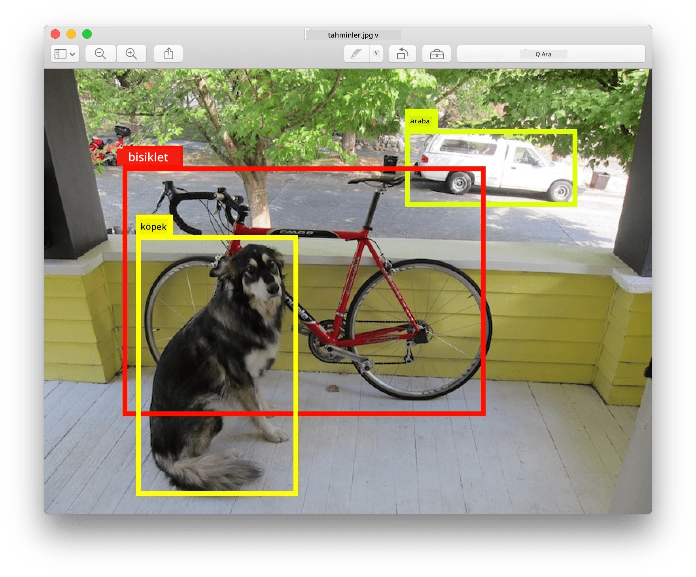
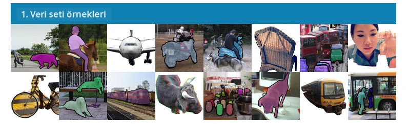
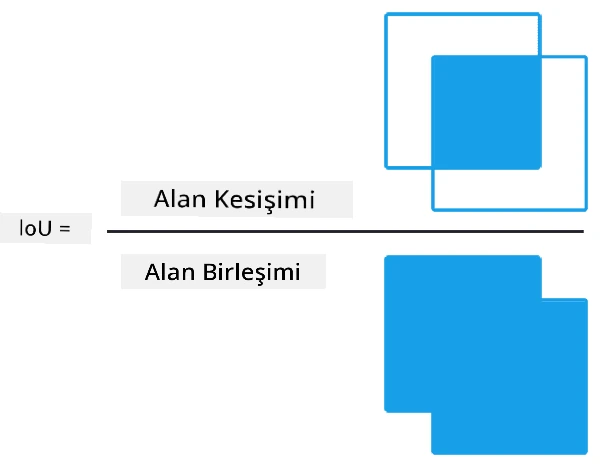
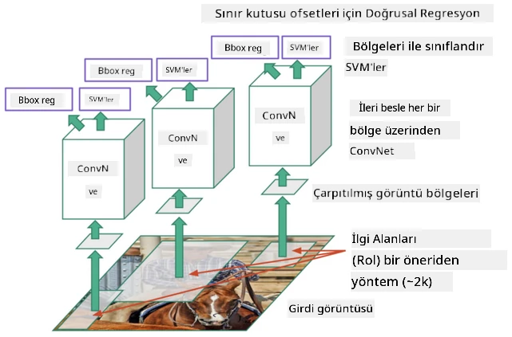
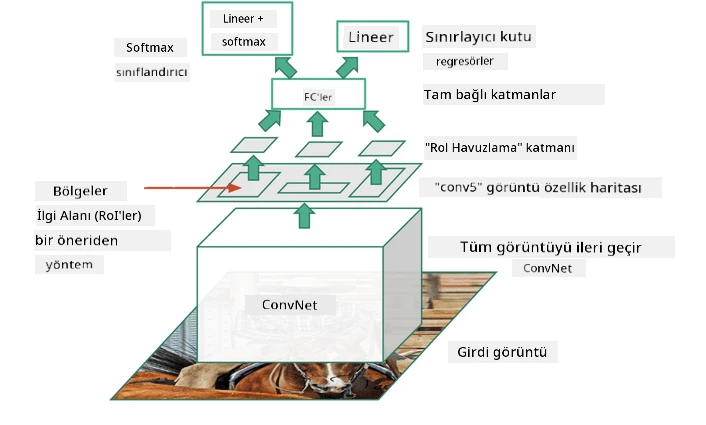
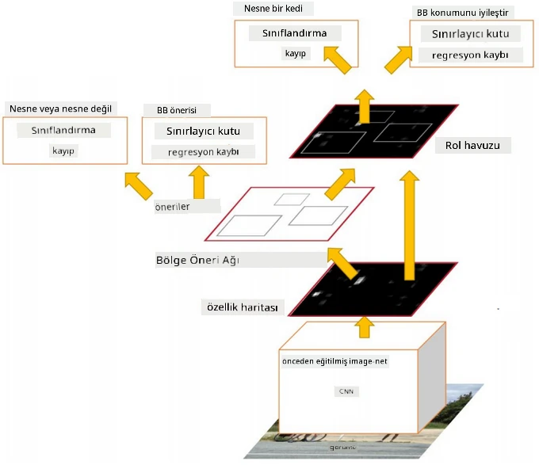
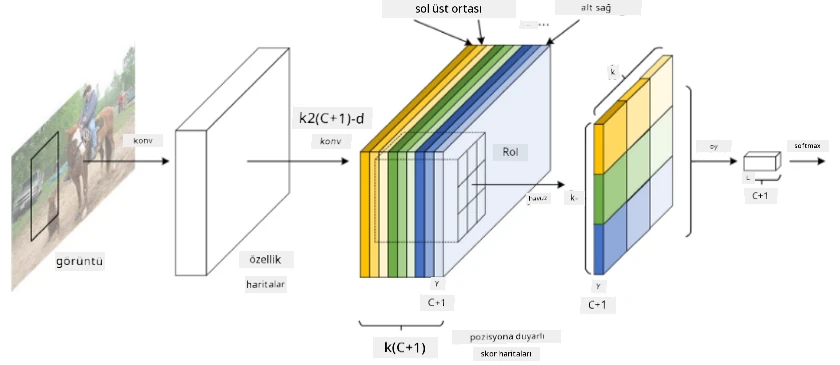
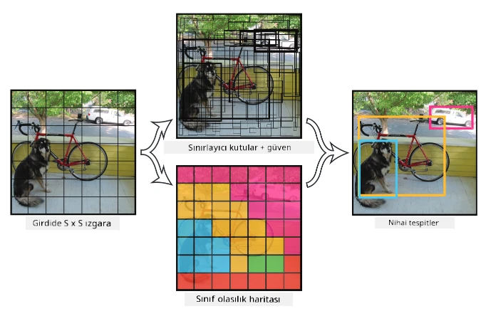

# Nesne Tespiti

Bugüne kadar ele aldığımız görüntü sınıflandırma modelleri, bir görüntüyü alıp MNIST problemindeki 'sayı' sınıfı gibi kategorik bir sonuç üretiyordu. Ancak, birçok durumda bir resmin nesneleri tasvir ettiğini bilmek yeterli değildir - nesnelerin tam konumlarını belirlemek isteriz. İşte **nesne tespiti** tam olarak bu noktada devreye girer.

## [Ders Öncesi Test](https://ff-quizzes.netlify.app/en/ai/quiz/21)

> Görsel [YOLO v2 web sitesi](https://pjreddie.com/darknet/yolov2/) üzerinden alınmıştır.

## Nesne Tespiti için Naif Bir Yaklaşım

Bir resimde bir kediyi bulmak istediğimizi varsayalım, nesne tespiti için çok basit bir yaklaşım şu şekilde olabilir:

1. Resmi bir dizi kareye ayırın.
2. Her bir karede görüntü sınıflandırma işlemi gerçekleştirin.
3. Yeterince yüksek aktivasyon veren kareler, ilgili nesneyi içeriyor olarak kabul edilebilir.

> *Görsel [Egzersiz Defteri](ObjectDetection-TF.ipynb) üzerinden alınmıştır.*

Ancak, bu yaklaşım ideal olmaktan uzaktır çünkü algoritmanın nesnenin sınır kutusunu çok hassas bir şekilde belirlemesine izin vermez. Daha hassas bir konum belirlemek için, sınır kutularının koordinatlarını tahmin etmek üzere bir tür **regresyon** çalıştırmamız gerekir - ve bunun için özel veri setlerine ihtiyaç duyarız.

## Nesne Tespiti için Regresyon

[Bu blog yazısı](https://towardsdatascience.com/object-detection-with-neural-networks-a4e2c46b4491), şekilleri tespit etme konusunda harika bir giriş sunuyor.

## Nesne Tespiti için Veri Setleri

Bu görev için aşağıdaki veri setleriyle karşılaşabilirsiniz:

* [PASCAL VOC](http://host.robots.ox.ac.uk/pascal/VOC/) - 20 sınıf
* [COCO](http://cocodataset.org/#home) - Bağlamdaki Yaygın Nesneler. 80 sınıf, sınır kutuları ve segmentasyon maskeleri

## Nesne Tespiti Metrikleri

### Kesişim Bölü Birleşim (IoU)

Görüntü sınıflandırma için algoritmanın ne kadar iyi performans gösterdiğini ölçmek kolaydır, ancak nesne tespiti için hem sınıfın doğruluğunu hem de tahmin edilen sınır kutusu konumunun hassasiyetini ölçmemiz gerekir. İkincisi için, **Kesişim Bölü Birleşim** (IoU) adı verilen bir ölçüm kullanırız, bu iki kutunun (veya iki rastgele alanın) ne kadar iyi örtüştüğünü ölçer.

> *[Bu harika IoU blog yazısından](https://pyimagesearch.com/2016/11/07/intersection-over-union-iou-for-object-detection/) alınan Şekil 2.*

Fikir basittir - iki şeklin kesişim alanını birleşim alanına böleriz. İki özdeş alan için IoU 1 olurken, tamamen ayrık alanlar için 0 olur. Diğer durumlarda 0 ile 1 arasında değişir. Genellikle IoU belirli bir değerin üzerinde olan sınır kutularını dikkate alırız.

### Ortalama Hassasiyet (Average Precision)

Bir nesne sınıfı $C$'nin ne kadar iyi tanındığını ölçmek istediğimizi varsayalım. Bunu ölçmek için **Ortalama Hassasiyet** metriğini kullanırız, bu şu şekilde hesaplanır:

1. Hassasiyet-Tekrar Çağırma eğrisi, algılama eşik değerine (0'dan 1'e kadar) bağlı olarak doğruluğu gösterir.
2. Eşik değerine bağlı olarak, görüntüde daha fazla veya daha az nesne algılanır ve farklı hassasiyet ve tekrar çağırma değerleri elde edilir.
3. Eğri şu şekilde görünür:

> *Görsel [NeuroWorkshop](http://github.com/shwars/NeuroWorkshop) üzerinden alınmıştır.*

Belirli bir sınıf $C$ için Ortalama Hassasiyet, bu eğrinin altındaki alandır. Daha spesifik olarak, Tekrar Çağırma ekseni genellikle 10 parçaya bölünür ve Hassasiyet bu noktaların tümü üzerinde ortalanır:

$$
AP = {1\over11}\sum_{i=0}^{10}\mbox{Precision}(\mbox{Recall}={i\over10})
$$

### AP ve IoU

Sadece IoU belirli bir değerin üzerinde olan algılamaları dikkate alacağız. Örneğin, PASCAL VOC veri setinde genellikle $\mbox{IoU Threshold} = 0.5$ varsayılırken, COCO'da AP farklı $\mbox{IoU Threshold}$ değerleri için ölçülür.

> *Görsel [NeuroWorkshop](http://github.com/shwars/NeuroWorkshop) üzerinden alınmıştır.*

### Ortalama Ortalama Hassasiyet - mAP

Nesne Tespiti için ana metrik **Ortalama Ortalama Hassasiyet** veya **mAP** olarak adlandırılır. Bu, tüm nesne sınıfları ve bazen de $\mbox{IoU Threshold}$ üzerinde ortalanmış Ortalama Hassasiyet değeridir. **mAP** hesaplama süreci daha ayrıntılı olarak
[bu blog yazısında](https://medium.com/@timothycarlen/understanding-the-map-evaluation-metric-for-object-detection-a07fe6962cf3)) ve ayrıca [kod örnekleriyle burada](https://gist.github.com/tarlen5/008809c3decf19313de216b9208f3734) açıklanmıştır.

## Farklı Nesne Tespiti Yaklaşımları

Nesne tespiti algoritmaları iki geniş sınıfa ayrılır:

* **Bölge Öneri Ağları** (R-CNN, Fast R-CNN, Faster R-CNN). Ana fikir, **İlgi Alanları** (ROI) oluşturmak ve maksimum aktivasyonu aramak için CNN çalıştırmaktır. Bu, naif yaklaşıma biraz benzer, ancak ROI'ler daha akıllıca oluşturulur. Bu tür yöntemlerin en büyük dezavantajlarından biri, yavaş olmalarıdır çünkü görüntü üzerinde CNN sınıflandırıcısının birçok geçişine ihtiyaç duyarız.
* **Tek geçiş** (YOLO, SSD, RetinaNet) yöntemleri. Bu mimarilerde, ağ hem sınıfları hem de ROI'leri tek bir geçişte tahmin edecek şekilde tasarlanır.

### R-CNN: Bölge Tabanlı CNN

[R-CNN](http://islab.ulsan.ac.kr/files/announcement/513/rcnn_pami.pdf), ROI bölgelerinin hiyerarşik yapısını oluşturmak için [Selective Search](http://www.huppelen.nl/publications/selectiveSearchDraft.pdf) kullanır. Bu bölgeler daha sonra CNN özellik çıkarıcıları ve SVM sınıflandırıcıları aracılığıyla nesne sınıfını belirlemek ve *sınır kutusu* koordinatlarını belirlemek için doğrusal regresyon ile işlenir. [Resmi Makale](https://arxiv.org/pdf/1506.01497v1.pdf)

> *Görsel van de Sande ve ark. ICCV’11'dan alınmıştır.*

> *Görseller [bu blogdan](https://towardsdatascience.com/r-cnn-fast-r-cnn-faster-r-cnn-yolo-object-detection-algorithms-36d53571365e) alınmıştır.*

### F-RCNN - Hızlı R-CNN

Bu yaklaşım R-CNN'e benzer, ancak bölgeler konvolüsyon katmanları uygulandıktan sonra tanımlanır.

> Görsel [Resmi Makale](https://www.cv-foundation.org/openaccess/content_iccv_2015/papers/Girshick_Fast_R-CNN_ICCV_2015_paper.pdf), [arXiv](https://arxiv.org/pdf/1504.08083.pdf), 2015 üzerinden alınmıştır.

### Daha Hızlı R-CNN

Bu yaklaşımın ana fikri, ROI'leri tahmin etmek için sinir ağı kullanmaktır - *Bölge Öneri Ağı* olarak adlandırılır. [Makale](https://arxiv.org/pdf/1506.01497.pdf), 2016

> Görsel [Resmi Makale](https://arxiv.org/pdf/1506.01497.pdf) üzerinden alınmıştır.

### R-FCN: Bölge Tabanlı Tam Konvolüsyonel Ağ

Bu algoritma, Daha Hızlı R-CNN'den bile daha hızlıdır. Ana fikir şu şekildedir:

1. Özellikler ResNet-101 kullanılarak çıkarılır.
2. Özellikler **Pozisyon-Duyarlı Skor Haritası** tarafından işlenir. $C$ sınıflarından her bir nesne $k\times k$ bölgelere ayrılır ve nesne parçalarını tahmin etmek için eğitim yapılır.
3. $k\times k$ bölgelerden her bir parça için tüm ağlar nesne sınıfları için oy kullanır ve maksimum oyu alan nesne sınıfı seçilir.

> Görsel [Resmi Makale](https://arxiv.org/abs/1605.06409) üzerinden alınmıştır.

### YOLO - Sadece Bir Kez Bak

YOLO, gerçek zamanlı tek geçişli bir algoritmadır. Ana fikir şu şekildedir:

 * Görüntü $S\times S$ bölgelere ayrılır.
 * Her bölge için **CNN**, $n$ olası nesneleri, *sınır kutusu* koordinatlarını ve *güven* = *olasılık* * IoU tahmin eder.

 

> Görsel [Resmi Makale](https://arxiv.org/abs/1506.02640) üzerinden alınmıştır.

### Diğer Algoritmalar

* RetinaNet: [Resmi Makale](https://arxiv.org/abs/1708.02002)
   - [Torchvision'da PyTorch Uygulaması](https://pytorch.org/vision/stable/_modules/torchvision/models/detection/retinanet.html)
   - [Keras Uygulaması](https://github.com/fizyr/keras-retinanet)
   - [Keras Örneklerinde RetinaNet ile Nesne Tespiti](https://keras.io/examples/vision/retinanet/)
* SSD (Tek Atış Dedektörü): [Resmi Makale](https://arxiv.org/abs/1512.02325)

## ✍️ Egzersizler: Nesne Tespiti

Öğreniminize aşağıdaki defterde devam edin:

[ObjectDetection.ipynb](ObjectDetection.ipynb)

## Sonuç

Bu derste, nesne tespitinin çeşitli yollarını hızlı bir şekilde gözden geçirdiniz!

## 🚀 Meydan Okuma

Bu makaleleri ve defterleri YOLO hakkında okuyun ve kendiniz deneyin:

* [YOLO'yu açıklayan iyi bir blog yazısı](https://www.analyticsvidhya.com/blog/2018/12/practical-guide-object-detection-yolo-framewor-python/)
 * [Resmi site](https://pjreddie.com/darknet/yolo/)
 * Yolo: [Keras uygulaması](https://github.com/experiencor/keras-yolo2), [adım adım defter](https://github.com/experiencor/basic-yolo-keras/blob/master/Yolo%20Step-by-Step.ipynb)
 * Yolo v2: [Keras uygulaması](https://github.com/experiencor/keras-yolo2), [adım adım defter](https://github.com/experiencor/keras-yolo2/blob/master/Yolo%20Step-by-Step.ipynb)

## [Ders Sonrası Test](https://ff-quizzes.netlify.app/en/ai/quiz/22)

## Gözden Geçirme ve Kendi Kendine Çalışma

* [Nesne Tespiti](https://tjmachinelearning.com/lectures/1718/obj/) - Nikhil Sardana
* [Nesne tespiti algoritmalarının iyi bir karşılaştırması](https://lilianweng.github.io/lil-log/2018/12/27/object-detection-part-4.html)
* [Nesne Tespiti için Derin Öğrenme Algoritmalarının İncelemesi](https://medium.com/comet-app/review-of-deep-learning-algorithms-for-object-detection-c1f3d437b852)
* [Temel Nesne Tespiti Algoritmalarına Adım Adım Giriş](https://www.analyticsvidhya.com/blog/2018/10/a-step-by-step-introduction-to-the-basic-object-detection-algorithms-part-1/)
* [Python'da Nesne Tespiti için Daha Hızlı R-CNN Uygulaması](https://www.analyticsvidhya.com/blog/2018/11/implementation-faster-r-cnn-python-object-detection/)

## [Ödev: Nesne Tespiti](lab/README.md)

---

