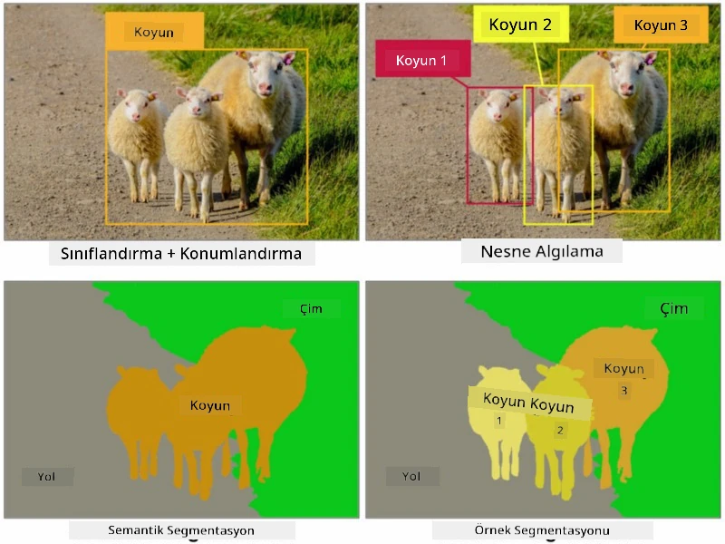
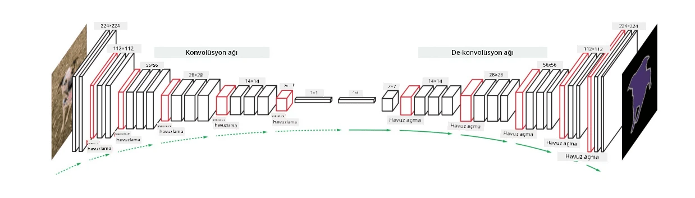

# Segmentasyon

Daha önce, nesneleri *sınır kutuları* tahmin ederek görüntüde bulmamıza olanak tanıyan Nesne Tespiti hakkında bilgi edinmiştik. Ancak, bazı görevlerde yalnızca sınır kutularına değil, daha hassas nesne konumlandırmasına da ihtiyacımız olabilir. Bu görev **segmentasyon** olarak adlandırılır.

## [Ders Öncesi Test](https://ff-quizzes.netlify.app/en/ai/quiz/23)

Segmentasyon, **piksel sınıflandırması** olarak görülebilir; burada görüntünün **her** pikseli için sınıfını tahmin etmemiz gerekir (*arka plan* sınıflardan biri olarak kabul edilir). İki ana segmentasyon algoritması vardır:

* **Semantik segmentasyon**, yalnızca piksel sınıfını belirtir ve aynı sınıfa ait farklı nesneler arasında ayrım yapmaz.
* **Örnek segmentasyonu**, sınıfları farklı örneklere ayırır.

Örneğin örnek segmentasyonunda bu koyunlar farklı nesneler olarak kabul edilir, ancak semantik segmentasyonda tüm koyunlar tek bir sınıf olarak temsil edilir.

> Görsel [bu blog yazısından](https://nirmalamurali.medium.com/image-classification-vs-semantic-segmentation-vs-instance-segmentation-625c33a08d50) alınmıştır.

Segmentasyon için farklı sinir ağları mimarileri vardır, ancak hepsi aynı yapıya sahiptir. Bir bakıma, daha önce öğrendiğiniz otomatik kodlayıcıya benzer, ancak burada amacımız orijinal görüntüyü değil, bir **maske**yi deşifre etmektir. Bu nedenle, bir segmentasyon ağı şu parçalardan oluşur:

* **Kodlayıcı**, giriş görüntüsünden özellikler çıkarır.
* **Kod Çözücü**, bu özellikleri sınıfların sayısına karşılık gelen aynı boyutta ve kanallara sahip bir **maske görüntüsüne** dönüştürür.

> Görsel [bu yayından](https://arxiv.org/pdf/2001.05566.pdf) alınmıştır.

Segmentasyon için kullanılan kayıp fonksiyonunu özellikle belirtmeliyiz. Klasik otomatik kodlayıcılar kullanıldığında, iki görüntü arasındaki benzerliği ölçmemiz gerekir ve bunu yapmak için ortalama kare hata (MSE) kullanılabilir. Segmentasyonda, hedef maske görüntüsündeki her piksel sınıf numarasını (üçüncü boyut boyunca tek-sıcak-kodlanmış) temsil eder, bu nedenle sınıflandırma için özel kayıp fonksiyonları kullanmamız gerekir - tüm pikseller üzerinde ortalaması alınmış çapraz-entropy kaybı. Maske ikili ise - **ikili çapraz-entropy kaybı** (BCE) kullanılır.

> ✅ Tek-sıcak kodlama, bir sınıf etiketini sınıf sayısına eşit uzunlukta bir vektöre kodlama yöntemidir. Bu teknik hakkında daha fazla bilgi için [bu makaleye](https://datagy.io/sklearn-one-hot-encode/) göz atın.

## Tıbbi Görüntüleme için Segmentasyon

Bu derste, tıbbi görüntülerde insan nevilerini (ben olarak da bilinir) tanımak için bir ağı eğiterek segmentasyonu uygulamada göreceğiz. Görüntü kaynağı olarak <a href="https://www.fc.up.pt/addi/ph2%20database.html">PH2 Veritabanı</a> kullanılacaktır. Bu veri seti, üç sınıfa ait 200 görüntü içerir: tipik nevüs, atipik nevüs ve melanom. Tüm görüntüler ayrıca nevüsü çevreleyen bir **maske** içerir.

> ✅ Bu teknik özellikle bu tür tıbbi görüntüleme için uygundur, ancak başka hangi gerçek dünya uygulamalarını hayal edebilirsiniz?

> Görsel PH2 Veritabanından alınmıştır.

Herhangi bir nevüsü arka planından ayırmak için bir model eğiteceğiz.

## ✍️ Alıştırmalar: Semantik Segmentasyon

Aşağıdaki not defterlerini açarak farklı semantik segmentasyon mimarileri hakkında daha fazla bilgi edinin, bunlarla çalışma pratiği yapın ve uygulamada nasıl çalıştıklarını görün.

* [Semantik Segmentasyon Pytorch](SemanticSegmentationPytorch.ipynb)
* [Semantik Segmentasyon TensorFlow](SemanticSegmentationTF.ipynb)

## [Ders Sonrası Test](https://ff-quizzes.netlify.app/en/ai/quiz/24)

## Sonuç

Segmentasyon, görüntü sınıflandırması için çok güçlü bir tekniktir ve sınır kutularının ötesine geçerek piksel düzeyinde sınıflandırma sağlar. Tıbbi görüntüleme gibi birçok uygulamada kullanılan bir tekniktir.

## 🚀 Meydan Okuma

Vücut segmentasyonu, insan görüntüleriyle yapabileceğimiz yaygın görevlerden sadece biridir. Diğer önemli görevler arasında **iskelet tespiti** ve **poz tespiti** bulunur. [OpenPose](https://github.com/CMU-Perceptual-Computing-Lab/openpose) kütüphanesini deneyerek poz tespitinin nasıl kullanılabileceğini görün.

## İnceleme ve Kendi Kendine Çalışma

Bu [Wikipedia makalesi](https://wikipedia.org/wiki/Image_segmentation), bu tekniğin çeşitli uygulamaları hakkında iyi bir genel bakış sunar. Bu alandaki Örnek segmentasyonu ve Panoptik segmentasyon alt alanları hakkında kendi başınıza daha fazla bilgi edinin.

## [Ödev](lab/README.md)

Bu laboratuvarda, Kaggle'dan [Segmentation Full Body MADS Dataset](https://www.kaggle.com/datasets/tapakah68/segmentation-full-body-mads-dataset) kullanarak **insan vücudu segmentasyonu** deneyin.

---

