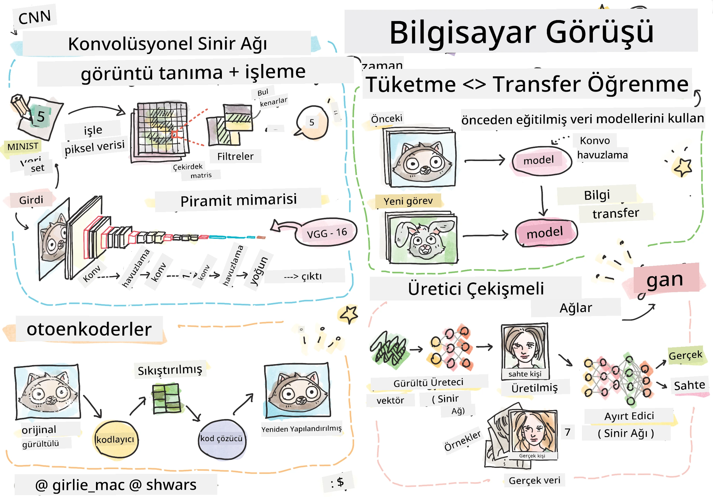

# Bilgisayarlı Görü

Bu bölümde şunları öğreneceğiz:

* [Bilgisayarlı Görüye ve OpenCV'ye Giriş](06-IntroCV/README.md)
* [Konvolüsyonel Sinir Ağları](07-ConvNets/README.md)
* [Önceden Eğitilmiş Ağlar ve Transfer Öğrenimi](08-TransferLearning/README.md) 
* [Otoenkoderler](09-Autoencoders/README.md)
* [Üretici Çekişmeli Ağlar](10-GANs/README.md)
* [Nesne Tespiti](11-ObjectDetection/README.md)
* [Semantik Bölütleme](12-Segmentation/README.md)

**Feragatname**:  
Bu belge, AI çeviri hizmeti [Co-op Translator](https://github.com/Azure/co-op-translator) kullanılarak çevrilmiştir. Doğruluk için çaba göstersek de, otomatik çevirilerin hata veya yanlışlık içerebileceğini lütfen unutmayın. Belgenin orijinal dili, yetkili kaynak olarak kabul edilmelidir. Kritik bilgiler için profesyonel insan çevirisi önerilir. Bu çevirinin kullanımından kaynaklanan yanlış anlamalar veya yanlış yorumlamalar için sorumluluk kabul etmiyoruz.