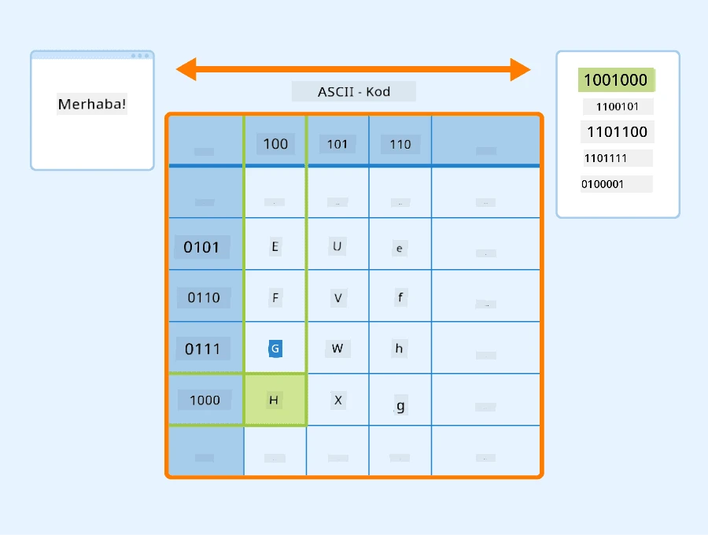
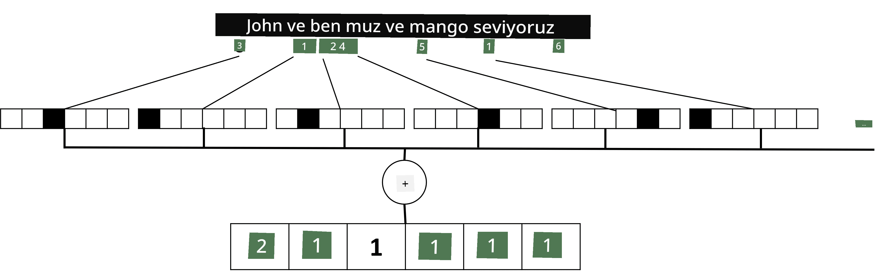

# Metni Tensörler Olarak Temsil Etmek

## [Ders Öncesi Testi](https://ff-quizzes.netlify.app/en/ai/quiz/25)

## Metin Sınıflandırma

Bu bölümün ilk kısmında **metin sınıflandırma** görevine odaklanacağız. [AG News](https://www.kaggle.com/amananandrai/ag-news-classification-dataset) veri setini kullanacağız. Bu veri seti, aşağıdaki gibi haber makalelerini içerir:

* Kategori: Bilim/Teknoloji
* Başlık: Ky. Şirketi Peptitleri Araştırmak İçin Hibe Kazandı (AP)
* Gövde: AP - Louisville Üniversitesi'nde bir kimya araştırmacısı tarafından kurulan bir şirket, geliştirme için hibe kazandı...

Amacımız, metne dayanarak haber öğesini kategorilerden birine sınıflandırmak olacak.

## Metni Temsil Etmek

Doğal Dil İşleme (NLP) görevlerini sinir ağlarıyla çözmek istiyorsak, metni tensörler olarak temsil etmenin bir yoluna ihtiyacımız var. Bilgisayarlar zaten metinsel karakterleri, ekranınızdaki yazı tiplerine eşleyen ASCII veya UTF-8 gibi kodlamalar kullanarak sayılarla temsil eder.

> [Görsel kaynağı](https://www.seobility.net/en/wiki/ASCII)

İnsanlar olarak, her harfin **neyi temsil ettiğini** ve tüm karakterlerin bir cümlenin kelimelerini oluşturmak için nasıl bir araya geldiğini anlıyoruz. Ancak, bilgisayarlar bu anlayışa sahip değildir ve sinir ağının anlamı eğitim sırasında öğrenmesi gerekir.

Bu nedenle, metni temsil ederken farklı yaklaşımlar kullanabiliriz:

* **Karakter düzeyinde temsil**, metni her karakteri bir sayı olarak ele alarak temsil ettiğimizde. Metin korpusumuzda *C* farklı karakter olduğunu varsayarsak, *Hello* kelimesi 5x*C* tensör olarak temsil edilir. Her harf, tek sıcak kodlama ile bir tensör sütununa karşılık gelir.
* **Kelime düzeyinde temsil**, tüm kelimelerin bir **kelime dağarcığı** oluşturduğumuz ve ardından kelimeleri tek sıcak kodlama ile temsil ettiğimiz yöntem. Bu yaklaşım bir şekilde daha iyidir, çünkü her harf tek başına çok fazla anlam ifade etmez ve bu nedenle daha yüksek düzeyde anlamsal kavramlar - kelimeler - kullanarak sinir ağı için görevi basitleştiririz. Ancak, büyük bir sözlük boyutuna sahip olduğumuzda, yüksek boyutlu seyrek tensörlerle başa çıkmamız gerekir.

Temsil yönteminden bağımsız olarak, önce metni bir **token** dizisine dönüştürmemiz gerekir. Bir token, bir karakter, bir kelime veya bazen bir kelimenin bir parçası olabilir. Daha sonra, token'ı genellikle **kelime dağarcığı** kullanarak bir sayıya dönüştürürüz ve bu sayı tek sıcak kodlama ile bir sinir ağına beslenebilir.

## N-Gramlar

Doğal dilde, kelimelerin kesin anlamı yalnızca bağlam içinde belirlenebilir. Örneğin, *sinir ağı* ve *balık ağı* ifadelerinin anlamları tamamen farklıdır. Bunu dikkate almanın yollarından biri, modelimizi kelime çiftleri üzerine inşa etmek ve kelime çiftlerini ayrı kelime dağarcığı tokenları olarak ele almaktır. Bu şekilde, *Balık tutmaya gitmeyi seviyorum* cümlesi şu token dizisiyle temsil edilir: *Balık tutmayı*, *tutmayı gitmeyi*, *gitmeyi seviyorum*. Bu yaklaşımın sorunu, sözlük boyutunun önemli ölçüde büyümesidir ve *gitmeyi seviyorum* ve *gitmeyi alışverişe* gibi kombinasyonlar, aynı fiile rağmen hiçbir anlamsal benzerlik paylaşmayan farklı tokenlarla temsil edilir.

Bazı durumlarda, üç kelimeden oluşan tri-gramlar kullanmayı düşünebiliriz. Bu nedenle, bu yaklaşım genellikle **n-gramlar** olarak adlandırılır. Ayrıca, karakter düzeyinde temsil ile n-gramlar kullanmak mantıklıdır, bu durumda n-gramlar kabaca farklı hecelere karşılık gelir.

## Kelime Torbası ve TF/IDF

Metin sınıflandırma gibi görevleri çözerken, metni sabit boyutlu bir vektörle temsil edebilmemiz gerekir. Bu vektörü, son yoğun sınıflandırıcıya giriş olarak kullanacağız. Bunu yapmanın en basit yollarından biri, tüm bireysel kelime temsillerini birleştirmek, örneğin onları toplayarak. Her kelimenin tek sıcak kodlamalarını toplarsak, metin içinde her kelimenin kaç kez göründüğünü gösteren bir frekans vektörü elde ederiz. Bu tür bir metin temsili **kelime torbası** (BoW) olarak adlandırılır.

> Görsel yazar tarafından oluşturulmuştur

Bir BoW, metinde hangi kelimelerin göründüğünü ve hangi miktarlarda olduğunu temsil eder, bu da metnin ne hakkında olduğunu anlamak için iyi bir gösterge olabilir. Örneğin, politika üzerine bir haber makalesi muhtemelen *başkan* ve *ülke* gibi kelimeler içerirken, bilimsel bir yayın *çarpıştırıcı*, *keşfedildi* gibi kelimeler içerebilir. Bu nedenle, kelime frekansları birçok durumda metin içeriğinin iyi bir göstergesi olabilir.

BoW'un sorunu, *ve*, *bu*, vb. gibi yaygın kelimelerin çoğu metinde görünmesi ve en yüksek frekanslara sahip olmasıdır. Bu durum, gerçekten önemli olan kelimeleri gölgede bırakır. Bu kelimelerin önemini azaltmak için, kelimelerin tüm belge koleksiyonunda ne sıklıkta göründüğünü dikkate alabiliriz. Bu, TF/IDF yaklaşımının arkasındaki ana fikirdir ve bu dersin ekli not defterlerinde daha ayrıntılı olarak ele alınmıştır.

Ancak, bu yaklaşımların hiçbiri metnin **anlamını** tam olarak dikkate alamaz. Bunu yapmak için daha güçlü sinir ağı modellerine ihtiyacımız var ve bu modelleri bu bölümde daha sonra tartışacağız.

## ✍️ Alıştırmalar: Metin Temsili

Aşağıdaki not defterlerinde öğrenmeye devam edin:

* [PyTorch ile Metin Temsili](TextRepresentationPyTorch.ipynb)
* [TensorFlow ile Metin Temsili](TextRepresentationTF.ipynb)

## Sonuç

Şimdiye kadar, farklı kelimelere frekans ağırlığı ekleyebilen teknikleri inceledik. Ancak, bu teknikler anlamı veya sıralamayı temsil edemez. Ünlü dilbilimci J. R. Firth'in 1935'te söylediği gibi, "Bir kelimenin tam anlamı her zaman bağlamsaldır ve bağlamdan bağımsız bir anlam çalışması ciddiye alınamaz." Bu kursta daha sonra, dil modelleme kullanarak metinden bağlamsal bilgiyi nasıl yakalayacağımızı öğreneceğiz.

## 🚀 Meydan Okuma

Kelime torbası ve farklı veri modelleri kullanarak başka alıştırmalar yapmayı deneyin. Bu [Kaggle yarışmasından](https://www.kaggle.com/competitions/word2vec-nlp-tutorial/overview/part-1-for-beginners-bag-of-words) ilham alabilirsiniz.

## [Ders Sonrası Testi](https://ff-quizzes.netlify.app/en/ai/quiz/26)

## Gözden Geçirme ve Kendi Kendine Çalışma

Microsoft Learn'de [text embeddings ve kelime torbası teknikleri](https://docs.microsoft.com/learn/modules/intro-natural-language-processing-pytorch/?WT.mc_id=academic-77998-cacaste) ile becerilerinizi geliştirin.

## [Ödev: Not Defterleri](assignment.md)

---

