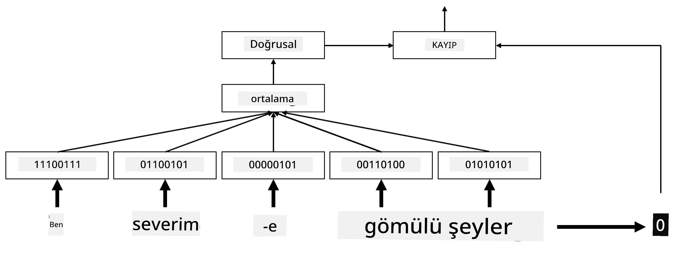
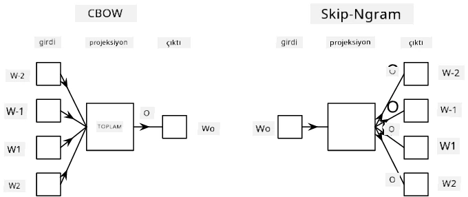

# Gömülü Temsiller

## [Ders Öncesi Test](https://ff-quizzes.netlify.app/en/ai/quiz/27)

BoW veya TF/IDF tabanlı sınıflandırıcılar eğitirken, `vocab_size` uzunluğunda yüksek boyutlu kelime torbası vektörleri üzerinde çalıştık ve düşük boyutlu konumsal temsil vektörlerinden seyrek tekil temsil vektörlerine açıkça dönüştürme yapıyorduk. Ancak, bu tekil temsil bellek açısından verimli değildir. Ayrıca, her kelime birbirinden bağımsız olarak ele alınır, yani tekil kodlanmış vektörler kelimeler arasındaki herhangi bir anlamsal benzerliği ifade etmez.

**Gömülü temsil** fikri, kelimeleri bir şekilde kelimenin anlamsal anlamını yansıtan daha düşük boyutlu yoğun vektörlerle temsil etmektir. Daha sonra anlamlı kelime gömülü temsillerinin nasıl oluşturulacağını tartışacağız, ancak şimdilik gömülü temsilleri bir kelime vektörünün boyutunu düşürmenin bir yolu olarak düşünelim.

Bu nedenle, gömülü temsil katmanı bir kelimeyi giriş olarak alır ve belirli bir `embedding_size` boyutunda bir çıktı vektörü üretir. Bir anlamda, bir `Linear` katmana çok benzer, ancak tekil kodlanmış bir vektör almak yerine, bir kelime numarasını giriş olarak alabilir, böylece büyük tekil kodlanmış vektörler oluşturmaktan kaçınabiliriz.

Sınıflandırıcı ağımızda ilk katman olarak bir gömülü temsil katmanı kullanarak, kelime torbasından **gömülü torba** modeline geçebiliriz. Bu modelde, önce metnimizdeki her kelimeyi ilgili gömülü temsile dönüştürürüz ve ardından bu gömülü temsillerin tümü üzerinde `sum`, `average` veya `max` gibi bir toplama fonksiyonu hesaplarız.

> Görsel yazar tarafından oluşturulmuştur

## ✍️ Alıştırmalar: Gömülü Temsiller

Aşağıdaki defterlerde öğrenmeye devam edin:
* [PyTorch ile Gömülü Temsiller](EmbeddingsPyTorch.ipynb)
* [TensorFlow ile Gömülü Temsiller](EmbeddingsTF.ipynb)

## Anlamsal Gömülü Temsiller: Word2Vec

Gömülü temsil katmanı kelimeleri vektör temsiline eşlemeyi öğrenmiş olsa da, bu temsil mutlaka çok fazla anlamsal anlam taşımıyor olabilir. Kelimelerin vektör temsillerini öyle bir şekilde öğrenmek güzel olurdu ki, benzer kelimeler veya eş anlamlılar, bazı vektör mesafelerine (örneğin Öklid mesafesi) göre birbirine yakın olan vektörlere karşılık gelsin.

Bunu yapmak için, gömülü temsil modelimizi büyük bir metin koleksiyonu üzerinde belirli bir şekilde önceden eğitmemiz gerekir. Anlamsal gömülü temsilleri eğitmenin bir yolu [Word2Vec](https://en.wikipedia.org/wiki/Word2vec) olarak adlandırılır. Bu yöntem, kelimelerin dağıtılmış temsillerini üretmek için kullanılan iki ana mimariye dayanır:

 - **Sürekli kelime torbası** (CBoW) — Bu mimaride, model çevresindeki bağlamdan bir kelimeyi tahmin etmek için eğitilir. $(W_{-2},W_{-1},W_0,W_1,W_2)$ ngrami verildiğinde, modelin amacı $(W_{-2},W_{-1},W_1,W_2)$'den $W_0$'ı tahmin etmektir.
 - **Sürekli atlama-gram** CBoW'un tersidir. Model, bağlam kelimelerinin çevresindeki pencereyi kullanarak mevcut kelimeyi tahmin eder.

CBoW daha hızlıdır, ancak atlama-gram daha yavaş olmasına rağmen nadir kelimeleri temsil etmede daha iyi bir iş çıkarır.

> Görsel [bu makaleden](https://arxiv.org/pdf/1301.3781.pdf) alınmıştır

Word2Vec önceden eğitilmiş gömülü temsiller (GloVe gibi diğer benzer modellerle birlikte) sinir ağlarında gömülü temsil katmanı yerine kullanılabilir. Ancak, kelime dağarcıklarıyla başa çıkmamız gerekir, çünkü Word2Vec/GloVe ile önceden eğitilmiş kelime dağarcığı, metin corpusumuzdaki kelime dağarcığından farklı olabilir. Yukarıdaki defterlere göz atarak bu sorunun nasıl çözülebileceğini görebilirsiniz.

## Bağlamsal Gömülü Temsiller

Word2Vec gibi geleneksel önceden eğitilmiş gömülü temsil modellerinin temel sınırlamalarından biri kelime anlamı ayrımının problemidir. Önceden eğitilmiş gömülü temsiller kelimelerin bağlamdaki anlamlarının bir kısmını yakalayabilse de, bir kelimenin her olası anlamı aynı gömülü temsile kodlanır. Bu, 'play' gibi birçok kelimenin kullanıldıkları bağlama bağlı olarak farklı anlamlara sahip olması nedeniyle aşağı akış modellerinde sorunlara yol açabilir.

Örneğin, 'play' kelimesi şu iki farklı cümlede oldukça farklı anlamlara sahiptir:

- Tiyatroda bir **oyun** izledim.
- John arkadaşlarıyla **oynamak** istiyor.

Yukarıdaki önceden eğitilmiş gömülü temsiller, 'play' kelimesinin her iki anlamını da aynı gömülü temsilde temsil eder. Bu sınırlamayı aşmak için, büyük bir metin corpusunda eğitilmiş ve kelimelerin farklı bağlamlarda nasıl bir araya gelebileceğini *bilen* bir **dil modeli** temelinde gömülü temsiller oluşturmamız gerekir. Bağlamsal gömülü temsilleri tartışmak bu dersin kapsamı dışında, ancak kursun ilerleyen bölümlerinde dil modellerini ele alırken bu konuya geri döneceğiz.

## Sonuç

Bu derste, kelimelerin anlamsal anlamlarını daha iyi yansıtmak için TensorFlow ve PyTorch'ta gömülü temsil katmanları oluşturmayı ve kullanmayı öğrendiniz.

## 🚀 Meydan Okuma

Word2Vec, şarkı sözleri ve şiir oluşturma gibi ilginç uygulamalarda kullanılmıştır. [Bu makaleye](https://www.politetype.com/blog/word2vec-color-poems) göz atarak yazarın Word2Vec'i şiir oluşturmak için nasıl kullandığını öğrenin. Ayrıca [Dan Shiffmann'ın bu videosunu](https://www.youtube.com/watch?v=LSS_bos_TPI&ab_channel=TheCodingTrain) izleyerek bu tekniğin farklı bir açıklamasını keşfedin. Ardından, bu teknikleri Kaggle'dan alınmış bir metin corpusunda kendi metinlerinize uygulamayı deneyin.

## [Ders Sonrası Test](https://ff-quizzes.netlify.app/en/ai/quiz/28)

## Gözden Geçirme ve Kendi Kendine Çalışma

Word2Vec ile ilgili bu makaleyi okuyun: [Efficient Estimation of Word Representations in Vector Space](https://arxiv.org/pdf/1301.3781.pdf)

## [Ödev: Defterler](assignment.md)

---

