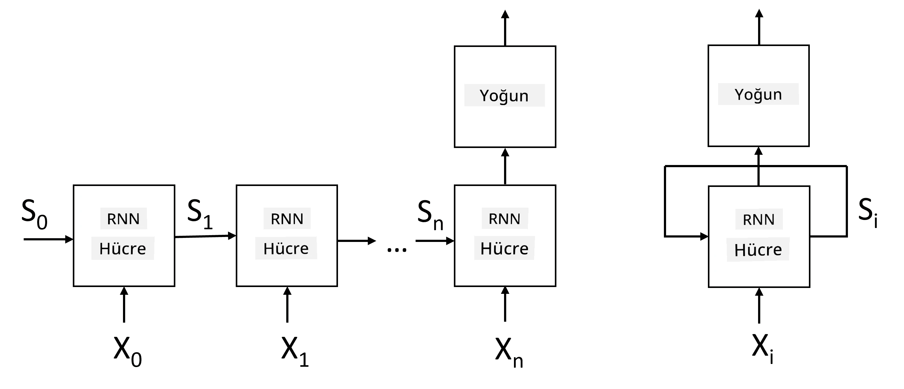
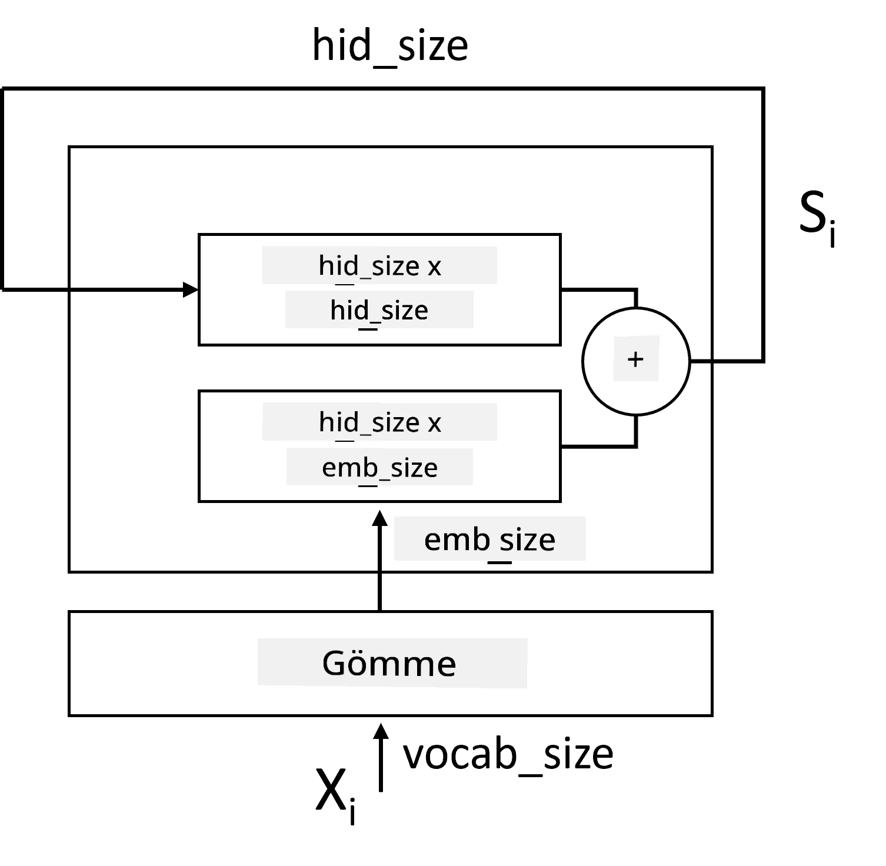
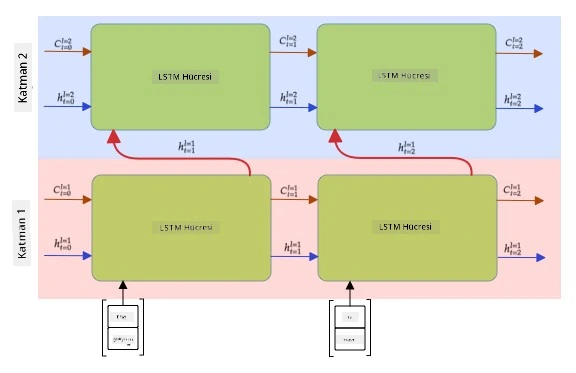

# Tekrarlayan Sinir Ağları

## [Ders Öncesi Quiz](https://ff-quizzes.netlify.app/en/ai/quiz/31)

Önceki bölümlerde, metnin zengin anlamsal temsillerini ve gömme katmanlarının üzerine basit bir doğrusal sınıflandırıcı kullandık. Bu mimarinin yaptığı şey, bir cümledeki kelimelerin toplu anlamını yakalamaktır, ancak gömme katmanlarının üzerindeki toplama işlemi, orijinal metindeki **kelime sırasını** dikkate almaz. Bu modeller kelime sırasını modelleyemediği için, metin üretimi veya soru yanıtlama gibi daha karmaşık veya belirsiz görevleri çözemezler.

Metin dizisinin anlamını yakalamak için, **tekrarlayan sinir ağı** veya RNN adı verilen başka bir sinir ağı mimarisi kullanmamız gerekir. RNN'de, cümlemizi ağdan bir sembol biriminde geçiririz ve ağ bir **durum** üretir, bu durumu bir sonraki sembolle birlikte tekrar ağa geçiririz.

> Görsel yazar tarafından oluşturulmuştur

X0,...,Xn giriş dizisi verildiğinde, RNN bir sinir ağı blokları dizisi oluşturur ve bu diziyi uçtan uca geri yayılım kullanarak eğitir. Her ağ bloğu bir çift (Xi,Si) alır ve sonuç olarak Si+1 üretir. Son durum Sn veya (çıktı Yn) sonucu üretmek için doğrusal bir sınıflandırıcıya gider. Tüm ağ blokları aynı ağırlıkları paylaşır ve tek bir geri yayılım geçişiyle uçtan uca eğitilir.

Durum vektörleri S0,...,Sn ağdan geçtiği için, ağ kelimeler arasındaki sıralı bağımlılıkları öğrenebilir. Örneğin, dizide *değil* kelimesi bir yerde geçtiğinde, durum vektöründeki belirli öğeleri olumsuzlamak için öğrenebilir, bu da olumsuzlama ile sonuçlanır.

> ✅ Yukarıdaki resimdeki tüm RNN bloklarının ağırlıkları paylaşıldığından, aynı resim bir geri besleme döngüsü olan tek bir blok (sağda) olarak temsil edilebilir; bu döngü, ağın çıktı durumunu tekrar girişe geçirir.

## Bir RNN Hücresinin Anatomisi

Basit bir RNN hücresinin nasıl organize edildiğini görelim. Önceki durum Si-1 ve mevcut sembol Xi'yi giriş olarak alır ve çıktı durumu Si'yi üretmek zorundadır (ve bazen, üretici ağlarda olduğu gibi, başka bir çıktı Yi ile de ilgileniriz).

Basit bir RNN hücresinin içinde iki ağırlık matrisi vardır: biri bir giriş sembolünü dönüştürür (buna W diyelim), diğeri ise bir giriş durumunu dönüştürür (H). Bu durumda ağın çıktısı &sigma;(W&times;Xi+H&times;Si-1+b) olarak hesaplanır, burada &sigma; aktivasyon fonksiyonu ve b ek bir bias'tır.

> Görsel yazar tarafından oluşturulmuştur

Çoğu durumda, giriş token'ları RNN'ye girmeden önce boyutları düşürmek için gömme katmanından geçirilir. Bu durumda, eğer giriş vektörlerinin boyutu *emb_size* ve durum vektörünün boyutu *hid_size* ise, W'nin boyutu *emb_size*&times;*hid_size*, H'nin boyutu ise *hid_size*&times;*hid_size* olur.

## Uzun Kısa Süreli Bellek (LSTM)

Klasik RNN'lerin ana sorunlarından biri, **kaybolan gradyanlar** problemidir. RNN'ler uçtan uca tek bir geri yayılım geçişiyle eğitildiğinden, hatayı ağın ilk katmanlarına iletmekte zorlanır ve bu nedenle ağ uzak token'lar arasındaki ilişkileri öğrenemez. Bu sorunu önlemenin yollarından biri, **kapılar** kullanarak **açık durum yönetimi** tanıtmaktır. Bu tür iki iyi bilinen mimari vardır: **Uzun Kısa Süreli Bellek** (LSTM) ve **Kapılı Röle Birimi** (GRU).

> Görsel kaynağı belirlenecek

LSTM Ağı, RNN'ye benzer bir şekilde organize edilmiştir, ancak katmandan katmana iki durum aktarılır: gerçek durum C ve gizli vektör H. Her birimde, gizli vektör Hi giriş Xi ile birleştirilir ve bunlar **kapılar** aracılığıyla durum C'de ne olacağını kontrol eder. Her kapı, sigmoid aktivasyonlu (çıktı aralığı [0,1]) bir sinir ağıdır ve durum vektörüyle çarpıldığında bit düzeyinde bir maske olarak düşünülebilir. Yukarıdaki resimde soldan sağa doğru şu kapılar vardır:

* **Unutma kapısı**, gizli bir vektör alır ve C vektörünün hangi bileşenlerini unutmamız gerektiğini ve hangilerini geçirmemiz gerektiğini belirler.
* **Giriş kapısı**, giriş ve gizli vektörlerden bazı bilgileri alır ve duruma ekler.
* **Çıkış kapısı**, durumu *tanh* aktivasyonlu bir doğrusal katman aracılığıyla dönüştürür, ardından yeni bir durum Ci+1 üretmek için gizli vektör Hi'yi kullanarak bazı bileşenlerini seçer.

Durum C'nin bileşenleri, açılıp kapatılabilen bayraklar olarak düşünülebilir. Örneğin, dizide *Alice* adını gördüğümüzde, bunun bir kadın karaktere atıfta bulunduğunu varsayabilir ve cümlede bir kadın isim olduğunu belirten bayrağı kaldırabiliriz. Daha sonra *ve Tom* ifadelerini gördüğümüzde, çoğul bir isim olduğunu belirten bayrağı kaldırabiliriz. Böylece, durumu manipüle ederek cümle parçalarının dilbilgisel özelliklerini takip edebiliriz.

> ✅ LSTM'nin iç işleyişini anlamak için mükemmel bir kaynak, Christopher Olah'ın [Understanding LSTM Networks](https://colah.github.io/posts/2015-08-Understanding-LSTMs/) adlı harika makalesidir.

## Çift Yönlü ve Çok Katmanlı RNN'ler

Şimdiye kadar, bir dizinin başından sonuna doğru tek yönlü çalışan tekrarlayan ağları tartıştık. Bu doğal görünüyor, çünkü okuma ve konuşmayı dinleme şeklimize benziyor. Ancak, birçok pratik durumda giriş dizisine rastgele erişimimiz olduğundan, tekrarlayan hesaplamayı her iki yönde çalıştırmak mantıklı olabilir. Bu tür ağlara **çift yönlü** RNN'ler denir. Çift yönlü bir ağla çalışırken, her yön için birer gizli durum vektörüne ihtiyacımız olacaktır.

Tek yönlü veya çift yönlü bir tekrarlayan ağ, bir dizideki belirli kalıpları yakalar ve bunları bir durum vektörüne depolayabilir veya çıktıya aktarabilir. Konvolüsyonel ağlarda olduğu gibi, ilk katman tarafından çıkarılan düşük seviyeli kalıplardan daha yüksek seviyeli kalıpları yakalamak ve inşa etmek için ilk katmanın üzerine başka bir tekrarlayan katman inşa edebiliriz. Bu bizi, önceki katmanın çıktısının bir sonraki katmana giriş olarak geçtiği iki veya daha fazla tekrarlayan ağdan oluşan bir **çok katmanlı RNN** kavramına götürür.

*[Bu harika yazıdan](https://towardsdatascience.com/from-a-lstm-cell-to-a-multilayer-lstm-network-with-pytorch-2899eb5696f3) Fernando López tarafından alınmıştır.*

## ✍️ Alıştırmalar: Gömme Katmanları

Aşağıdaki not defterlerinde öğrenmeye devam edin:

* [PyTorch ile RNN'ler](RNNPyTorch.ipynb)
* [TensorFlow ile RNN'ler](RNNTF.ipynb)

## Sonuç

Bu birimde, RNN'lerin dizi sınıflandırması için kullanılabileceğini gördük, ancak aslında metin üretimi, makine çevirisi ve daha fazlası gibi birçok görevi de yerine getirebilirler. Bu görevleri bir sonraki birimde ele alacağız.

## 🚀 Meydan Okuma

LSTM'ler hakkında bazı literatürleri okuyun ve uygulamalarını düşünün:

- [Grid Long Short-Term Memory](https://arxiv.org/pdf/1507.01526v1.pdf)
- [Show, Attend and Tell: Neural Image Caption
Generation with Visual Attention](https://arxiv.org/pdf/1502.03044v2.pdf)

## [Ders Sonrası Quiz](https://ff-quizzes.netlify.app/en/ai/quiz/32)

## Gözden Geçirme ve Kendi Kendine Çalışma

- Christopher Olah'ın [Understanding LSTM Networks](https://colah.github.io/posts/2015-08-Understanding-LSTMs/) adlı makalesi.

## [Ödev: Not Defterleri](assignment.md)

---

