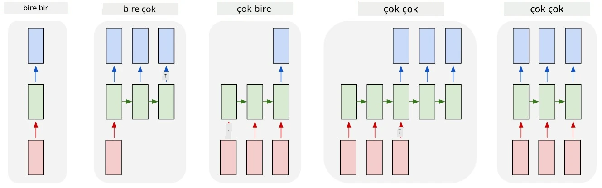
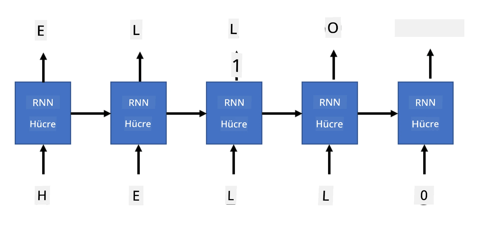

# Üretici Ağlar

## [Ders Öncesi Test](https://ff-quizzes.netlify.app/en/ai/quiz/33)

Tekrarlayan Sinir Ağları (RNN'ler) ve Uzun Kısa Süreli Bellek Hücreleri (LSTM'ler) ile Gated Recurrent Units (GRU'lar) gibi kapılı hücre varyantları, dil modelleme için bir mekanizma sağlar. Bu ağlar, kelime sıralamasını öğrenebilir ve bir dizideki bir sonraki kelime için tahminlerde bulunabilir. Bu, RNN'lerin **üretici görevler** için kullanılmasına olanak tanır; örneğin, sıradan metin üretimi, makine çevirisi ve hatta görüntü açıklaması.

> ✅ Yazarken metin tamamlama gibi üretici görevlerden faydalandığınız tüm zamanları düşünün. Sevdiğiniz uygulamaların RNN'leri kullanıp kullanmadığını araştırın.

Önceki birimde tartıştığımız RNN mimarisinde, her RNN birimi bir sonraki gizli durumu çıktı olarak üretir. Ancak, her tekrarlayan birime başka bir çıktı ekleyebiliriz, bu da bir **dizi** (orijinal dizinin uzunluğuna eşit) çıkarmamıza olanak tanır. Ayrıca, her adımda bir giriş kabul etmeyen ve sadece bir başlangıç durum vektörü alıp ardından bir çıktı dizisi üreten RNN birimleri kullanabiliriz.

Bu, aşağıdaki resimde gösterilen farklı sinir ağı mimarilerini mümkün kılar:



> Resim, [Andrej Karpaty](http://karpathy.github.io/) tarafından yazılan [Unreasonable Effectiveness of Recurrent Neural Networks](http://karpathy.github.io/2015/05/21/rnn-effectiveness/) blog yazısından alınmıştır.

* **Bire bir**: Bir giriş ve bir çıkışa sahip geleneksel bir sinir ağıdır.
* **Bire çok**: Bir giriş değeri kabul eden ve bir çıktı değerleri dizisi üreten üretici bir mimaridir. Örneğin, bir **görüntü açıklama** ağı eğitmek istiyorsak, bir resmi giriş olarak alabilir, bir CNN'den geçirerek gizli durumunu elde edebilir ve ardından bir tekrarlayan zincirle açıklamayı kelime kelime üretebiliriz.
* **Çoktan bire**: Önceki birimde tanımladığımız, metin sınıflandırma gibi RNN mimarilerine karşılık gelir.
* **Çoktan çoğa** veya **diziden diziye**: **Makine çevirisi** gibi görevlere karşılık gelir. İlk RNN, giriş dizisinden tüm bilgiyi gizli duruma toplar ve başka bir RNN zinciri bu durumu çıktı dizisine açar.

Bu birimde, metin üretmemize yardımcı olan basit üretici modeller üzerine odaklanacağız. Basitlik için karakter düzeyinde tokenizasyon kullanacağız.

Bu RNN'yi adım adım metin üretmek için eğiteceğiz. Her adımda, `nchars` uzunluğunda bir karakter dizisi alacağız ve ağdan her giriş karakteri için bir sonraki çıktı karakterini üretmesini isteyeceğiz:



Metin üretirken (çıkarsama sırasında), bazı **başlangıç** verileriyle başlarız. Bu veri RNN hücrelerinden geçirilerek ara durumu oluşturur ve ardından üretim başlar. Her seferinde bir karakter üretiriz ve durumu ve üretilen karakteri bir sonraki karakteri üretmek için başka bir RNN hücresine geçiririz. Bu işlem yeterli sayıda karakter üretilene kadar devam eder.


> Resim, yazar tarafından oluşturulmuştur.

## ✍️ Alıştırmalar: Üretici Ağlar

Aşağıdaki not defterlerinde öğrenmeye devam edin:

* [PyTorch ile Üretici Ağlar](GenerativePyTorch.ipynb)
* [TensorFlow ile Üretici Ağlar](GenerativeTF.ipynb)

## Yumuşak Metin Üretimi ve Sıcaklık

Her RNN hücresinin çıktısı bir karakter olasılık dağılımıdır. Eğer her zaman en yüksek olasılığa sahip karakteri bir sonraki karakter olarak seçersek, metin genellikle aynı karakter dizileri arasında "dönmeye" başlayabilir. Örneğin:

```
today of the second the company and a second the company ...
```

Ancak, bir sonraki karakter için olasılık dağılımına bakarsak, en yüksek olasılıklar arasındaki farkın büyük olmayabileceğini görebiliriz. Örneğin, bir karakterin olasılığı 0.2, diğerinin ise 0.19 olabilir. Örneğin, '*play*' dizisindeki bir sonraki karakter, eşit derecede boşluk veya **e** (örneğin *player* kelimesinde olduğu gibi) olabilir.

Bu, her zaman en yüksek olasılığa sahip karakteri seçmenin "adil" olmayabileceği sonucuna götürür. İkinci en yüksek olasılığı seçmek de anlamlı bir metne yol açabilir. Daha akıllıca bir yaklaşım, ağın çıktısının verdiği olasılık dağılımından karakterleri **örneklemek** olacaktır. Ayrıca, daha fazla rastgelelik eklemek veya en yüksek olasılıklı karakterlere daha fazla bağlı kalmak istediğimizde olasılık dağılımını düzleştirecek veya dikleştirecek bir **sıcaklık** parametresi kullanabiliriz.

Bu yumuşak metin üretiminin nasıl uygulandığını yukarıdaki not defterlerinde keşfedin.

## Sonuç

Metin üretimi kendi başına faydalı olabilirken, asıl avantajlar RNN'ler kullanılarak bir başlangıç özellik vektöründen metin üretme yeteneğinden gelir. Örneğin, metin üretimi makine çevirisinin bir parçası olarak kullanılır (diziden diziye, bu durumda *encoder*'dan gelen durum vektörü çevrilen mesajı üretmek veya *decode* etmek için kullanılır) veya bir görüntünün metinsel açıklamasını üretmek için kullanılır (bu durumda özellik vektörü CNN çıkarıcıdan gelir).

## 🚀 Meydan Okuma

Bu konuyla ilgili Microsoft Learn'de bazı dersler alın:

* [PyTorch](https://docs.microsoft.com/learn/modules/intro-natural-language-processing-pytorch/6-generative-networks/?WT.mc_id=academic-77998-cacaste)/[TensorFlow](https://docs.microsoft.com/learn/modules/intro-natural-language-processing-tensorflow/5-generative-networks/?WT.mc_id=academic-77998-cacaste) ile Metin Üretimi

## [Ders Sonrası Test](https://ff-quizzes.netlify.app/en/ai/quiz/34)

## İnceleme ve Kendi Kendine Çalışma

Bilginizi genişletmek için bazı makaleler:

* Markov Zinciri, LSTM ve GPT-2 ile metin üretimine farklı yaklaşımlar: [blog yazısı](https://towardsdatascience.com/text-generation-gpt-2-lstm-markov-chain-9ea371820e1e)
* [Keras dokümantasyonunda](https://keras.io/examples/generative/lstm_character_level_text_generation/) metin üretim örneği

## [Ödev](lab/README.md)

Metni karakter karakter nasıl üreteceğimizi gördük. Laboratuvarda, kelime düzeyinde metin üretimini keşfedeceksiniz.

---

