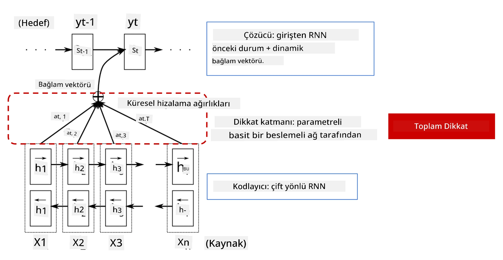
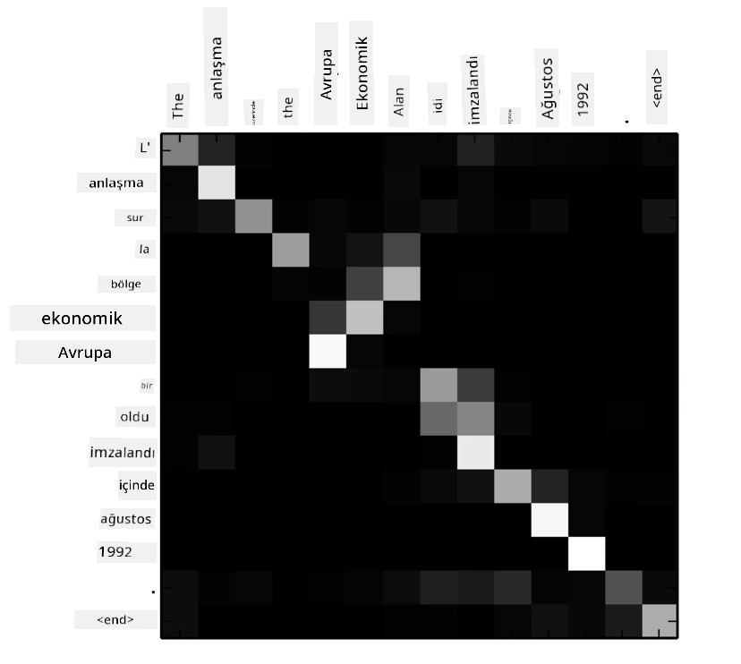
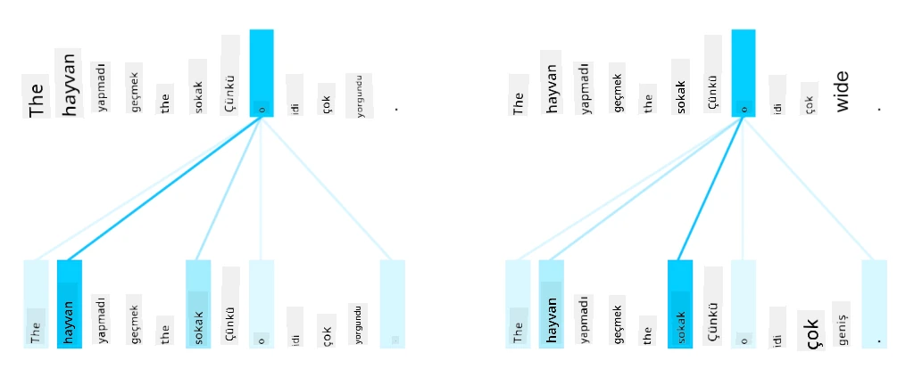
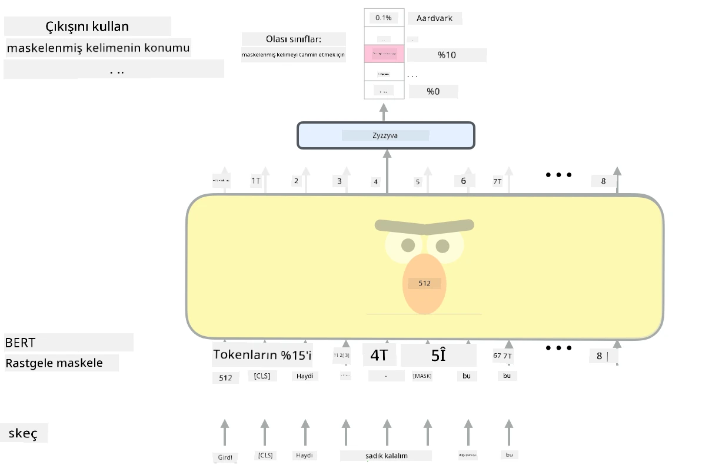

# Dikkat Mekanizmaları ve Transformerlar

## [Ders Öncesi Test](https://ff-quizzes.netlify.app/en/ai/quiz/35)

NLP alanındaki en önemli problemlerden biri **makine çevirisi**dir; bu, Google Translate gibi araçların temelini oluşturan önemli bir görevdir. Bu bölümde, makine çevirisine, daha genel olarak ise herhangi bir *diziden-diziye* (sequence-to-sequence) göreve odaklanacağız (bu aynı zamanda **cümle dönüşümü** olarak da adlandırılır).

RNN'lerle diziden-diziye yaklaşımı, iki tekrarlayan ağ tarafından uygulanır. Bu ağlardan biri olan **encoder**, bir giriş dizisini gizli bir duruma sıkıştırırken, diğer ağ olan **decoder**, bu gizli durumu çözerek çevrilmiş bir sonuç üretir. Ancak bu yaklaşımda birkaç sorun vardır:

* Encoder ağının son durumu, bir cümlenin başlangıcını hatırlamakta zorlanır, bu da uzun cümleler için modelin kalitesinin düşmesine neden olur.
* Bir dizideki tüm kelimeler sonuca aynı etkiyi yapar. Ancak gerçekte, giriş dizisindeki belirli kelimeler genellikle ardışık çıktılar üzerinde diğerlerinden daha fazla etkiye sahiptir.

**Dikkat Mekanizmaları**, RNN'nin her bir çıktı tahmininde her bir giriş vektörünün bağlamsal etkisini ağırlıklandırmanın bir yolunu sağlar. Bu, giriş RNN'nin ara durumları ile çıkış RNN arasında kısayollar oluşturarak uygulanır. Bu şekilde, çıktı sembolü yt'yi oluştururken, farklı ağırlık katsayıları &alpha;t,i ile tüm giriş gizli durumlarını hi dikkate alırız.

> [Bahdanau ve diğerleri, 2015](https://arxiv.org/pdf/1409.0473.pdf) tarafından önerilen eklemeli dikkat mekanizması ile encoder-decoder modeli, [bu blog yazısından](https://lilianweng.github.io/lil-log/2018/06/24/attention-attention.html) alıntılanmıştır.

Dikkat matrisi {&alpha;i,j} belirli giriş kelimelerinin çıktı dizisindeki bir kelimenin oluşturulmasında oynadığı rolü temsil eder. Aşağıda böyle bir matrisin örneği verilmiştir:

> [Bahdanau ve diğerleri, 2015](https://arxiv.org/pdf/1409.0473.pdf) (Şekil 3) tarafından önerilen şekil.

Dikkat mekanizmaları, NLP'deki mevcut veya yakın zamanda mevcut olan en iyi performansın büyük bir kısmından sorumludur. Ancak dikkat eklemek, model parametrelerinin sayısını büyük ölçüde artırır ve bu da RNN'lerde ölçekleme sorunlarına yol açar. RNN'lerin ölçeklenmesindeki temel bir kısıtlama, modellerin tekrarlayan doğasının eğitim sırasında toplu işlem ve paralelleştirmeyi zorlaştırmasıdır. Bir RNN'de bir dizinin her bir öğesi sıralı olarak işlenmelidir, bu da kolayca paralelleştirilemeyeceği anlamına gelir.

> [Google'ın Blogundan](https://research.googleblog.com/2016/09/a-neural-network-for-machine.html) alınan şekil.

Dikkat mekanizmalarının benimsenmesi ve bu kısıtlama, bugün bildiğimiz ve kullandığımız BERT'ten Open-GPT3'e kadar olan en iyi performanslı Transformer Modellerinin oluşturulmasına yol açtı.

## Transformer Modelleri

Transformerların arkasındaki temel fikirlerden biri, RNN'lerin sıralı doğasından kaçınmak ve eğitim sırasında paralelleştirilebilir bir model oluşturmaktır. Bu, iki fikirle gerçekleştirilir:

* pozisyonel kodlama
* RNN'ler (veya CNN'ler) yerine desenleri yakalamak için kendine dikkat mekanizmasının kullanılması (bu nedenle transformerları tanıtan makale *[Attention is all you need](https://arxiv.org/abs/1706.03762)* olarak adlandırılmıştır)

### Pozisyonel Kodlama/Gömme

Pozisyonel kodlama fikri şu şekildedir:
1. RNN'ler kullanıldığında, tokenların göreceli pozisyonu adım sayısı ile temsil edilir ve bu nedenle açıkça temsil edilmesine gerek yoktur.
2. Ancak dikkat mekanizmasına geçtiğimizde, bir dizideki tokenların göreceli pozisyonlarını bilmemiz gerekir.
3. Pozisyonel kodlama elde etmek için, token dizimizi dizideki token pozisyonlarının bir dizisiyle (örneğin, 0,1, ...) genişletiriz.
4. Daha sonra token pozisyonunu bir token gömme vektörüyle karıştırırız. Pozisyonu (tam sayı) bir vektöre dönüştürmek için farklı yaklaşımlar kullanabiliriz:

* Token gömmeye benzer şekilde eğitilebilir gömme. Burada bu yaklaşımı ele alıyoruz. Hem tokenlar hem de pozisyonları üzerinde gömme katmanları uygularız, aynı boyutlarda gömme vektörleri elde ederiz ve bunları toplarız.
* Orijinal makalede önerildiği gibi sabit pozisyon kodlama fonksiyonu.

> Görsel yazar tarafından oluşturulmuştur.

Pozisyonel gömme ile elde ettiğimiz sonuç, hem orijinal tokenı hem de dizideki pozisyonunu gömer.

### Çoklu Başlı Kendine Dikkat

Sonraki adımda, dizimizdeki bazı desenleri yakalamamız gerekir. Bunu yapmak için transformerlar **kendine dikkat** mekanizmasını kullanır; bu, giriş ve çıkış olarak aynı diziye uygulanan dikkattir. Kendine dikkat uygulamak, cümle içindeki **bağlamı** dikkate almamızı ve hangi kelimelerin birbirleriyle ilişkili olduğunu görmemizi sağlar. Örneğin, *it* gibi zamirlerin hangi kelimelere atıfta bulunduğunu görmemizi ve bağlamı dikkate almamızı sağlar:

> [Google Blogundan](https://research.googleblog.com/2017/08/transformer-novel-neural-network.html) alınan görsel.

Transformerlarda, ağın uzun vadeli ve kısa vadeli kelime ilişkileri, zamir referansları gibi farklı bağımlılık türlerini yakalama gücünü vermek için **Çoklu Başlı Dikkat** kullanırız.

[TensorFlow Notebook](TransformersTF.ipynb) transformer katmanlarının uygulanması hakkında daha fazla ayrıntı içerir.

### Encoder-Decoder Dikkati

Transformerlarda dikkat iki yerde kullanılır:

* Giriş metni içindeki desenleri kendine dikkat ile yakalamak için
* Dizi çevirisi yapmak için - bu, encoder ve decoder arasındaki dikkat katmanıdır.

Encoder-decoder dikkati, bu bölümün başında RNN'lerde kullanılan dikkat mekanizmasına çok benzerdir. Bu animasyonlu diyagram, encoder-decoder dikkatinin rolünü açıklar.

Her giriş pozisyonu bağımsız olarak her çıkış pozisyonuna eşlendiğinden, transformerlar RNN'lere göre daha iyi paralelleştirilebilir, bu da çok daha büyük ve daha ifade gücü yüksek dil modellerini mümkün kılar. Her dikkat başlığı, kelimeler arasındaki farklı ilişkileri öğrenmek için kullanılabilir ve bu da doğal dil işleme görevlerini iyileştirir.

## BERT

**BERT** (Bidirectional Encoder Representations from Transformers), *BERT-base* için 12 katman ve *BERT-large* için 24 katman içeren çok büyük bir çok katmanlı transformer ağıdır. Model, büyük bir metin veri kümesi (WikiPedia + kitaplar) üzerinde denetimsiz eğitim (bir cümledeki maskelenmiş kelimeleri tahmin etme) kullanılarak önceden eğitilir. Ön eğitim sırasında model, dil anlayışının önemli seviyelerini emer ve bu daha sonra diğer veri kümeleriyle ince ayar yapılarak kullanılabilir. Bu sürece **transfer öğrenme** denir.

> Görsel [kaynağı](http://jalammar.github.io/illustrated-bert/)

## ✍️ Egzersizler: Transformerlar

Aşağıdaki notebooklarda öğreniminize devam edin:

* [PyTorch ile Transformerlar](TransformersPyTorch.ipynb)
* [TensorFlow ile Transformerlar](TransformersTF.ipynb)

## Sonuç

Bu derste, NLP araç kutusundaki temel araçlar olan Transformerlar ve Dikkat Mekanizmaları hakkında bilgi edindiniz. BERT, DistilBERT, BigBird, OpenGPT3 ve daha fazlası gibi birçok Transformer mimarisi varyasyonu vardır ve bunlar ince ayar yapılabilir. [HuggingFace paketi](https://github.com/huggingface/) hem PyTorch hem de TensorFlow ile bu mimarilerin çoğunu eğitmek için bir depo sağlar.

## 🚀 Meydan Okuma

## [Ders Sonrası Test](https://ff-quizzes.netlify.app/en/ai/quiz/36)

## Gözden Geçirme ve Kendi Kendine Çalışma

* Transformerları açıklayan klasik [Attention is all you need](https://arxiv.org/abs/1706.03762) makalesini açıklayan [blog yazısı](https://mchromiak.github.io/articles/2017/Sep/12/Transformer-Attention-is-all-you-need/).
* Transformerları detaylı bir şekilde açıklayan [bir dizi blog yazısı](https://towardsdatascience.com/transformers-explained-visually-part-1-overview-of-functionality-95a6dd460452).

## [Ödev](assignment.md)

---

