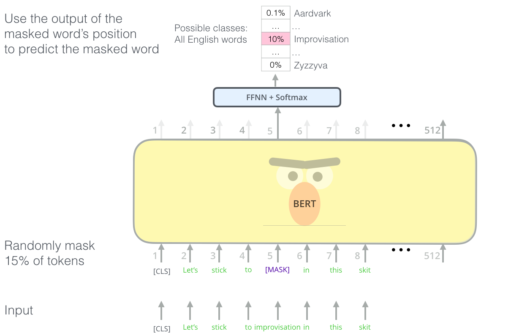

# Dikkat Mekanizmaları ve Transformerlar

## [Ders öncesi quiz](https://red-field-0a6ddfd03.1.azurestaticapps.net/quiz/118)

NLP alanındaki en önemli problemlerden biri **makine çevirisi**dir; bu, Google Translate gibi araçların temelini oluşturan önemli bir görevdir. Bu bölümde, makine çevirisine, daha genel olarak ise herhangi bir *dizi-dizi* görevine (bu göreve **cümle dönüştürme** de denir) odaklanacağız.

RNN'lerle, dizi-dizi işlemi, bir giriş dizisini gizli bir duruma dönüştüren **kodlayıcı** adındaki bir ağ ile bu gizli durumu çevrilmiş bir sonuca açan **çözücü** adındaki başka bir ağdan oluşan iki tekrarlayan ağ ile gerçekleştirilir. Bu yaklaşımda birkaç problem bulunmaktadır:

* Kodlayıcı ağın son durumu, bir cümlenin başını hatırlamakta zorlanır, bu da uzun cümleler için modelin kalitesini düşürür.
* Bir dizideki tüm kelimelerin sonuca olan etkisi aynıdır. Ancak gerçekte, giriş dizisindeki belirli kelimeler, sıralı çıktılar üzerinde diğerlerinden daha fazla etkiye sahiptir.

**Dikkat Mekanizmaları**, RNN'nin her bir çıktı tahmini üzerindeki her giriş vektörünün bağlamsal etkisini ağırlıklandırmanın bir yolunu sunar. Bu, giriş RNN'sinin ara durumları ile çıktı RNN'si arasında kısayollar oluşturarak uygulanır. Bu şekilde, çıktı sembolü yt üretilirken, farklı ağırlık katsayıları αt,i ile tüm giriş gizli durumları hi dikkate alınacaktır.

> Eklemeli dikkat mekanizmasına sahip kodlayıcı-çözücü modeli [Bahdanau ve diğerleri, 2015](https://arxiv.org/pdf/1409.0473.pdf) tarafından, [bu blog yazısından](https://lilianweng.github.io/lil-log/2018/06/24/attention-attention.html) alıntıdır.

Dikkat matris {αi,j} belirli giriş kelimelerinin bir çıktı dizisindeki belirli bir kelimenin üretilmesindeki rolünü temsil eder. Aşağıda böyle bir matrisin örneği verilmiştir:

> [Bahdanau ve diğerleri, 2015](https://arxiv.org/pdf/1409.0473.pdf) (Şekil 3)

Dikkat mekanizmaları, günümüz veya yakın dönemdeki NLP'deki en son teknolojinin büyük bir kısmından sorumludur. Ancak dikkatin eklenmesi, model parametrelerinin sayısını büyük ölçüde artırır ve bu da RNN'lerde ölçeklenebilirlik sorunlarına yol açar. RNN'lerin ölçeklenebilirliğinde temel bir kısıtlama, modellerin tekrarlayan doğasının, eğitimi toplu ve paralel hale getirmeyi zorlaştırmasıdır. Bir RNN'de bir dizinin her bir öğesi, ardışık sırayla işlenmelidir; bu da kolayca paralel hale getirilemeyeceği anlamına gelir.

> [Google Blogu](https://research.googleblog.com/2016/09/a-neural-network-for-machine.html) kaynaklı şekil

Dikkat mekanizmalarının benimsenmesi ve bu kısıtlamanın birleşimi, günümüzde bildiğimiz ve kullandığımız, BERT'ten Open-GPT3'e kadar uzanan en son teknoloji Transformer Modellerinin yaratılmasına yol açtı.

## Transformer Modelleri

Transformerların arkasındaki ana fikirlerden biri, RNN'lerin ardışık doğasından kaçınmak ve eğitimi sırasında paralel hale getirilebilen bir model oluşturmaktır. Bu, iki fikrin uygulanmasıyla gerçekleştirilir:

* konumsal kodlama
* RNN'ler (veya CNN'ler) yerine desenleri yakalamak için kendine dikkat mekanizmasını kullanmak (bu nedenle transformerları tanıtan makalenin adı *[Dikkat, ihtiyacınız olan her şey](https://arxiv.org/abs/1706.03762)*dir)

### Konumsal Kodlama/Gömme

Konumsal kodlamanın temel fikri şudur:
1. RNN'ler kullanırken, tokenların göreceli konumu adım sayısı ile temsil edilir ve bu nedenle açıkça temsil edilmesine gerek yoktur.
2. Ancak, dikkate geçtiğimizde, bir dizideki tokenların göreceli konumlarını bilmemiz gerekir.
3. Konumsal kodlama almak için, token dizimizi dizideki token konumları dizisi ile artırırız (yani, 0,1, ... sayılar dizisi).
4. Daha sonra token konumunu bir token gömme vektörü ile karıştırırız. Konumu (tam sayı) bir vektöre dönüştürmek için farklı yaklaşımlar kullanabiliriz:

* Token gömme ile benzer şekilde eğitilebilir gömme. Burada dikkate aldığımız yaklaşım budur. Hem tokenlar hem de konumları üzerinde gömme katmanları uygularız ve sonuçta aynı boyutlarda gömme vektörleri elde ederiz, bunları toplarız.
* Orijinal makalede önerilen sabit konum kodlama fonksiyonu.

> Yazarın resmi

Konumsal gömme ile elde ettiğimiz sonuç, hem orijinal tokenı hem de dizideki konumunu gömer.

### Çoklu Başlık Kendine Dikkat

Sonraki adım, dizimizdeki bazı desenleri yakalamaktır. Bunu yapmak için, transformerlar **kendine dikkat** mekanizmasını kullanır; bu, esasen aynı diziyi girdi ve çıktı olarak uygulanan dikkattir. Kendine dikkati uygulamak, cümle içindeki **bağlamı** dikkate almamızı sağlar ve hangi kelimelerin birbiriyle ilişkili olduğunu görmemize olanak tanır. Örneğin, hangi kelimelerin *o* gibi referanslarla ifade edildiğini görmemizi sağlar ve ayrıca bağlamı dikkate alır:

> Resim [Google Blogu](https://research.googleblog.com/2017/08/transformer-novel-neural-network.html) kaynaklı

Transformerlarda, ağın farklı bağımlılık türlerini yakalama gücünü artırmak için **Çoklu Başlık Dikkati** kullanılır; örneğin, uzun vadeli ve kısa vadeli kelime ilişkileri, karşılıklı referanslar vs.

[TensorFlow Not Defteri](../../../../../lessons/5-NLP/18-Transformers/TransformersTF.ipynb) transformer katmanlarının uygulanması hakkında daha fazla detay içerir.

### Kodlayıcı-Çözücü Dikkati

Transformerlarda, dikkat iki yerde kullanılır:

* Kendine dikkat kullanarak giriş metnindeki desenleri yakalamak için
* Dizi çevirisi gerçekleştirmek için - bu, kodlayıcı ve çözücü arasındaki dikkat katmanıdır.

Kodlayıcı-çözücü dikkati, bu bölümün başında açıklandığı gibi RNN'lerde kullanılan dikkat mekanizmasına çok benzer. Bu animasyonlu diyagram, kodlayıcı-çözücü dikkatin rolünü açıklar.

Her bir giriş konumu bağımsız olarak her bir çıkış konumuna eşlendiğinden, transformerlar RNN'lerden daha iyi paralelleşebilir; bu da çok daha büyük ve daha etkili dil modellerinin oluşmasını sağlar. Her bir dikkat başlığı, kelimeler arasındaki farklı ilişkileri öğrenmek için kullanılabilir ve bu da doğal dil işleme görevlerini geliştirir.

## BERT

**BERT** (Transformerlardan İkili Kodlayıcı Temsilleri), *BERT-base* için 12 katman ve *BERT-large* için 24 katman içeren çok büyük bir çok katmanlı transformer ağıdır. Model, öncelikle geniş bir metin veri kümesi (WikiPedia + kitaplar) üzerinde denetimsiz eğitim (bir cümlede maskelenmiş kelimeleri tahmin etme) kullanılarak önceden eğitilir. Ön eğitim sırasında model, daha sonra ince ayar ile diğer veri kümeleri ile kullanılabilecek önemli düzeyde dil anlayışı kazanır. Bu süreç **aktarım öğrenimi** olarak adlandırılır.

> Resim [kaynak](http://jalammar.github.io/illustrated-bert/)

## ✍️ Alıştırmalar: Transformerlar

Aşağıdaki not defterlerinde öğreniminize devam edin:

* [PyTorch'da Transformerlar](../../../../../lessons/5-NLP/18-Transformers/TransformersPyTorch.ipynb)
* [TensorFlow'da Transformerlar](../../../../../lessons/5-NLP/18-Transformers/TransformersTF.ipynb)

## Sonuç

Bu derste, NLP araç kutusundaki tüm temel araçlar olan Transformerlar ve Dikkat Mekanizmaları hakkında bilgi edindiniz. BERT, DistilBERT, BigBird, OpenGPT3 ve daha fazlası dahil olmak üzere birçok Transformer mimarisi varyasyonu bulunmaktadır ve bunlar ince ayar yapılabilir. [HuggingFace paketi](https://github.com/huggingface/) bu mimarilerin çoğunu hem PyTorch hem de TensorFlow ile eğitmek için bir depo sağlar.

## 🚀 Zorluk

## [Ders sonrası quiz](https://red-field-0a6ddfd03.1.azurestaticapps.net/quiz/218)

## Gözden Geçirme & Kendi Kendine Çalışma

* [Blog yazısı](https://mchromiak.github.io/articles/2017/Sep/12/Transformer-Attention-is-all-you-need/), klasik [Dikkat, ihtiyacınız olan her şey](https://arxiv.org/abs/1706.03762) makalesini açıklamaktadır.
* Transformerlar hakkında detaylı mimariyi açıklayan [bir dizi blog yazısı](https://towardsdatascience.com/transformers-explained-visually-part-1-overview-of-functionality-95a6dd460452).

## [Görev](assignment.md)

**Açıklama**:  
Bu belge, makine tabanlı AI çeviri hizmetleri kullanılarak çevrilmiştir. Doğruluk için çaba göstersek de, otomatik çevirilerin hatalar veya yanlış anlamalar içerebileceğini lütfen unutmayın. Orijinal belge, kendi dilinde yetkili kaynak olarak kabul edilmelidir. Kritik bilgiler için profesyonel insan çevirisi önerilmektedir. Bu çevirinin kullanımından kaynaklanan yanlış anlamalar veya yanlış yorumlamalardan dolayı sorumluluk kabul etmiyoruz.