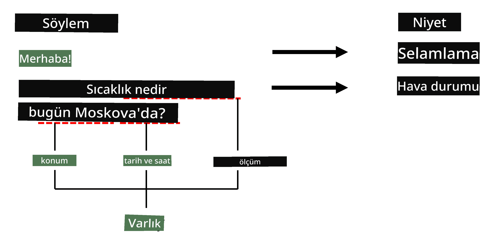

# Adlandırılmış Varlık Tanıma

Şimdiye kadar, çoğunlukla bir NLP görevi olan sınıflandırmaya odaklandık. Ancak, sinir ağlarıyla gerçekleştirilebilecek başka NLP görevleri de vardır. Bu görevlerden biri, metin içinde yer alan belirli varlıkları tanımayı içeren **[Adlandırılmış Varlık Tanıma](https://wikipedia.org/wiki/Named-entity_recognition)** (NER) işlemidir. Bu varlıklar arasında yerler, kişi isimleri, tarih-zaman aralıkları, kimyasal formüller ve daha fazlası bulunabilir.

## [Ders Öncesi Test](https://ff-quizzes.netlify.app/en/ai/quiz/37)

## NER Kullanımına Örnek

Diyelim ki Amazon Alexa veya Google Asistan gibi bir doğal dil sohbet botu geliştirmek istiyorsunuz. Akıllı sohbet botlarının çalışma şekli, kullanıcının ne istediğini anlamak için girilen cümle üzerinde metin sınıflandırması yapmaktır. Bu sınıflandırmanın sonucu, sohbet botunun ne yapması gerektiğini belirleyen **niyet** olarak adlandırılır.

> Görsel yazar tarafından oluşturulmuştur

Ancak, kullanıcı cümle içinde bazı parametreler belirtebilir. Örneğin, hava durumu sorarken bir konum veya tarih belirtebilir. Bot, bu varlıkları anlayabilmeli ve işlem yapmadan önce parametre yuvalarını uygun şekilde doldurmalıdır. İşte tam da burada NER devreye girer.

> ✅ Bir diğer örnek, [bilimsel tıbbi makaleleri analiz etmek](https://soshnikov.com/science/analyzing-medical-papers-with-azure-and-text-analytics-for-health/) olabilir. Burada aramamız gereken ana şeyler, hastalıklar ve tıbbi maddeler gibi belirli tıbbi terimlerdir. Az sayıda hastalık muhtemelen alt dize aramasıyla çıkarılabilirken, kimyasal bileşikler ve ilaç isimleri gibi daha karmaşık varlıklar için daha gelişmiş bir yaklaşım gereklidir.

## NER ve Token Sınıflandırması

NER modelleri aslında **token sınıflandırma modelleridir**, çünkü her bir giriş tokeni için bu tokenin bir varlığa ait olup olmadığını ve eğer aitse hangi varlık sınıfına ait olduğunu belirlememiz gerekir.

Aşağıdaki makale başlığını ele alalım:

**Tricuspid kapak yetmezliği** ve **lityum karbonat** **toksisitesi** bir yenidoğan bebekte.

Buradaki varlıklar şunlardır:

* Tricuspid kapak yetmezliği bir hastalıktır (`DIS`)
* Lityum karbonat bir kimyasal maddedir (`CHEM`)
* Toksisite de bir hastalıktır (`DIS`)

Dikkat edin, bir varlık birden fazla token içerebilir. Ve bu durumda olduğu gibi, ardışık iki varlığı ayırt etmemiz gerekir. Bu nedenle, her varlık için iki sınıf kullanmak yaygındır - biri varlığın ilk tokenini belirtir (genellikle **b**aşlangıç için `B-` ön eki kullanılır) ve diğeri varlığın devamını (`I-`, **i**ç token için) belirtir. Ayrıca, tüm **d**iğer tokenleri temsil etmek için `O` sınıfını kullanırız. Bu tür token etiketleme [BIO etiketleme](https://en.wikipedia.org/wiki/Inside%E2%80%93outside%E2%80%93beginning_(tagging)) (veya IOB) olarak adlandırılır. Etiketlendiğinde, başlığımız şu şekilde görünecektir:

Token | Etiket
------|-----
Tricuspid | B-DIS
kapak | I-DIS
yetmezliği | I-DIS
ve | O
lityum | B-CHEM
karbonat | I-CHEM
toksisitesi | B-DIS
bir | O
yenidoğan | O
bebekte | O
. | O

Tokenler ve sınıflar arasında birebir bir ilişki kurmamız gerektiğinden, bu resimden **çoktan-çoka** bir sinir ağı modeli eğitebiliriz:

> *Görsel, [Andrej Karpathy](http://karpathy.github.io/) tarafından yazılmış [bu blog yazısından](http://karpathy.github.io/2015/05/21/rnn-effectiveness/) alınmıştır. NER token sınıflandırma modelleri, bu resimdeki en sağdaki ağ mimarisine karşılık gelir.*

## NER Modellerini Eğitmek

Bir NER modeli aslında bir token sınıflandırma modeli olduğundan, bu görev için zaten aşina olduğumuz RNN'leri kullanabiliriz. Bu durumda, tekrarlayan ağın her bloğu token kimliğini döndürecektir. Aşağıdaki örnek defter, token sınıflandırması için LSTM'nin nasıl eğitileceğini göstermektedir.

## ✍️ Örnek Defterler: NER

Aşağıdaki defterde öğrenmeye devam edin:

* [TensorFlow ile NER](NER-TF.ipynb)

## Sonuç

Bir NER modeli, bir **token sınıflandırma modeli**dir, yani token sınıflandırması yapmak için kullanılabilir. Bu, yerler, isimler, tarihler ve daha fazlasını içeren metin içindeki belirli varlıkları tanımaya yardımcı olan çok yaygın bir NLP görevidir.

## 🚀 Meydan Okuma

Aşağıda bağlantısı verilen ödevi tamamlayarak tıbbi terimler için bir adlandırılmış varlık tanıma modeli eğitin ve ardından bunu farklı bir veri kümesinde deneyin.

## [Ders Sonrası Test](https://ff-quizzes.netlify.app/en/ai/quiz/38)

## Gözden Geçirme ve Kendi Kendine Çalışma

[Recurrent Neural Networks'ün Akıl Almaz Etkinliği](http://karpathy.github.io/2015/05/21/rnn-effectiveness/) blog yazısını okuyun ve bu makaledeki Daha Fazla Okuma bölümünü takip ederek bilginizi derinleştirin.

## [Ödev](lab/README.md)

Bu dersin ödevinde, bir tıbbi varlık tanıma modeli eğitmeniz gerekecek. Bu derste açıklanan şekilde bir LSTM modeli eğiterek başlayabilir ve ardından BERT dönüştürücü modelini kullanmaya geçebilirsiniz. Tüm detayları öğrenmek için [talimatları okuyun](lab/README.md).

---

