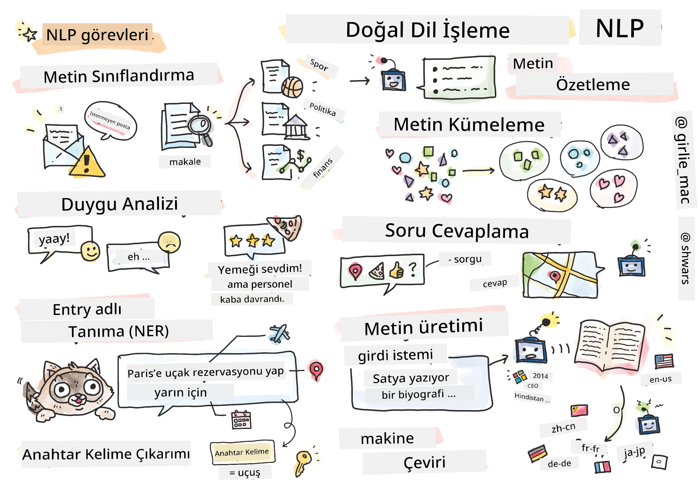

# Doğal Dil İşleme



Bu bölümde, **Doğal Dil İşleme (NLP)** ile ilgili görevleri çözmek için Sinir Ağlarını kullanmaya odaklanacağız. Bilgisayarların çözmesini istediğimiz birçok NLP problemi bulunmaktadır:

* **Metin sınıflandırma**, metin dizileriyle ilgili tipik bir sınıflandırma problemidir. Örnekler arasında e-posta mesajlarını spam veya spam değil olarak sınıflandırmak ya da makaleleri spor, iş, politika gibi kategorilere ayırmak yer alır. Ayrıca, sohbet botları geliştirirken, genellikle bir kullanıcının ne söylemek istediğini anlamamız gerekir -- bu durumda **niyet sınıflandırması** ile ilgileniyoruz. Niyet sınıflandırmasında genellikle birçok kategoriyle uğraşmamız gerekir.
* **Duygu analizi**, bir cümlenin anlamının ne kadar olumlu/olumsuz olduğunu belirten bir sayı (duygu) atamamız gereken tipik bir regresyon problemidir. Duygu analizinin daha gelişmiş bir versiyonu olan **özellik tabanlı duygu analizi** (ABSA), duygu durumunu tüm cümleye değil, farklı bölümlerine (özelliklere) atar, örneğin: *Bu restoranda mutfağı beğendim, ama atmosfer berbattı*.
* **Adlandırılmış Varlık Tanıma** (NER), metinden belirli varlıkları çıkarmakla ilgilidir. Örneğin, *Yarın Paris'e uçmam gerekiyor* cümlesinde *yarın* kelimesinin TARİH'e, *Paris* kelimesinin ise KONUM'a atıfta bulunduğunu anlamamız gerekebilir.  
* **Anahtar kelime çıkarımı**, NER'e benzer, ancak belirli varlık türleri için önceden eğitim yapmadan, cümlenin anlamı için önemli olan kelimeleri otomatik olarak çıkarmamız gerekir.
* **Metin kümeleme**, benzer cümleleri bir araya getirmek istediğimizde faydalı olabilir, örneğin teknik destek konuşmalarında benzer talepleri gruplamak.
* **Soru yanıtlama**, bir modelin belirli bir soruya yanıt verebilme yeteneğini ifade eder. Model, bir metin parçası ve bir soruyu giriş olarak alır ve sorunun cevabının metinde bulunduğu yeri sağlaması (veya bazen cevap metnini oluşturması) gerekir.
* **Metin oluşturma**, bir modelin yeni metin oluşturma yeteneğidir. Bu, bir *metin ipucu* temelinde bir sonraki harf/kelimeyi tahmin eden bir sınıflandırma görevi olarak düşünülebilir. GPT-3 gibi gelişmiş metin oluşturma modelleri, [ipucu programlama](https://towardsdatascience.com/software-3-0-how-prompting-will-change-the-rules-of-the-game-a982fbfe1e0) veya [ipucu mühendisliği](https://medium.com/swlh/openai-gpt-3-and-prompt-engineering-dcdc2c5fcd29) adı verilen bir teknik kullanarak sınıflandırma gibi diğer NLP görevlerini çözebilir.
* **Metin özetleme**, bir bilgisayarın uzun bir metni "okuyup" birkaç cümleyle özetlemesini istediğimiz bir tekniktir.
* **Makine çevirisi**, bir dildeki metni anlamayı ve başka bir dilde metin oluşturmayı birleştiren bir görev olarak görülebilir.

Başlangıçta, çoğu NLP görevi dilbilgisi gibi geleneksel yöntemlerle çözülüyordu. Örneğin, makine çevirisinde, başlangıç cümlesi bir sözdizimi ağacına dönüştürmek için ayrıştırıcılar kullanılıyor, ardından cümlenin anlamını temsil etmek için daha yüksek seviyeli anlamsal yapılar çıkarılıyor ve bu anlam ve hedef dilin dilbilgisine dayanarak sonuç oluşturuluyordu. Günümüzde, birçok NLP görevi sinir ağları kullanılarak daha etkili bir şekilde çözülmektedir.

> Birçok klasik NLP yöntemi, [Natural Language Processing Toolkit (NLTK)](https://www.nltk.org) Python kütüphanesinde uygulanmıştır. Farklı NLP görevlerinin NLTK kullanılarak nasıl çözülebileceğini kapsayan harika bir [NLTK Kitabı](https://www.nltk.org/book/) çevrimiçi olarak mevcuttur.

Kursumuzda, çoğunlukla NLP için Sinir Ağlarını kullanmaya odaklanacağız ve gerektiğinde NLTK kullanacağız.

Tablo verileri ve görüntülerle çalışmak için sinir ağlarını kullanmayı zaten öğrendik. Bu veri türleri ile metin arasındaki temel fark, metnin değişken uzunlukta bir dizi olmasıdır, oysa görüntülerde giriş boyutu önceden bilinir. Konvolüsyonel ağlar giriş verilerinden desenler çıkarabilirken, metindeki desenler daha karmaşıktır. Örneğin, olumsuzluk, özneyle birçok kelime arasında ayrılabilir (örneğin: *Portakalları sevmiyorum* ile *O büyük renkli lezzetli portakalları sevmiyorum*), ve bu yine de tek bir desen olarak yorumlanmalıdır. Bu nedenle, dili işlemek için *tekrarlayan ağlar* ve *dönüştürücüler* gibi yeni sinir ağı türlerini tanıtmamız gerekir.

## Kütüphaneleri Yükleme

Bu kursu yerel bir Python kurulumunda çalıştırıyorsanız, NLP için gerekli tüm kütüphaneleri aşağıdaki komutlarla yüklemeniz gerekebilir:

**PyTorch için**
```bash
pip install -r requirements-torch.txt
```
**TensorFlow için**
```bash
pip install -r requirements-tf.txt
```

> TensorFlow ile NLP'yi [Microsoft Learn](https://docs.microsoft.com/learn/modules/intro-natural-language-processing-tensorflow/?WT.mc_id=academic-77998-cacaste) üzerinde deneyebilirsiniz.

## GPU Uyarısı

Bu bölümde, bazı örneklerde oldukça büyük modelleri eğiteceğiz.
* **GPU Destekli Bilgisayar Kullanın**: Büyük modellerle çalışırken bekleme sürelerini azaltmak için not defterlerinizi GPU destekli bir bilgisayarda çalıştırmanız önerilir.
* **GPU Bellek Sınırlamaları**: GPU'da çalışmak, özellikle büyük modelleri eğitirken GPU belleğinizin tükenmesine neden olabilir.
* **GPU Bellek Tüketimi**: Eğitim sırasında tüketilen GPU belleği, minibatch boyutu gibi çeşitli faktörlere bağlıdır.
* **Minibatch Boyutunu Azaltın**: GPU bellek sorunlarıyla karşılaşırsanız, kodunuzdaki minibatch boyutunu azaltmayı düşünebilirsiniz.
* **TensorFlow GPU Bellek Serbest Bırakma**: TensorFlow'un eski sürümleri, bir Python çekirdeğinde birden fazla model eğitildiğinde GPU belleğini doğru şekilde serbest bırakmayabilir. GPU bellek kullanımını etkili bir şekilde yönetmek için TensorFlow'u yalnızca gerektiğinde GPU belleği tahsis edecek şekilde yapılandırabilirsiniz.
* **Kod Ekleme**: TensorFlow'un GPU belleği tahsisini yalnızca gerektiğinde büyütmesini sağlamak için not defterlerinize aşağıdaki kodu ekleyin:

```python
physical_devices = tf.config.list_physical_devices('GPU') 
if len(physical_devices)>0:
    tf.config.experimental.set_memory_growth(physical_devices[0], True) 
```

Klasik ML perspektifinden NLP öğrenmekle ilgileniyorsanız, [bu dersler dizisini](https://github.com/microsoft/ML-For-Beginners/tree/main/6-NLP) ziyaret edin.

## Bu Bölümde
Bu bölümde şunları öğreneceğiz:

* [Metni tensörler olarak temsil etme](13-TextRep/README.md)
* [Kelime Gömüleri](14-Emdeddings/README.md)
* [Dil Modelleme](15-LanguageModeling/README.md)
* [Tekrarlayan Sinir Ağları](16-RNN/README.md)
* [Üretken Ağlar](17-GenerativeNetworks/README.md)
* [Dönüştürücüler](18-Transformers/README.md)

**Feragatname**:  
Bu belge, AI çeviri hizmeti [Co-op Translator](https://github.com/Azure/co-op-translator) kullanılarak çevrilmiştir. Doğruluk için çaba göstersek de, otomatik çevirilerin hata veya yanlışlıklar içerebileceğini lütfen unutmayın. Belgenin orijinal dili, yetkili kaynak olarak kabul edilmelidir. Kritik bilgiler için profesyonel insan çevirisi önerilir. Bu çevirinin kullanımından kaynaklanan yanlış anlamalar veya yanlış yorumlamalardan sorumlu değiliz.