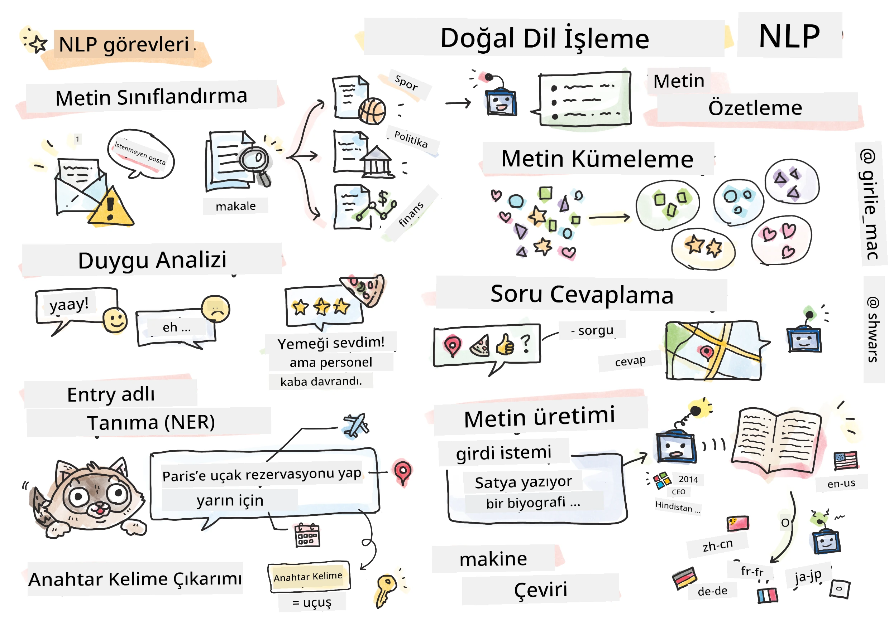

# Doğal Dil İşleme



Bu bölümde, **Doğal Dil İşleme (NLP)** ile ilgili görevleri ele almak için Sinir Ağları kullanmaya odaklanacağız. Bilgisayarların çözebilmesini istediğimiz birçok NLP problemi vardır:

* **Metin sınıflandırması**, metin dizileriyle ilgili tipik bir sınıflandırma problemidir. Örnekler arasında e-posta mesajlarını spam ve spam olmayan olarak sınıflandırmak ya da makaleleri spor, iş, politika gibi kategorilere ayırmak vardır. Ayrıca, sohbet botları geliştirirken, bir kullanıcının ne söylemek istediğini anlamamız gerekir - bu durumda **niyet sınıflandırması** ile ilgileniyoruz. Niyet sınıflandırmasında genellikle birçok kategoriyle başa çıkmamız gerekir.
* **Duygu analizi**, tipik bir regresyon problemidir; burada bir cümlenin anlamının ne kadar olumlu/olumsuz olduğunu ifade eden bir sayı (duygu) atamamız gerekir. Duygu analizinin daha gelişmiş bir versiyonu, tüm cümleye değil, cümlenin farklı bölümlerine (yönlere) duygu atadığımız **yönebazlı duygu analizi** (ABSA)dır, örneğin *Bu restoranda mutfağı sevdim, ama atmosfer berbattı*.
* **Adlandırılmış Varlık Tanıma** (NER), metinden belirli varlıkları çıkarmakla ilgilidir. Örneğin, *Yarın Paris'e uçmam gerekiyor* ifadesinde *yarın* kelimesinin TARİH, *Paris* kelimesinin KONUM olduğunu anlamamız gerekebilir.  
* **Anahtar kelime çıkarımı** NER'e benzer, ancak belirli varlık türleri için önceden eğitim almadan, cümlenin anlamı için önemli kelimeleri otomatik olarak çıkarmamız gerekir.
* **Metin kümeleme**, benzer cümleleri bir araya getirmek istediğimizde faydalı olabilir; örneğin, teknik destek konuşmalarındaki benzer talepler.
* **Soru yanıtlama**, bir modelin belirli bir soruya cevap verme yeteneğine denir. Model bir metin parçası ve bir soru alır, ardından sorunun cevabının bulunduğu metin yerini sağlaması (veya bazen cevap metnini üretmesi) gerekir.
* **Metin üretimi**, bir modelin yeni metin oluşturma yeteneğidir. Bu, bir *metin istemi* temelinde bir sonraki harfi/kelimeyi tahmin eden bir sınıflandırma görevi olarak düşünülebilir. GPT-3 gibi gelişmiş metin üretim modelleri, [prompt programlama](https://towardsdatascience.com/software-3-0-how-prompting-will-change-the-rules-of-the-game-a982fbfe1e0) veya [prompt mühendisliği](https://medium.com/swlh/openai-gpt-3-and-prompt-engineering-dcdc2c5fcd29) olarak adlandırılan bir teknik kullanarak sınıflandırma gibi diğer NLP görevlerini de çözebilir.
* **Metin özetleme**, uzun bir metni "okuyup" birkaç cümleye özetlemek istediğimiz bir tekniktir.
* **Makine çevirisi**, bir dildeki metni anlama ve başka bir dilde metin üretme birleşimi olarak görülebilir.

Başlangıçta, çoğu NLP görevi dil bilgisi gibi geleneksel yöntemlerle çözülüyordu. Örneğin makine çevirisinde parsers, ilk cümleyi sözdizimi ağacına dönüştürmek için kullanılır, sonra cümlenin anlamını temsil eden daha yüksek düzeyde anlamsal yapılar çıkarılırdı ve bu anlama ile hedef dilin dil bilgisi temel alınarak sonuç oluşturulurdu. Günümüzde birçok NLP görevi sinir ağları kullanılarak daha etkili şekilde çözülmektedir.

> Birçok klasik NLP yöntemi, [Natural Language Processing Toolkit (NLTK)](https://www.nltk.org) Python kitaplığında uygulanmıştır. Çevrimiçi erişilebilen harika bir [NLTK Kitabı](https://www.nltk.org/book/) vardır ve kitap NLTK ile farklı NLP görevlerinin nasıl çözülebileceğini kapsar.

Kursumuzda çoğunlukla NLP için Sinir Ağları kullanmaya odaklanacağız ve gerektiğinde NLTK kullanacağız.

Daha önce tablolarla ve görüntülerle çalışmak için sinir ağlarını kullanmayı öğrendik. Bu tür veriler ile metin arasındaki temel fark, metnin değişken uzunlukta bir dizi olmasıdır, oysa görüntülerde giriş boyutu önceden bellidir. Konvolüsyonel ağlar giriş verisinden desenler çıkarabilirken, metindeki desenler daha karmaşıktır. Örneğin, olumsuzlama çok kelimeden ayrılarak gelebilir (örn. *Portakalları sevmiyorum* vs. *O büyük renkli lezzetli portakalları sevmiyorum*), ama bu hala tek bir desen olarak yorumlanmalıdır. Bu yüzden dil işlemek için *geri dönüşümlü ağlar* ve *transformerlar* gibi yeni sinir ağı türleri getirmeliyiz.

## Kütüphaneleri Yükleme

Bu kursu yerel Python kurulumuyla çalıştırıyorsanız, NLP için gereken tüm kütüphaneleri aşağıdaki komutlarla yüklemeniz gerekebilir:

**PyTorch için**
```bash
pip install -r requirements-pytorch.txt
```
**TensorFlow için**
```bash
pip install -r requirements-tf.txt
```

> TensorFlow ile NLP’yi [Microsoft Learn](https://docs.microsoft.com/learn/modules/intro-natural-language-processing-tensorflow/?WT.mc_id=academic-77998-cacaste) üzerinde deneyebilirsiniz.

## GPU Uyarısı

Bu bölümde bazı örneklerde oldukça büyük modelleri eğiteceğiz.
* **GPU Destekli Bilgisayar Kullanın**: Büyük modellerle çalışırken bekleme sürelerini azaltmak için defterlerinizi GPU destekli bir bilgisayarda çalıştırmanız önerilir.
* **GPU Bellek Sınırlamaları**: GPU üzerinde çalıştırmak, özellikle büyük modeller eğitildiğinde GPU bellek tükenmesine yol açabilir.
* **GPU Bellek Tüketimi**: Eğitim sırasında tüketilen GPU belleği; minibatch boyutu gibi çeşitli faktörlere bağlıdır.
* **Minibatch Boyutunu Azaltın**: GPU bellek sorunlarıyla karşılaşırsanız, kodunuzdaki minibatch boyutunu azaltmayı çözüm olarak düşünebilirsiniz.
* **TensorFlow GPU Bellek Serbest Bırakma**: TensorFlow’un eski sürümleri, bir Python kernelinde birden fazla model eğitirken GPU belleğini doğru şekilde serbest bırakmayabilir. GPU bellek kullanımını etkili şekilde yönetmek için TensorFlow’u yalnızca ihtiyaç duyulduğunda GPU belleğini tahsis edecek şekilde yapılandırabilirsiniz.
* **Kod Ekleme**: TensorFlow’un GPU bellek tahsisini sadece gerektiğinde artıracak şekilde ayarlamak için defterlerinize aşağıdaki kodu ekleyin:

```python
physical_devices = tf.config.list_physical_devices('GPU') 
if len(physical_devices)>0:
    tf.config.experimental.set_memory_growth(physical_devices[0], True) 
```

Klasik ML bakış açısından NLP öğrenmek isterseniz, [bu ders setini](https://github.com/microsoft/ML-For-Beginners/tree/main/6-NLP) ziyaret edin.

## Bu Bölümde
Bu bölümde şunları öğreneceğiz:

* [Metni tensörler olarak temsil etme](13-TextRep/README.md)
* [Kelime Gömme](14-Embeddings/README.md)
* [Dil Modellemesi](15-LanguageModeling/README.md)
* [Geri Dönüşümlü Sinir Ağları](16-RNN/README.md)
* [Üretici Ağlar](17-GenerativeNetworks/README.md)
* [Transformerlar](18-Transformers/README.md)

---

<!-- CO-OP TRANSLATOR DISCLAIMER START -->
**Feragatname**:
Bu belge, AI çeviri hizmeti [Co-op Translator](https://github.com/Azure/co-op-translator) kullanılarak çevrilmiştir. Doğruluk için çaba sarf etsek de, otomatik çevirilerin hata veya yanlışlık içerebileceğini lütfen unutmayınız. Orijinal belge, kendi dilinde yetkili kaynak olarak kabul edilmelidir. Kritik bilgiler için profesyonel insan çevirisi önerilir. Bu çevirinin kullanımı sonucu ortaya çıkabilecek yanlış anlamalardan veya yanlış yorumlamalardan sorumlu değiliz.
<!-- CO-OP TRANSLATOR DISCLAIMER END -->