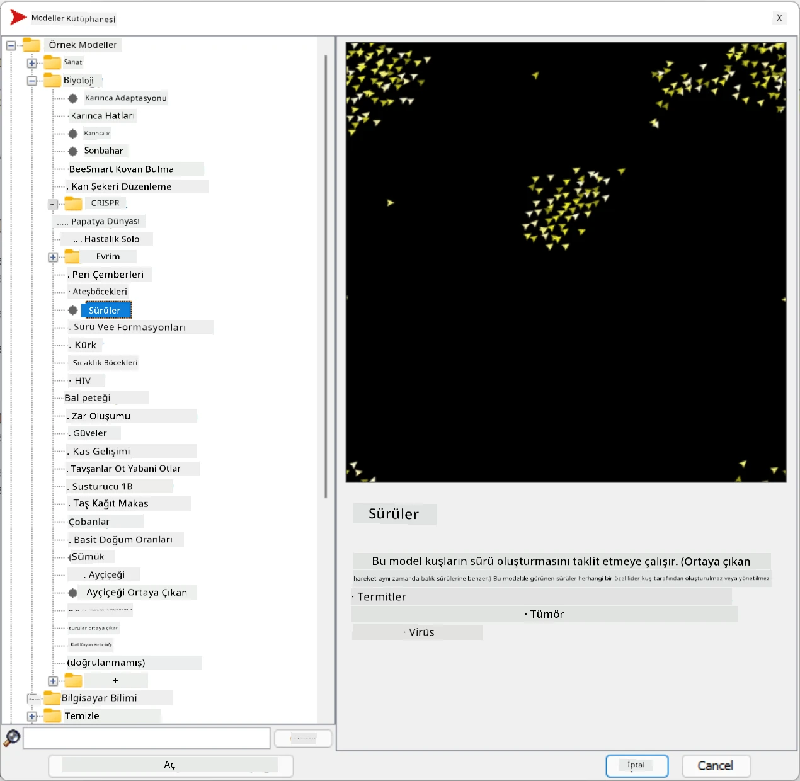
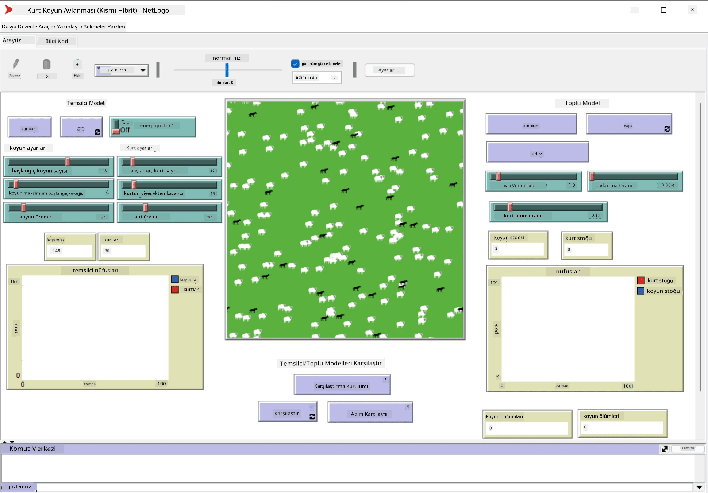

# Çoklu-Ajan Sistemleri

Zekayı elde etmenin olası yollarından biri, **ortaya çıkan** (veya **sinerjik**) yaklaşımdır. Bu yaklaşım, birçok nispeten basit ajanın birleşik davranışının, sistemin bir bütün olarak daha karmaşık (veya zeki) bir davranış sergilemesine yol açabileceği gerçeğine dayanır. Teorik olarak, bu yaklaşım [Kolektif Zeka](https://en.wikipedia.org/wiki/Collective_intelligence), [Emergentizm](https://en.wikipedia.org/wiki/Global_brain) ve [Evrimsel Sibernetik](https://en.wikipedia.org/wiki/Global_brain) ilkelerine dayanır. Bu ilkeler, üst düzey sistemlerin, alt düzey sistemlerin uygun şekilde birleştirilmesiyle bir tür ek değer kazandığını ifade eder (*metasistem geçişi ilkesi* olarak adlandırılır).

## [Ders Öncesi Test](https://ff-quizzes.netlify.app/en/ai/quiz/45)

**Çoklu-Ajan Sistemleri** yönelimi, 1990'larda internetin ve dağıtık sistemlerin büyümesine yanıt olarak yapay zekada ortaya çıkmıştır. Klasik yapay zeka ders kitaplarından biri olan [Artificial Intelligence: A Modern Approach](https://en.wikipedia.org/wiki/Artificial_Intelligence:_A_Modern_Approach), klasik yapay zekayı çoklu-ajan sistemleri perspektifinden ele alır.

Çoklu-ajan yaklaşımının merkezinde **Ajan** kavramı yer alır. Ajan, bir **çevrede** yaşayan, bu çevreyi algılayabilen ve üzerinde eylemde bulunabilen bir varlıktır. Bu oldukça geniş bir tanımdır ve birçok farklı türde ve sınıfta ajanlar olabilir:

* Akıl yürütme yeteneklerine göre:
   - **Tepkisel** ajanlar genellikle basit istek-yanıt türü davranış sergiler
   - **Düşünsel** ajanlar bir tür mantıksal akıl yürütme ve/veya planlama yetenekleri kullanır
* Kodun çalıştığı yere göre:
   - **Statik** ajanlar belirli bir ağ düğümünde çalışır
   - **Mobil** ajanlar kodlarını ağ düğümleri arasında taşıyabilir
* Davranışlarına göre:
   - **Pasif ajanlar** belirli hedeflere sahip değildir. Bu tür ajanlar dış uyaranlara tepki verebilir, ancak kendiliğinden eylem başlatmaz.
   - **Aktif ajanlar** belirli hedeflere ulaşmaya çalışır
   - **Bilişsel ajanlar** karmaşık planlama ve akıl yürütme içerir

Günümüzde çoklu-ajan sistemleri birçok uygulamada kullanılmaktadır:

* Oyunlarda, birçok oyuncu olmayan karakter bir tür yapay zeka kullanır ve zeki ajanlar olarak kabul edilebilir.
* Video prodüksiyonunda, kalabalıkları içeren karmaşık 3D sahnelerin render edilmesi genellikle çoklu-ajan simülasyonu kullanılarak yapılır.
* Sistem modellemede, karmaşık bir modelin davranışını simüle etmek için çoklu-ajan yaklaşımı kullanılır. Örneğin, çoklu-ajan yaklaşımı COVID-19 hastalığının dünya çapında yayılmasını tahmin etmek için başarıyla kullanılmıştır. Benzer bir yaklaşım, şehirdeki trafiği modellemek ve trafik kurallarındaki değişikliklere nasıl tepki verdiğini görmek için kullanılabilir.
* Karmaşık otomasyon sistemlerinde, her cihaz bağımsız bir ajan olarak hareket edebilir, bu da tüm sistemi daha az monolitik ve daha sağlam hale getirir.

Çoklu-ajan sistemlerine derinlemesine dalmayacağız, ancak **Çoklu-Ajan Modelleme** örneğini ele alacağız.

## NetLogo

[NetLogo](https://ccl.northwestern.edu/netlogo/), [Logo](https://en.wikipedia.org/wiki/Logo_(programming_language)) programlama dilinin değiştirilmiş bir versiyonuna dayanan bir çoklu-ajan modelleme ortamıdır. Bu dil, çocuklara programlama kavramlarını öğretmek için geliştirilmiştir ve **kaplumbağa** adlı bir ajanı kontrol etmenize olanak tanır. Kaplumbağa hareket edebilir ve arkasında bir iz bırakabilir. Bu, bir ajanın davranışını anlamak için oldukça görsel bir yol olan karmaşık geometrik şekiller oluşturmayı sağlar.

NetLogo'da `create-turtles` komutunu kullanarak birçok kaplumbağa oluşturabiliriz. Daha sonra tüm kaplumbağalara bazı eylemler yapmalarını emredebiliriz (aşağıdaki örnekte - 10 birim ileri hareket):

```
create-turtles 10
ask turtles [
  forward 10
]
```

Tabii ki, tüm kaplumbağaların aynı şeyi yapması ilginç değildir, bu yüzden belirli bir noktanın yakınındaki kaplumbağalar gibi gruplara `ask` komutuyla emir verebiliriz. Ayrıca `breed [cats cat]` komutunu kullanarak farklı *türlerde* kaplumbağalar oluşturabiliriz. Burada `cat` bir türün adıdır ve hem tekil hem de çoğul kelimeyi belirtmemiz gerekir, çünkü farklı komutlar açıklık için farklı formlar kullanır.

> ✅ NetLogo dilini öğrenmeye dalmayacağız - ilgileniyorsanız, harika [Beginner's Interactive NetLogo Dictionary](https://ccl.northwestern.edu/netlogo/bind/) kaynağını ziyaret edebilirsiniz.

NetLogo'yu [indirip](https://ccl.northwestern.edu/netlogo/download.shtml) kurarak deneyebilirsiniz.

### Modeller Kütüphanesi

NetLogo'nun harika bir özelliği, deneyebileceğiniz çalışan modellerin bulunduğu bir kütüphaneye sahip olmasıdır. **File &rightarrow; Models Library** seçeneğine gidin ve birçok model kategorisi arasından seçim yapabilirsiniz.



> Dmitry Soshnikov tarafından modeller kütüphanesi ekran görüntüsü

Bir modeli açabilirsiniz, örneğin **Biology &rightarrow; Flocking**.

### Ana İlkeler

Modeli açtıktan sonra, ana NetLogo ekranına yönlendirilirsiniz. İşte sınırlı kaynaklar (ot) göz önüne alındığında kurtlar ve koyunların popülasyonunu açıklayan örnek bir model.



> Dmitry Soshnikov tarafından ekran görüntüsü

Bu ekranda şunları görebilirsiniz:

* **Arayüz** bölümü, şunları içerir:
  - Tüm ajanların yaşadığı ana alan
  - Farklı kontroller: düğmeler, kaydırıcılar vb.
  - Simülasyon parametrelerini göstermek için kullanabileceğiniz grafikler
* **Kod** sekmesi, NetLogo programını yazabileceğiniz editörü içerir

Çoğu durumda, arayüzde simülasyon durumunu başlatan bir **Setup** düğmesi ve yürütmeyi başlatan bir **Go** düğmesi bulunur. Bunlar, kodda aşağıdaki gibi görünen ilgili işleyiciler tarafından yönetilir:

```
to go [
...
]
```

NetLogo'nun dünyası şu nesnelerden oluşur:

* **Ajanlar** (kaplumbağalar), alan boyunca hareket edebilir ve bir şeyler yapabilir. Ajanlara `ask turtles [...]` sözdizimi kullanarak komut verirsiniz ve köşeli parantez içindeki kod, tüm ajanlar tarafından *kaplumbağa modunda* çalıştırılır.
* **Yamalar**, ajanların yaşadığı alanın kare bölgeleridir. Aynı yamada bulunan tüm ajanlara başvurabilir veya yama renklerini ve diğer bazı özellikleri değiştirebilirsiniz. Ayrıca `ask patches` komutuyla yamalara bir şeyler yaptırabilirsiniz.
* **Gözlemci**, dünyayı kontrol eden benzersiz bir ajandır. Tüm düğme işleyicileri *gözlemci modunda* çalıştırılır.

> ✅ Çoklu-ajan ortamının güzelliği, kaplumbağa modunda veya yama modunda çalışan kodun tüm ajanlar tarafından aynı anda paralel olarak çalıştırılmasıdır. Böylece, az miktarda kod yazarak ve bireysel bir ajanın davranışını programlayarak, simülasyon sisteminin bir bütün olarak karmaşık davranışını oluşturabilirsiniz.

### Sürü Davranışı

Çoklu-ajan davranışına bir örnek olarak **[Sürü Davranışı](https://en.wikipedia.org/wiki/Flocking_(behavior))**'nı ele alalım. Sürü davranışı, kuş sürülerinin uçuşuna çok benzeyen karmaşık bir desendir. Onları uçarken izlediğinizde, bir tür kolektif algoritmayı takip ettiklerini veya bir tür *kolektif zekaya* sahip olduklarını düşünebilirsiniz. Ancak, bu karmaşık davranış, her bireysel ajanın (bu durumda bir *kuş*) yalnızca kısa mesafedeki diğer ajanları gözlemlemesi ve üç basit kurala uymasıyla ortaya çıkar:

* **Hizalanma** - komşu ajanların ortalama yönüne doğru yönelir
* **Uyum** - komşuların ortalama konumuna doğru yönelmeye çalışır (*uzun mesafeli çekim*)
* **Ayrılma** - diğer kuşlara çok yaklaştığında uzaklaşmaya çalışır (*kısa mesafeli itme*)

Sürü davranışı örneğini çalıştırabilir ve davranışı gözlemleyebilirsiniz. Ayrıca, her kuşun ne kadar uzağı görebileceğini tanımlayan *görüş mesafesi* veya *ayrılma derecesi* gibi parametreleri ayarlayabilirsiniz. Görüş mesafesini 0'a düşürdüğünüzde, tüm kuşlar kör olur ve sürü davranışı durur. Ayrılmayı 0'a düşürdüğünüzde, tüm kuşlar düz bir çizgide toplanır.

> ✅ **Kod** sekmesine geçin ve sürü davranışının üç kuralının (hizalanma, uyum ve ayrılma) kodda nerede uygulandığını görün. Sadece görüş alanındaki ajanlara nasıl başvurduğumuza dikkat edin.

### Görülecek Diğer Modeller

Deneyebileceğiniz birkaç ilginç model daha var:

* **Art &rightarrow; Fireworks**, bir havai fişeğin bireysel ateş akışlarının kolektif davranışı olarak nasıl düşünülebileceğini gösterir.
* **Social Science &rightarrow; Traffic Basic** ve **Social Science &rightarrow; Traffic Grid**, trafik ışıklarıyla veya olmadan 1D ve 2D Grid'deki şehir trafiği modelini gösterir. Simülasyondaki her araba şu kuralları takip eder:
   - Önündeki alan boşsa - hızlan (belirli bir maksimum hıza kadar)
   - Önündeki engeli görürse - fren yap (ve bir sürücünün ne kadar uzağı görebileceğini ayarlayabilirsiniz)
* **Social Science &rightarrow; Party**, bir kokteyl partisinde insanların nasıl gruplar oluşturduğunu gösterir. Grubun mutluluğunun en hızlı artışına yol açan parametre kombinasyonunu bulabilirsiniz.

Bu örneklerden de görebileceğiniz gibi, çoklu-ajan simülasyonları, aynı veya benzer mantığı takip eden bireylerden oluşan karmaşık bir sistemin davranışını anlamanın oldukça yararlı bir yolu olabilir. Ayrıca bilgisayar oyunlarındaki [NPC'ler](https://en.wikipedia.org/wiki/NPC) gibi sanal ajanları veya 3D animasyonlu dünyalardaki ajanları kontrol etmek için kullanılabilir.

## Düşünsel Ajanlar

Yukarıda açıklanan ajanlar oldukça basittir ve çevredeki değişikliklere bir tür algoritma kullanarak tepki verir. Bu tür ajanlar **tepkisel ajanlar** olarak adlandırılır. Ancak, bazen ajanlar akıl yürütüp eylemlerini planlayabilir, bu durumda **düşünsel** olarak adlandırılırlar.

Tipik bir örnek, bir insanın tatil turu rezervasyonu yapmak için bir talimat verdiği kişisel bir ajandır. İnternette yaşayan birçok ajan olduğunu varsayalım, bu ajanlar ona yardımcı olabilir. Bu durumda, diğer ajanlarla iletişim kurarak hangi uçuşların mevcut olduğunu, farklı tarihler için otel fiyatlarını öğrenmeli ve en iyi fiyatı müzakere etmeye çalışmalıdır. Tatil planı tamamlandığında ve sahibi tarafından onaylandığında, rezervasyon işlemini gerçekleştirebilir.

Bunu yapmak için ajanların **iletişim kurması** gerekir. Başarılı iletişim için şunlara ihtiyaç duyarlar:

* [Knowledge Interchange Format](https://en.wikipedia.org/wiki/Knowledge_Interchange_Format) (KIF) ve [Knowledge Query and Manipulation Language](https://en.wikipedia.org/wiki/Knowledge_Query_and_Manipulation_Language) (KQML) gibi **bilgi alışverişi için standart diller**. Bu diller [Konuşma Eylemi teorisi](https://en.wikipedia.org/wiki/Speech_act) temel alınarak tasarlanmıştır.
* Bu diller ayrıca farklı **müzayede türlerine** dayalı **müzakere protokollerini** içermelidir.
* Aynı kavramlara başvurabilmeleri ve anlamlarını bilmeleri için **ortak bir ontoloji** kullanmaları gerekir.
* Farklı ajanların neler yapabileceğini **keşfetmek** için bir yol, yine bir tür ontolojiye dayalı olmalıdır.

Düşünsel ajanlar, tepkisel ajanlardan çok daha karmaşıktır çünkü sadece çevredeki değişikliklere tepki vermekle kalmaz, aynı zamanda *eylemleri başlatabilmelidir*. Düşünsel ajanlar için önerilen mimarilerden biri, inanç-arzu-niyet (Belief-Desire-Intention, BDI) ajanıdır:

* **İnançlar**, bir ajanın çevresi hakkındaki bilgi setini oluşturur. Bu, bir bilgi tabanı veya bir ajanın çevredeki belirli bir duruma uygulayabileceği kurallar kümesi olarak yapılandırılabilir.
* **Arzular**, bir ajanın yapmak istediği şeyleri, yani hedeflerini tanımlar. Örneğin, yukarıdaki kişisel asistan ajanın hedefi bir tur rezervasyonu yapmakken, bir otel ajanın hedefi karı maksimize etmektir.
* **Niyetler**, bir ajanın hedeflerine ulaşmak için planladığı belirli eylemlerdir. Eylemler genellikle çevreyi değiştirir ve diğer ajanlarla iletişim kurmayı sağlar.

Çoklu-ajan sistemleri oluşturmak için kullanılabilecek bazı platformlar mevcuttur, örneğin [JADE](https://jade.tilab.com/). [Bu makale](https://arxiv.org/ftp/arxiv/papers/2007/2007.08961.pdf), çoklu-ajan platformlarının bir incelemesini, çoklu-ajan sistemlerinin kısa bir tarihçesini ve farklı kullanım senaryolarını içermektedir.

## Sonuç

Çoklu-ajan sistemleri çok farklı biçimler alabilir ve birçok farklı uygulamada kullanılabilir. 
Hepsi bireysel bir ajanın daha basit davranışına odaklanır ve **sinerjik etki** sayesinde genel sistemin daha karmaşık davranışını elde eder.

## 🚀 Meydan Okuma

Bu dersi gerçek dünyaya taşıyın ve bir sorunu çözebilecek bir çoklu-ajan sistemi kavramsallaştırmayı deneyin. Örneğin, bir çoklu-ajan sistemi okul servisi güzergahını optimize etmek için ne yapmalıdır? Bir fırında nasıl çalışabilir?

## [Ders Sonrası Test](https://ff-quizzes.netlify.app/en/ai/quiz/46)

## İnceleme ve Kendi Kendine Çalışma

Bu tür sistemlerin endüstride kullanımını inceleyin. Üretim veya video oyun endüstrisi gibi bir alan seçin ve çoklu-ajan sistemlerinin benzersiz sorunları nasıl çözebileceğini keşfedin.

## [NetLogo Ödevi](assignment.md)

---

