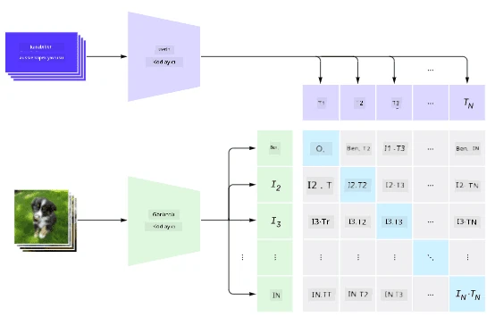
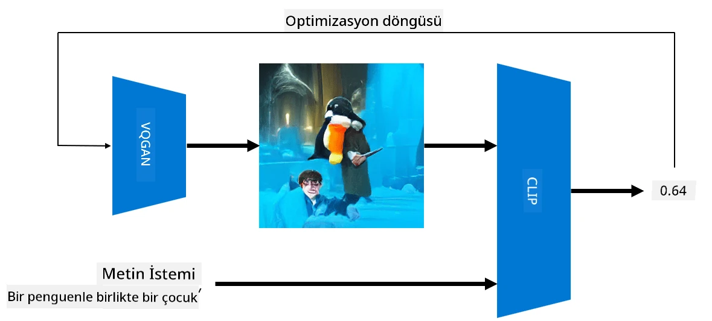

# Çok Modlu Ağlar

Transformer modellerinin NLP görevlerini çözmedeki başarısından sonra, aynı veya benzer mimariler bilgisayar görme görevlerine uygulanmaya başlandı. Görme ve doğal dil yeteneklerini *birleştiren* modeller oluşturma konusunda artan bir ilgi var. Bu girişimlerden biri OpenAI tarafından gerçekleştirildi ve CLIP ile DALL.E olarak adlandırıldı.

## Karşılaştırmalı Görüntü Ön Eğitimi (CLIP)

CLIP'in temel fikri, metin istemlerini bir görüntüyle karşılaştırabilmek ve görüntünün istemle ne kadar iyi eşleştiğini belirlemektir.

> *Resim [bu blog yazısından](https://openai.com/blog/clip/)*

Model, internetten elde edilen görüntüler ve bunların altyazıları üzerinde eğitilmiştir. Her bir batch için, N çift (görüntü, metin) alırız ve bunları bazı vektör temsillerine dönüştürürüz: I, ..., T. Bu temsiller daha sonra birbirleriyle eşleştirilir. Kayıp fonksiyonu, bir çiftin (örneğin I ve T) vektörleri arasındaki kosinüs benzerliğini maksimize etmek ve diğer tüm çiftler arasındaki kosinüs benzerliğini minimize etmek için tanımlanmıştır. Bu yaklaşımın **karşılaştırmalı** olarak adlandırılmasının nedeni budur.

CLIP modeli/kütüphanesi [OpenAI GitHub](https://github.com/openai/CLIP) üzerinden erişilebilir. Yaklaşım [bu blog yazısında](https://openai.com/blog/clip/) ve daha ayrıntılı olarak [bu makalede](https://arxiv.org/pdf/2103.00020.pdf) açıklanmıştır.

Bu model önceden eğitildikten sonra, bir grup görüntü ve bir grup metin istemi verebiliriz ve model bize olasılıkları içeren bir tensör döndürür. CLIP birkaç görev için kullanılabilir:

**Görüntü Sınıflandırma**

Diyelim ki görüntüleri kediler, köpekler ve insanlar arasında sınıflandırmamız gerekiyor. Bu durumda, modele bir görüntü ve bir dizi metin istemi verebiliriz: "*bir kedi resmi*", "*bir köpek resmi*", "*bir insan resmi*". Sonuçta elde edilen 3 olasılık vektöründe en yüksek değere sahip indeksi seçmemiz yeterlidir.

> *Resim [bu blog yazısından](https://openai.com/blog/clip/)*

**Metin Tabanlı Görüntü Arama**

Tam tersini de yapabiliriz. Eğer elimizde bir görüntü koleksiyonu varsa, bu koleksiyonu modele ve bir metin istemine verebiliriz - bu, verilen isteme en çok benzeyen görüntüyü bize verir.

## ✍️ Örnek: [CLIP ile Görüntü Sınıflandırma ve Görüntü Arama](../../../../../lessons/X-Extras/X1-MultiModal/Clip.ipynb)

CLIP'in nasıl çalıştığını görmek için [Clip.ipynb](../../../../../lessons/X-Extras/X1-MultiModal/Clip.ipynb) notebook'unu açın.

## VQGAN+CLIP ile Görüntü Oluşturma

CLIP, bir metin isteminden **görüntü oluşturma** için de kullanılabilir. Bunu yapmak için, bazı vektör girdilerine dayalı olarak görüntü oluşturabilecek bir **üretici modeline** ihtiyacımız var. Bu modellerden biri [VQGAN](https://compvis.github.io/taming-transformers/) (Vector-Quantized GAN) olarak adlandırılır.

VQGAN'ı sıradan [GAN](../../4-ComputerVision/10-GANs/README.md)'dan ayıran temel fikirler şunlardır:
* Görüntüyü oluşturan bağlam açısından zengin görsel parçaların bir dizisini oluşturmak için otoregresif transformer mimarisi kullanmak. Bu görsel parçalar ise [CNN](../../4-ComputerVision/07-ConvNets/README.md) tarafından öğrenilir.
* Görüntünün parçalarının "gerçek" mi yoksa "sahte" mi olduğunu algılayan alt görüntü ayrımcısı kullanmak (geleneksel GAN'daki "tamamen ya da hiç" yaklaşımının aksine).

VQGAN hakkında daha fazla bilgi edinmek için [Taming Transformers](https://compvis.github.io/taming-transformers/) web sitesini ziyaret edin.

VQGAN ile geleneksel GAN arasındaki önemli farklardan biri, geleneksel GAN'ın herhangi bir giriş vektöründen düzgün bir görüntü üretebilmesi, ancak VQGAN'ın tutarlı bir görüntü üretme olasılığının düşük olmasıdır. Bu nedenle, görüntü oluşturma sürecini daha fazla yönlendirmemiz gerekir ve bu CLIP kullanılarak yapılabilir.

Bir metin istemine karşılık gelen bir görüntü oluşturmak için, rastgele bir kodlama vektörüyle başlarız ve bu vektör VQGAN'dan geçirilerek bir görüntü oluşturulur. Daha sonra CLIP, görüntünün metin istemine ne kadar iyi uyduğunu gösteren bir kayıp fonksiyonu üretmek için kullanılır. Amaç, bu kaybı minimize etmek ve geri yayılım kullanarak giriş vektör parametrelerini ayarlamaktır.

VQGAN+CLIP'i uygulayan harika bir kütüphane [Pixray](http://github.com/pixray/pixray)'dir.

 |   | 
----|----|----
*Edebiyat öğretmeni olan genç bir erkeğin kitapla yakın çekim suluboya portresi* isteminden üretilen resim | *Bilgisayar bilimi öğretmeni olan genç bir kadının bilgisayarla yakın çekim yağlı boya portresi* isteminden üretilen resim | *Matematik öğretmeni olan yaşlı bir erkeğin kara tahta önünde yakın çekim yağlı boya portresi* isteminden üretilen resim

> Resimler **Yapay Öğretmenler** koleksiyonundan, [Dmitry Soshnikov](http://soshnikov.com) tarafından.

## DALL-E
### [DALL-E 1](https://openai.com/research/dall-e)
DALL-E, istemlerden görüntü oluşturmak için eğitilmiş bir GPT-3 versiyonudur. 12 milyar parametre ile eğitilmiştir.

CLIP'ten farklı olarak, DALL-E hem metni hem de görüntüyü bir dizi token olarak alır. Bu nedenle, birden fazla istemden metne dayalı görüntüler oluşturabilirsiniz.

### [DALL-E 2](https://openai.com/dall-e-2)
DALL-E 1 ve 2 arasındaki temel fark, DALL-E 2'nin daha gerçekçi görüntüler ve sanat eserleri üretmesidir.

DALL-E ile görüntü oluşturma örnekleri:
 |   | 
----|----|----
*Edebiyat öğretmeni olan genç bir erkeğin kitapla yakın çekim suluboya portresi* isteminden üretilen resim | *Bilgisayar bilimi öğretmeni olan genç bir kadının bilgisayarla yakın çekim yağlı boya portresi* isteminden üretilen resim | *Matematik öğretmeni olan yaşlı bir erkeğin kara tahta önünde yakın çekim yağlı boya portresi* isteminden üretilen resim

## Kaynaklar

* VQGAN Makalesi: [Taming Transformers for High-Resolution Image Synthesis](https://compvis.github.io/taming-transformers/paper/paper.pdf)
* CLIP Makalesi: [Learning Transferable Visual Models From Natural Language Supervision](https://arxiv.org/pdf/2103.00020.pdf)

**Feragatname**:  
Bu belge, AI çeviri hizmeti [Co-op Translator](https://github.com/Azure/co-op-translator) kullanılarak çevrilmiştir. Doğruluk için çaba göstersek de, otomatik çevirilerin hata veya yanlışlık içerebileceğini lütfen unutmayın. Belgenin orijinal dili, yetkili kaynak olarak kabul edilmelidir. Kritik bilgiler için profesyonel insan çevirisi önerilir. Bu çevirinin kullanımından kaynaklanan yanlış anlamalar veya yanlış yorumlamalardan sorumlu değiliz.