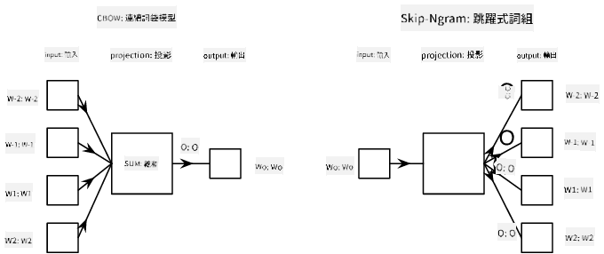

<!--
CO_OP_TRANSLATOR_METADATA:
{
  "original_hash": "7ba20f54a5bfcd6521018cdfb17c7c57",
  "translation_date": "2025-09-23T13:02:37+00:00",
  "source_file": "lessons/5-NLP/15-LanguageModeling/README.md",
  "language_code": "tw"
}
-->
# 語言建模

語義嵌入（如 Word2Vec 和 GloVe）實際上是邁向**語言建模**的第一步——建立能夠以某種方式*理解*（或*表示*）語言特性的模型。

## [課前測驗](https://ff-quizzes.netlify.app/en/ai/quiz/29)

語言建模的核心思想是以無監督的方式在未標註的數據集上進行訓練。這很重要，因為我們擁有大量未標註的文本，而標註文本的數量則受到我們能投入的標註工作量的限制。通常，我們可以構建能夠**預測缺失詞**的語言模型，因為在文本中隨機遮蔽一個詞並將其作為訓練樣本是相對容易的。

## 嵌入訓練

在之前的例子中，我們使用了預訓練的語義嵌入，但了解這些嵌入是如何訓練的也很有趣。有幾種可能的思路可以採用：

* **N-Gram** 語言建模，通過查看前 N 個詞元（N-gram）來預測一個詞元。
* **連續詞袋模型** (CBoW)，在詞元序列 $W_{-N}$, ..., $W_N$ 中預測中間的詞元 $W_0$。
* **Skip-gram**，通過中間詞元 $W_0$ 預測一組相鄰的詞元 {$W_{-N},\dots, W_{-1}, W_1,\dots, W_N$}。

> 圖片來源：[這篇論文](https://arxiv.org/pdf/1301.3781.pdf)

## ✍️ 示例筆記本：訓練 CBoW 模型

繼續學習以下筆記本：

* [使用 TensorFlow 訓練 CBoW Word2Vec](CBoW-TF.ipynb)
* [使用 PyTorch 訓練 CBoW Word2Vec](CBoW-PyTorch.ipynb)

## 結論

在上一課中，我們看到詞嵌入的效果就像魔法一樣！現在我們知道，訓練詞嵌入並不是一項非常複雜的任務，如果需要，我們應該能夠為特定領域的文本訓練自己的詞嵌入。

## [課後測驗](https://ff-quizzes.netlify.app/en/ai/quiz/30)

## 回顧與自學

* [PyTorch 官方語言建模教程](https://pytorch.org/tutorials/beginner/nlp/word_embeddings_tutorial.html)。
* [TensorFlow 官方訓練 Word2Vec 模型教程](https://www.TensorFlow.org/tutorials/text/word2vec)。
* 使用 **gensim** 框架訓練最常用嵌入的簡單方法可參考[此文檔](https://pytorch.org/tutorials/beginner/nlp/word_embeddings_tutorial.html)。

## 🚀 [作業：訓練 Skip-Gram 模型](lab/README.md)

在實驗中，我們挑戰你修改本課的代碼，將 CBoW 模型改為 Skip-Gram 模型。[閱讀詳情](lab/README.md)

---

