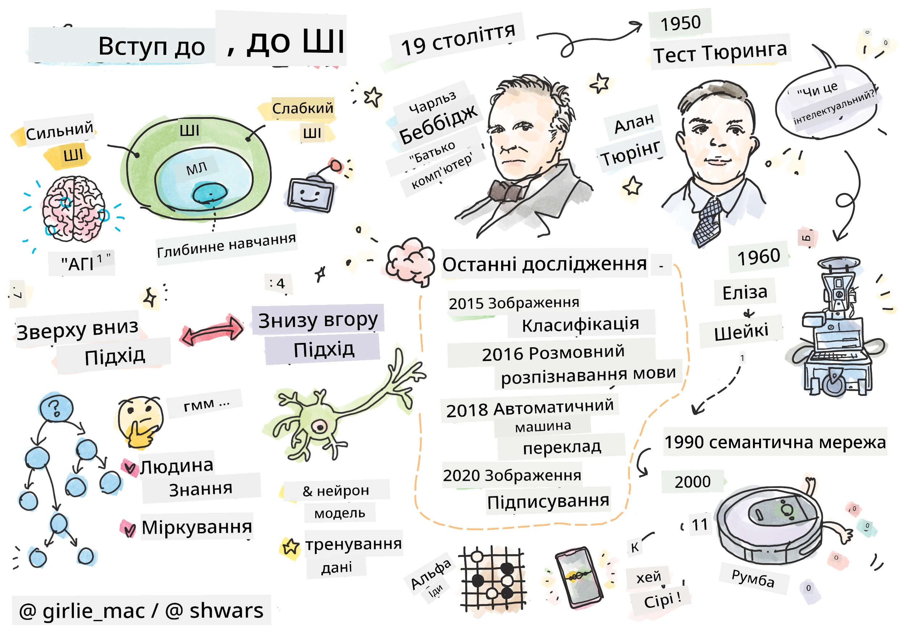
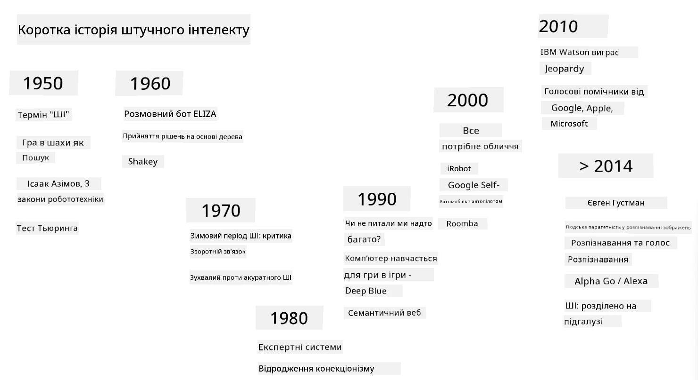

# Вступ до штучного інтелекту

> Малюнок від [Tomomi Imura](https://twitter.com/girlie_mac)

## [Тест перед лекцією](https://ff-quizzes.netlify.app/en/ai/quiz/1)

**Штучний інтелект** — це захоплююча наукова дисципліна, яка досліджує, як можна змусити комп’ютери демонструвати розумну поведінку, наприклад, виконувати ті завдання, які добре вдаються людям.

Спочатку комп’ютери були винайдені [Чарльзом Беббіджем](https://en.wikipedia.org/wiki/Charles_Babbage) для роботи з числами за чітко визначеною процедурою — алгоритмом. Сучасні комп’ютери, хоча й значно більш розвинені, ніж оригінальна модель, запропонована у 19 столітті, все ще дотримуються тієї ж ідеї контрольованих обчислень. Таким чином, можна запрограмувати комп’ютер виконувати щось, якщо ми знаємо точну послідовність кроків, необхідних для досягнення мети.

> Фото від [Vickie Soshnikova](http://twitter.com/vickievalerie)

> ✅ Визначення віку людини за її фотографією — це завдання, яке неможливо явно запрограмувати, тому що ми не знаємо, як саме приходимо до числа в нашій голові, коли робимо це.

---

Однак є завдання, які ми не знаємо, як вирішити явно. Наприклад, визначення віку людини за її фотографією. Ми якось навчаємося це робити, тому що бачили багато прикладів людей різного віку, але ми не можемо чітко пояснити, як це робимо, і не можемо запрограмувати комп’ютер для цього. Саме такі завдання цікавлять **Штучний інтелект** (скорочено ШІ).

✅ Подумайте про деякі завдання, які ви могли б передати комп’ютеру, щоб отримати користь від ШІ. Розгляньте сфери фінансів, медицини та мистецтва — як ці сфери сьогодні отримують користь від ШІ?

## Слабкий ШІ проти Сильного ШІ

Слабкий ШІ | Сильний ШІ
---------------------------------------|-------------------------------------
Слабкий ШІ стосується систем ШІ, які розроблені та навчені для виконання конкретного завдання або вузького набору завдань.|Сильний ШІ, або Загальний штучний інтелект (AGI), стосується систем ШІ з інтелектом і розумінням на рівні людини.
Ці системи ШІ не є загальноінтелектуальними; вони відмінно виконують заздалегідь визначене завдання, але не мають справжнього розуміння чи свідомості.|Ці системи ШІ мають здатність виконувати будь-яке інтелектуальне завдання, яке може виконувати людина, адаптуватися до різних сфер і володіти формою свідомості чи самосвідомості.
Приклади слабкого ШІ включають віртуальних помічників, таких як Siri або Alexa, алгоритми рекомендацій, які використовуються потоковими сервісами, і чат-боти, розроблені для конкретних завдань обслуговування клієнтів.|Досягнення Сильного ШІ є довгостроковою метою досліджень ШІ і потребуватиме розробки систем ШІ, які можуть міркувати, навчатися, розуміти та адаптуватися до широкого спектру завдань і контекстів.
Слабкий ШІ є високоспеціалізованим і не володіє когнітивними здібностями, схожими на людські, або загальними можливостями вирішення проблем за межами своєї вузької сфери.|Сильний ШІ наразі є теоретичною концепцією, і жодна система ШІ не досягла цього рівня загального інтелекту.

Детальніше дивіться **[Загальний штучний інтелект](https://en.wikipedia.org/wiki/Artificial_general_intelligence)** (AGI).

## Визначення інтелекту та тест Тьюринга

Однією з проблем при роботі з терміном **[Інтелект](https://en.wikipedia.org/wiki/Intelligence)** є те, що немає чіткого визначення цього терміну. Можна стверджувати, що інтелект пов’язаний з **абстрактним мисленням** або **самосвідомістю**, але ми не можемо належним чином його визначити.

> [Фото](https://unsplash.com/photos/75715CVEJhI) від [Amber Kipp](https://unsplash.com/@sadmax) з Unsplash

Щоб побачити неоднозначність терміну *інтелект*, спробуйте відповісти на запитання: "Чи є кіт розумним?". Різні люди схильні давати різні відповіді на це запитання, оскільки немає загальноприйнятого тесту, щоб довести, що твердження є істинним чи ні. А якщо ви думаєте, що такий тест існує — спробуйте провести IQ-тест для вашого кота...

✅ Подумайте хвилину, як ви визначаєте інтелект. Чи є ворона, яка може пройти лабіринт і дістатися до їжі, розумною? Чи є дитина розумною?

---

Коли ми говоримо про AGI, нам потрібен спосіб визначити, чи створили ми справді розумну систему. [Алан Тьюринг](https://en.wikipedia.org/wiki/Alan_Turing) запропонував спосіб, який називається **[Тест Тьюринга](https://en.wikipedia.org/wiki/Turing_test)**, який також діє як визначення інтелекту. Тест порівнює дану систему з чимось, що є розумним за своєю суттю — реальною людиною, і оскільки будь-яке автоматичне порівняння може бути обійдене комп’ютерною програмою, ми використовуємо людського допитувача. Отже, якщо людина не може відрізнити реальну людину від комп’ютерної системи в текстовому діалозі — система вважається розумною.

> Чат-бот під назвою [Eugene Goostman](https://en.wikipedia.org/wiki/Eugene_Goostman), розроблений у Санкт-Петербурзі, наблизився до проходження тесту Тьюринга у 2014 році, використовуючи хитрий трюк з особистістю. Він одразу заявив, що є 13-річним українським хлопчиком, що пояснювало брак знань і деякі невідповідності в тексті. Бот переконав 30% суддів, що він людина, після 5-хвилинного діалогу — метрика, яку Тьюринг вважав, що машина зможе пройти до 2000 року. Однак слід розуміти, що це не означає, що ми створили розумну систему або що комп’ютерна система обдурила людського допитувача — система не обдурила людей, а скоріше творці бота!

✅ Чи вас коли-небудь обманював чат-бот, змушуючи думати, що ви розмовляєте з людиною? Як він вас переконав?

## Різні підходи до ШІ

Якщо ми хочемо, щоб комп’ютер поводився як людина, нам потрібно якось змоделювати наш спосіб мислення всередині комп’ютера. Відповідно, нам потрібно спробувати зрозуміти, що робить людину розумною.

> Щоб запрограмувати інтелект у машині, нам потрібно зрозуміти, як працюють наші власні процеси прийняття рішень. Якщо ви трохи заглянете в себе, то зрозумієте, що деякі процеси відбуваються підсвідомо — наприклад, ми можемо відрізнити кота від собаки, не думаючи про це, — тоді як інші включають міркування.

Існує два можливих підходи до цієї проблеми:

Підхід "зверху вниз" (символічне міркування) | Підхід "знизу вверх" (нейронні мережі)
---------------------------------------|-------------------------------------
Підхід "зверху вниз" моделює спосіб, яким людина міркує для вирішення проблеми. Він включає вилучення **знань** від людини та представлення їх у формі, яку може прочитати комп’ютер. Нам також потрібно розробити спосіб моделювання **міркувань** всередині комп’ютера. | Підхід "знизу вверх" моделює структуру людського мозку, що складається з величезної кількості простих одиниць, які називаються **нейронами**. Кожен нейрон діє як зважене середнє своїх входів, і ми можемо навчити мережу нейронів вирішувати корисні проблеми, надаючи **навчальні дані**.

Існують також інші можливі підходи до інтелекту:

* **Емерджентний**, **синергетичний** або **багатоагентний підхід** базуються на тому факті, що складна розумна поведінка може бути отримана шляхом взаємодії великої кількості простих агентів. Згідно з [еволюційною кібернетикою](https://en.wikipedia.org/wiki/Global_brain#Evolutionary_cybernetics), інтелект може *виникати* з більш простішої, реактивної поведінки в процесі *переходу до метасистеми*.

* **Еволюційний підхід**, або **генетичний алгоритм**, є процесом оптимізації, заснованим на принципах еволюції.

Ми розглянемо ці підходи пізніше в курсі, але зараз ми зосередимося на двох основних напрямках: "зверху вниз" і "знизу вверх".

### Підхід "зверху вниз"

У **підході "зверху вниз"** ми намагаємося змоделювати наше міркування. Оскільки ми можемо слідкувати за своїми думками, коли міркуємо, ми можемо спробувати формалізувати цей процес і запрограмувати його всередині комп’ютера. Це називається **символічним міркуванням**.

Люди, як правило, мають певні правила в голові, які керують їхніми процесами прийняття рішень. Наприклад, коли лікар ставить діагноз пацієнту, він або вона може зрозуміти, що у людини є лихоманка, і, отже, може бути запалення в організмі. Застосовуючи великий набір правил до конкретної проблеми, лікар може прийти до остаточного діагнозу.

Цей підхід сильно залежить від **представлення знань** і **міркувань**. Вилучення знань від людського експерта може бути найскладнішою частиною, оскільки лікар у багатьох випадках не знає точно, чому він або вона приходить до певного діагнозу. Іноді рішення просто з’являється в його або її голові без явного мислення. Деякі завдання, такі як визначення віку людини за фотографією, взагалі не можуть бути зведені до маніпулювання знаннями.

### Підхід "знизу вверх"

Альтернативно, ми можемо спробувати змоделювати найпростіші елементи всередині нашого мозку — нейрон. Ми можемо створити так звану **штучну нейронну мережу** всередині комп’ютера, а потім спробувати навчити її вирішувати проблеми, надаючи їй приклади. Цей процес схожий на те, як новонароджена дитина вивчає своє оточення, роблячи спостереження.

✅ Проведіть невелике дослідження про те, як діти навчаються. Які основні елементи мозку дитини?

> | А як щодо ML?         |      |
> |--------------|-----------|
> | Частина штучного інтелекту, яка базується на навчанні комп’ютера вирішувати проблему на основі деяких даних, називається **Машинним навчанням**. Ми не будемо розглядати класичне машинне навчання в цьому курсі — ми рекомендуємо вам окремий навчальний курс [Машинне навчання для початківців](http://aka.ms/ml-beginners). |       |

## Коротка історія ШІ

Штучний інтелект як галузь був започаткований у середині двадцятого століття. Спочатку символічне міркування було переважним підходом, і це призвело до низки важливих успіхів, таких як експертні системи — комп’ютерні програми, які могли діяти як експерт у деяких обмежених проблемних областях. Однак незабаром стало зрозуміло, що такий підхід погано масштабується. Вилучення знань від експерта, представлення їх у комп’ютері та підтримка цієї бази знань у актуальному стані виявляється дуже складним завданням і занадто дорогим для практичного використання в багатьох випадках. Це призвело до так званої [Зими ШІ](https://en.wikipedia.org/wiki/AI_winter) у 1970-х роках.

> Зображення від [Dmitry Soshnikov](http://soshnikov.com)

З часом обчислювальні ресурси стали дешевшими, і стало доступно більше даних, тому підходи нейронних мереж почали демонструвати чудову продуктивність у змаганнях з людьми в багатьох сферах, таких як комп’ютерне бачення або розуміння мови. У останнє десятиліття термін "Штучний інтелект" здебільшого використовувався як синонім нейронних мереж, оскільки більшість успіхів ШІ, про які ми чуємо, базуються на них.

Ми можемо спостерігати, як змінювалися підходи, наприклад, у створенні комп’ютерної програми для гри в шахи:

* Ранні шахові програми базувалися на пошуку — програма явно намагалася оцінити можливі ходи суперника для заданої кількості наступних ходів і вибирала оптимальний хід на основі оптимальної позиції, яку можна досягти за кілька ходів. Це призвело до розробки так званого [алгоритму альфа-бета обрізання](https://en.wikipedia.org/wiki/Alpha%E2%80%93beta_pruning).
* Стратегії пошуку добре працюють ближче до кінця гри, де простір пошуку обмежений невеликою кількістю можливих ходів. Однак на початку гри простір пошуку величезний, і алгоритм можна покращити, навчаючись на існуючих матчах між людськими гравцями. Наступні експерименти використовували так зване [міркування на основі випадків](https://en.wikipedia.org/wiki/Case-based_reasoning), де програма шукала випадки в базі знань, дуже схожі на поточну позицію в грі.
* Сучасні програми, які перемагають людських гравців, базуються на нейронних мережах і [підкріплювальному навчанні](https://en.wikipedia.org/wiki/Reinforcement_learning), де програми навчаються грати, граючи довгий час проти самих себе та навчаючись на власних помилках — так само, як люди навчаються грати в шахи. Однак комп’ютерна програма може зіграти набагато більше ігор за набагато менший час, і тому може навчатися набагато швидше.

✅ Проведіть невелике дослідження про інші ігри, в які грали ШІ.

Так само ми можемо побачити, як змінювався підхід до створення "розмовляючих програм" (які могли б пройти тест Тьюринга):

* Ранні програми такого типу, як [Eliza](https://en.wikipedia.org/wiki/ELIZA), базувалися на дуже простих граматичних правилах і переформулюванні вхідного речення у запитання.
* Сучасні помічники
> Зображення Дмитра Сошникова, [фото](https://unsplash.com/photos/r8LmVbUKgns) Марини Абросімової, [Unsplash](https://unsplash.com/@abrosimova_marina_foto)

## Останні дослідження в галузі штучного інтелекту

Величезний ріст досліджень нейронних мереж почався приблизно у 2010 році, коли стали доступними великі публічні набори даних. Величезна колекція зображень під назвою [ImageNet](https://en.wikipedia.org/wiki/ImageNet), яка містить близько 14 мільйонів анотованих зображень, дала початок [ImageNet Large Scale Visual Recognition Challenge](https://image-net.org/challenges/LSVRC/).

> Зображення [Дмитра Сошникова](http://soshnikov.com)

У 2012 році [Convolutional Neural Networks](../4-ComputerVision/07-ConvNets/README.md) вперше були використані для класифікації зображень, що призвело до значного зниження помилок класифікації (з майже 30% до 16,4%). У 2015 році архітектура ResNet від Microsoft Research [досягла точності на рівні людини](https://doi.org/10.1109/ICCV.2015.123).

З того часу нейронні мережі продемонстрували дуже успішну поведінку у багатьох завданнях:

---

Рік | Досягнення рівня людини
-----|--------
2015 | [Класифікація зображень](https://doi.org/10.1109/ICCV.2015.123)
2016 | [Розпізнавання розмовної мови](https://arxiv.org/abs/1610.05256)
2018 | [Автоматичний машинний переклад](https://arxiv.org/abs/1803.05567) (з китайської на англійську)
2020 | [Опис зображень](https://arxiv.org/abs/2009.13682)

За останні кілька років ми стали свідками величезних успіхів великих мовних моделей, таких як BERT і GPT-3. Це стало можливим здебільшого завдяки тому, що існує багато загальних текстових даних, які дозволяють навчати моделі розуміти структуру та зміст текстів, попередньо тренувати їх на загальних текстових колекціях, а потім спеціалізувати ці моделі для більш конкретних завдань. Ми дізнаємося більше про [обробку природної мови](../5-NLP/README.md) пізніше в цьому курсі.

## 🚀 Виклик

Здійсніть огляд інтернету, щоб визначити, де, на вашу думку, штучний інтелект використовується найефективніше. Це може бути додаток для картографії, сервіс перетворення мови в текст або відеогра? Дослідіть, як була створена ця система.

## [Тест після лекції](https://ff-quizzes.netlify.app/en/ai/quiz/2)

## Огляд і самостійне навчання

Ознайомтеся з історією штучного інтелекту та машинного навчання, прочитавши [цей урок](https://github.com/microsoft/ML-For-Beginners/tree/main/1-Introduction/2-history-of-ML). Візьміть елемент зі скетчноту на початку цього уроку або цього і дослідіть його глибше, щоб зрозуміти культурний контекст, який вплинув на його розвиток.

**Завдання**: [Game Jam](assignment.md)

---

<!-- CO-OP TRANSLATOR DISCLAIMER START -->
**Відмова від відповідальності**:  
Цей документ був перекладений за допомогою сервісу автоматичного перекладу [Co-op Translator](https://github.com/Azure/co-op-translator). Хоча ми прагнемо до точності, звертаємо вашу увагу, що автоматичні переклади можуть містити помилки або неточності. Оригінальний документ на його рідній мові слід вважати авторитетним джерелом. Для критичної інформації рекомендується професійний людський переклад. Ми не несемо відповідальності за будь-які непорозуміння або неправильні тлумачення, що виникли внаслідок використання цього перекладу.
<!-- CO-OP TRANSLATOR DISCLAIMER END -->