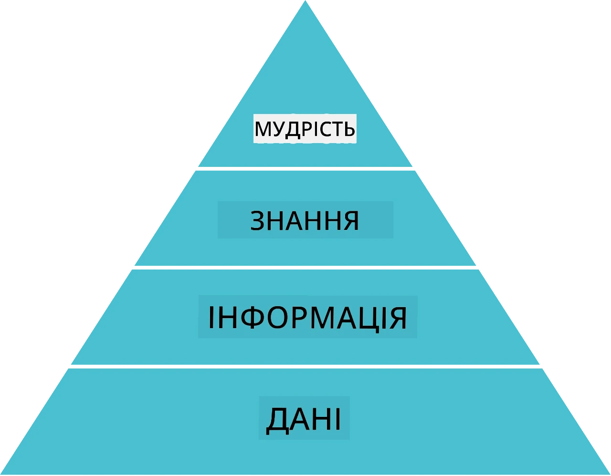
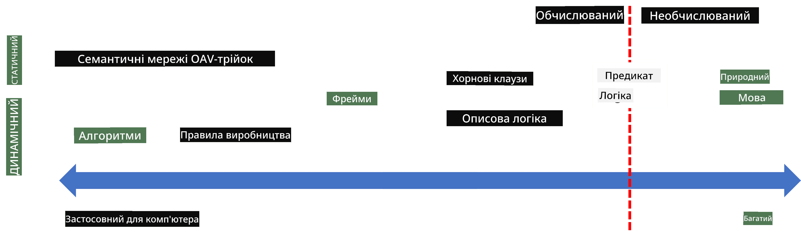
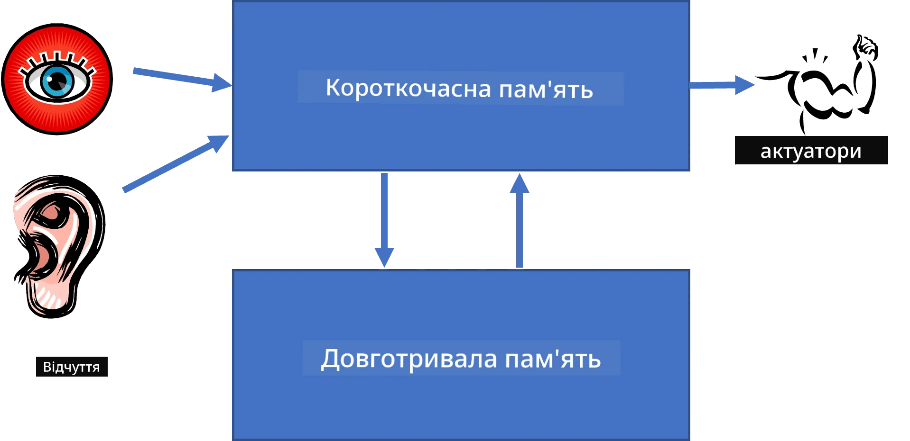
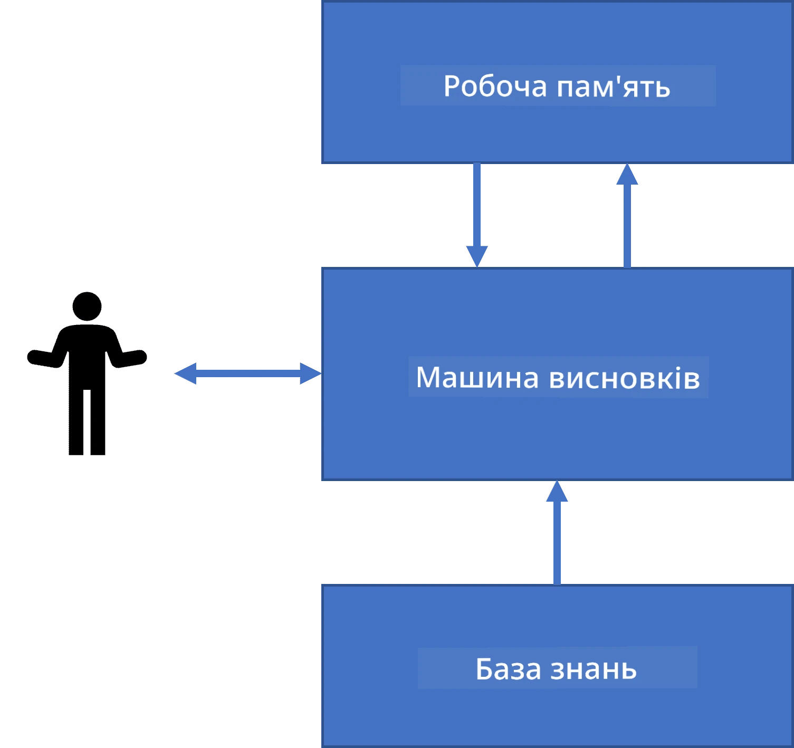
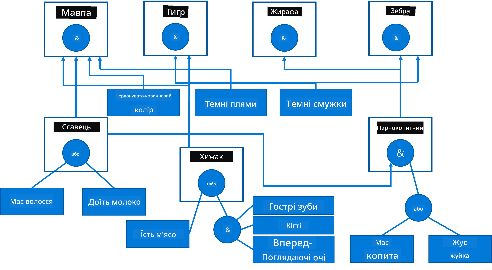
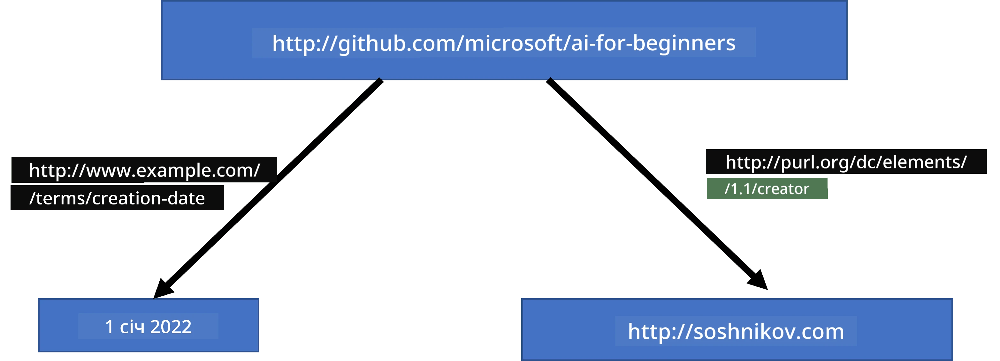
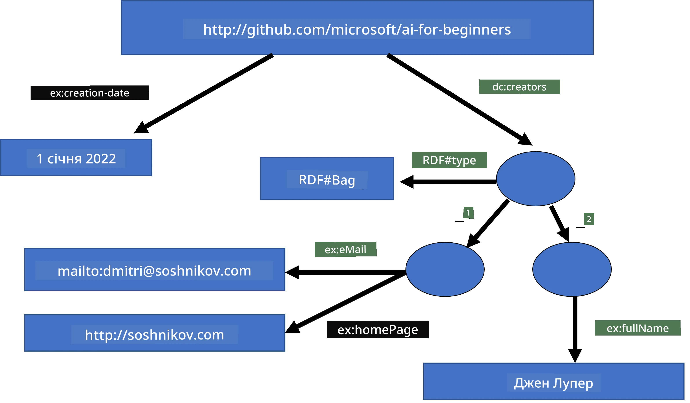
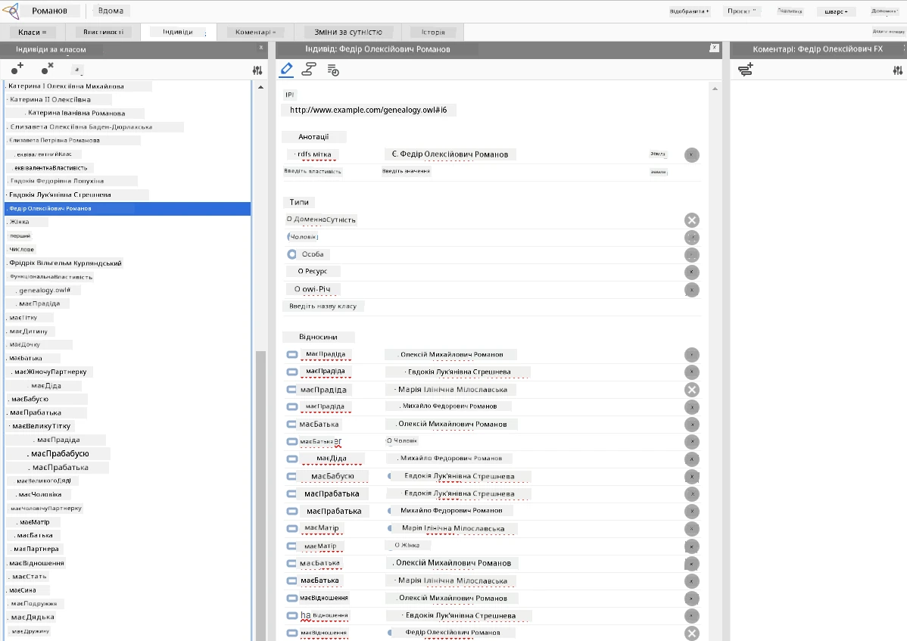

# Представлення знань та експертні системи


> Лаконічна замітка від [Tomomi Imura](https://twitter.com/girlie_mac)

Пошук штучного інтелекту базується на пошуку знань, щоб розуміти світ так само, як і люди. Але як це зробити?

## [Попередній тест](https://ff-quizzes.netlify.app/en/ai/quiz/3)

У ранні дні AI популярним був підхід зверху вниз до створення інтелектуальних систем (обговорений у попередньому уроці). Ідея полягала у вилученні знань від людей у форму, зрозумілу машиною, а потім автоматичному вирішенні проблем на її основі. Цей підхід базувався на двох великих ідеях:

* Представлення знань
* Міркування

## Представлення знань

Однією з важливих концепцій у Символічному AI є **знання**. Важливо відрізняти знання від *інформації* або *даних*. Наприклад, можна сказати, що книги містять знання, тому що, вивчаючи книги, можна стати експертом. Проте те, що міститься в книгах, фактично називається *даними*, а читаючи книги та інтегруючи ці дані у нашу модель світу, ми перетворюємо дані на знання.

> ✅ **Знання** — це те, що міститься в нашій свідомості і представляє наше розуміння світу. Воно отримується через активний процес **навчання**, що інтегрує отриману інформацію у наш активний світогляд.

Здебільшого ми не даємо суворого визначення знання, але узгоджуємо його з іншими спорідненими поняттями за допомогою [піраміди DIKW](https://en.wikipedia.org/wiki/DIKW_pyramid). Вона містить наступні поняття:

* **Дані** — це те, що представлено на фізичному носії, наприклад, у вигляді написаного тексту або усних слів. Дані існують незалежно від людей і можуть передаватися між ними.
* **Інформація** — це те, як ми інтерпретуємо дані в голові. Наприклад, коли ми чуємо слово *комп’ютер*, ми маємо якесь розуміння, що це таке.
* **Знання** — це інформація, інтегрована у нашу світову модель. Наприклад, коли ми дізнаємося, що таке комп’ютер, ми маємо уявлення про те, як він працює, скільки коштує і для чого використовується. Це мережа взаємозалежних понять, що формують наші знання.
* **Мудрість** — це щабель вищого рівня розуміння світу, яка представляє *мета-знання*, тобто уявлення про те, коли і як слід застосовувати знання.



*Зображення [з Вікіпедії](https://commons.wikimedia.org/w/index.php?curid=37705247), автор Longlivetheux - власна робота, CC BY-SA 4.0*

Отже, задача **представлення знань** полягає у знаходженні ефективного способу представляти знання всередині комп’ютера у формі даних, щоб їх можна було автоматично використовувати. Це можна уявити як спектр:



> Зображення від [Dmitry Soshnikov](http://soshnikov.com)

* Зліва розташовані дуже прості типи представлення знань, які можуть ефективно використовуватися комп’ютерами. Найпростіший — алгоритмічний, коли знання представлені комп’ютерною програмою. Проте це не найкращий спосіб представлення знань, бо він не гнучкий. Знання в нашій голові нерідко неалгоритмічні.
* Справа — представлення, такі як природний текст. Він найпотужніший, але не придатний для автоматичних міркувань.

> ✅ Подумайте хвилину, як ви представляєте знання у своїй голові і конвертуєте його у нотатки. Чи є певний формат, який сприяє кращому запам’ятовуванню?

## Класифікація комп’ютерних методів представлення знань

Ми можемо класифікувати різні методи представлення знань у комп’ютері за такими категоріями:

* **Мережева репрезентація** базується на тому, що в нашій свідомості існує мережа взаємопов’язаних понять. Ми можемо спробувати відтворити такі ж мережі у вигляді графа в комп’ютері — так званої **семантичної мережі**.

1. **Триплети об’єкт-атрибут-значення** або **пари атрибут-значення**. Оскільки граф можна представити у комп’ютері у вигляді списку вузлів і ребер, ми можемо представити семантичну мережу як список триплетів, що містять об’єкти, атрибути та значення. Наприклад, побудуємо наступні триплети про мови програмування:

Об’єкт | Атрибут | Значення
-------|---------|---------
Python | є | Не типізованою мовою
Python | винайшов | Guido van Rossum
Python | синтаксис блоку | відступи
Не типізована мова | не має | визначень типів

> ✅ Подумайте, як за допомогою триплетів можна представити інші типи знань.

2. **Ієрархічні представлення** підкреслюють, що ми часто створюємо ієрархію об’єктів у своїй свідомості. Наприклад, ми знаємо, що канарейка — це птах, і всі птахи мають крила. Ми також маємо уявлення про колір канарейки і її швидкість польоту.

   - **Фреймова репрезентація** базується на представленні кожного об’єкта або класу об’єктів як **фрейму**, що містить **слоти**. Слоти можуть мати можливі значення за замовчуванням, обмеження значень або збережені процедури, які можна викликати для отримання значення слоту. Усі фрейми формують ієрархію, подібну до ієрархії об’єктів в об’єктно-орієнтованих мовах програмування.
   - **Сценарії** — це особливий вид фреймів, які представляють складні ситуації, що можуть розгортатися в часі.

**Python**

Слот | Значення | Значення за замовчуванням | Інтервал
-----|----------|---------------------------|----------
Назва | Python | | |
Є-Типом | Не типізована мова | | |
Регістр змінної | | CamelCase | |
Довжина програми | | | 5-5000 рядків |
Синтаксис блоку | Відступи | | |

3. **Процедурні представлення** базуються на представленні знань як списку дій, які можна виконати за певної умови.
   - Правила продукції — це умова-оператор if-then, які дозволяють робити висновки. Наприклад, у лікаря може бути правило: **ЯКЩО** у пацієнта висока температура **АБО** високий рівень C-реактивного білка у крові, **ТО** у нього є запалення. Як тільки одна з умов виконується, можна зробити висновок про запалення і використати його у подальших міркуваннях.
   - Алгоритми можна вважати іншою формою процедурного представлення, хоча їх майже ніколи безпосередньо не використовують у системах, що базуються на знаннях.

4. **Логіка** була спочатку запропонована Арістотелем як спосіб представлення універсальних людських знань.
   - Предикатна логіка як математична теорія надто багата для обчислення, тому зазвичай використовують її підмножину, наприклад, горнові клаузи, які застосовуються у Prolog.
   - Описова логіка — це сімейство логічних систем для представлення і міркувань про ієрархії об’єктів, розподілені представлення знань, такі як *семантична павутина*.

## Експертні системи

Одним із ранніх успіхів символічного AI були так звані **експертні системи** — комп’ютерні системи, які розроблялися для імітації експерта в деякій обмеженій предметній області. Вони базувалися на **базі знань**, вилученій від одного чи більше експертів-людей, та містили **вивідний механізм**, який виконував певні міркування на її основі.

 | 
---------------------------------------------------|------------------------------------------------------
Спрощена структура нейронної системи людини | Архітектура системи, що базується на знаннях

Експертні системи побудовані за зразком людської системи міркувань, що містить **короткочасну пам’ять** і **довготривалу пам’ять**. Аналогічно в системах на основі знань розрізняють такі компоненти:

* **Проблемна пам’ять**: містить знання про проблему, яка наразі розв’язується, напр., температуру або артеріальний тиск пацієнта, чи є в нього запалення тощо. Ці знання також називають **статичними знаннями**, тому що вони містять снимок того, що ми зараз знаємо про проблему — так званий *стан проблеми*.
* **База знань**: подає довготермінові знання про предметну область. Вона отримується вручну від експертів і не змінюється під час консультацій. Оскільки вона дозволяє переміщатися від одного стану проблеми до іншого, її також називають **динамічними знаннями**.
* **Вивідний механізм**: координує увесь процес пошуку у просторі станів проблеми, задаючи користувачу питання за потреби. Він також відповідає за пошук правил, які слід застосувати до кожного стану.

Як приклад розглянемо експертну систему визначення тварини на основі її фізичних характеристик:



> Зображення від [Dmitry Soshnikov](http://soshnikov.com)

Цю діаграму називають **AND-OR деревом**, і це графічне представлення набору правил продукції. Малювати дерево корисно на початку вилучення знань від експерта. Для подання знань у комп’ютері зручніше використати правила:

```
IF the animal eats meat
OR (animal has sharp teeth
    AND animal has claws
    AND animal has forward-looking eyes
) 
THEN the animal is a carnivore
```

Ви можете помітити, що кожна умова з лівої частини правила та дія насправді є триплетом об’єкт-атрибут-значення (OAV). **Робоча пам’ять** містить набір триплетів OAV, що відповідають проблемі, яка наразі розв’язується. **Механізм правил** шукає правила, для яких умова виконується, і застосовує їх, додаючи новий триплет до робочої пам’яті.

> ✅ Намалюйте власне AND-OR дерево на тему, що вам подобається!

### Прямий проти зворотного виводу

Описаний вище процес називають **прямим виводом**. Він починається з деяких початкових даних про проблему, що є у робочій пам’яті, і потім виконує цикл міркувань:

1. Якщо цільовий атрибут присутній у робочій пам’яті — зупинись і дай результат
2. Знайди всі правила, умова яких наразі виконується — отримаємо **набір конфліктних правил**.
3. Виконай **розв’язання конфлікту** — обери одне правило для виконання на цьому кроці. Існують різні стратегії розв’язання конфлікту:
   - Вибрати перше застосовне правило в базі знань
   - Вибрати випадкове правило
   - Вибрати *більш специфічне* правило, тобто те, що задовольняє найбільше умов у лівій частині (LHS)
4. Застосувати вибране правило і вставити новий шматок знань у стан проблеми
5. Повторити з кроку 1.

Однак у деяких випадках ми можемо захотіти почати з порожніх знань про проблему і задавати питання, які допоможуть прийти до висновку. Наприклад, при медичній діагностиці ми зазвичай не робимо усіх аналізів наперед, а лише за потребою.

Цей процес можна змоделювати за допомогою **зворотного виводу**. Він керується **метою** — значенням атрибута, яке ми хочемо знайти:

1. Вибрати всі правила, які можуть дати значення мети (тобто з метою у правій частині правила) — створити набір конфліктів
2. Якщо немає правил для цього атрибута, або є правило, що належить запросити значення у користувача — запитай його, інакше:
3. Використати стратегію розв’язання конфлікту, щоб вибрати правило, яке використовуватиметься як *гіпотеза* — спробуємо її довести
4. Рекурсивно повторити процес для усіх атрибутів із лівої частини правила, намагаючись довести їх як цілі
5. Якщо будь-який етап провалюється — використати інше правило на кроці 3.

> ✅ У яких ситуаціях прямий вивід є більш доречним? А як щодо зворотного?

### Реалізація експертних систем

Експертні системи можна реалізувати різними способами:

* Програмування їх безпосередньо на якійсь мові високого рівня. Це не найкраща ідея, бо головна перевага систем на основі знань у тому, що знання відокремлені від виводу, і експерт предметної області потенційно міг би писати правила, не знаючи деталей процесу виводу.
* Використання **експертної оболонки**, тобто системи, спеціально розробленої для наповнення знаннями за допомогою спеціальної мови представлення знань.

## ✍️ Вправа: Виведення тварини

Дивіться [Animals.ipynb](https://github.com/microsoft/AI-For-Beginners/blob/main/lessons/2-Symbolic/Animals.ipynb) для прикладу реалізації системи експертного виводу вперед і назад.

> **Примітка**: цей приклад досить простий і лише дає уявлення про те, як виглядає експертна система. Коли ви почнете створювати таку систему, ви помітите деяку *інтелектуальну* поведінку лише після досягнення певної кількості правил, близько 200+. З часом правила стають надто складними, щоб тримати їх усі в голові, і ви можете задаватися питанням, чому система приймає ті чи інші рішення. Важливою характеристикою систем, що базуються на знаннях, є те, що ви завжди можете *пояснити*, як було прийнято будь-яке рішення.

## Онтології та Семантична Павутина

Наприкінці XX століття з’явилася ініціатива використовувати представлення знань для анотування ресурсів Інтернету, щоб можна було знаходити ресурси, що відповідають дуже специфічним запитам. Ця ініціатива називалася **Семантичною Павутиною** і базувалася на таких концепціях:

- Спеціальне представлення знань на основі **[описової логіки](https://en.wikipedia.org/wiki/Description_logic)** (DL). Вона схожа на фреймове представлення знань, бо створює ієрархію об’єктів із властивостями, але має формальну логічну семантику та виводи. Існує ціла родина DL, які балансують між експресивністю і алгоритмічною складністю виводів.
- Розподілене представлення знань, де всі поняття представлені глобальним URI-ідентифікатором, що робить можливим створення ієрархій знань, що охоплюють Інтернет.
- Родина мов на основі XML для опису знань: RDF (Resource Description Framework), RDFS (RDF Schema), OWL (Ontology Web Language).

Основна концепція у Семантичному вебі — це поняття **Онтології**. Воно означає явну специфікацію предметної області за допомогою формального представлення знань. Найпростіша онтологія може бути лише ієрархією об’єктів у предметній області, але більш складні онтології включатимуть правила, які можна використовувати для логічних висновків.

У семантичному вебі всі представлення базуються на трійках. Кожен об’єкт і кожне відношення унікально ідентифікуються URI. Наприклад, якщо ми хочемо вказати факт, що цей AI Curriculum був розроблений Дмитром Сошниковим 1 січня 2022 року — ось трійки, які ми можемо використати:



```
http://github.com/microsoft/ai-for-beginners http://www.example.com/terms/creation-date “Jan 1, 2022”
http://github.com/microsoft/ai-for-beginners http://purl.org/dc/elements/1.1/creator http://soshnikov.com
```

> ✅ Тут `http://www.example.com/terms/creation-date` і `http://purl.org/dc/elements/1.1/creator` — це деякі відомі і загальноприйняті URI для вираження понять *творець* і *дата створення*.

У більш складному випадку, якщо ми хочемо визначити список творців, ми можемо використати деякі структури даних, визначені в RDF.



> Схеми вище від [Dmitry Soshnikov](http://soshnikov.com)

Прогрес у побудові Семантичного веба певною мірою сповільнився через успіх пошукових систем і методів обробки природної мови, які дозволяють отримувати структуровані дані з тексту. Однак у деяких сферах все ще докладаються значні зусилля для підтримки онтологій та баз знань. Декілька проектів, які варто відзначити:

* [WikiData](https://wikidata.org/) — це колекція машинно-зчитуваних баз знань, пов’язана з Вікіпедією. Більша частина даних здобувається з Вікіпедійних *інфобоксів* — фрагментів структурованого контенту всередині сторінок Вікіпедії. Ви можете [запитувати](https://query.wikidata.org/) wikidata мовою SPARQL — спеціальною мовою запитів для Семантичного веба. Ось приклад запиту, який показує найпопулярніші кольори очей серед людей:

```sparql
#defaultView:BubbleChart
SELECT ?eyeColorLabel (COUNT(?human) AS ?count)
WHERE
{
  ?human wdt:P31 wd:Q5.       # human instance-of homo sapiens
  ?human wdt:P1340 ?eyeColor. # human eye-color ?eyeColor
  SERVICE wikibase:label { bd:serviceParam wikibase:language "en". }
}
GROUP BY ?eyeColorLabel
```

* [DBpedia](https://www.dbpedia.org/) — це ще одна подібна ініціатива, як WikiData.

> ✅ Якщо ви хочете експериментувати із побудовою власних онтологій або відкривати існуючі, існує чудовий візуальний редактор онтологій під назвою [Protégé](https://protege.stanford.edu/). Завантажте його або використовуйте онлайн.



*Веб-редактор Protégé відкритий з онтологією сім’ї Романових. Знімок екрану Дмитра Сошникова*

## ✍️ Завдання: Онтологія сім’ї


Дивіться [FamilyOntology.ipynb](https://github.com/Ezana135/AI-For-Beginners/blob/main/lessons/2-Symbolic/FamilyOntology.ipynb) для прикладу використання технік Семантичного веба для розуміння сімейних відносин. Ми візьмемо дерево родини, представлене у загальному форматі GEDCOM, та онтологію сімейних зв’язків і побудуємо граф усіх сімейних зв’язків для заданої множини осіб.

## Microsoft Concept Graph

У більшості випадків онтології ретельно створюють вручну. Однак також можливо **видобувати** онтології з неструктурованих даних, наприклад, з текстів природної мови.

Один із таких спроб здійснила Microsoft Research, що призвело до створення [Microsoft Concept Graph](https://blogs.microsoft.com/ai/microsoft-researchers-release-graph-that-helps-machines-conceptualize/?WT.mc_id=academic-77998-cacaste).

Це велика колекція сутностей, згрупованих за допомогою відношення успадкування `is-a`. Вона дозволяє відповідати на питання типу «Що таке Microsoft?» — відповідь буде на кшталт «компанія з ймовірністю 0.87 і бренд з ймовірністю 0.75».

Граф доступний або через REST API, або у вигляді великого текстового файлу для завантаження, який містить усі пари сутностей.

## ✍️ Завдання: Граф понять

Спробуйте ноутбук [MSConceptGraph.ipynb](https://github.com/microsoft/AI-For-Beginners/blob/main/lessons/2-Symbolic/MSConceptGraph.ipynb), щоб побачити, як можна використовувати Microsoft Concept Graph для групування новинних статей за кількома категоріями.

## Висновок

Сьогодні ШІ часто вважають синонімом *машинного навчання* або *нейронних мереж*. Однак людина також здійснює явне міркування, що наразі не охоплюється нейронними мережами. У реальних проєктах явне міркування все ще застосовується для виконання завдань, які потребують пояснень або можливості керованої зміни поведінки системи.

## 🚀 Виклик

В ноутбуці Онтології сім’ї, пов’язаному з цим уроком, є можливість експериментувати з іншими сімейними відносинами. Спробуйте виявити нові зв’язки між людьми у дереві сім’ї.

## [Післялекційний тест](https://ff-quizzes.netlify.app/en/ai/quiz/4)

## Огляд і самостоятельне вивчення

Проведіть дослідження в Інтернеті, щоб виявити сфери, де люди намагалися кількісно оцінити та кодувати знання. Ознайомтеся з Таксономією Блума і поверніться в історію, щоб дізнатися, як люди намагалися осмислити свій світ. Вивчіть роботу Ліннея зі створення таксономії організмів і спостерігайте, як Дмитро Менделєєв створив спосіб опису і групування хімічних елементів. Які ще цікаві приклади ви можете знайти?

**Завдання**: [Побудувати онтологію](assignment.md)

---

<!-- CO-OP TRANSLATOR DISCLAIMER START -->
**Відмова від відповідальності**:  
Цей документ був перекладений із використанням сервісу автоматичного перекладу [Co-op Translator](https://github.com/Azure/co-op-translator). Хоча ми прагнемо до точності, зверніть увагу, що автоматичні переклади можуть містити помилки або неточності. Оригінальний документ рідною мовою слід вважати авторитетним джерелом інформації. Для критично важливої інформації рекомендується звертатися до професійного людського перекладу. Ми не несемо відповідальності за будь-які непорозуміння або неправильне тлумачення, що виникли внаслідок використання цього перекладу.
<!-- CO-OP TRANSLATOR DISCLAIMER END -->