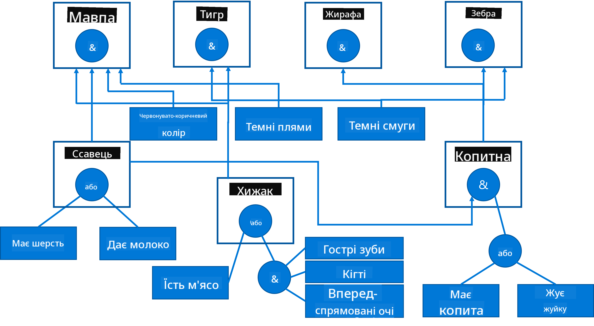

<!--
CO_OP_TRANSLATOR_METADATA:
{
  "original_hash": "7d097f7fda9166ead615e4c34552381b",
  "translation_date": "2025-09-23T15:33:20+00:00",
  "source_file": "lessons/2-Symbolic/README.md",
  "language_code": "uk"
}
-->
# Представлення знань та експертні системи


> Скетчноут від [Tomomi Imura](https://twitter.com/girlie_mac)

Пошук штучного інтелекту базується на прагненні до знань, щоб розуміти світ так, як це роблять люди. Але як це можна реалізувати?

## [Тест перед лекцією](https://ff-quizzes.netlify.app/en/ai/quiz/3)

На ранніх етапах розвитку AI популярним був підхід "зверху вниз" до створення інтелектуальних систем (обговорювався в попередньому уроці). Ідея полягала в тому, щоб витягти знання від людей у форму, яку може обробляти машина, і потім використовувати їх для автоматичного вирішення задач. Цей підхід базувався на двох великих ідеях:

* Представлення знань
* Міркування

## Представлення знань

Одним із важливих концептів у символічному AI є **знання**. Важливо розрізняти знання від *інформації* або *даних*. Наприклад, можна сказати, що книги містять знання, тому що їх можна вивчати і ставати експертом. Однак те, що міститься в книгах, насправді називається *даними*, і, читаючи книги та інтегруючи ці дані у нашу модель світу, ми перетворюємо дані на знання.

> ✅ **Знання** — це те, що міститься у нашій голові і представляє наше розуміння світу. Воно отримується через активний процес **навчання**, який інтегрує отриману інформацію у нашу активну модель світу.

Найчастіше ми не строго визначаємо знання, але узгоджуємо їх з іншими пов'язаними концептами за допомогою [піраміди DIKW](https://en.wikipedia.org/wiki/DIKW_pyramid). Вона містить наступні концепти:

* **Дані** — це те, що представлено на фізичних носіях, таких як написаний текст або вимовлені слова. Дані існують незалежно від людей і можуть передаватися між ними.
* **Інформація** — це те, як ми інтерпретуємо дані у нашій голові. Наприклад, коли ми чуємо слово *комп'ютер*, ми маємо певне розуміння, що це таке.
* **Знання** — це інформація, інтегрована у нашу модель світу. Наприклад, коли ми дізнаємося, що таке комп'ютер, ми починаємо мати уявлення про те, як він працює, скільки коштує і для чого його можна використовувати. Ця мережа взаємопов'язаних концептів формує наші знання.
* **Мудрість** — це ще один рівень нашого розуміння світу, який представляє *мета-знання*, наприклад, уявлення про те, як і коли знання слід використовувати.


*Зображення [з Вікіпедії](https://commons.wikimedia.org/w/index.php?curid=37705247), By Longlivetheux - Own work, CC BY-SA 4.0*

Таким чином, проблема **представлення знань** полягає у пошуку ефективного способу представлення знань у комп'ютері у формі даних, щоб зробити їх автоматично придатними для використання. Це можна розглядати як спектр:


> Зображення від [Dmitry Soshnikov](http://soshnikov.com)

* Ліворуч знаходяться дуже прості типи представлення знань, які можуть ефективно використовуватися комп'ютерами. Найпростіший — алгоритмічний, коли знання представлені комп'ютерною програмою. Однак це не найкращий спосіб представлення знань, оскільки він не є гнучким. Знання у нашій голові часто не є алгоритмічними.
* Праворуч знаходяться представлення, такі як природний текст. Це найпотужніший спосіб, але він не може бути використаний для автоматичного міркування.

> ✅ Подумайте хвилину про те, як ви представляєте знання у своїй голові і перетворюєте їх на нотатки. Чи є якийсь формат, який добре працює для вас, щоб допомогти у запам'ятовуванні?

## Класифікація комп'ютерних представлень знань

Ми можемо класифікувати різні методи представлення знань у комп'ютері за наступними категоріями:

* **Мережеві представлення** базуються на тому, що у нашій голові є мережа взаємопов'язаних концептів. Ми можемо спробувати відтворити такі ж мережі у вигляді графа у комп'ютері — так званої **семантичної мережі**.

1. **Трійки об'єкт-атрибут-значення** або **пари атрибут-значення**. Оскільки граф може бути представлений у комп'ютері як список вузлів і ребер, ми можемо представити семантичну мережу списком трійок, що містять об'єкти, атрибути і значення. Наприклад, ми створюємо наступні трійки про мови програмування:

Об'єкт | Атрибут | Значення
-------|---------|---------
Python | є | Мова без типізації
Python | створений | Guido van Rossum
Python | синтаксис блоку | відступи
Мова без типізації | не має | визначень типів

> ✅ Подумайте, як трійки можуть бути використані для представлення інших типів знань.

2. **Ієрархічні представлення** підкреслюють той факт, що ми часто створюємо ієрархію об'єктів у нашій голові. Наприклад, ми знаємо, що канарка — це птах, і всі птахи мають крила. Ми також маємо уявлення про те, якого кольору зазвичай канарка і яка її швидкість польоту.

   - **Представлення у вигляді фреймів** базується на представленні кожного об'єкта або класу об'єктів як **фрейму**, який містить **слоти**. Слоти мають можливі значення за замовчуванням, обмеження значень або збережені процедури, які можна викликати для отримання значення слота. Усі фрейми формують ієрархію, схожу на ієрархію об'єктів у мовах програмування, орієнтованих на об'єкти.
   - **Сценарії** — це особливий вид фреймів, які представляють складні ситуації, що можуть розгортатися у часі.

**Python**

Слот | Значення | Значення за замовчуванням | Інтервал |
-----|----------|---------------------------|----------|
Назва | Python | | |
Є | Мова без типізації | | |
Регістр змінних | | CamelCase | |
Довжина програми | | | 5-5000 рядків |
Синтаксис блоку | Відступ | | |

3. **Процедурні представлення** базуються на представленні знань списком дій, які можуть бути виконані за певних умов.
   - Правила продукції — це if-then твердження, які дозволяють робити висновки. Наприклад, лікар може мати правило, яке говорить, що **ЯКЩО** у пацієнта висока температура **АБО** високий рівень С-реактивного білка у аналізі крові **ТОДІ** у нього запалення. Як тільки ми стикаємося з однією з умов, ми можемо зробити висновок про запалення, а потім використовувати його у подальших міркуваннях.
   - Алгоритми можна вважати ще однією формою процедурного представлення, хоча вони майже ніколи не використовуються безпосередньо у системах, заснованих на знаннях.

4. **Логіка** була спочатку запропонована Арістотелем як спосіб представлення універсальних людських знань.
   - Логіка предикатів як математична теорія є занадто багатою, щоб бути обчислюваною, тому зазвичай використовується її підмножина, така як клаузи Хорна, що використовуються у Prolog.
   - Описова логіка — це сімейство логічних систем, які використовуються для представлення і міркування про ієрархії об'єктів у розподілених представленнях знань, таких як *семантична мережа*.

## Експертні системи

Одним із ранніх успіхів символічного AI були так звані **експертні системи** — комп'ютерні системи, які були розроблені для того, щоб діяти як експерт у певній обмеженій області задач. Вони базувалися на **базі знань**, отриманій від одного або кількох людських експертів, і містили **мотор виведення**, який виконував певні міркування на її основі.

 | 
---------------------------------------------|------------------------------------------------
Спрощена структура людської нервової системи | Архітектура системи на основі знань

Експертні системи побудовані подібно до системи людського мислення, яка містить **короткострокову пам'ять** і **довгострокову пам'ять**. Аналогічно, у системах на основі знань ми розрізняємо наступні компоненти:

* **Пам'ять задачі**: містить знання про задачу, яка зараз вирішується, тобто температуру або кров'яний тиск пацієнта, чи є у нього запалення тощо. Ці знання також називаються **статичними знаннями**, оскільки вони містять знімок того, що ми зараз знаємо про задачу — так званий *стан задачі*.
* **База знань**: представляє довгострокові знання про область задач. Вона отримується вручну від людських експертів і не змінюється від консультації до консультації. Оскільки вона дозволяє переходити від одного стану задачі до іншого, її також називають **динамічними знаннями**.
* **Мотор виведення**: координує весь процес пошуку у просторі станів задачі, задаючи питання користувачеві, коли це необхідно. Він також відповідає за пошук правильних правил, які слід застосувати до кожного стану.

Наприклад, розглянемо наступну експертну систему для визначення тварини на основі її фізичних характеристик:



> Зображення від [Dmitry Soshnikov](http://soshnikov.com)

Ця діаграма називається **AND-OR деревом**, і вона є графічним представленням набору правил продукції. Малювання дерева корисне на початку отримання знань від експерта. Для представлення знань у комп'ютері зручніше використовувати правила:

```
IF the animal eats meat
OR (animal has sharp teeth
    AND animal has claws
    AND animal has forward-looking eyes
) 
THEN the animal is a carnivore
```

Ви можете помітити, що кожна умова на лівій стороні правила і дія фактично є трійками об'єкт-атрибут-значення (OAV). **Робоча пам'ять** містить набір трійок OAV, які відповідають задачі, що зараз вирішується. **Мотор правил** шукає правила, для яких умова задовольняється, і застосовує їх, додаючи ще одну трійку до робочої пам'яті.

> ✅ Намалюйте власне AND-OR дерево на тему, яка вам подобається!

### Пряме vs. зворотне виведення

Описаний вище процес називається **прямим виведенням**. Він починається з деяких початкових даних про задачу, доступних у робочій пам'яті, і потім виконує наступний цикл міркувань:

1. Якщо цільовий атрибут присутній у робочій пам'яті — зупинитися і надати результат
2. Шукати всі правила, умови яких зараз задовольняються — отримати **конфліктний набір** правил.
3. Виконати **розв'язання конфлікту** — вибрати одне правило, яке буде виконано на цьому кроці. Можуть бути різні стратегії розв'язання конфлікту:
   - Вибрати перше застосовне правило у базі знань
   - Вибрати випадкове правило
   - Вибрати *більш специфічне* правило, тобто те, яке задовольняє найбільше умов на "лівій стороні" (LHS)
4. Застосувати вибране правило і вставити новий шматок знань у стан задачі
5. Повторити з кроку 1.

Однак у деяких випадках ми можемо захотіти почати з порожніх знань про задачу і задавати питання, які допоможуть нам дійти до висновку. Наприклад, при медичній діагностиці ми зазвичай не виконуємо всі медичні аналізи заздалегідь перед початком діагностики пацієнта. Ми скоріше хочемо виконувати аналізи, коли потрібно прийняти рішення.

Цей процес можна змоделювати за допомогою **зворотного виведення**. Він керується **ціллю** — значенням атрибута, яке ми шукаємо:

1. Вибрати всі правила, які можуть надати нам значення цілі (тобто з ціллю на RHS ("правій стороні")) — конфліктний набір
1. Якщо немає правил для цього атрибута або є правило, яке говорить, що ми повинні запитати значення у користувача — запитати його, інакше:
1. Використовувати стратегію розв'язання конфлікту, щоб вибрати одне правило, яке ми будемо використовувати як *гіпотезу* — ми спробуємо її довести
1. Рекурсивно повторити процес для всіх атрибутів на LHS правила, намагаючись довести їх як цілі
1. Якщо у будь-який момент процес зазнає невдачі — використовувати інше правило на кроці 3.

> ✅ У яких ситуаціях пряме виведення є більш доречним? А як щодо зворотного виведення?

### Реалізація експертних систем

Експертні системи можуть бути реалізовані за допомогою різних інструментів:

* Програмування їх безпосередньо у якомусь високорівневому мовному програмуванні. Це не найкраща ідея, оскільки головна перевага системи на основі знань полягає у тому, що знання відокремлені від виведення, і потенційно експерт у предметній області повинен мати можливість писати правила без розуміння деталей процесу виведення.
* Використання **оболонки експертних систем**, тобто системи, спеціально розробленої для заповнення знаннями за допомогою якоїсь мови представлення знань.

## ✍️ Вправа: Виведення про тварин

Дивіться [Animals.ipynb](https://github.com/microsoft/AI-For-Beginners/blob/main/lessons/2-Symbolic/Animals.ipynb) для прикладу реалізації експертної системи з прямим і зворотним виведенням.

> **Примітка**: Цей приклад досить простий і лише дає уявлення про те, як виглядає експертна система. Як тільки ви почнете створювати таку систему, ви помітите деяку *інтелектуальну* поведінку лише тоді, коли досягнете певної кількості правил, приблизно 200+. У якийсь момент правила стають занадто складними, щоб тримати всі їх у голові, і в цей момент ви можете почати задаватися питанням, чому система приймає певні рішення. Однак важливою характеристикою систем на основі знань є те, що ви завжди можете *пояснити*, як було прийнято будь-яке з рішень.

## Онтології та семантична мережа

Наприкінці 20-го століття була ініціатива використати представлення знань для анотації ресурсів Інтернету, щоб стало можливим знаходити ресурси, які відповідають дуже специфічним запитам. Цей рух називався **Семантична мережа**, і він базувався на кількох концептах:

- Спе
- Сімейство мов на основі XML для опису знань: RDF (Resource Description Framework), RDFS (RDF Schema), OWL (Ontology Web Language).

Основним поняттям у Семантичному вебі є поняття **Онтології**. Воно стосується явної специфікації предметної області за допомогою формального представлення знань. Найпростіша онтологія може бути просто ієрархією об'єктів у предметній області, але складніші онтології включатимуть правила, які можна використовувати для висновків.

У семантичному вебі всі представлення базуються на трійках. Кожен об'єкт і кожне відношення унікально ідентифікуються за допомогою URI. Наприклад, якщо ми хочемо заявити факт, що цей навчальний курс з AI був розроблений Дмитром Сошниковим 1 січня 2022 року, ось трійки, які ми можемо використати:


```
http://github.com/microsoft/ai-for-beginners http://www.example.com/terms/creation-date “Jan 13, 2007”
http://github.com/microsoft/ai-for-beginners http://purl.org/dc/elements/1.1/creator http://soshnikov.com
```

> ✅ Тут `http://www.example.com/terms/creation-date` і `http://purl.org/dc/elements/1.1/creator` є добре відомими та загальноприйнятими URI для вираження понять *автор* і *дата створення*.

У більш складному випадку, якщо ми хочемо визначити список авторів, ми можемо використати деякі структури даних, визначені в RDF.


> Діаграми вище створені [Дмитром Сошниковим](http://soshnikov.com)

Прогрес у створенні Семантичного вебу був дещо уповільнений через успіх пошукових систем і технік обробки природної мови, які дозволяють витягувати структуровані дані з тексту. Однак у деяких областях все ще докладаються значні зусилля для підтримки онтологій і баз знань. Кілька проектів, які варто відзначити:

* [WikiData](https://wikidata.org/) — це колекція машинно читаних баз знань, пов'язаних із Вікіпедією. Більшість даних добувається з *InfoBoxes* Вікіпедії — структурованого контенту всередині сторінок Вікіпедії. Ви можете [запитувати](https://query.wikidata.org/) WikiData за допомогою SPARQL, спеціальної мови запитів для Семантичного вебу. Ось приклад запиту, який показує найпоширеніші кольори очей серед людей:

```sparql
#defaultView:BubbleChart
SELECT ?eyeColorLabel (COUNT(?human) AS ?count)
WHERE
{
  ?human wdt:P31 wd:Q5.       # human instance-of homo sapiens
  ?human wdt:P1340 ?eyeColor. # human eye-color ?eyeColor
  SERVICE wikibase:label { bd:serviceParam wikibase:language "en". }
}
GROUP BY ?eyeColorLabel
```

* [DBpedia](https://www.dbpedia.org/) — ще одна ініціатива, схожа на WikiData.

> ✅ Якщо ви хочете експериментувати зі створенням власних онтологій або відкриттям існуючих, є чудовий візуальний редактор онтологій під назвою [Protégé](https://protege.stanford.edu/). Завантажте його або використовуйте онлайн.


*Веб-редактор Protégé відкритий з онтологією родини Романових. Скриншот Дмитра Сошникова*

## ✍️ Вправа: Онтологія родини

Дивіться [FamilyOntology.ipynb](https://github.com/Ezana135/AI-For-Beginners/blob/main/lessons/2-Symbolic/FamilyOntology.ipynb) для прикладу використання технік Семантичного вебу для аналізу сімейних відносин. Ми візьмемо родинне дерево, представлене у загальному форматі GEDCOM, і онтологію сімейних відносин, щоб побудувати графік усіх сімейних зв'язків для заданого набору осіб.

## Граф концепцій Microsoft

У більшості випадків онтології ретельно створюються вручну. Однак також можливо **добувати** онтології з неструктурованих даних, наприклад, з текстів природної мови.

Одна з таких спроб була здійснена Microsoft Research і призвела до створення [Microsoft Concept Graph](https://blogs.microsoft.com/ai/microsoft-researchers-release-graph-that-helps-machines-conceptualize/?WT.mc_id=academic-77998-cacaste).

Це велика колекція сутностей, згрупованих за допомогою відношення успадкування `is-a`. Вона дозволяє відповідати на запитання типу "Що таке Microsoft?" — відповідь може бути щось на кшталт "компанія з ймовірністю 0.87, і бренд з ймовірністю 0.75".

Граф доступний як REST API або як великий текстовий файл для завантаження, який містить усі пари сутностей.

## ✍️ Вправа: Граф концепцій

Спробуйте блокнот [MSConceptGraph.ipynb](https://github.com/microsoft/AI-For-Beginners/blob/main/lessons/2-Symbolic/MSConceptGraph.ipynb), щоб побачити, як ми можемо використовувати Microsoft Concept Graph для групування новинних статей у кілька категорій.

## Висновок

Сьогодні штучний інтелект часто вважається синонімом *машинного навчання* або *нейронних мереж*. Однак людина також демонструє явне мислення, яке наразі не обробляється нейронними мережами. У реальних проектах явне мислення все ще використовується для виконання завдань, які потребують пояснень або можливості змінювати поведінку системи контрольованим чином.

## 🚀 Виклик

У блокноті Family Ontology, пов'язаному з цим уроком, є можливість експериментувати з іншими сімейними відносинами. Спробуйте знайти нові зв'язки між людьми в родинному дереві.

## [Тест після лекції](https://ff-quizzes.netlify.app/en/ai/quiz/4)

## Огляд і самостійне навчання

Проведіть дослідження в інтернеті, щоб виявити області, де люди намагалися кількісно оцінити та кодувати знання. Ознайомтеся з таксономією Блума і поверніться в історію, щоб дізнатися, як люди намагалися зрозуміти свій світ. Дослідіть роботу Ліннея зі створення таксономії організмів і спостерігайте, як Дмитро Менделєєв створив спосіб опису та групування хімічних елементів. Які ще цікаві приклади ви можете знайти?

**Завдання**: [Створіть онтологію](assignment.md)

---

