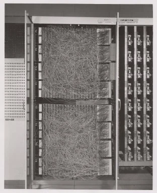

# Вступ до нейронних мереж: Перцептрон

## [Тест перед лекцією](https://ff-quizzes.netlify.app/en/ai/quiz/5)

Однією з перших спроб реалізувати щось схоже на сучасну нейронну мережу була робота Френка Розенблатта з Корнельської аеронавтичної лабораторії у 1957 році. Це була апаратна реалізація під назвою "Mark-1", створена для розпізнавання простих геометричних фігур, таких як трикутники, квадрати та кола.

|      |      |
|--------------|-----------|
| | |

> Зображення [з Вікіпедії](https://en.wikipedia.org/wiki/Perceptron)

Вхідне зображення представлялося у вигляді масиву з 20x20 фотокомірок, тому нейронна мережа мала 400 входів і один бінарний вихід. Проста мережа містила один нейрон, також відомий як **логічний елемент порогу**. Ваги нейронної мережі працювали як потенціометри, які потребували ручного налаштування під час етапу навчання.

> ✅ Потенціометр — це пристрій, який дозволяє користувачеві регулювати опір у колі.

> У той час газета The New York Times писала про перцептрон: *ембріон електронного комп'ютера, який [ВМС] очікують, зможе ходити, говорити, бачити, писати, відтворювати себе і усвідомлювати своє існування.*

## Модель перцептрона

Припустимо, що у нашій моделі є N ознак, у такому випадку вхідний вектор буде вектором розміру N. Перцептрон — це модель **бінарної класифікації**, тобто він може розрізняти два класи вхідних даних. Ми припускаємо, що для кожного вхідного вектора x вихід нашого перцептрона буде або +1, або -1, залежно від класу. Вихід обчислюється за формулою:

y(x) = f(w<sup>T</sup>x)

де f — це функція активації типу "сходинка".

<!-- img src="http://www.sciweavers.org/tex2img.php?eq=f%28x%29%20%3D%20%5Cbegin%7Bcases%7D%0A%20%20%20%20%20%20%20%20%20%2B1%20%26%20x%20%5Cgeq%200%20%5C%5C%0A%20%20%20%20%20%20%20%20%20-1%20%26%20x%20%3C%200%0A%20%20%20%20%20%20%20%5Cend%7Bcases%7D%20%5C%5C%0A&bc=White&fc=Black&im=jpg&fs=12&ff=arev&edit=0" align="center" border="0" alt="f(x) = \begin{cases} +1 & x \geq 0 \\ -1 & x < 0 \end{cases} \\" width="154" height="50" / -->


## Навчання перцептрона

Щоб навчити перцептрон, нам потрібно знайти вектор ваг w, який класифікує більшість значень правильно, тобто дає найменшу **помилку**. Ця помилка E визначається за **критерієм перцептрона** наступним чином:

E(w) = -&sum;w<sup>T</sup>x<sub>i</sub>t<sub>i</sub>

де:

* сума береться для тих точок навчальних даних i, які призводять до неправильної класифікації,
* x<sub>i</sub> — це вхідні дані, а t<sub>i</sub> — це або -1, або +1 для негативних і позитивних прикладів відповідно.

Цей критерій розглядається як функція ваг w, і нам потрібно її мінімізувати. Часто використовується метод **градієнтного спуску**, у якому ми починаємо з деяких початкових ваг w<sup>(0)</sup>, а потім на кожному кроці оновлюємо ваги за формулою:

w<sup>(t+1)</sup> = w<sup>(t)</sup> - &eta;&nabla;E(w)

Тут &eta; — це так званий **темп навчання**, а &nabla;E(w) позначає **градієнт** E. Після обчислення градієнта ми отримуємо:

w<sup>(t+1)</sup> = w<sup>(t)</sup> + &sum;&eta;x<sub>i</sub>t<sub>i</sub>

Алгоритм на Python виглядає так:

```python
def train(positive_examples, negative_examples, num_iterations = 100, eta = 1):

    weights = [0,0,0] # Initialize weights (almost randomly :)
        
    for i in range(num_iterations):
        pos = random.choice(positive_examples)
        neg = random.choice(negative_examples)

        z = np.dot(pos, weights) # compute perceptron output
        if z < 0: # positive example classified as negative
            weights = weights + eta*weights.shape

        z  = np.dot(neg, weights)
        if z >= 0: # negative example classified as positive
            weights = weights - eta*weights.shape

    return weights
```

## Висновок

У цьому уроці ви дізналися про перцептрон, який є моделлю бінарної класифікації, і як його навчати за допомогою вектора ваг.

## 🚀 Виклик

Якщо ви хочете спробувати створити власний перцептрон, спробуйте [цей лабораторний практикум на Microsoft Learn](https://docs.microsoft.com/en-us/azure/machine-learning/component-reference/two-class-averaged-perceptron?WT.mc_id=academic-77998-cacaste), який використовує [Azure ML designer](https://docs.microsoft.com/en-us/azure/machine-learning/concept-designer?WT.mc_id=academic-77998-cacaste).

## [Тест після лекції](https://ff-quizzes.netlify.app/en/ai/quiz/6)

## Огляд і самостійне навчання

Щоб побачити, як можна використовувати перцептрон для вирішення простих задач, а також реальних проблем, і продовжити навчання — перейдіть до [ноутбука Перцептрон](Perceptron.ipynb).

Ось цікавий [стаття про перцептрони](https://towardsdatascience.com/what-is-a-perceptron-basics-of-neural-networks-c4cfea20c590).

## [Завдання](lab/README.md)

У цьому уроці ми реалізували перцептрон для задачі бінарної класифікації і використали його для класифікації між двома рукописними цифрами. У цьому лабораторному практикумі вам пропонується вирішити задачу класифікації цифр повністю, тобто визначити, яка цифра найбільш ймовірно відповідає даному зображенню.

* [Інструкції](lab/README.md)
* [Ноутбук](lab/PerceptronMultiClass.ipynb)

---

