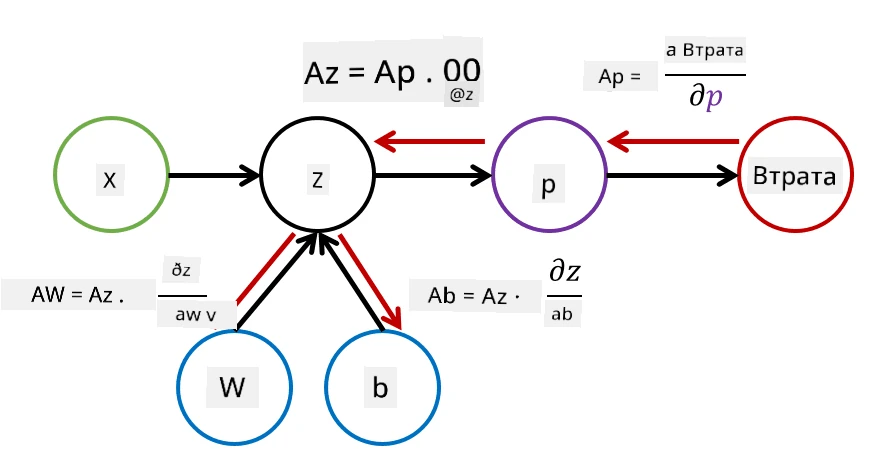

# Вступ до нейронних мереж. Багатошаровий перцептрон

У попередньому розділі ви ознайомилися з найпростішою моделлю нейронної мережі — одношаровим перцептроном, лінійною моделлю класифікації для двох класів.

У цьому розділі ми розширимо цю модель до більш гнучкої структури, яка дозволить нам:

* виконувати **класифікацію для кількох класів** на додаток до двокласової
* вирішувати **задачі регресії** на додаток до класифікації
* розділяти класи, які не є лінійно роздільними

Ми також розробимо власну модульну структуру на Python, яка дозволить нам створювати різні архітектури нейронних мереж.

## [Квіз перед лекцією](https://ff-quizzes.netlify.app/en/ai/quiz/7)

## Формалізація машинного навчання

Почнемо з формалізації задачі машинного навчання. Припустимо, у нас є навчальний набір даних **X** з мітками **Y**, і нам потрібно побудувати модель *f*, яка буде робити найбільш точні прогнози. Якість прогнозів вимірюється за допомогою **функції втрат** &lagran;. Часто використовуються такі функції втрат:

* Для задачі регресії, коли потрібно передбачити число, можна використовувати **абсолютну похибку** &sum;i|f(x(i))-y(i)| або **квадратичну похибку** &sum;i(f(x(i))-y(i))2
* Для класифікації використовують **0-1 втрати** (що фактично є **точністю** моделі) або **логістичні втрати**.

Для одношарового перцептрона функція *f* визначалась як лінійна функція *f(x)=wx+b* (де *w* — матриця ваг, *x* — вектор вхідних ознак, а *b* — вектор зміщення). Для різних архітектур нейронних мереж ця функція може набувати більш складної форми.

> У випадку класифікації часто бажано отримати ймовірності відповідних класів як вихід мережі. Для перетворення довільних чисел у ймовірності (наприклад, для нормалізації виходу) часто використовують функцію **softmax** &sigma;, і функція *f* стає *f(x)=&sigma;(wx+b)*.

У визначенні *f* вище, *w* і *b* називаються **параметрами** &theta;=⟨*w,b*⟩. Маючи набір даних ⟨**X**,**Y**⟩, ми можемо обчислити загальну похибку для всього набору даних як функцію параметрів &theta;.

> ✅ **Мета навчання нейронної мережі — мінімізувати похибку, змінюючи параметри &theta;**

## Оптимізація методом градієнтного спуску

Існує добре відомий метод оптимізації функцій, який називається **градієнтний спуск**. Ідея полягає в тому, що ми можемо обчислити похідну (у багатовимірному випадку — **градієнт**) функції втрат за параметрами і змінювати параметри так, щоб похибка зменшувалася. Це можна формалізувати наступним чином:

* Ініціалізувати параметри випадковими значеннями w(0), b(0)
* Багаторазово повторювати наступний крок:
    - w(i+1) = w(i)-&eta;&part;&lagran;/&part;w
    - b(i+1) = b(i)-&eta;&part;&lagran;/&part;b

Під час навчання оптимізаційні кроки повинні розраховуватися з урахуванням усього набору даних (пам’ятайте, що втрати обчислюються як сума для всіх навчальних зразків). Однак на практиці ми беремо невеликі частини набору даних, які називаються **мініпакетами**, і обчислюємо градієнти на основі підмножини даних. Оскільки підмножина кожного разу вибирається випадково, такий метод називається **стохастичним градієнтним спуском** (SGD).

## Багатошарові перцептрони та зворотне поширення

Одношарова мережа, як ми бачили вище, здатна класифікувати лінійно роздільні класи. Щоб побудувати більш багату модель, ми можемо об’єднати кілька шарів мережі. Математично це означатиме, що функція *f* матиме більш складну форму і буде обчислюватися в кілька етапів:
* z1=w1x+b1
* z2=w2&alpha;(z1)+b2
* f = &sigma;(z2)

Тут &alpha; — це **нелінійна функція активації**, &sigma; — функція softmax, а параметри &theta;=<*w1,b1,w2,b2*>.

Алгоритм градієнтного спуску залишиться таким самим, але обчислення градієнтів буде складнішим. Враховуючи правило диференціювання складної функції, ми можемо обчислити похідні таким чином:

* &part;&lagran;/&part;w2 = (&part;&lagran;/&part;&sigma;)(&part;&sigma;/&part;z2)(&part;z2/&part;w2)
* &part;&lagran;/&part;w1 = (&part;&lagran;/&part;&sigma;)(&part;&sigma;/&part;z2)(&part;z2/&part;&alpha;)(&part;&alpha;/&part;z1)(&part;z1/&part;w1)

> ✅ Правило диференціювання складної функції використовується для обчислення похідних функції втрат за параметрами.

Зверніть увагу, що ліва частина всіх цих виразів однакова, і тому ми можемо ефективно обчислювати похідні, починаючи з функції втрат і рухаючись "назад" через граф обчислень. Таким чином, метод навчання багатошарового перцептрона називається **зворотним поширенням**, або 'backprop'.

> TODO: цитування зображення

> ✅ Ми розглянемо зворотне поширення набагато детальніше в нашому прикладі в ноутбуці.

## Висновок

У цьому уроці ми створили власну бібліотеку нейронних мереж і використали її для простої задачі класифікації у двовимірному просторі.

## 🚀 Виклик

У супровідному ноутбуці ви реалізуєте власну структуру для створення та навчання багатошарових перцептронів. Ви зможете детально побачити, як працюють сучасні нейронні мережі.

Перейдіть до ноутбука [OwnFramework](OwnFramework.ipynb) і виконайте завдання.

## [Квіз після лекції](https://ff-quizzes.netlify.app/en/ai/quiz/8)

## Огляд і самостійне навчання

Зворотне поширення — це поширений алгоритм, який використовується в AI та ML, варто [вивчити його детальніше](https://wikipedia.org/wiki/Backpropagation).

## [Завдання](lab/README.md)

У цій лабораторній роботі вам пропонується використати структуру, яку ви створили в цьому уроці, для вирішення задачі класифікації рукописних цифр MNIST.

* [Інструкції](lab/README.md)
* [Ноутбук](lab/MyFW_MNIST.ipynb)

---

