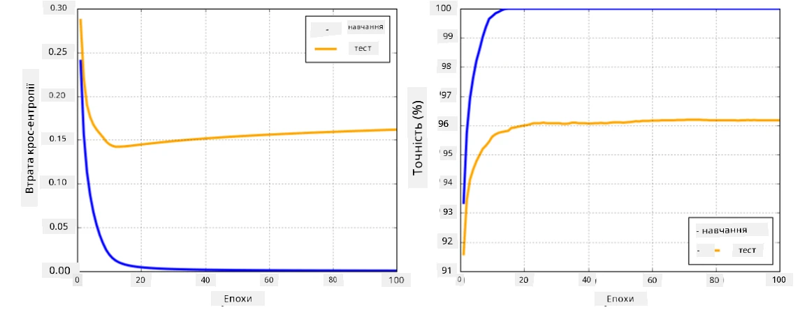

# Фреймворки для нейронних мереж

Як ми вже дізналися, для ефективного навчання нейронних мереж необхідно виконати дві основні задачі:

* Працювати з тензорами, наприклад, множити, додавати та обчислювати функції, такі як сигмоїда або softmax
* Обчислювати градієнти всіх виразів, щоб виконувати оптимізацію методом градієнтного спуску

## [Квіз перед лекцією](https://ff-quizzes.netlify.app/en/ai/quiz/9)

Хоча бібліотека `numpy` може виконувати першу задачу, нам потрібен механізм для обчислення градієнтів. У [нашому фреймворку](../04-OwnFramework/OwnFramework.ipynb), який ми розробили в попередньому розділі, ми вручну програмували всі функції похідних у методі `backward`, який виконує зворотне поширення. Ідеально, якщо фреймворк дозволяє обчислювати градієнти для *будь-якого виразу*, який ми можемо визначити.

Ще однією важливою річчю є можливість виконувати обчислення на GPU або інших спеціалізованих обчислювальних пристроях, таких як [TPU](https://en.wikipedia.org/wiki/Tensor_Processing_Unit). Навчання глибоких нейронних мереж потребує *дуже багато* обчислень, і можливість паралелізувати ці обчислення на GPU є надзвичайно важливою.

> ✅ Термін "паралелізувати" означає розподіл обчислень між кількома пристроями.

На сьогодні два найпопулярніші фреймворки для нейронних мереж — це [TensorFlow](http://TensorFlow.org) та [PyTorch](https://pytorch.org/). Обидва забезпечують низькорівневий API для роботи з тензорами як на CPU, так і на GPU. Крім низькорівневого API, існує також високорівневий API, який називається [Keras](https://keras.io/) та [PyTorch Lightning](https://pytorchlightning.ai/) відповідно.

Низькорівневий API | [TensorFlow](http://TensorFlow.org) | [PyTorch](https://pytorch.org/)
-------------------|-------------------------------------|--------------------------------
Високорівневий API | [Keras](https://keras.io/) | [PyTorch Lightning](https://pytorchlightning.ai/)

**Низькорівневі API** в обох фреймворках дозволяють створювати так звані **обчислювальні графи**. Цей граф визначає, як обчислювати вихід (зазвичай функцію втрат) із заданими вхідними параметрами, і може бути переданий для обчислення на GPU, якщо він доступний. Існують функції для диференціювання цього обчислювального графа та обчислення градієнтів, які потім можна використовувати для оптимізації параметрів моделі.

**Високорівневі API** розглядають нейронні мережі як **послідовність шарів**, що значно спрощує побудову більшості нейронних мереж. Навчання моделі зазвичай вимагає підготовки даних, а потім виклику функції `fit`, яка виконує всю роботу.

Високорівневий API дозволяє швидко створювати типові нейронні мережі, не турбуючись про безліч деталей. У той же час низькорівневий API забезпечує набагато більший контроль над процесом навчання, тому його часто використовують у дослідженнях, коли працюють із новими архітектурами нейронних мереж.

Важливо розуміти, що обидва API можна використовувати разом. Наприклад, ви можете розробити власну архітектуру шару мережі за допомогою низькорівневого API, а потім використовувати її у більшій мережі, створеній і навченої за допомогою високорівневого API. Або ви можете визначити мережу за допомогою високорівневого API як послідовність шарів, а потім використовувати власний низькорівневий цикл навчання для оптимізації. Обидва API використовують однакові базові концепції і розроблені для того, щоб добре працювати разом.

## Навчання

У цьому курсі ми пропонуємо більшість матеріалів як для PyTorch, так і для TensorFlow. Ви можете вибрати свій улюблений фреймворк і проходити лише відповідні ноутбуки. Якщо ви не впевнені, який фреймворк вибрати, почитайте дискусії в інтернеті щодо **PyTorch vs. TensorFlow**. Ви також можете ознайомитися з обома фреймворками, щоб краще їх зрозуміти.

Де можливо, ми будемо використовувати високорівневі API для простоти. Однак ми вважаємо важливим зрозуміти, як нейронні мережі працюють з нуля, тому спочатку ми почнемо працювати з низькорівневим API і тензорами. Якщо ж ви хочете швидко розпочати і не витрачати багато часу на вивчення цих деталей, ви можете пропустити їх і перейти прямо до ноутбуків з високорівневим API.

## ✍️ Вправи: Фреймворки

Продовжуйте навчання у наступних ноутбуках:

Низькорівневий API | [TensorFlow+Keras Notebook](IntroKerasTF.ipynb) | [PyTorch](IntroPyTorch.ipynb)
-------------------|-------------------------------------|--------------------------------
Високорівневий API | [Keras](IntroKeras.ipynb) | *PyTorch Lightning*

Після освоєння фреймворків давайте повторимо поняття перенавчання.

# Перенавчання

Перенавчання — це надзвичайно важливе поняття в машинному навчанні, і дуже важливо правильно його зрозуміти!

Розглянемо наступну задачу апроксимації 5 точок (представлених як `x` на графіках нижче):

 | 
-------------------------|--------------------------
**Лінійна модель, 2 параметри** | **Нелінійна модель, 7 параметрів**
Помилка навчання = 5.3 | Помилка навчання = 0
Помилка валідації = 5.1 | Помилка валідації = 20

* Ліворуч ми бачимо хорошу апроксимацію прямою лінією. Оскільки кількість параметрів є адекватною, модель правильно розуміє розподіл точок.
* Праворуч модель занадто потужна. Оскільки у нас є лише 5 точок, а модель має 7 параметрів, вона може налаштуватися так, щоб проходити через усі точки, що робить помилку навчання рівною 0. Однак це заважає моделі зрозуміти правильну закономірність у даних, тому помилка валідації дуже висока.

Дуже важливо знайти правильний баланс між складністю моделі (кількістю параметрів) і кількістю навчальних зразків.

## Чому виникає перенавчання

  * Недостатньо навчальних даних
  * Занадто потужна модель
  * Занадто багато шуму у вхідних даних

## Як виявити перенавчання

Як видно з графіка вище, перенавчання можна виявити за дуже низькою помилкою навчання і високою помилкою валідації. Зазвичай під час навчання ми бачимо, як помилки навчання і валідації починають зменшуватися, а потім у певний момент помилка валідації може перестати зменшуватися і почати зростати. Це буде ознакою перенавчання і сигналом, що, ймовірно, слід припинити навчання (або принаймні зробити знімок моделі).

## Як запобігти перенавчанню

Якщо ви бачите, що перенавчання відбувається, ви можете зробити одне з наступного:

 * Збільшити кількість навчальних даних
 * Зменшити складність моделі
 * Використовувати деякі [техніки регуляризації](../../4-ComputerVision/08-TransferLearning/TrainingTricks.md), такі як [Dropout](../../4-ComputerVision/08-TransferLearning/TrainingTricks.md#Dropout), які ми розглянемо пізніше.

## Перенавчання і компроміс між зміщенням і дисперсією

Перенавчання — це насправді випадок більш загальної проблеми в статистиці, яка називається [компроміс між зміщенням і дисперсією](https://en.wikipedia.org/wiki/Bias%E2%80%93variance_tradeoff). Якщо ми розглянемо можливі джерела помилок у нашій моделі, то побачимо два типи помилок:

* **Помилки зміщення** виникають через те, що наш алгоритм не може правильно захопити взаємозв'язок між навчальними даними. Це може бути наслідком того, що наша модель недостатньо потужна (**недонавчання**).
* **Помилки дисперсії**, які виникають через те, що модель апроксимує шум у вхідних даних замість значущих взаємозв'язків (**перенавчання**).

Під час навчання помилка зміщення зменшується (оскільки наша модель навчається апроксимувати дані), а помилка дисперсії збільшується. Важливо припинити навчання — або вручну (коли ми виявляємо перенавчання), або автоматично (впроваджуючи регуляризацію) — щоб запобігти перенавчанню.

## Висновок

У цьому уроці ви дізналися про відмінності між різними API для двох найпопулярніших фреймворків штучного інтелекту, TensorFlow і PyTorch. Крім того, ви ознайомилися з дуже важливою темою — перенавчанням.

## 🚀 Виклик

У супровідних ноутбуках ви знайдете "завдання" внизу; пройдіть через ноутбуки і виконайте завдання.

## [Квіз після лекції](https://ff-quizzes.netlify.app/en/ai/quiz/10)

## Огляд і самостійне навчання

Дослідіть наступні теми:

- TensorFlow
- PyTorch
- Перенавчання

Запитайте себе:

- У чому різниця між TensorFlow і PyTorch?
- У чому різниця між перенавчанням і недонавчанням?

## [Завдання](lab/README.md)

У цій лабораторній роботі вам пропонується вирішити дві задачі класифікації, використовуючи одношарові та багатошарові повнозв'язані мережі за допомогою PyTorch або TensorFlow.

* [Інструкції](lab/README.md)
* [Ноутбук](lab/LabFrameworks.ipynb)

---

