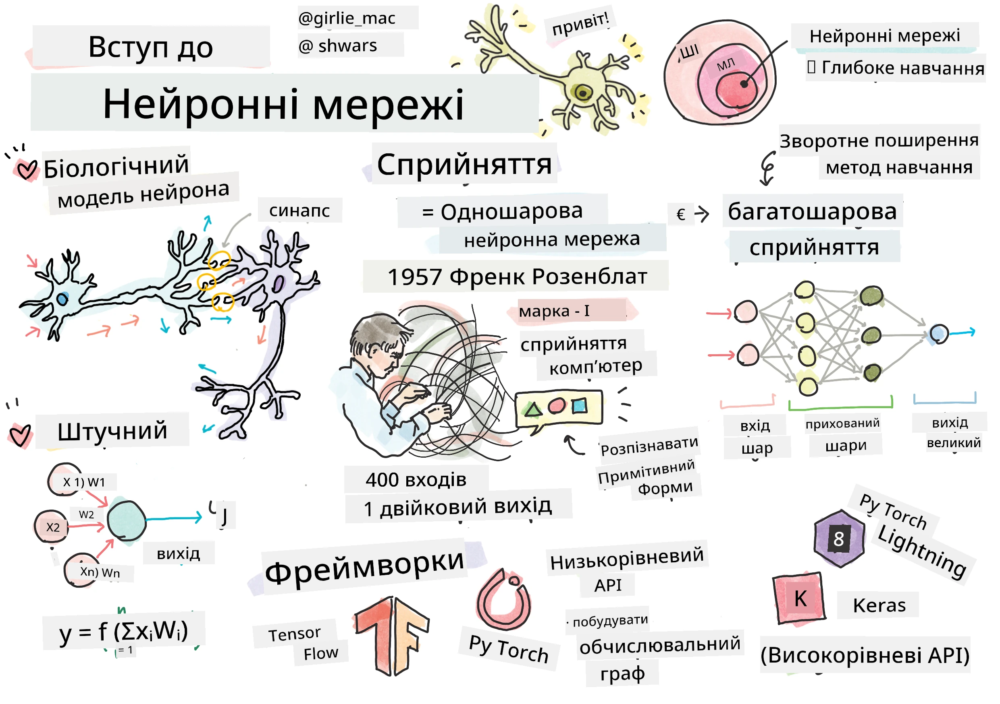
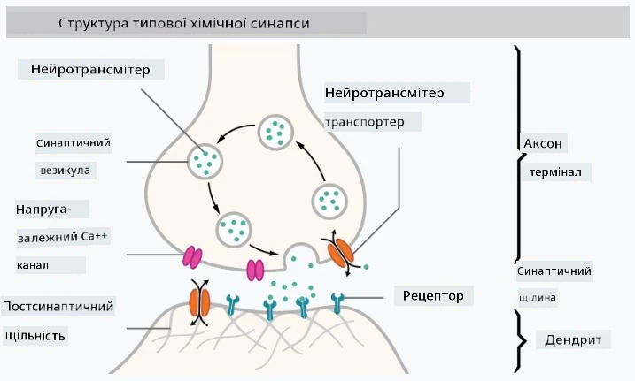

# Вступ до нейронних мереж

Як ми обговорювали у вступі, одним із способів досягнення інтелекту є навчання **комп'ютерної моделі** або **штучного мозку**. З середини 20-го століття дослідники пробували різні математичні моделі, і лише в останні роки цей напрямок став надзвичайно успішним. Такі математичні моделі мозку називаються **нейронними мережами**.

> Іноді нейронні мережі називають *Штучними нейронними мережами* (Artificial Neural Networks, ANNs), щоб підкреслити, що йдеться про моделі, а не про реальні мережі нейронів.

## Машинне навчання

Нейронні мережі є частиною більшої дисципліни під назвою **Машинне навчання**, мета якої — використовувати дані для навчання комп'ютерних моделей, здатних вирішувати задачі. Машинне навчання становить значну частину штучного інтелекту, однак у цьому курсі ми не розглядаємо класичне ML.

> Відвідайте наш окремий курс **[Машинне навчання для початківців](http://github.com/microsoft/ml-for-beginners)**, щоб дізнатися більше про класичне машинне навчання.

У машинному навчанні ми припускаємо, що маємо деякий набір даних прикладів **X** і відповідні вихідні значення **Y**. Приклади часто є N-вимірними векторами, які складаються з **характеристик**, а вихідні значення називаються **мітками**.

Ми розглянемо дві найпоширеніші задачі машинного навчання:

* **Класифікація**, де потрібно класифікувати вхідний об'єкт у дві або більше категорії.
* **Регресія**, де потрібно передбачити числове значення для кожного з вхідних зразків.

> При представленні входів і виходів у вигляді тензорів вхідний набір даних є матрицею розміру M&times;N, де M — кількість зразків, а N — кількість характеристик. Вихідні мітки Y — це вектор розміру M.

У цьому курсі ми зосередимося лише на моделях нейронних мереж.

## Модель нейрона

З біології ми знаємо, що наш мозок складається з нейронних клітин (нейронів), кожна з яких має кілька "входів" (дендрити) і один "вихід" (аксон). Як дендрити, так і аксони можуть проводити електричні сигнали, а зв’язки між ними — відомі як синапси — можуть мати різний ступінь провідності, який регулюється нейромедіаторами.

 | 
----|----
Реальний нейрон *([Зображення](https://en.wikipedia.org/wiki/Synapse#/media/File:SynapseSchematic_lines.svg) з Вікіпедії)* | Штучний нейрон *(Зображення автора)*

Таким чином, найпростіша математична модель нейрона містить кілька входів X1, ..., XN і один вихід Y, а також набір ваг W1, ..., WN. Вихід обчислюється як:

де f — це деяка нелінійна **функція активації**.

> Ранні моделі нейрона були описані в класичній статті [A logical calculus of the ideas immanent in nervous activity](https://www.cs.cmu.edu/~./epxing/Class/10715/reading/McCulloch.and.Pitts.pdf) Воррена МакКалока та Волтера Піттса у 1943 році. Дональд Хебб у своїй книзі "[The Organization of Behavior: A Neuropsychological Theory](https://books.google.com/books?id=VNetYrB8EBoC)" запропонував спосіб навчання таких мереж.

## У цьому розділі

У цьому розділі ми дізнаємося про:
* [Перцептрон](03-Perceptron/README.md), одну з найперших моделей нейронних мереж для класифікації на два класи
* [Багатошарові мережі](04-OwnFramework/README.md) з відповідним ноутбуком [як створити власний фреймворк](04-OwnFramework/OwnFramework.ipynb)
* [Фреймворки нейронних мереж](05-Frameworks/README.md), з такими ноутбуками: [PyTorch](05-Frameworks/IntroPyTorch.ipynb) і [Keras/Tensorflow](05-Frameworks/IntroKerasTF.ipynb)
* [Перенавчання](../../../../lessons/3-NeuralNetworks/05-Frameworks)

---

**Відмова від відповідальності**:  
Цей документ був перекладений за допомогою сервісу автоматичного перекладу [Co-op Translator](https://github.com/Azure/co-op-translator). Хоча ми прагнемо до точності, будь ласка, майте на увазі, що автоматичні переклади можуть містити помилки або неточності. Оригінальний документ на його рідній мові слід вважати авторитетним джерелом. Для критичної інформації рекомендується професійний людський переклад. Ми не несемо відповідальності за будь-які непорозуміння або неправильні тлумачення, що виникають внаслідок використання цього перекладу.