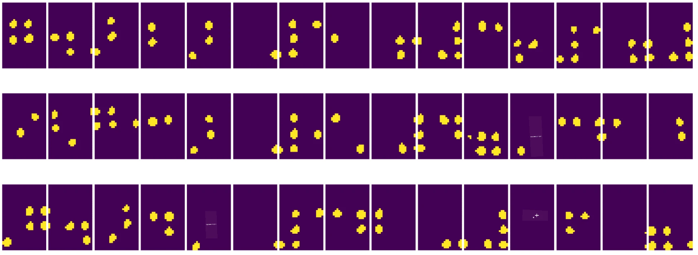
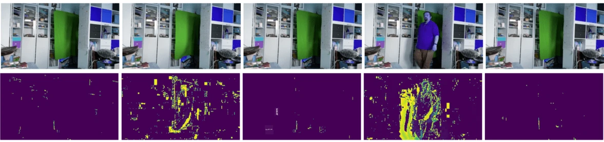

# Вступ до комп'ютерного зору

[Комп'ютерний зір](https://wikipedia.org/wiki/Computer_vision) — це галузь, метою якої є надання комп'ютерам можливості отримувати високорівневе розуміння цифрових зображень. Це досить широке визначення, оскільки *розуміння* може означати багато різних речей, включаючи пошук об'єкта на зображенні (**виявлення об'єктів**), розуміння того, що відбувається (**виявлення подій**), опис зображення текстом або реконструкцію сцени в 3D. Існують також спеціальні завдання, пов'язані із зображеннями людей: оцінка віку та емоцій, виявлення та ідентифікація обличчя, а також оцінка 3D-пози, серед іншого.

## [Тест перед лекцією](https://ff-quizzes.netlify.app/en/ai/quiz/11)

Одне з найпростіших завдань комп'ютерного зору — це **класифікація зображень**.

Комп'ютерний зір часто вважається галуззю штучного інтелекту. Сьогодні більшість завдань комп'ютерного зору вирішуються за допомогою нейронних мереж. Ми дізнаємося більше про спеціальний тип нейронних мереж, які використовуються для комп'ютерного зору, [згорткові нейронні мережі](../07-ConvNets/README.md), протягом цього розділу.

Однак перед тим, як передати зображення нейронній мережі, у багатьох випадках має сенс використовувати деякі алгоритмічні методи для покращення зображення.

Існує кілька бібліотек Python для обробки зображень:

* **[imageio](https://imageio.readthedocs.io/en/stable/)** можна використовувати для читання/запису різних форматів зображень. Вона також підтримує ffmpeg — корисний інструмент для перетворення кадрів відео в зображення.
* **[Pillow](https://pillow.readthedocs.io/en/stable/index.html)** (також відома як PIL) є трохи потужнішою і підтримує деякі маніпуляції із зображеннями, такі як морфінг, налаштування палітри тощо.
* **[OpenCV](https://opencv.org/)** — це потужна бібліотека обробки зображень, написана на C++, яка стала стандартом *де-факто* для обробки зображень. Вона має зручний інтерфейс для Python.
* **[dlib](http://dlib.net/)** — це бібліотека C++, яка реалізує багато алгоритмів машинного навчання, включаючи деякі алгоритми комп'ютерного зору. Вона також має інтерфейс для Python і може використовуватися для складних завдань, таких як виявлення обличчя та визначення ключових точок обличчя.

## OpenCV

[OpenCV](https://opencv.org/) вважається стандартом *де-факто* для обробки зображень. Вона містить багато корисних алгоритмів, реалізованих на C++. Ви також можете викликати OpenCV з Python.

Хорошим місцем для вивчення OpenCV є [курс Learn OpenCV](https://learnopencv.com/getting-started-with-opencv/). У нашій програмі ми не ставимо за мету вивчити OpenCV, а лише показати вам кілька прикладів, коли її можна використовувати і як.

### Завантаження зображень

Зображення в Python зручно представляти у вигляді масивів NumPy. Наприклад, зображення в градаціях сірого розміром 320x200 пікселів буде зберігатися у вигляді масиву 200x320, а кольорові зображення того ж розміру матимуть форму 200x320x3 (для 3 кольорових каналів). Щоб завантажити зображення, можна використати наступний код:

```python
import cv2
import matplotlib.pyplot as plt

im = cv2.imread('image.jpeg')
plt.imshow(im)
```

Традиційно OpenCV використовує кодування BGR (синій-зелений-червоний) для кольорових зображень, тоді як решта інструментів Python використовують більш традиційне RGB (червоний-зелений-синій). Щоб зображення виглядало правильно, потрібно перетворити його в колірний простір RGB, або шляхом перестановки вимірів у масиві NumPy, або викликом функції OpenCV:

```python
im = cv2.cvtColor(im,cv2.COLOR_BGR2RGB)
```

Ту ж функцію `cvtColor` можна використовувати для виконання інших перетворень колірного простору, таких як перетворення зображення в градації сірого або в HSV (відтінок-насиченість-значення).

Ви також можете використовувати OpenCV для завантаження відео кадр за кадром — приклад наведено у вправі [OpenCV Notebook](OpenCV.ipynb).

### Обробка зображень

Перед тим, як передати зображення нейронній мережі, можливо, вам знадобиться виконати кілька кроків попередньої обробки. OpenCV може виконувати багато завдань, включаючи:

* **Зміна розміру** зображення за допомогою `im = cv2.resize(im, (320,200),interpolation=cv2.INTER_LANCZOS)`
* **Розмиття** зображення за допомогою `im = cv2.medianBlur(im,3)` або `im = cv2.GaussianBlur(im, (3,3), 0)`
* Зміна **яскравості та контрасту** зображення може бути виконана шляхом маніпуляцій з масивами NumPy, як описано [у цьому записі на Stackoverflow](https://stackoverflow.com/questions/39308030/how-do-i-increase-the-contrast-of-an-image-in-python-opencv).
* Використання [порогової обробки](https://docs.opencv.org/4.x/d7/d4d/tutorial_py_thresholding.html) шляхом виклику функцій `cv2.threshold`/`cv2.adaptiveThreshold`, що часто є кращим варіантом, ніж налаштування яскравості або контрасту.
* Застосування різних [перетворень](https://docs.opencv.org/4.5.5/da/d6e/tutorial_py_geometric_transformations.html) до зображення:
    - **[Афінні перетворення](https://docs.opencv.org/4.5.5/d4/d61/tutorial_warp_affine.html)** можуть бути корисними, якщо вам потрібно об'єднати обертання, зміну розміру та нахил зображення, і ви знаєте вихідне та кінцеве розташування трьох точок на зображенні. Афінні перетворення зберігають паралельність ліній.
    - **[Перспективні перетворення](https://medium.com/analytics-vidhya/opencv-perspective-transformation-9edffefb2143)** можуть бути корисними, коли ви знаєте вихідні та кінцеві позиції 4 точок на зображенні. Наприклад, якщо ви зробили фотографію прямокутного документа за допомогою камери смартфона під певним кутом і хочете отримати прямокутне зображення самого документа.
* Розуміння руху всередині зображення за допомогою **[оптичного потоку](https://docs.opencv.org/4.5.5/d4/dee/tutorial_optical_flow.html)**.

## Приклади використання комп'ютерного зору

У нашому [OpenCV Notebook](OpenCV.ipynb) ми наводимо кілька прикладів, коли комп'ютерний зір може бути використаний для виконання конкретних завдань:

* **Попередня обробка фотографії книги шрифтом Брайля**. Ми зосереджуємося на тому, як можна використовувати порогову обробку, виявлення особливостей, перспективне перетворення та маніпуляції з NumPy для відокремлення окремих символів шрифту Брайля для подальшої класифікації нейронною мережею.

 |  | 
----|-----|-----

> Зображення з [OpenCV.ipynb](OpenCV.ipynb)

* **Виявлення руху у відео за допомогою різниці кадрів**. Якщо камера нерухома, то кадри з її потоку мають бути досить схожими один на одного. Оскільки кадри представлені у вигляді масивів, просто віднімаючи ці масиви для двох послідовних кадрів, ми отримаємо різницю пікселів, яка має бути низькою для статичних кадрів і ставати вищою, коли в зображенні є значний рух.



> Зображення з [OpenCV.ipynb](OpenCV.ipynb)

* **Виявлення руху за допомогою оптичного потоку**. [Оптичний потік](https://docs.opencv.org/3.4/d4/dee/tutorial_optical_flow.html) дозволяє зрозуміти, як окремі пікселі на кадрах відео рухаються. Існує два типи оптичного потоку:

   - **Щільний оптичний потік** обчислює векторне поле, яке показує, куди рухається кожен піксель.
   - **Рідкісний оптичний потік** базується на виборі деяких характерних особливостей на зображенні (наприклад, країв) і побудові їх траєкторії від кадру до кадру.


> Зображення з [OpenCV.ipynb](OpenCV.ipynb)

## ✍️ Приклад блокнотів: OpenCV [спробуйте OpenCV в дії](OpenCV.ipynb)

Давайте проведемо кілька експериментів з OpenCV, досліджуючи [OpenCV Notebook](OpenCV.ipynb)

## Висновок

Іноді відносно складні завдання, такі як виявлення руху або виявлення кінчиків пальців, можна вирішити виключно за допомогою комп'ютерного зору. Тому дуже корисно знати основні техніки комп'ютерного зору та можливості бібліотек, таких як OpenCV.

## 🚀 Виклик

Перегляньте [це відео](https://docs.microsoft.com/shows/ai-show/ai-show--2021-opencv-ai-competition--grand-prize-winners--cortic-tigers--episode-32?WT.mc_id=academic-77998-cacaste) з AI Show, щоб дізнатися про проект Cortic Tigers і те, як вони створили рішення на основі блоків для демократизації завдань комп'ютерного зору за допомогою робота. Проведіть дослідження інших подібних проектів, які допомагають новачкам освоїти цю галузь.

## [Тест після лекції](https://ff-quizzes.netlify.app/en/ai/quiz/12)

## Огляд і самостійне навчання

Дізнайтеся більше про оптичний потік [у цьому чудовому підручнику](https://learnopencv.com/optical-flow-in-opencv/).

## [Завдання](lab/README.md)

У цьому лабораторному завданні вам потрібно буде зняти відео з простими жестами, і ваша мета — витягти рухи вгору/вниз/вліво/вправо за допомогою оптичного потоку.


---

