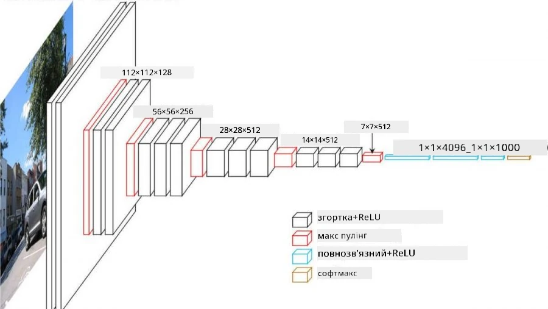
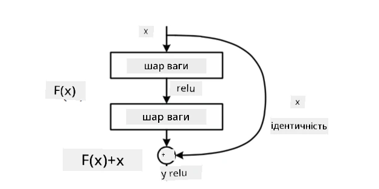
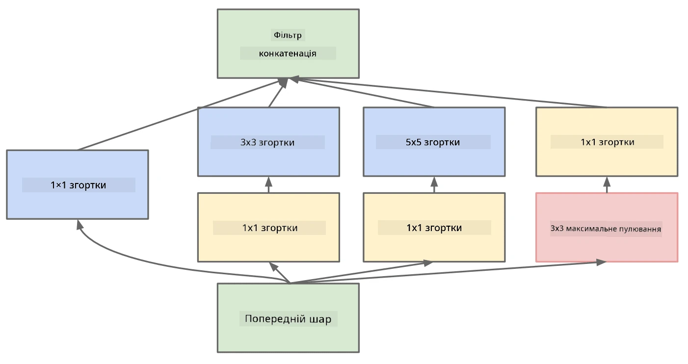

# Відомі архітектури CNN

### VGG-16

VGG-16 — це мережа, яка досягла точності 92.7% у класифікації ImageNet top-5 у 2014 році. Вона має наступну структуру шарів:

Як видно, VGG слідує традиційній пірамідальній архітектурі, яка є послідовністю шарів згортки та пулінгу.

> Зображення з [Researchgate](https://www.researchgate.net/figure/Vgg16-model-structure-To-get-the-VGG-NIN-model-we-replace-the-2-nd-4-th-6-th-7-th_fig2_335194493)

### ResNet

ResNet — це сімейство моделей, запропонованих Microsoft Research у 2015 році. Основна ідея ResNet — використання **залишкових блоків**:

> Зображення з [цієї статті](https://arxiv.org/pdf/1512.03385.pdf)

Причина використання ідентичного проходу полягає в тому, щоб наш шар прогнозував **різницю** між результатом попереднього шару та виходом залишкового блоку — звідси назва *залишковий*. Ці блоки набагато легше тренувати, і можна створювати мережі з кількома сотнями таких блоків (найпоширеніші варіанти — ResNet-52, ResNet-101 і ResNet-152).

Також можна думати про цю мережу як про здатну адаптувати свою складність до набору даних. Спочатку, коли ви починаєте тренувати мережу, значення ваг невеликі, і більшість сигналу проходить через ідентичні шари. У міру прогресу навчання і збільшення ваг значущість параметрів мережі зростає, і мережа адаптується, щоб забезпечити необхідну виразну потужність для правильної класифікації навчальних зображень.

### Google Inception

Архітектура Google Inception робить цей підхід ще на крок далі, будуючи кожен шар мережі як комбінацію кількох різних шляхів:

> Зображення з [Researchgate](https://www.researchgate.net/figure/Inception-module-with-dimension-reductions-left-and-schema-for-Inception-ResNet-v1_fig2_355547454)

Тут потрібно підкреслити роль згорток 1x1, оскільки спочатку вони здаються нелогічними. Чому нам потрібно проходити через зображення з фільтром 1x1? Однак слід пам’ятати, що згорткові фільтри також працюють із кількома каналами глибини (спочатку — кольори RGB, у наступних шарах — канали для різних фільтрів), і згортка 1x1 використовується для змішування цих вхідних каналів за допомогою різних тренованих ваг. Це також можна розглядати як зменшення розмірності (пулінг) за виміром каналів.

Ось [хороший блог-пост](https://medium.com/analytics-vidhya/talented-mr-1x1-comprehensive-look-at-1x1-convolution-in-deep-learning-f6b355825578) на цю тему, а також [оригінальна стаття](https://arxiv.org/pdf/1312.4400.pdf).

### MobileNet

MobileNet — це сімейство моделей зі зменшеним розміром, які підходять для мобільних пристроїв. Використовуйте їх, якщо у вас обмежені ресурси і ви можете пожертвувати трохи точністю. Основна ідея цих моделей — так звана **глибокосепарабельна згортка**, яка дозволяє представляти згорткові фільтри як композицію просторових згорток і згортки 1x1 за каналами глибини. Це значно зменшує кількість параметрів, роблячи мережу меншою за розміром, а також легшою для тренування з меншою кількістю даних.

Ось [хороший блог-пост про MobileNet](https://medium.com/analytics-vidhya/image-classification-with-mobilenet-cc6fbb2cd470).

## Висновок

У цьому розділі ви дізналися основну концепцію нейронних мереж для комп’ютерного зору — згорткові мережі. Реальні архітектури, які забезпечують класифікацію зображень, виявлення об’єктів і навіть генерацію зображень, базуються на CNN, просто з більшою кількістю шарів і деякими додатковими трюками для навчання.

## 🚀 Виклик

У супровідних блокнотах є примітки внизу про те, як досягти більшої точності. Проведіть експерименти, щоб побачити, чи зможете ви досягти вищої точності.

## [Тест після лекції](https://ff-quizzes.netlify.app/en/ai/quiz/14)

## Огляд і самостійне навчання

Хоча CNN найчастіше використовуються для завдань комп’ютерного зору, вони загалом добре підходять для вилучення шаблонів фіксованого розміру. Наприклад, якщо ми працюємо зі звуками, ми також можемо використовувати CNN для пошуку певних шаблонів в аудіосигналі — у цьому випадку фільтри будуть одномірними (і така CNN називатиметься 1D-CNN). Також іноді використовується 3D-CNN для вилучення ознак у багатовимірному просторі, наприклад, певних подій, що відбуваються на відео — CNN може захоплювати певні шаблони змін ознак з часом. Проведіть огляд і самостійне навчання про інші завдання, які можна виконувати за допомогою CNN.

## [Завдання](lab/README.md)

У цій лабораторній роботі вам потрібно класифікувати різні породи котів і собак. Ці зображення є складнішими, ніж набір даних MNIST, мають вищі розміри, і класів більше ніж 10.

---

