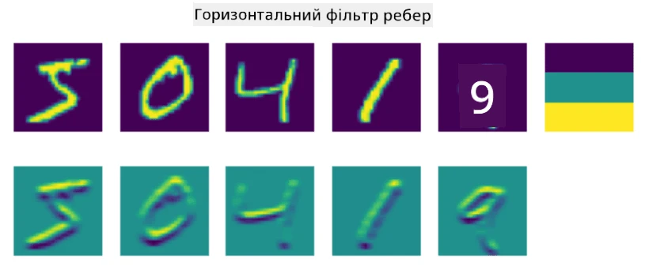
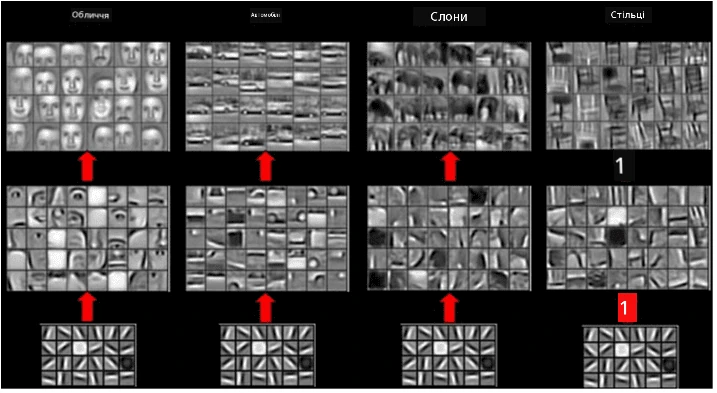

# Конволюційні нейронні мережі

Ми вже бачили, що нейронні мережі досить добре працюють із зображеннями, і навіть одношаровий перцептрон здатний розпізнавати рукописні цифри з набору даних MNIST з прийнятною точністю. Однак набір даних MNIST є дуже специфічним, і всі цифри в ньому центровані всередині зображення, що спрощує задачу.

## [Тест перед лекцією](https://ff-quizzes.netlify.app/en/ai/quiz/13)

У реальному житті ми хочемо мати можливість розпізнавати об'єкти на зображенні незалежно від їх точного розташування. Комп'ютерний зір відрізняється від загальної класифікації, тому що, коли ми намагаємося знайти певний об'єкт на зображенні, ми скануємо його, шукаючи специфічні **шаблони** та їх комбінації. Наприклад, шукаючи кота, ми спочатку можемо шукати горизонтальні лінії, які можуть утворювати вуса, а потім певна комбінація вусів може підказати нам, що це дійсно зображення кота. Важливими є відносне розташування та наявність певних шаблонів, а не їх точне положення на зображенні.

Для вилучення шаблонів ми будемо використовувати поняття **конволюційних фільтрів**. Як вам відомо, зображення представляється у вигляді 2D-матриці або 3D-тензора з глибиною кольору. Застосування фільтра означає, що ми беремо відносно невелику матрицю **ядра фільтра**, і для кожного пікселя в оригінальному зображенні обчислюємо зважене середнє з сусідніми точками. Це можна уявити як невелике вікно, яке ковзає по всьому зображенню, усереднюючи всі пікселі відповідно до ваг у матриці ядра фільтра.

 | 
----|----

> Зображення Дмитра Сошникова

Наприклад, якщо ми застосуємо 3x3 фільтри вертикальних і горизонтальних країв до цифр MNIST, ми можемо отримати виділення (наприклад, високі значення) там, де є вертикальні та горизонтальні краї в нашому оригінальному зображенні. Таким чином, ці два фільтри можуть бути використані для "пошуку" країв. Аналогічно, ми можемо створювати різні фільтри для пошуку інших низькорівневих шаблонів:

> Зображення [банку фільтрів Leung-Malik](https://www.robots.ox.ac.uk/~vgg/research/texclass/filters.html)

Однак, хоча ми можемо вручну створювати фільтри для вилучення певних шаблонів, ми також можемо спроєктувати мережу таким чином, щоб вона автоматично навчалася шаблонам. Це одна з основних ідей CNN.

## Основні ідеї CNN

Робота CNN базується на таких важливих ідеях:

* Конволюційні фільтри можуть вилучати шаблони
* Ми можемо спроєктувати мережу таким чином, щоб фільтри навчалися автоматично
* Ми можемо використовувати той самий підхід для пошуку шаблонів у високорівневих ознаках, а не лише в оригінальному зображенні. Таким чином, вилучення ознак у CNN працює на ієрархії ознак, починаючи з низькорівневих комбінацій пікселів і до високорівневих комбінацій частин зображення.

> Зображення з [статті Hislop-Lynch](https://www.semanticscholar.org/paper/Computer-vision-based-pedestrian-trajectory-Hislop-Lynch/26e6f74853fc9bbb7487b06dc2cf095d36c9021d), засноване на [їхньому дослідженні](https://dl.acm.org/doi/abs/10.1145/1553374.1553453)

## ✍️ Вправи: Конволюційні нейронні мережі

Продовжимо досліджувати, як працюють конволюційні нейронні мережі, і як ми можемо досягти навчання фільтрів, працюючи з відповідними ноутбуками:

* [Конволюційні нейронні мережі - PyTorch](ConvNetsPyTorch.ipynb)
* [Конволюційні нейронні мережі - TensorFlow](ConvNetsTF.ipynb)

## Пірамідальна архітектура

Більшість CNN, які використовуються для обробки зображень, слідують так званій пірамідальній архітектурі. Перший конволюційний шар, застосований до оригінальних зображень, зазвичай має відносно невелику кількість фільтрів (8-16), які відповідають різним комбінаціям пікселів, таким як горизонтальні/вертикальні лінії або штрихи. На наступному рівні ми зменшуємо просторовий розмір мережі та збільшуємо кількість фільтрів, що відповідає більшій кількості можливих комбінацій простих ознак. З кожним шаром, наближаючись до фінального класифікатора, просторові розміри зображення зменшуються, а кількість фільтрів зростає.

Наприклад, давайте розглянемо архітектуру VGG-16, мережі, яка досягла 92.7% точності в топ-5 класифікації ImageNet у 2014 році:

> Зображення з [Researchgate](https://www.researchgate.net/figure/Vgg16-model-structure-To-get-the-VGG-NIN-model-we-replace-the-2-nd-4-th-6-th-7-th_fig2_335194493)

## Найвідоміші архітектури CNN

[Продовжуйте вивчення найвідоміших архітектур CNN](CNN_Architectures.md)

---

