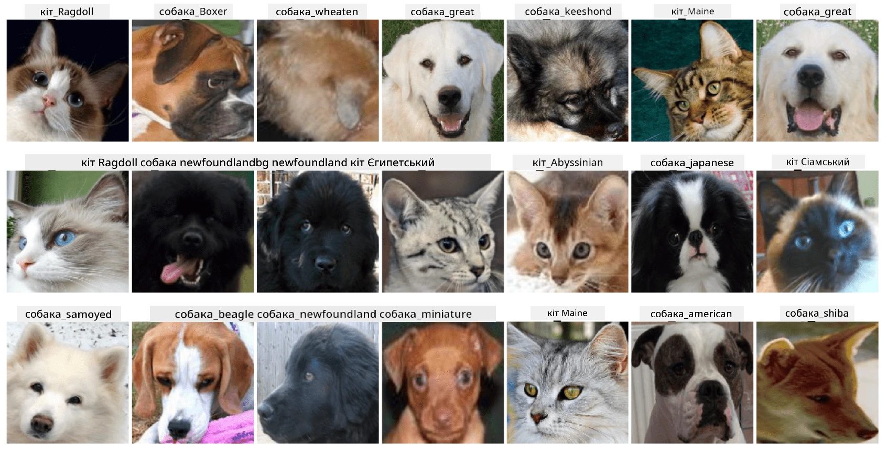

# Класифікація облич домашніх тварин

Лабораторне завдання з [AI for Beginners Curriculum](https://github.com/microsoft/ai-for-beginners).

## Завдання

Уявіть, що вам потрібно розробити додаток для притулку домашніх тварин, щоб каталогізувати всіх тварин. Однією з чудових функцій такого додатка було б автоматичне визначення породи за фотографією. Це можна успішно реалізувати за допомогою нейронних мереж.

Вам потрібно навчити згорткову нейронну мережу класифікувати різні породи котів і собак, використовуючи набір даних **Pet Faces**.

## Набір даних

Ми будемо використовувати [Oxford-IIIT Pet Dataset](https://www.robots.ox.ac.uk/~vgg/data/pets/), який містить зображення 37 різних порід собак і котів.



Щоб завантажити набір даних, скористайтеся цим фрагментом коду:

```python
!wget https://thor.robots.ox.ac.uk/~vgg/data/pets/images.tar.gz
!tar xfz images.tar.gz
!rm images.tar.gz
```

**Примітка:** Зображення в наборі даних Oxford-IIIT Pet Dataset організовані за назвами файлів (наприклад, `Abyssinian_1.jpg`, `Bengal_2.jpg`). У ноутбуці є код для організації цих зображень у підкаталоги за породами для зручнішої класифікації.

## Початок роботи з ноутбуком

Розпочніть лабораторну роботу, відкривши [PetFaces.ipynb](PetFaces.ipynb)

## Висновок

Ви вирішили досить складну задачу класифікації зображень з нуля! Було досить багато класів, і вам вдалося досягти прийнятної точності! Також має сенс вимірювати точність top-k, оскільки легко сплутати деякі класи, які навіть для людей не є чітко відмінними.

---

**Відмова від відповідальності**:  
Цей документ був перекладений за допомогою сервісу автоматичного перекладу [Co-op Translator](https://github.com/Azure/co-op-translator). Хоча ми прагнемо до точності, будь ласка, зверніть увагу, що автоматичні переклади можуть містити помилки або неточності. Оригінальний документ на його рідній мові слід вважати авторитетним джерелом. Для критичної інформації рекомендується професійний людський переклад. Ми не несемо відповідальності за будь-які непорозуміння або неправильні тлумачення, що виникли внаслідок використання цього перекладу.