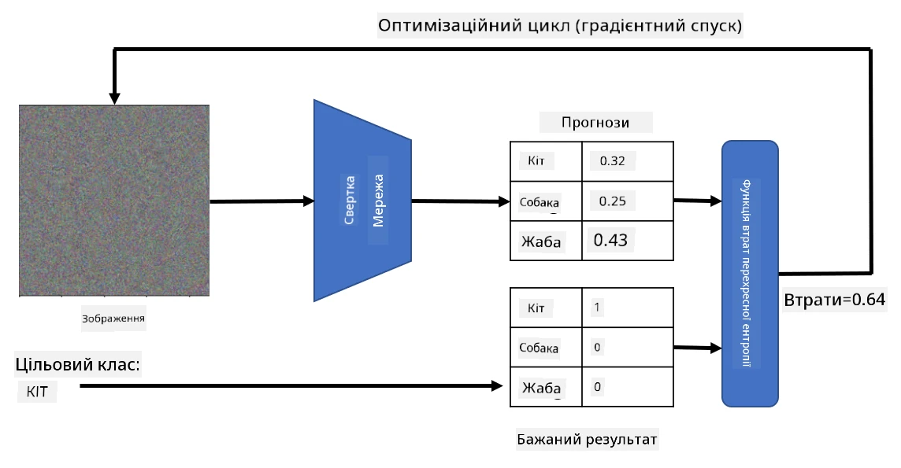

# Попередньо навчені мережі та перенесення навчання

Навчання CNN може займати багато часу, і для цього завдання потрібна велика кількість даних. Однак значна частина часу витрачається на вивчення найкращих низькорівневих фільтрів, які мережа може використовувати для вилучення шаблонів із зображень. Виникає природне питання — чи можемо ми використати нейронну мережу, навчану на одному наборі даних, і адаптувати її для класифікації інших зображень без необхідності повного процесу навчання?

## [Тест перед лекцією](https://ff-quizzes.netlify.app/en/ai/quiz/15)

Цей підхід називається **перенесенням навчання**, оскільки ми переносимо певні знання з однієї моделі нейронної мережі до іншої. У перенесенні навчання ми зазвичай починаємо з попередньо навченої моделі, яка була навчена на великому наборі зображень, наприклад, **ImageNet**. Ці моделі вже добре справляються з вилученням різних ознак із загальних зображень, і в багатьох випадках побудова класифікатора на основі цих вилучених ознак може дати хороший результат.

> ✅ Перенесення навчання — це термін, який зустрічається в інших академічних галузях, таких як освіта. Він стосується процесу перенесення знань з однієї сфери в іншу.

## Попередньо навчені моделі як екстрактори ознак

Конволюційні мережі, про які ми говорили в попередньому розділі, містять кілька шарів, кожен з яких має вилучати певні ознаки із зображення, починаючи з низькорівневих комбінацій пікселів (наприклад, горизонтальна/вертикальна лінія або штрих), до високорівневих комбінацій ознак, які відповідають таким речам, як око чи полум’я. Якщо ми навчимо CNN на достатньо великому наборі загальних і різноманітних зображень, мережа повинна навчитися вилучати ці загальні ознаки.

І Keras, і PyTorch містять функції для легкого завантаження попередньо навчених ваг нейронної мережі для деяких загальних архітектур, більшість із яких були навчені на зображеннях ImageNet. Найчастіше використовувані описані на сторінці [Архітектури CNN](../07-ConvNets/CNN_Architectures.md) з попереднього уроку. Зокрема, ви можете розглянути використання однієї з наступних моделей:

* **VGG-16/VGG-19** — це відносно прості моделі, які все ще забезпечують хорошу точність. Часто використання VGG як першої спроби є хорошим вибором, щоб побачити, як працює перенесення навчання.
* **ResNet** — це сімейство моделей, запропонованих Microsoft Research у 2015 році. Вони мають більше шарів, а отже, потребують більше ресурсів.
* **MobileNet** — це сімейство моделей зі зменшеним розміром, які підходять для мобільних пристроїв. Використовуйте їх, якщо у вас обмежені ресурси і ви можете пожертвувати трохи точністю.

Ось приклади ознак, вилучених із зображення кота мережею VGG-16:

## Набір даних "Коти проти собак"

У цьому прикладі ми використаємо набір даних [Коти та собаки](https://www.microsoft.com/download/details.aspx?id=54765&WT.mc_id=academic-77998-cacaste), який дуже близький до реального сценарію класифікації зображень.

## ✍️ Вправа: Перенесення навчання

Давайте побачимо перенесення навчання в дії у відповідних ноутбуках:

* [Перенесення навчання - PyTorch](TransferLearningPyTorch.ipynb)
* [Перенесення навчання - TensorFlow](TransferLearningTF.ipynb)

## Візуалізація ідеального кота

Попередньо навчена нейронна мережа містить різні шаблони у своєму *мозку*, включаючи уявлення про **ідеального кота** (а також ідеального собаку, ідеальну зебру тощо). Було б цікаво якось **візуалізувати це зображення**. Однак це не просто, оскільки шаблони розподілені по всіх вагах мережі, а також організовані в ієрархічну структуру.

Один із підходів, який ми можемо використати, — це почати з випадкового зображення, а потім спробувати використати техніку **оптимізації градієнтного спуску**, щоб змінити це зображення таким чином, щоб мережа почала думати, що це кіт.

Однак, якщо ми це зробимо, ми отримаємо щось дуже схоже на випадковий шум. Це тому, що *існує багато способів змусити мережу думати, що вхідне зображення — це кіт*, включаючи ті, які не мають сенсу візуально. Хоча ці зображення містять багато шаблонів, характерних для кота, немає нічого, що обмежувало б їх бути візуально виразними.

Щоб покращити результат, ми можемо додати ще один термін до функції втрат, який називається **варіаційна втрата**. Це метрика, яка показує, наскільки схожі сусідні пікселі зображення. Мінімізуючи варіаційну втрату, ми робимо зображення більш гладким і позбавляємося шуму — таким чином розкриваючи більш привабливі візуальні шаблони. Ось приклад таких "ідеальних" зображень, які класифікуються як кіт і як зебра з високою ймовірністю:

 | 
-----|-----
 *Ідеальний кіт* | *Ідеальна зебра*

Схожий підхід можна використати для виконання так званих **атак на нейронну мережу**. Припустимо, ми хочемо обдурити нейронну мережу і змусити собаку виглядати як кіт. Якщо ми візьмемо зображення собаки, яке мережа розпізнає як собаку, ми можемо трохи змінити його за допомогою оптимізації градієнтного спуску, поки мережа не почне класифікувати його як кота:

 | 
-----|-----
*Оригінальне зображення собаки* | *Зображення собаки, класифіковане як кіт*

Дивіться код для відтворення результатів вище у наступному ноутбуці:

* [Ідеальний та атакувальний кіт - TensorFlow](AdversarialCat_TF.ipynb)

## Висновок

Використовуючи перенесення навчання, ви можете швидко створити класифікатор для завдання класифікації об’єктів і досягти високої точності. Ви можете побачити, що більш складні завдання, які ми вирішуємо зараз, потребують більшої обчислювальної потужності і не можуть бути легко вирішені на CPU. У наступному розділі ми спробуємо використати більш легку реалізацію для навчання тієї ж моделі, використовуючи менші обчислювальні ресурси, що призводить до лише трохи нижчої точності.

## 🚀 Виклик

У супровідних ноутбуках є примітки внизу про те, як перенесення знань найкраще працює з дещо схожими навчальними даними (наприклад, новий тип тварини). Проведіть експерименти з абсолютно новими типами зображень, щоб побачити, наскільки добре чи погано працюють ваші моделі перенесення знань.

## [Тест після лекції](https://ff-quizzes.netlify.app/en/ai/quiz/16)

## Огляд і самостійне навчання

Прочитайте [TrainingTricks.md](TrainingTricks.md), щоб поглибити свої знання про інші способи навчання моделей.

## [Завдання](lab/README.md)

У цій лабораторній роботі ми використаємо реальний набір даних [Oxford-IIIT](https://www.robots.ox.ac.uk/~vgg/data/pets/) про домашніх тварин із 35 породами котів і собак, і побудуємо класифікатор перенесення навчання.

---

