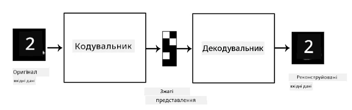
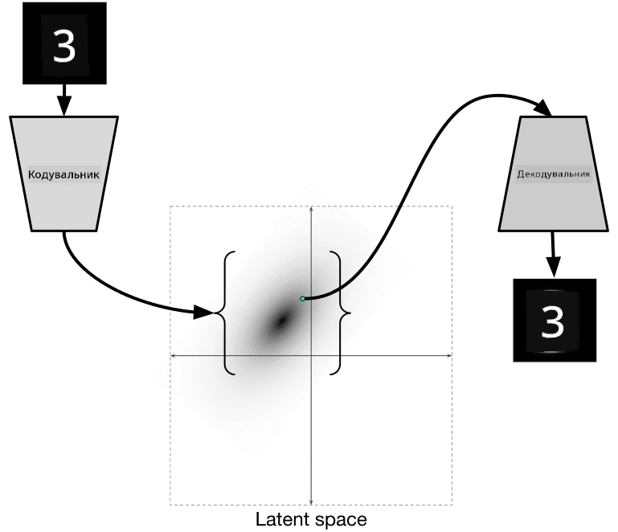

# Автоенкодери

Під час навчання CNN одна з проблем полягає в тому, що нам потрібна велика кількість даних із мітками. У випадку класифікації зображень нам потрібно розділити зображення на різні класи, що є ручною роботою.

## [Тест перед лекцією](https://ff-quizzes.netlify.app/en/ai/quiz/17)

Однак ми можемо захотіти використовувати необроблені (без міток) дані для навчання екстракторів ознак CNN, що називається **самонавчанням**. Замість міток ми будемо використовувати навчальні зображення як вхідні та вихідні дані для мережі. Основна ідея **автоенкодера** полягає в тому, що ми матимемо **мережу енкодера**, яка перетворює вхідне зображення в деякий **латентний простір** (зазвичай це просто вектор меншого розміру), а потім **мережу декодера**, завданням якої буде відновлення оригінального зображення.

> ✅ [Автоенкодер](https://wikipedia.org/wiki/Autoencoder) — це "тип штучної нейронної мережі, яка використовується для навчання ефективного кодування даних без міток."

Оскільки ми навчаємо автоенкодер захоплювати якомога більше інформації з оригінального зображення для точного відновлення, мережа намагається знайти найкраще **вбудовування** вхідних зображень, щоб передати їх зміст.

> Зображення з [блогу Keras](https://blog.keras.io/building-autoencoders-in-keras.html)

## Сценарії використання автоенкодерів

Хоча відновлення оригінальних зображень може здатися не дуже корисним саме по собі, є кілька сценаріїв, де автоенкодери особливо корисні:

* **Зниження розмірності зображень для візуалізації** або **навчання вбудовувань зображень**. Зазвичай автоенкодери дають кращі результати, ніж PCA, оскільки враховують просторову природу зображень і ієрархічні ознаки.
* **Шумозаглушення**, тобто видалення шуму із зображення. Оскільки шум містить багато непотрібної інформації, автоенкодер не може вмістити все це в порівняно невеликий латентний простір, і тому він захоплює лише важливу частину зображення. Під час навчання шумозаглушувачів ми починаємо з оригінальних зображень і використовуємо зображення з штучно доданим шумом як вхідні дані для автоенкодера.
* **Суперроздільність**, збільшення роздільності зображення. Ми починаємо з зображень високої роздільності і використовуємо зображення з нижчою роздільністю як вхідні дані для автоенкодера.
* **Генеративні моделі**. Після навчання автоенкодера частину декодера можна використовувати для створення нових об'єктів, починаючи з випадкових латентних векторів.

## Варіаційні автоенкодери (VAE)

Традиційні автоенкодери зменшують розмірність вхідних даних, визначаючи важливі ознаки вхідних зображень. Однак латентні вектори часто не мають особливого сенсу. Іншими словами, якщо взяти набір даних MNIST як приклад, визначити, які цифри відповідають різним латентним вектором, не так просто, оскільки близькі латентні вектори не обов'язково відповідають однаковим цифрам.

З іншого боку, для навчання *генеративних* моделей краще мати певне розуміння латентного простору. Ця ідея приводить нас до **варіаційного автоенкодера** (VAE).

VAE — це автоенкодер, який навчається прогнозувати *статистичний розподіл* латентних параметрів, так званий **латентний розподіл**. Наприклад, ми можемо захотіти, щоб латентні вектори розподілялися нормально з певним середнім zmean і стандартним відхиленням zsigma (середнє і стандартне відхилення є векторами певної розмірності d). Енкодер у VAE навчається прогнозувати ці параметри, а декодер бере випадковий вектор із цього розподілу для відновлення об'єкта.

Підсумуємо:

 * З вхідного вектора ми прогнозуємо `z_mean` і `z_log_sigma` (замість прогнозування самого стандартного відхилення ми прогнозуємо його логарифм)
 * Ми вибираємо вектор `sample` із розподілу N(zmean,exp(zlog\_sigma))
 * Декодер намагається декодувати оригінальне зображення, використовуючи `sample` як вхідний вектор

 

> Зображення з [цього блогу](https://ijdykeman.github.io/ml/2016/12/21/cvae.html) Ісаака Дайкмана

Варіаційні автоенкодери використовують складну функцію втрат, яка складається з двох частин:

* **Втрати відновлення** — це функція втрат, яка показує, наскільки близьке відновлене зображення до цільового (це може бути середньоквадратична помилка, або MSE). Це та сама функція втрат, що й у звичайних автоенкодерах.
* **KL-втрати**, які забезпечують, щоб розподіл латентних змінних залишався близьким до нормального розподілу. Вона базується на понятті [дивергенції Кульбака-Лейблера](https://www.countbayesie.com/blog/2017/5/9/kullback-leibler-divergence-explained) — метрики для оцінки схожості двох статистичних розподілів.

Однією з важливих переваг VAE є те, що вони дозволяють нам генерувати нові зображення відносно легко, оскільки ми знаємо, з якого розподілу вибирати латентні вектори. Наприклад, якщо ми навчимо VAE з 2D латентним вектором на MNIST, ми можемо змінювати компоненти латентного вектора, щоб отримати різні цифри:

> Зображення від [Дмитра Сошникова](http://soshnikov.com)

Зверніть увагу, як зображення плавно переходять одне в одне, коли ми починаємо отримувати латентні вектори з різних частин латентного простору параметрів. Ми також можемо візуалізувати цей простір у 2D:

 

> Зображення від [Дмитра Сошникова](http://soshnikov.com)

## ✍️ Вправи: Автоенкодери

Дізнайтеся більше про автоенкодери в цих відповідних ноутбуках:

* [Автоенкодери в TensorFlow](AutoencodersTF.ipynb)
* [Автоенкодери в PyTorch](AutoEncodersPyTorch.ipynb)

## Властивості автоенкодерів

* **Специфічність даних** - вони добре працюють лише з типом зображень, на яких були навчені. Наприклад, якщо ми навчимо мережу суперроздільності на квітах, вона не буде добре працювати на портретах. Це тому, що мережа може створювати зображення з вищою роздільністю, використовуючи тонкі деталі, отримані з ознак навчального набору даних.
* **Втрати** - відновлене зображення не є таким самим, як оригінальне. Характер втрат визначається *функцією втрат*, яка використовується під час навчання.
* Працює з **даними без міток**

## [Тест після лекції](https://ff-quizzes.netlify.app/en/ai/quiz/18)

## Висновок

У цьому уроці ви дізналися про різні типи автоенкодерів, доступних для дослідника штучного інтелекту. Ви дізналися, як їх створювати та використовувати для відновлення зображень. Ви також дізналися про VAE і як використовувати його для генерації нових зображень.

## 🚀 Виклик

У цьому уроці ви дізналися про використання автоенкодерів для зображень. Але їх також можна використовувати для музики! Ознайомтеся з проектом Magenta [MusicVAE](https://magenta.tensorflow.org/music-vae), який використовує автоенкодери для навчання відновлення музики. Проведіть кілька [експериментів](https://colab.research.google.com/github/magenta/magenta-demos/blob/master/colab-notebooks/Multitrack_MusicVAE.ipynb) з цією бібліотекою, щоб побачити, що ви можете створити.

## [Тест після лекції](https://ff-quizzes.netlify.app/en/ai/quiz/16)

## Огляд і самостійне навчання

Для довідки, дізнайтеся більше про автоенкодери в цих ресурсах:

* [Створення автоенкодерів у Keras](https://blog.keras.io/building-autoencoders-in-keras.html)
* [Блог NeuroHive](https://neurohive.io/ru/osnovy-data-science/variacionnyj-avtojenkoder-vae/)
* [Пояснення варіаційних автоенкодерів](https://kvfrans.com/variational-autoencoders-explained/)
* [Умовні варіаційні автоенкодери](https://ijdykeman.github.io/ml/2016/12/21/cvae.html)

## Завдання

Наприкінці [цього ноутбука з TensorFlow](AutoencodersTF.ipynb) ви знайдете "завдання" - використовуйте його як своє завдання.

---

