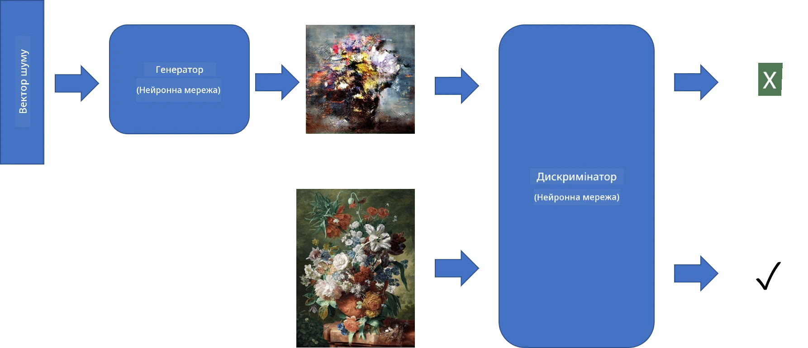
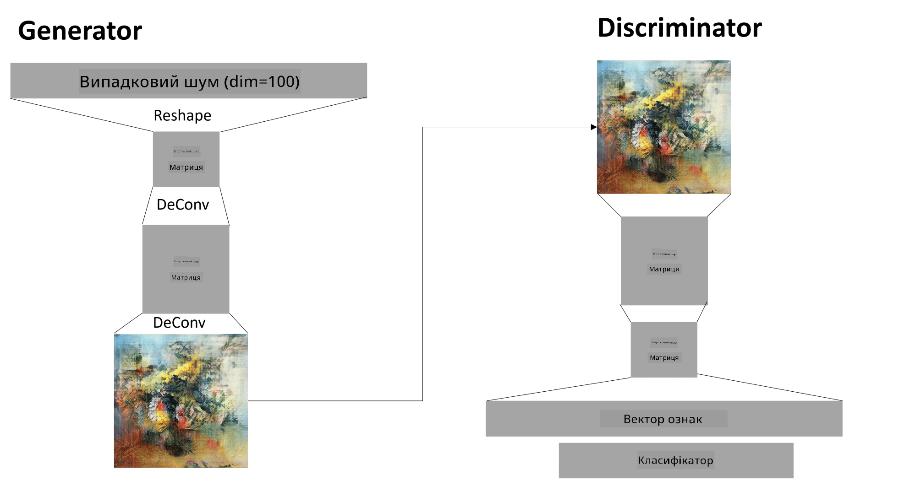

# Генеративні змагальні мережі

У попередньому розділі ми дізналися про **генеративні моделі**: моделі, які можуть створювати нові зображення, схожі на ті, що є в навчальному наборі даних. VAE був гарним прикладом генеративної моделі.

## [Тест перед лекцією](https://ff-quizzes.netlify.app/en/ai/quiz/19)

Однак, якщо ми спробуємо створити щось дійсно значуще, наприклад, картину з розумною роздільною здатністю, використовуючи VAE, ми побачимо, що навчання не сходиться добре. Для цього випадку використання варто дізнатися про іншу архітектуру, спеціально орієнтовану на генеративні моделі - **Генеративні змагальні мережі**, або GANs.

Основна ідея GAN полягає в тому, щоб мати дві нейронні мережі, які будуть навчатися одна проти одної:

> Зображення від [Dmitry Soshnikov](http://soshnikov.com)

> ✅ Невеликий словник:
> * **Генератор** - це мережа, яка бере випадковий вектор і створює зображення як результат.
> * **Дискримінатор** - це мережа, яка бере зображення і повинна визначити, чи є воно реальним (з навчального набору даних), чи було створене генератором. Це, по суті, класифікатор зображень.

### Дискримінатор

Архітектура дискримінатора не відрізняється від звичайної мережі класифікації зображень. У найпростішому випадку це може бути повністю зв’язаний класифікатор, але найімовірніше це буде [згорткова мережа](../07-ConvNets/README.md).

> ✅ GAN, заснований на згорткових мережах, називається [DCGAN](https://arxiv.org/pdf/1511.06434.pdf)

Дискримінатор CNN складається з наступних шарів: кілька згорток+пулінгів (з зменшенням просторового розміру) і одного або більше повністю зв’язаних шарів для отримання "вектору ознак", фінального бінарного класифікатора.

> ✅ "Пулінг" у цьому контексті - це техніка, яка зменшує розмір зображення. "Шари пулінгу зменшують розміри даних, об'єднуючи виходи кластерів нейронів на одному шарі в один нейрон на наступному шарі." - [джерело](https://wikipedia.org/wiki/Convolutional_neural_network#Pooling_layers)

### Генератор

Генератор трохи складніший. Його можна вважати перевернутим дискримінатором. Починаючи з латентного вектора (замість вектора ознак), він має повністю зв’язаний шар для перетворення його у потрібний розмір/форму, а потім шари деконволюції+масштабування. Це схоже на *декодер* частини [автокодера](../09-Autoencoders/README.md).

> ✅ Оскільки згортковий шар реалізується як лінійний фільтр, що проходить через зображення, деконволюція по суті схожа на згортку і може бути реалізована за допомогою тієї ж логіки шару.

> Зображення від [Dmitry Soshnikov](http://soshnikov.com)

### Навчання GAN

GAN називаються **змагальними**, тому що між генератором і дискримінатором постійно відбувається конкуренція. Під час цієї конкуренції і генератор, і дискримінатор покращуються, таким чином мережа навчається створювати все кращі і кращі зображення.

Навчання відбувається у два етапи:

* **Навчання дискримінатора**. Це завдання досить просте: ми генеруємо пакет зображень за допомогою генератора, позначаючи їх як 0, що означає фальшиве зображення, і беремо пакет зображень з вхідного набору даних (з міткою 1, реальне зображення). Ми отримуємо деяку *втрату дискримінатора* і виконуємо зворотне поширення.
* **Навчання генератора**. Це трохи складніше, тому що ми не знаємо очікуваного виходу для генератора безпосередньо. Ми беремо всю мережу GAN, що складається з генератора, за яким слідує дискримінатор, подаємо їй деякі випадкові вектори і очікуємо, що результат буде 1 (відповідно до реальних зображень). Потім ми заморожуємо параметри дискримінатора (ми не хочемо, щоб він навчався на цьому етапі) і виконуємо зворотне поширення.

Під час цього процесу втрати як генератора, так і дискримінатора не зменшуються значно. У ідеальній ситуації вони повинні коливатися, що відповідає покращенню продуктивності обох мереж.

## ✍️ Вправи: GANs

* [Ноутбук GAN у TensorFlow/Keras](GANTF.ipynb)
* [Ноутбук GAN у PyTorch](GANPyTorch.ipynb)

### Проблеми з навчанням GAN

GAN відомі тим, що їх особливо складно навчати. Ось кілька проблем:

* **Колапс моди**. Цей термін означає, що генератор навчається створювати одне успішне зображення, яке обманює дискримінатор, а не різноманітність різних зображень.
* **Чутливість до гіперпараметрів**. Часто можна побачити, що GAN взагалі не сходиться, а потім раптово зменшення швидкості навчання призводить до сходження.
* Збереження **балансу** між генератором і дискримінатором. У багатьох випадках втрата дискримінатора може швидко впасти до нуля, що призводить до того, що генератор не може навчатися далі. Щоб подолати це, можна спробувати встановити різні швидкості навчання для генератора і дискримінатора або пропустити навчання дискримінатора, якщо втрата вже занадто мала.
* Навчання для **високої роздільної здатності**. Відображаючи ту саму проблему, що і з автокодерами, ця проблема виникає через те, що реконструкція занадто багатьох шарів згорткової мережі призводить до артефактів. Цю проблему зазвичай вирішують за допомогою так званого **прогресивного зростання**, коли спочатку кілька шарів навчаються на зображеннях низької роздільної здатності, а потім шари "розблоковуються" або додаються. Інше рішення - додавання додаткових з'єднань між шарами і навчання кількох роздільних здатностей одночасно - дивіться цю [Multi-Scale Gradient GANs статтю](https://arxiv.org/abs/1903.06048) для деталей.

## Перенесення стилю

GAN - це чудовий спосіб створювати художні зображення. Ще одна цікава техніка - так зване **перенесення стилю**, яке бере одне **зображення контенту** і перемальовує його в іншому стилі, застосовуючи фільтри з **зображення стилю**.

Як це працює:

* Ми починаємо з випадкового шумового зображення (або з зображення контенту, але для розуміння простіше почати з випадкового шуму).
* Нашою метою буде створити таке зображення, яке буде близьким як до зображення контенту, так і до зображення стилю. Це визначатиметься двома функціями втрат:
   - **Втрата контенту** обчислюється на основі ознак, отриманих CNN на деяких шарах з поточного зображення і зображення контенту.
   - **Втрата стилю** обчислюється між поточним зображенням і зображенням стилю хитрим способом за допомогою матриць Грама (детальніше в [прикладному ноутбуці](StyleTransfer.ipynb)).
* Щоб зробити зображення більш гладким і прибрати шум, ми також вводимо **Варіаційну втрату**, яка обчислює середню відстань між сусідніми пікселями.
* Основний цикл оптимізації коригує поточне зображення, використовуючи градієнтний спуск (або інший алгоритм оптимізації), щоб мінімізувати загальну втрату, яка є зваженою сумою всіх трьох втрат.

## ✍️ Приклад: [Перенесення стилю](StyleTransfer.ipynb)

## [Тест після лекції](https://ff-quizzes.netlify.app/en/ai/quiz/20)

## Висновок

У цьому уроці ви дізналися про GANs і як їх навчати. Ви також дізналися про особливі виклики, з якими може зіткнутися цей тип нейронної мережі, і деякі стратегії, як їх подолати.

## 🚀 Виклик

Пройдіть через [ноутбук перенесення стилю](StyleTransfer.ipynb), використовуючи власні зображення.

## Огляд і самостійне навчання

Для довідки, читайте більше про GANs у цих ресурсах:

* Marco Pasini, [10 уроків, які я засвоїв, навчаючи GANs протягом року](https://towardsdatascience.com/10-lessons-i-learned-training-generative-adversarial-networks-gans-for-a-year-c9071159628)
* [StyleGAN](https://en.wikipedia.org/wiki/StyleGAN), архітектура GAN, яку варто розглянути
* [Створення генеративного мистецтва за допомогою GANs на Azure ML](https://soshnikov.com/scienceart/creating-generative-art-using-gan-on-azureml/)

## Завдання

Перегляньте один із двох ноутбуків, пов’язаних із цим уроком, і перенавчіть GAN на власних зображеннях. Що ви можете створити?

---

