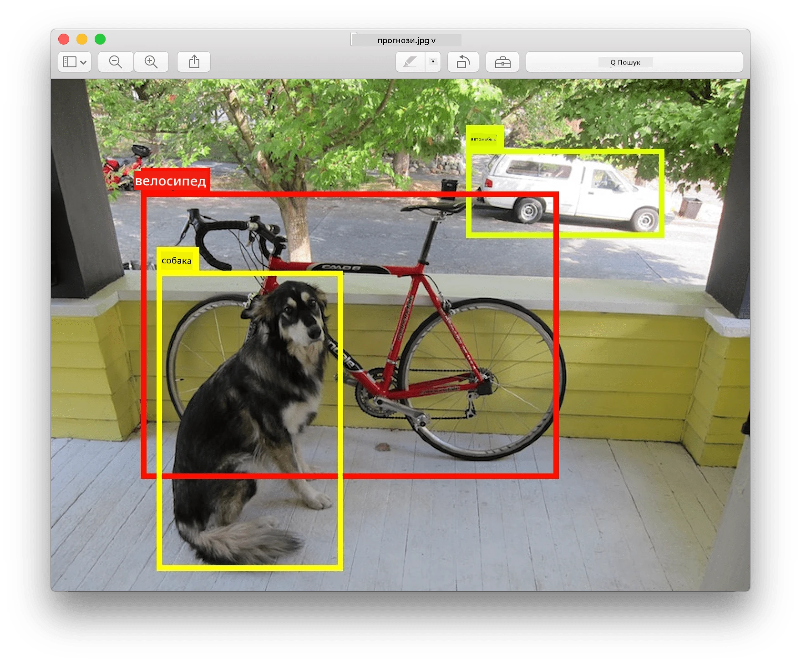
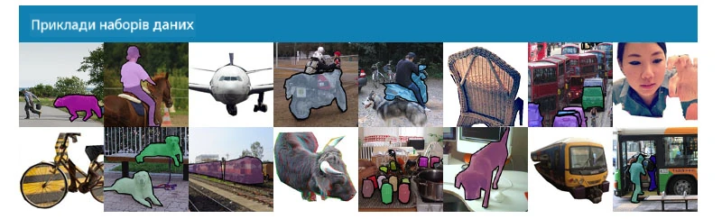
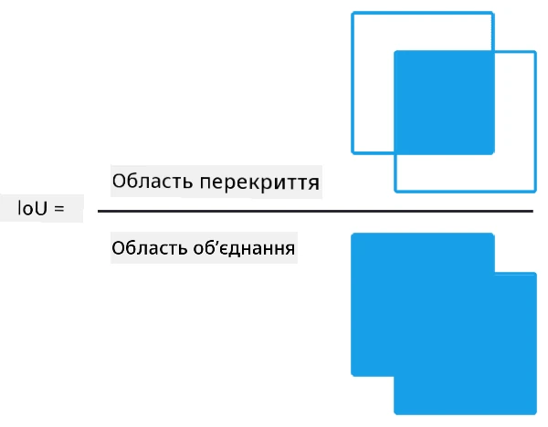
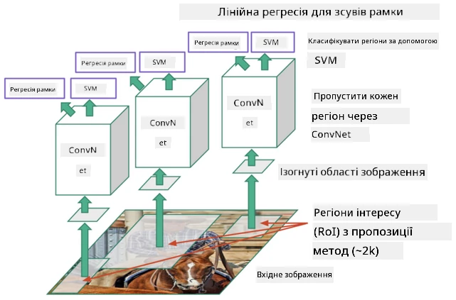
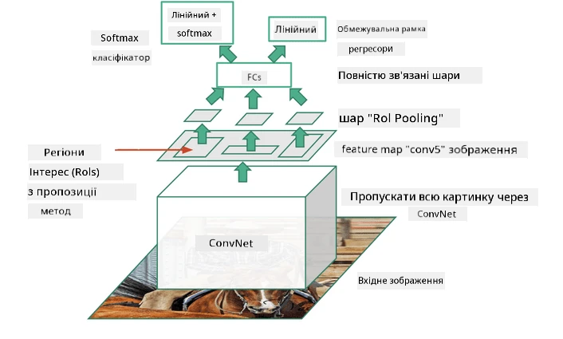
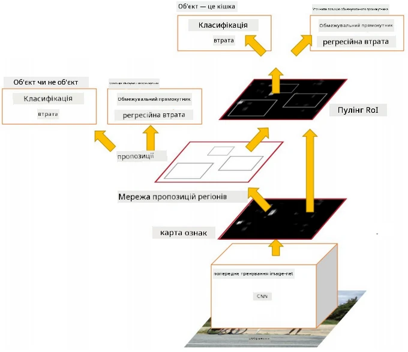
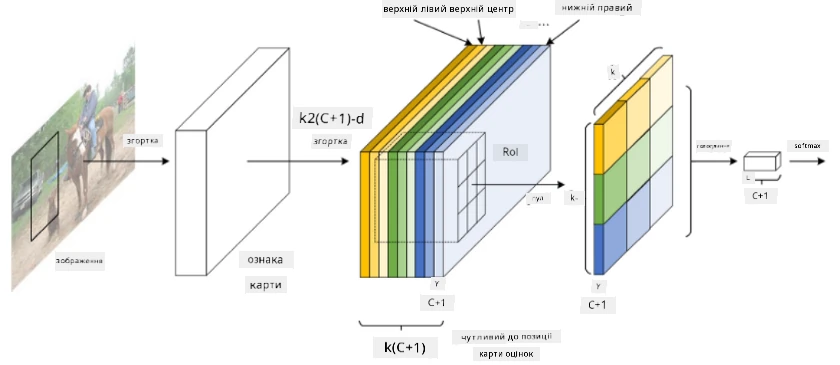

# Виявлення об'єктів

Моделі класифікації зображень, з якими ми працювали раніше, брали зображення і видавали категоріальний результат, наприклад, клас "число" у задачі MNIST. Однак у багатьох випадках нам недостатньо просто знати, що на зображенні є об'єкти — ми хочемо визначити їх точне розташування. Саме це є метою **виявлення об'єктів**.

## [Квіз перед лекцією](https://ff-quizzes.netlify.app/en/ai/quiz/21)

> Зображення з [веб-сайту YOLO v2](https://pjreddie.com/darknet/yolov2/)

## Наївний підхід до виявлення об'єктів

Припустимо, ми хочемо знайти кота на зображенні. Дуже наївний підхід до виявлення об'єктів може виглядати так:

1. Розбити зображення на кілька плиток.
2. Запустити класифікацію зображень для кожної плитки.
3. Ті плитки, які дають достатньо високу активацію, можна вважати такими, що містять потрібний об'єкт.

> *Зображення з [зошита вправ](ObjectDetection-TF.ipynb)*

Однак цей підхід далекий від ідеального, оскільки він дозволяє алгоритму дуже неточно визначати межі об'єкта. Для більш точного визначення необхідно використовувати якийсь вид **регресії**, щоб передбачити координати межових рамок — і для цього потрібні спеціальні набори даних.

## Регресія для виявлення об'єктів

[Ця стаття в блозі](https://towardsdatascience.com/object-detection-with-neural-networks-a4e2c46b4491) пропонує чудове введення у виявлення форм.

## Набори даних для виявлення об'єктів

Ви можете зустріти наступні набори даних для цієї задачі:

* [PASCAL VOC](http://host.robots.ox.ac.uk/pascal/VOC/) — 20 класів
* [COCO](http://cocodataset.org/#home) — Загальні об'єкти в контексті. 80 класів, межові рамки та маски сегментації

## Метрики для виявлення об'єктів

### Перетин над об'єднанням

Для класифікації зображень легко виміряти, наскільки добре працює алгоритм, але для виявлення об'єктів потрібно оцінити як правильність класу, так і точність визначення розташування межової рамки. Для останнього використовується так звана **Перетин над об'єднанням** (IoU), яка вимірює, наскільки добре дві рамки (або дві довільні області) перекриваються.

> *Рисунок 2 з [цієї чудової статті про IoU](https://pyimagesearch.com/2016/11/07/intersection-over-union-iou-for-object-detection/)*

Ідея проста — ми ділимо площу перетину між двома фігурами на площу їх об'єднання. Для двох ідентичних областей IoU буде дорівнювати 1, а для повністю роз'єднаних областей — 0. В інших випадках значення буде варіюватися від 0 до 1. Зазвичай враховуються лише ті межові рамки, для яких IoU перевищує певне значення.

### Середня точність

Припустимо, ми хочемо оцінити, наскільки добре розпізнається певний клас об'єктів $C$. Для цього використовується метрика **Середня точність**, яка обчислюється наступним чином:

1. Розглядається крива Точність-Відклик, яка показує точність залежно від порогового значення виявлення (від 0 до 1).
2. Залежно від порогу, ми отримаємо більше або менше об'єктів, виявлених на зображенні, і різні значення точності та відклику.
3. Крива виглядатиме так:

> *Зображення з [NeuroWorkshop](http://github.com/shwars/NeuroWorkshop)*

Середня точність для даного класу $C$ — це площа під цією кривою. Точніше, вісь відклику зазвичай ділиться на 10 частин, і точність усереднюється за всіма цими точками:

$$
AP = {1\over11}\sum_{i=0}^{10}\mbox{Precision}(\mbox{Recall}={i\over10})
$$

### AP та IoU

Ми враховуємо лише ті виявлення, для яких IoU перевищує певне значення. Наприклад, у наборі даних PASCAL VOC зазвичай $\mbox{IoU Threshold} = 0.5$, тоді як у COCO AP вимірюється для різних значень $\mbox{IoU Threshold}$.

> *Зображення з [NeuroWorkshop](http://github.com/shwars/NeuroWorkshop)*

### Середня середня точність — mAP

Основною метрикою для виявлення об'єктів є **Середня середня точність**, або **mAP**. Це значення середньої точності, усереднене за всіма класами об'єктів, а іноді також за $\mbox{IoU Threshold}$. Детальніше процес обчислення **mAP** описаний
[у цій статті](https://medium.com/@timothycarlen/understanding-the-map-evaluation-metric-for-object-detection-a07fe6962cf3)), а також [тут із прикладами коду](https://gist.github.com/tarlen5/008809c3decf19313de216b9208f3734).

## Різні підходи до виявлення об'єктів

Існує два основних класи алгоритмів виявлення об'єктів:

* **Мережі пропозицій регіонів** (R-CNN, Fast R-CNN, Faster R-CNN). Основна ідея полягає у створенні **регіонів інтересу** (ROI) і запуску CNN для них, шукаючи максимальну активацію. Це трохи схоже на наївний підхід, за винятком того, що ROI створюються більш розумним способом. Одним із головних недоліків таких методів є те, що вони повільні, оскільки потрібні численні проходи класифікатора CNN через зображення.
* **Однопрохідні** (YOLO, SSD, RetinaNet) методи. У цих архітектурах мережа спроектована так, щоб передбачати як класи, так і ROI за один прохід.

### R-CNN: CNN на основі регіонів

[R-CNN](http://islab.ulsan.ac.kr/files/announcement/513/rcnn_pami.pdf) використовує [Selective Search](http://www.huppelen.nl/publications/selectiveSearchDraft.pdf) для створення ієрархічної структури регіонів ROI, які потім проходять через CNN для вилучення ознак і SVM-класифікатори для визначення класу об'єкта, а також лінійну регресію для визначення координат *межової рамки*. [Офіційна стаття](https://arxiv.org/pdf/1506.01497v1.pdf)

> *Зображення з van de Sande et al. ICCV’11*

> *Зображення з [цієї статті](https://towardsdatascience.com/r-cnn-fast-r-cnn-faster-r-cnn-yolo-object-detection-algorithms-36d53571365e)*

### F-RCNN - Fast R-CNN

Цей підхід схожий на R-CNN, але регіони визначаються після застосування шарів згортки.

> Зображення з [офіційної статті](https://www.cv-foundation.org/openaccess/content_iccv_2015/papers/Girshick_Fast_R-CNN_ICCV_2015_paper.pdf), [arXiv](https://arxiv.org/pdf/1504.08083.pdf), 2015

### Faster R-CNN

Основна ідея цього підходу полягає у використанні нейронної мережі для прогнозування ROI — так званої *мережі пропозицій регіонів*. [Стаття](https://arxiv.org/pdf/1506.01497.pdf), 2016

> Зображення з [офіційної статті](https://arxiv.org/pdf/1506.01497.pdf)

### R-FCN: Повністю згорткова мережа на основі регіонів

Цей алгоритм ще швидший, ніж Faster R-CNN. Основна ідея полягає у наступному:

1. Ми вилучаємо ознаки за допомогою ResNet-101.
2. Ознаки обробляються **картою оцінок, чутливою до позиції**. Кожен об'єкт із $C$ класів ділиться на $k\times k$ регіонів, і ми навчаємося прогнозувати частини об'єктів.
3. Для кожної частини з $k\times k$ регіонів усі мережі голосують за класи об'єктів, і вибирається клас об'єкта з максимальним голосом.

> Зображення з [офіційної статті](https://arxiv.org/abs/1605.06409)

### YOLO - You Only Look Once

YOLO — це алгоритм реального часу з одним проходом. Основна ідея полягає у наступному:

 * Зображення ділиться на $S\times S$ регіони.
 * Для кожного регіону **CNN** прогнозує $n$ можливих об'єктів, координати *межової рамки* та *довіру*=*ймовірність* * IoU.

 

> Зображення з [офіційної статті](https://arxiv.org/abs/1506.02640)

### Інші алгоритми

* RetinaNet: [офіційна стаття](https://arxiv.org/abs/1708.02002)
   - [Реалізація PyTorch у Torchvision](https://pytorch.org/vision/stable/_modules/torchvision/models/detection/retinanet.html)
   - [Реалізація Keras](https://github.com/fizyr/keras-retinanet)
   - [Виявлення об'єктів за допомогою RetinaNet](https://keras.io/examples/vision/retinanet/) у прикладах Keras
* SSD (Single Shot Detector): [офіційна стаття](https://arxiv.org/abs/1512.02325)

## ✍️ Вправи: Виявлення об'єктів

Продовжуйте навчання у наступному зошиті:

[ObjectDetection.ipynb](ObjectDetection.ipynb)

## Висновок

У цьому уроці ви здійснили швидкий огляд різних способів, якими можна виконувати виявлення об'єктів!

## 🚀 Виклик

Прочитайте ці статті та зошити про YOLO і спробуйте їх самостійно:

* [Хороша стаття в блозі](https://www.analyticsvidhya.com/blog/2018/12/practical-guide-object-detection-yolo-framewor-python/) про YOLO
 * [Офіційний сайт](https://pjreddie.com/darknet/yolo/)
 * Yolo: [Реалізація Keras](https://github.com/experiencor/keras-yolo2), [покроковий зошит](https://github.com/experiencor/basic-yolo-keras/blob/master/Yolo%20Step-by-Step.ipynb)
 * Yolo v2: [Реалізація Keras](https://github.com/experiencor/keras-yolo2), [покроковий зошит](https://github.com/experiencor/keras-yolo2/blob/master/Yolo%20Step-by-Step.ipynb)

## [Квіз після лекції](https://ff-quizzes.netlify.app/en/ai/quiz/22)

## Огляд та самостійне навчання

* [Виявлення об'єктів](https://tjmachinelearning.com/lectures/1718/obj/) від Ніхіла Сардани
* [Хороше порівняння алгоритмів виявлення об'єктів](https://lilianweng.github.io/lil-log/2018/12/27/object-detection-part-4.html)
* [Огляд алгоритмів глибокого навчання для виявлення об'єктів](https://medium.com/comet-app/review-of-deep-learning-algorithms-for-object-detection-c1f3d437b852)
* [Покрокове введення до основних алгоритмів виявлення об'єктів](https://www.analyticsvidhya.com/blog/2018/10/a-step-by-step-introduction-to-the-basic-object-detection-algorithms-part-1/)
* [Реалізація Faster R-CNN у Python для виявлення об'єктів](https://www.analyticsvidhya.com/blog/2018/11/implementation-faster-r-cnn-python-object-detection/)

## [Завдання: Виявлення об'єктів](lab/README.md)

---

