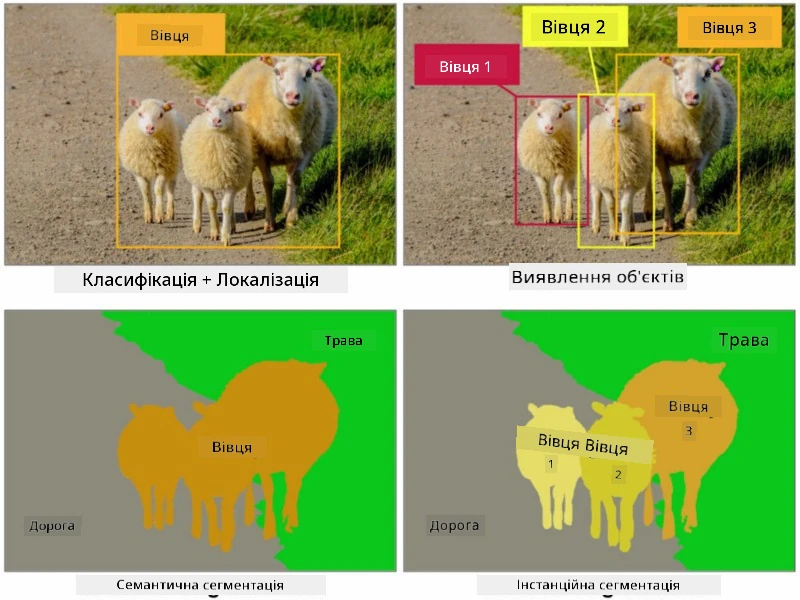
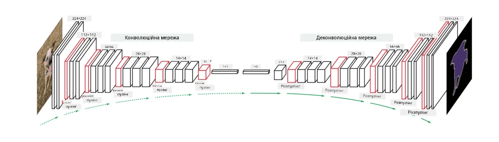

# Сегментація

Раніше ми вивчали розпізнавання об'єктів, яке дозволяє знаходити об'єкти на зображенні, прогнозуючи їх *граничні рамки*. Однак для деяких завдань нам потрібна не тільки гранична рамка, але й більш точна локалізація об'єкта. Це завдання називається **сегментацією**.

## [Тест перед лекцією](https://ff-quizzes.netlify.app/en/ai/quiz/23)

Сегментацію можна розглядати як **класифікацію пікселів**, де для **кожного** пікселя зображення ми повинні передбачити його клас (*фон* є одним із класів). Існує два основних алгоритми сегментації:

* **Семантична сегментація** визначає лише клас пікселя, але не розрізняє різні об'єкти одного класу.
* **Сегментація об'єктів** розділяє класи на окремі екземпляри.

Наприклад, для сегментації об'єктів ці вівці є різними об'єктами, але для семантичної сегментації всі вівці представлені одним класом.

> Зображення з [цієї статті](https://nirmalamurali.medium.com/image-classification-vs-semantic-segmentation-vs-instance-segmentation-625c33a08d50)

Існують різні нейронні архітектури для сегментації, але всі вони мають однакову структуру. У певному сенсі це схоже на автоенкодер, про який ви вже дізналися, але замість деконструкції оригінального зображення наша мета — деконструювати **маску**. Таким чином, мережа сегментації має такі частини:

* **Енкодер** витягує ознаки з вхідного зображення.
* **Декодер** перетворює ці ознаки у **зображення маски**, яке має той самий розмір і кількість каналів, що відповідає кількості класів.

> Зображення з [цієї публікації](https://arxiv.org/pdf/2001.05566.pdf)

Особливо варто згадати функцію втрат, яка використовується для сегментації. Використовуючи класичні автоенкодери, нам потрібно виміряти схожість між двома зображеннями, і для цього ми можемо використовувати середньоквадратичну помилку (MSE). У сегментації кожен піксель у цільовому зображенні маски представляє номер класу (закодований у форматі one-hot уздовж третього виміру), тому нам потрібно використовувати функції втрат, специфічні для класифікації, — крос-ентропію, усереднену по всіх пікселях. Якщо маска є бінарною, використовується **бінарна крос-ентропія** (BCE).

> ✅ One-hot кодування — це спосіб кодування мітки класу у вектор довжиною, що дорівнює кількості класів. Ознайомтеся з [цією статтею](https://datagy.io/sklearn-one-hot-encode/) про цю техніку.

## Сегментація для медичних зображень

У цьому уроці ми побачимо сегментацію в дії, тренуючи мережу для розпізнавання невусів (також відомих як родимки) на медичних зображеннях. Ми будемо використовувати <a href="https://www.fc.up.pt/addi/ph2%20database.html">PH2 Database</a> дерматоскопічних зображень як джерело даних. Цей набір даних містить 200 зображень трьох класів: типовий невус, атиповий невус і меланома. Усі зображення також містять відповідну **маску**, яка окреслює невус.

> ✅ Ця техніка особливо підходить для такого типу медичних зображень, але які інші реальні застосування ви могли б уявити?

> Зображення з PH2 Database

Ми будемо тренувати модель для сегментації будь-якого невуса від його фону.

## ✍️ Вправи: Семантична сегментація

Відкрийте наведені нижче ноутбуки, щоб дізнатися більше про різні архітектури семантичної сегментації, попрактикуватися з ними та побачити їх у дії.

* [Семантична сегментація Pytorch](SemanticSegmentationPytorch.ipynb)
* [Семантична сегментація TensorFlow](SemanticSegmentationTF.ipynb)

## [Тест після лекції](https://ff-quizzes.netlify.app/en/ai/quiz/24)

## Висновок

Сегментація — це дуже потужна техніка для класифікації зображень, яка виходить за межі граничних рамок до класифікації на рівні пікселів. Це техніка, яка використовується в медичних зображеннях, серед інших застосувань.

## 🚀 Виклик

Сегментація тіла — лише одне із поширених завдань, яке ми можемо виконувати із зображеннями людей. Інші важливі завдання включають **виявлення скелета** та **виявлення пози**. Спробуйте бібліотеку [OpenPose](https://github.com/CMU-Perceptual-Computing-Lab/openpose), щоб побачити, як можна використовувати виявлення пози.

## Огляд і самостійне навчання

Ця [стаття у Вікіпедії](https://wikipedia.org/wiki/Image_segmentation) пропонує хороший огляд різних застосувань цієї техніки. Дізнайтеся більше самостійно про піддомени сегментації об'єктів та паноптичної сегментації у цій галузі досліджень.

## [Завдання](lab/README.md)

У цій лабораторній роботі спробуйте **сегментацію людського тіла**, використовуючи [Segmentation Full Body MADS Dataset](https://www.kaggle.com/datasets/tapakah68/segmentation-full-body-mads-dataset) з Kaggle.

---

