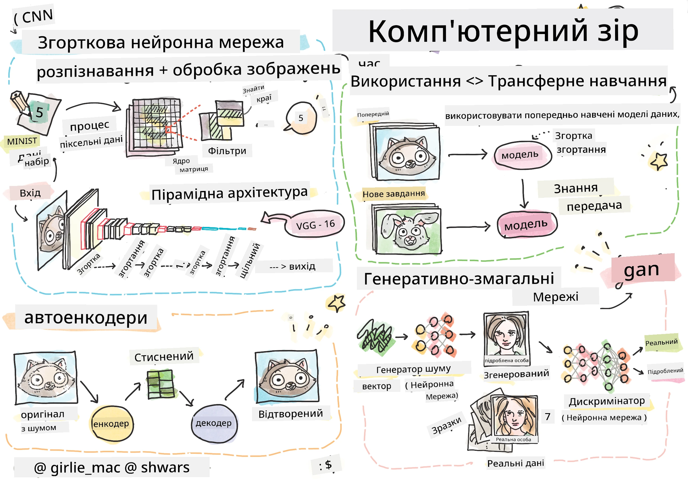

# Комп'ютерний зір

У цьому розділі ми дізнаємося про:

* [Вступ до комп'ютерного зору та OpenCV](06-IntroCV/README.md)
* [Згорткові нейронні мережі](07-ConvNets/README.md)
* [Попередньо навчені мережі та трансферне навчання](08-TransferLearning/README.md) 
* [Автоенкодери](09-Autoencoders/README.md)
* [Генеративно-змагальні мережі](10-GANs/README.md)
* [Виявлення об'єктів](11-ObjectDetection/README.md)
* [Семантична сегментація](12-Segmentation/README.md)

**Відмова від відповідальності**:  
Цей документ було перекладено за допомогою сервісу автоматичного перекладу [Co-op Translator](https://github.com/Azure/co-op-translator). Хоча ми прагнемо до точності, звертаємо вашу увагу, що автоматичні переклади можуть містити помилки або неточності. Оригінальний документ на його рідній мові слід вважати авторитетним джерелом. Для критично важливої інформації рекомендується професійний людський переклад. Ми не несемо відповідальності за будь-які непорозуміння або неправильні тлумачення, що виникли внаслідок використання цього перекладу.